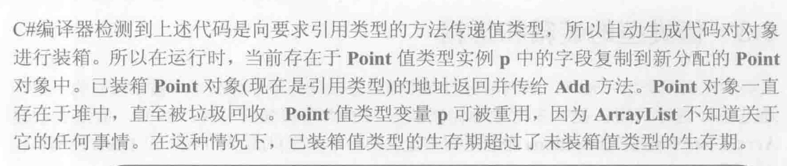

# 第四章 类型

### 类型转换

C#动态类型转换的时候，如果是向基类转换，可以直接隐式转换

但是如果是向子类，那就必须显式转换。这时候，转换的时候就会检查是否能转换。如果不能抛出异常。

C#的 as和C++ dynamic_cast是差不多的，都是转换的时候会检查能不能转换，如果不能返回null，比先is再转换效率高

> C++dynamic_cast的时候，会查看存储在虚函数表的type_info，对于向下转换，如果一个Base* b的实际动态类型是一个Base，那么他type_info里存储的类型和Derived就不一样，那么就会报错。
>
> 本质上就是利用动态类型做类型检查是否匹配


### type


每个类型都会对应一个类型对象，在执行程序前，CLR会保证这些类型对象被成功加载并且管理起来。他们其实都是一个Type类型对象的实例

> 每个 **类型** 都会在堆上有一个对应的 **类型对象**。在 C# 中，类型对象是通过 `Type` 类表示的，它是一个运行时的元数据对象，描述了某个类型的结构和特性。每个类型（类、接口、枚举等）在运行时都有一个 `Type` 实例，它用于反射、类型检查、动态创建对象等操作。
>
> 不过，需要澄清的是，类型对象本身并不是一个普通的类实例，它并不像普通的类对象那样存储在堆上，而是作为 CLR（公共语言运行时）的一部分存在并管理。
>
> 类型对象是 CLR 管理的元数据，通常不会像普通对象那样被回收。CLR 会在应用程序生命周期内保持这些类型对象的存在，直到程序退出或进程终止。

每个类型都会有一个与之关联的 `Type` 对象。这个 `Type` 对象本身也是一个类型实例，可以通过 `typeof` 关键字或者对象的 `GetType()` 方法来获取。

#### 示例：使用 `typeof` 获取类型对象

```c#
csharp复制代码using System;

class MyClass
{
    public int MyProperty { get; set; }
}

class Program
{
    static void Main()
    {
        Type type = typeof(MyClass);  // 获取 MyClass 类型的 Type 对象
        Console.WriteLine(type.FullName);  // 输出 MyClass 的全名
    }
}
```

## 第五

### 值类型和引用类型

值/引用类型的最终父类都是System.Object类，但是引用类型的直接继承自System.Object，值类型的直接父类是ValueType，而ValueType的父类是Object


（意思是，C++当中，对象或者变量存在哪里是使用者决定的（比如分配在Stack和new Class分配在堆上），而C#分配在哪里，是由于它是值类型还是引用类型）

#### Boxing和UnBoxing

有的时候，C#需要获取对象的地址，因此这时候就会发生拆箱装箱。而引用类型一直都是装箱状态，因此不会有这个问题。





其实，UnBoxing是获取指针的过程，而紧接着UnBoxing之后，还会发生一次字段的复制

这里有一个Trick，就是WriteLine的时候要用ToString，而不是直接把值类型传入WrtieLine。

因为WritLine要求传入String类型（引用类型）并且会调用Concat函数，Concat函数要求传入Object，而值类型这时候会发生装箱，但是用ToString就直接返回String类型了。


### Equal

Object.Equal的默认实现，实际上实现的是同一性的比较而不是相等性的比较，它会要求传入一个Object参数，比较二者的引用。但是并没有考虑内容


而IEquatable\<T>接口要求实现的：

```c#
public interface IEquatable<in T>
{
    bool Equals(T other);
}
```

则是一个类型安全的Equals，这里就要求我们自己设计一种相等性的比较


C#内部提供了检查同一性的代码：


```c#
//一个好的设计：
using System;

public class Person
{
    public string Name { get; set; }
    public int Age { get; set; }

    // 构造函数
    public Person(string name, int age)
    {
        Name = name;
        Age = age;
    }

    // 重载 Equals 方法
    public override bool Equals(object obj)
    {
        // 1. 检查是否是同一个引用
        if (ReferenceEquals(this, obj)) return true;

        // 2. 如果 obj 为 null 或者类型不同，返回 false
        if (obj == null || this.GetType() != obj.GetType()) return false;

        // 3. 转换 obj 为 Person 类型并进行字段比较
        Person other = (Person)obj;
        return this.Name == other.Name && this.Age == other.Age;
    }

    // 重载 GetHashCode 方法，保证相等的对象具有相同的哈希码
    public override int GetHashCode()
    {
        // 使用 Name 和 Age 生成哈希码
        int hashName = Name == null ? 0 : Name.GetHashCode();
        int hashAge = Age.GetHashCode();
        return hashName ^ hashAge; // XOR 操作
    }
}

class Program
{
    static void Main()
    {
        Person p1 = new Person("Alice", 30);
        Person p2 = new Person("Alice", 30);
        Person p3 = new Person("Bob", 25);

        // 比较 p1 和 p2（相等）
        Console.WriteLine(p1.Equals(p2)); // True

        // 比较 p1 和 p3（不相等）
        Console.WriteLine(p1.Equals(p3)); // False
    }
}

```

3
