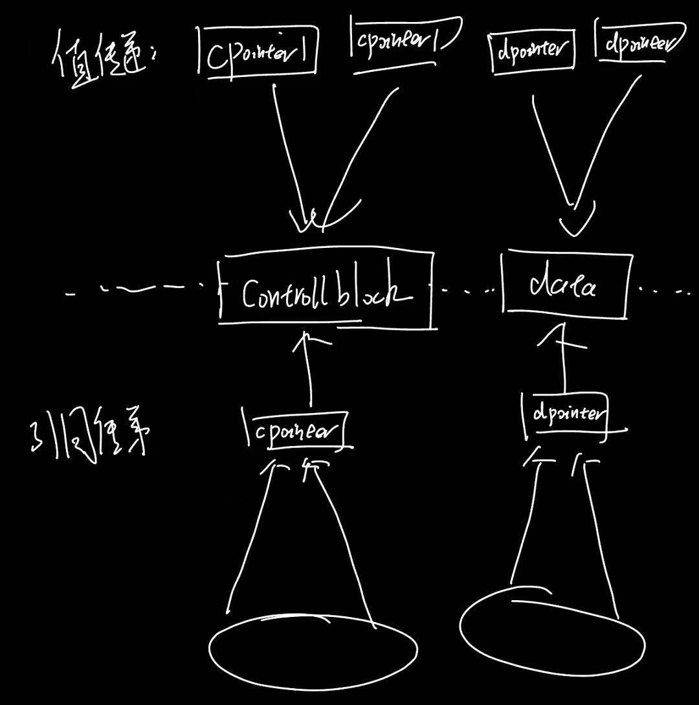

# static关键字

1. 链接性

链接性分三种：外部链接，内部链接和无链接函数内部的局部变量，无论是否用 `static` 修饰，都具有**无连接性**。它们的作用域仅限于函数内部。

默认的函数和变量都是外部链接，而由static修饰之后，变量和函数是内部链接，只在当前的编译单元可见

2. 存储期

static修饰的变量都存储在静态存储区，程序运行期间一直存在

注意，类内的static变量必须要在类外部显式初始化

# C++里面四种强制类型转换

首先转换这个概念有几个分类：

显式/隐式

向上/向下

const_cast：

> 只能用于指针或者引用，只能改变对象的底层const（指向对象const）

static_cast：

> 隐式类型转换，可以实现内置基本类型之间的相互转换（比如void\*转ptr\*），也可以在类的层次之间向上或者向下转换。但是向下转换不安全（因为没有动态类型检查）。不能进行无关类型指针之间的转换，转换的指针也不能作用与包含底层const的对象（指向的对象是const的，也就是说）

dynamic_cast：

> 依赖于RAII方法，也就是依赖虚函数，其实是type_info。一般来说type_info存储的位置是在虚函数表的前面的位置。
>
> ```
>             内存地址低 <-----------------------> 内存地址高
> 
>                           [ ... other RTTI info ... ] (可选)
> vptr[-2] (或其他负偏移) -> [ pointer to std::type_info object for this class ]
> vptr[-1] (或其他负偏移) -> [ base offset / other info ]
> ---------------------------------------------------------------------
> vptr[0]  (vtable_start) -> [ address of virtual_function_1 ]
> vptr[1]                 -> [ address of virtual_function_2 ]
> vptr[2]                 -> [ ...                             ]
>                           [ ... more virtual function pointers ... ]
> ```
>
> 

reinterpret_cast: 

> 重新解释数据的二进制含义，但是不改变其数值。**重新解释**一个对象的底层位模式 (bit pattern)，就好像它是另一种完全不同的类型。
>
> reinterpret_cast不能直接转换变量的值的解释（比如直接把一个float转换为int）
>
> `reinterpret_cast` 的核心在于改变对内存地址的类型解释，而不是进行值的语义转换。
>
> reinterpret_cast可以：
>
> 1. 指针之间的转换（指针变量存储的地址是不变的，变得是解释（比如float* 转换为int* ，改变的是对于指针指向对象的解释）
> 2. 转换引用类型
> 3. 指针转换和足够大的整形之间转换（比如一个指针转换为一个很大的int)

问题：static_cast和reinterpret_cast的区别是什么？

A：static_cast是类型转换，最直接的例子是，比如一个float f =100.0f转换为一个int。

显然，float f是浮点数存储，遵循的是IEEE的浮点数存储，包括了符号位，什么M还有E，经过计算之后才会被解释为100.0。因此，我们期望它经过static_cast隐式类型转换之后变成int是一个截断的100。

但如果直接对二进制位进行重新解释呢？那就会把一个float的bit直接解释为int，而不是遵循隐式类型转换的逻辑

```c++
	float f = 100.0;
	cout << "static_cast: " << static_cast<int>(f) << endl;
	cout << "reinterpret: " << *reinterpret_cast<int*>(&f) << endl;
	// 对于 100.0f (0x42C80000)，这里会输出 1120403456
    // 0x42C80000 (hex) = 1120403456 (decimal)
	
	// 输出：
	// static_cast: 100
	// reinterpret: 1120403456
```

# C++指针和引用的区别

引用只是一个别名，而指针是一个变量，既然指针是一个变量，那么指针自己就有专门的内存地址

指针可以被初始化为指向nullptr，而引用必须指向一个已有的对象

指针可以多级，而引用最多一级()

# 空类大小：

为什么空类至少是1个字节？

原因很简单，是因为为了保证每一个对象在程序中都有唯一的地址

考虑这样的场景：

```c++
class A{}; //空类
int main(){
    A a1; //地址0x1000
    A a2; //地址0x1001
}
```

如果空类不至少有1的大小，那么a1和a2的地址应该是一样的

# 智能指针

Shared_ptr的线程安全：

一句话总结：shared_ptr里，对于控制块内部的引用计数器的增减是线程安全的，但是shared_ptr（作为一种类）本身，不是线程安全的。展开说，就是在多线程条件下，shared_ptr的传递是值传递的，那么它的多线程读写是线程安全的，但是如果是引用传递或者是指针传递，那么是线程不安全的。

原因：

对于值传递，相当于创建了一个新的智能指针副本，这里的副本的意思是，有一个新的shared_ptr对象，它的地址是新的，并且创建了一个新的指向管理资源的指针和一个新的指向控制块的指针（但是指向的控制块和管理的资源是和原来一样的）

因此，在多线程下，相当于只有这一个副本的位置才能通过这一套地址去增减控制块和修改资源（路径是单一的）相当于实现了一种“伪原子性”


而对于引用或者指针传递的多线程操纵，如果有很多个线程同时读写。比如说:

```c++
shared_ptr<T> a;


//线程1：
void f1(shared_ptr<T>& a){
    shared_ptr<T> b;
    a = b;
}

//线程2：
void f1(shared_ptr<T>& a){
    shared_ptr<T> c;;
    a = c;;
}
```

注意这里的赋值过程，分为这几个流程：

> 1. 引用计数修改
> 2. 改变控制块指针指向
> 3. 改变管理资源指针的指向

引用计数的修改是原子的，但是这三个操作之间都不是原子的。

所以存在的问题就是，线程1和2交替执行，那么本身期望的状态时：减少一次a的资源的引用计数，a重新指向b，然后减少一次b的资源的引用计数，然后再指向c；

但是，如果竞争了，就会导致可能a的资源的引用计数减少两次，也有可能会导致，存在一个中间状态指向a的资源，但是控制块是b的。

如果我们使用的是拷贝的，那么很显然，会首先增加两次引用计数（因为是值传递）。并且也只会有一个线程去操作一个独立的对象。

