# static关键字

1. 链接性

链接性分三种：外部链接，内部链接和无链接函数内部的局部变量，无论是否用 `static` 修饰，都具有**无连接性**。它们的作用域仅限于函数内部。

默认的函数和变量都是外部链接，而由static修饰之后，变量和函数是内部链接，只在当前的编译单元可见

2. 存储期

static修饰的变量都存储在静态存储区，程序运行期间一直存在

注意，类内的static变量必须要在类外部显式初始化

# C++里面四种强制类型转换

首先转换这个概念有几个分类：

显式/隐式

向上/向下

const_cast：

> 只能用于指针或者引用，只能改变对象的底层const（指向对象const）

static_cast：

> 隐式类型转换，可以实现内置基本类型之间的相互转换（比如void\*转ptr\*），也可以在类的层次之间向上或者向下转换。但是向下转换不安全（因为没有动态类型检查）。不能进行无关类型指针之间的转换，转换的指针也不能作用与包含底层const的对象（指向的对象是const的，也就是说）

dynamic_cast：

> 依赖于RAII方法，也就是依赖虚函数，其实是type_info。一般来说type_info存储的位置是在虚函数表的前面的位置。
>
> ```
>          内存地址低 <-----------------------> 内存地址高
> 
>                        [ ... other RTTI info ... ] (可选)
> vptr[-2] (或其他负偏移) -> [ pointer to std::type_info object for this class ]
> vptr[-1] (或其他负偏移) -> [ base offset / other info ]
> ---------------------------------------------------------------------
> vptr[0]  (vtable_start) -> [ address of virtual_function_1 ]
> vptr[1]                 -> [ address of virtual_function_2 ]
> vptr[2]                 -> [ ...                             ]
>                        [ ... more virtual function pointers ... ]
> ```
>
> type_info中存储了什么：最重要的是基类信息的指针，以及一种继承关系的存储，让编译器可以根据type_info知道现在的对象到底是什么类型的
>
> 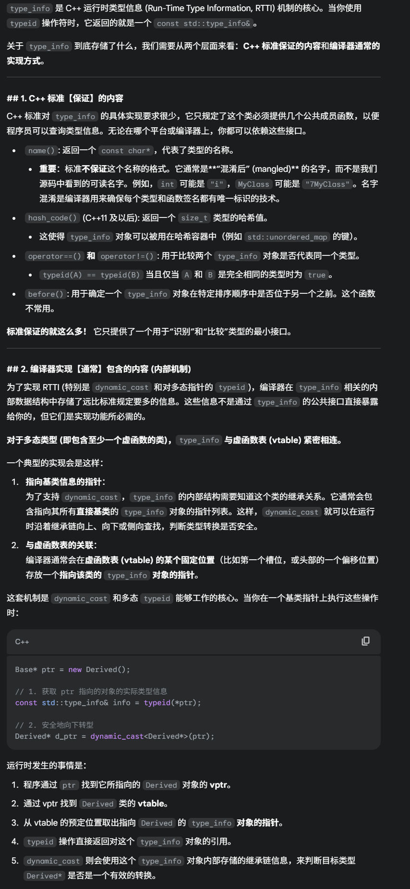
>
> 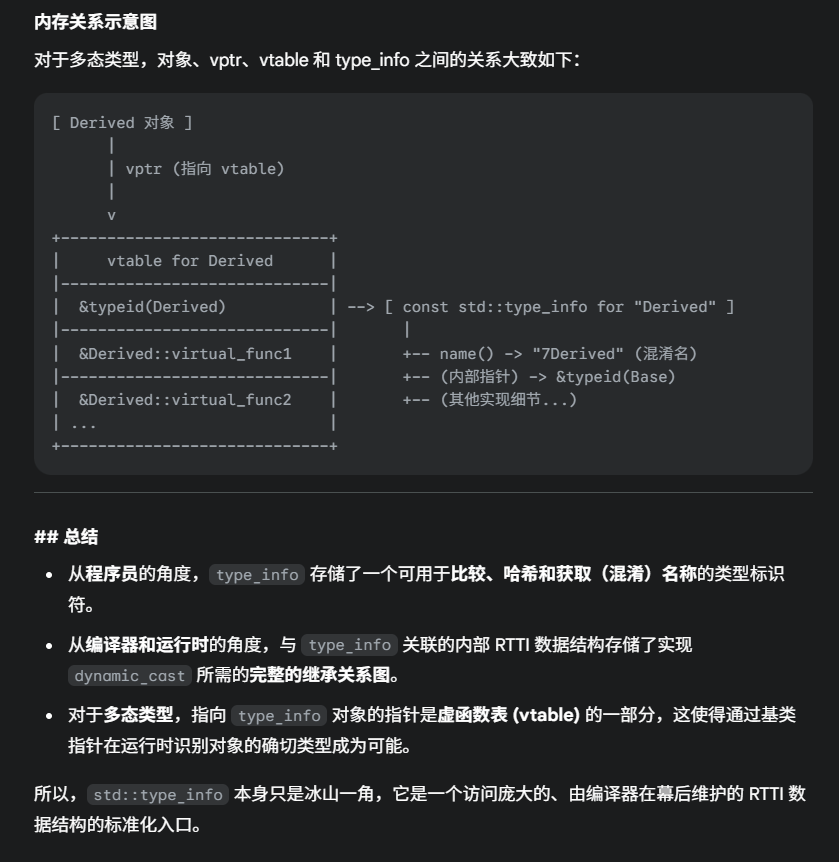
>
> dynamic_cast实现侧向转换，需要利用到type_info中的哪些信息
>
> 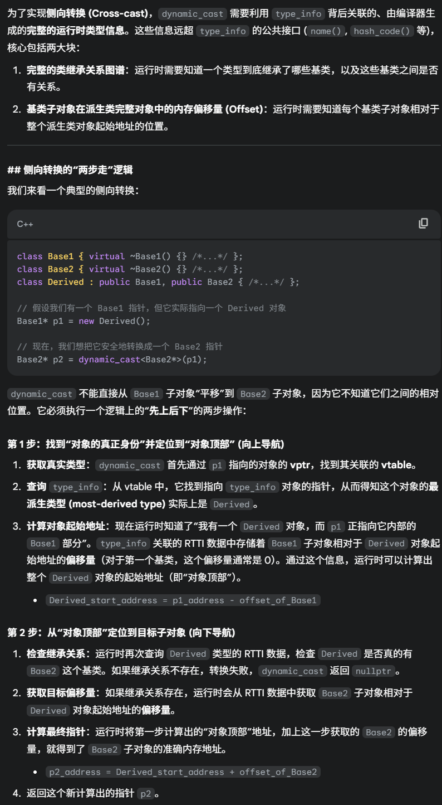
>
> 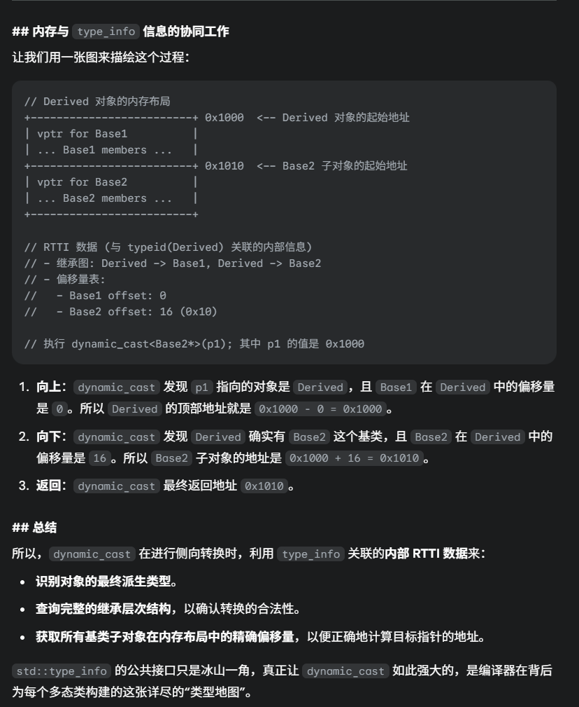
>
> 
>
> 问题：dynamic_cast 作用后，指针值（地址）有变化吗
>
> > 答案是不一定，我们知道dynamic_cast是可以向下转换的，因此，这其实取决于到底要转换到什么类型：
> >
> > 1. 不变：
> >
> > 在单继承转换当中，以及多继承中，从子类转换为继承链的第一个基类的时候，其实是不变的。
> >
> > 因为在对象模型中，我们只需要思考这个转换前后，首地址在对象的哪个地方就可以了
> >
> > 
> >
> > 2. 变：
> >
> > 这主要发生在**多重继承**的场景中，与我们上一个问题讨论的内存布局直接相关。
> >
> > ```c++
> > class Base1 { virtual ~Base1() {} /*...*/ };
> > class Base2 { virtual ~Base2() {} /*...*/ };
> > class Derived : public Base1, public Base2 { /*...*/ };
> > 
> > Derived* d_ptr = new Derived();
> > ```
> >
> > **派生类向上转型到非首个基类，** 
> >
> > 当你把一个派生类指针转型为指向**第二个或更后面的基类**的指针时，指针值必须改变。
> >
> > **非首个基类，向下转型到派生类**
> >
> > 反过来，当你有一个指向 `Base2` 子对象的指针，并想把它转回完整的 `Derived` 对象指针时，`dynamic_cast` 必须从指针值中**减去**那个偏移量。
> >
> > **侧向转型 (Cross-cast)**
> >
> > 这是 `dynamic_cast` 最强大的功能之一：在继承关系中的“兄弟”基类之间进行转换。
> >
> > ```c++
> > Base1* b1_ptr = new Derived();
> > // 现在想从 b1_ptr 得到 b2_ptr
> > Base2* b2_ptr_cross = dynamic_cast<Base2*>(b1_ptr);
> > 
> > // b2_ptr_cross 的值 != b1_ptr 的值！
> > ```
> >
> > **指针值变为 `nullptr`**
> >
> > 这是 `dynamic_cast` 的核心安全特性。当对一个**指针**进行向下转型或侧向转型，而该转型在逻辑上不成立时，`dynamic_cast` 会返回 `nullptr`。(其实也变了)

reinterpret_cast: 

> 重新解释数据的二进制含义，但是不改变其数值。**重新解释**一个对象的底层位模式 (bit pattern)，就好像它是另一种完全不同的类型。
>
> reinterpret_cast不能直接转换变量的值的解释（比如直接把一个float转换为int）
>
> `reinterpret_cast` 的核心在于改变对内存地址的类型解释，而不是进行值的语义转换。
>
> reinterpret_cast可以：
>
> 1. 指针之间的转换（指针变量存储的地址是不变的，变得是解释（比如float* 转换为int* ，改变的是对于指针指向对象的解释）
> 2. 转换引用类型
> 3. 指针转换和足够大的整形之间转换（比如一个指针转换为一个很大的int)

问题：static_cast和reinterpret_cast的区别是什么？

A：static_cast是类型转换，最直接的例子是，比如一个float f =100.0f转换为一个int。

显然，float f是浮点数存储，遵循的是IEEE的浮点数存储，包括了符号位，什么M还有E，经过计算之后才会被解释为100.0。因此，我们期望它经过static_cast隐式类型转换之后变成int是一个截断的100。

但如果直接对二进制位进行重新解释呢？那就会把一个float的bit直接解释为int，而不是遵循隐式类型转换的逻辑

```c++
	float f = 100.0;
	cout << "static_cast: " << static_cast<int>(f) << endl;
	cout << "reinterpret: " << *reinterpret_cast<int*>(&f) << endl;
	// 对于 100.0f (0x42C80000)，这里会输出 1120403456
    // 0x42C80000 (hex) = 1120403456 (decimal)
	
	// 输出：
	// static_cast: 100
	// reinterpret: 1120403456
```

# C++指针和引用的区别

引用只是一个别名，而指针是一个变量，既然指针是一个变量，那么指针自己就有专门的内存地址

指针可以被初始化为指向nullptr，而引用必须指向一个已有的对象

指针可以多级，而引用最多一级()

# 动态链接和静态链接

首先，编译的时候，C++是一个编译单元一个编译单元分别编译的，编译生成一个对应的目标文件。

而如果编译单元之间有依赖的话，那么就需要链接。

对于静态链接，链接的时候会把静态链接和其他编译单元一起，打包成一个完整的程序文件。他们在一个地址空间当中，并且对于静态链接来说，有多少次链接就复制了多少份，在内存中加载了多少次，内存中就有多少份，它是不共享的，只属于当前所在的地址空间。


对于动态链接来说，链接的时候没有真正复制库函数，而是保存了一个存根，

在加载的时候，动态的去查找对应的dll实现，加入内存，并且如果已经加载过了，那么就通过虚拟地址映射的方式共享实现。

> 动态链接存根保存在哪里？
>
> 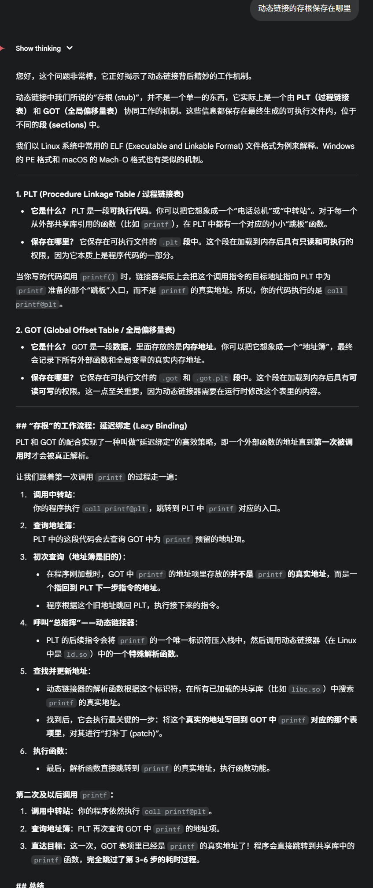
>
> 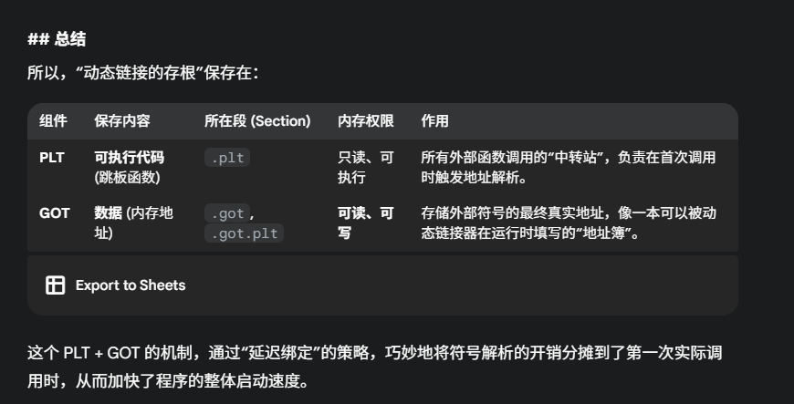
>
> 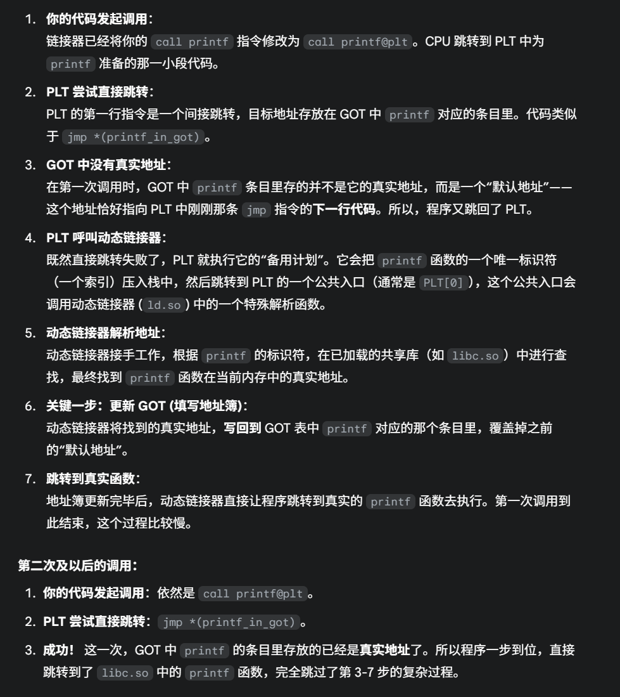


# 空类大小：

为什么空类至少是1个字节？

原因很简单，是因为为了保证每一个对象在程序中都有唯一的地址

考虑这样的场景：

```c++
class A{}; //空类
int main(){
    A a1; //地址0x1000
    A a2; //地址0x1001
}
```

如果空类不至少有1的大小，那么a1和a2的地址应该是一样的

# 智能指针

## Unique_ptr：

Unique_ptr实现对于指针资源的独占，实现是通过delete它的拷贝构造函数和拷贝赋值运算符来实现的（但是注意，允许移动构造和移动赋值）


## Shared_ptr

### 1. 线程安全：

一句话总结：shared_ptr里，对于控制块内部的引用计数器的增减是线程安全的，但是shared_ptr（作为一种类）本身，不是线程安全的。展开说，就是在多线程条件下，shared_ptr的传递是值传递的，那么它的多线程读写是线程安全的，但是如果是引用传递或者是指针传递，那么是线程不安全的。

原因：

对于值传递，相当于创建了一个新的智能指针副本，这里的副本的意思是，有一个新的shared_ptr对象，它的地址是新的，并且创建了一个新的指向管理资源的指针和一个新的指向控制块的指针（但是指向的控制块和管理的资源是和原来一样的）

因此，在多线程下，相当于只有这一个副本的位置才能通过这一套地址去增减控制块和修改资源（路径是单一的）相当于实现了一种“伪原子性”


而对于引用或者指针传递的多线程操纵，如果有很多个线程同时读写。比如说:

```c++
shared_ptr<T> a;


//线程1：
void f1(shared_ptr<T>& a){
    shared_ptr<T> b;
    a = b;
}

//线程2：
void f1(shared_ptr<T>& a){
    shared_ptr<T> c;;
    a = c;;
}
```

注意这里的赋值过程，分为这几个流程：

> 1. 引用计数修改
> 2. 改变控制块指针指向
> 3. 改变管理资源指针的指向

引用计数的修改是原子的，但是这三个操作之间都不是原子的。

所以存在的问题就是，线程1和2交替执行，那么本身期望的状态时：减少一次a的资源的引用计数，a重新指向b，然后减少一次b的资源的引用计数，然后再指向c；

但是，如果竞争了，就会导致可能a的资源的引用计数减少两次，也有可能会导致，存在一个中间状态指向a的资源，但是控制块是b的。

如果我们使用的是拷贝的，那么很显然，会首先增加两次引用计数（因为是值传递）。并且也只会有一个线程去操作一个独立的对象。


### 2. make_shared

为什么尽量使用make_shared有两个目的：

1. 性能优势

因为`std::shared_ptr<T>(new T(args...))` 这种方式创建 `std::shared_ptr` 时，实际上会发生两次内存分配：

> 第一次是分配了T(new T)
>
> 第二次是创建了`std::shared_ptr` 的控制块

但是如果使用make_shared只需要一次内存分配，它会一次性地分配一块足够大的内存，同时容纳 `T` 对象和 `shared_ptr` 的控制块（其实是使用了placement_new)

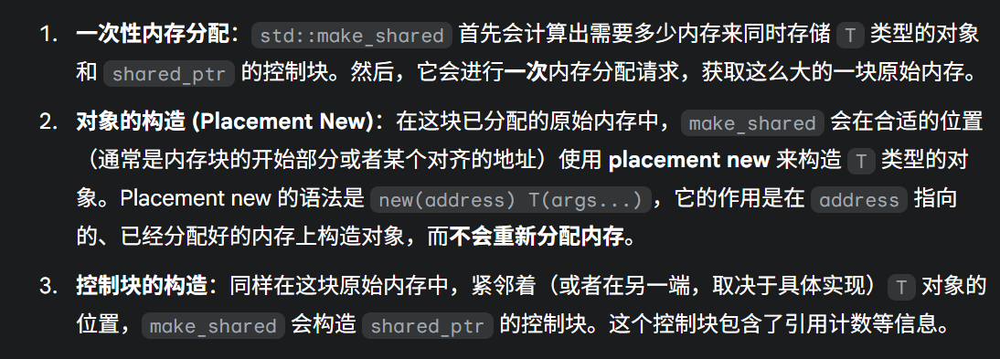

并且这也**提高了缓存局部性 (Cache Locality)**：由于对象和其管理数据（控制块）在内存中是相邻的，当访问对象时，其控制块（例如更新引用计数时）很可能已经在CPU缓存中。这减少了从主内存读取数据的次数，从而提高了访问速度。

2. 异常安全

考虑以下：

```c++
void some_function(std::shared_ptr<Widget> spw, int priority)
{
    //...
}
int main(){
    some_function(std::shared_ptr<Widget>(new Widget()), compute_priority());
}
```

编译器可能会按照以下顺序执行：

1. 执行 `new Widget()`：分配内存并构造 `Widget` 对象。假设这里成功了，我们得到一个裸指针 `Widget* raw_ptr`。
2. 执行 `compute_priority()`：这个函数可能会抛出异常。
3. 执行 `std::shared_ptr<Widget>(raw_ptr)` 的构造：如果 `compute_priority()` 抛出异常，这一步将永远不会执行。

如果在第一步 `new Widget()` 执行成功后，第二步 `compute_priority()` 抛出了异常，那么 `std::shared_ptr` 的构造函数将不会被调用。这意味着，第一步分配的 `Widget` 对象的内存将会**泄漏**，因为没有任何 `shared_ptr` 来管理它

而如果这样：

```c++
some_function(std::make_shared<Widget>(), compute_priority());
```

因为make_shared会一次性分配尽可能大的一块内存来同时满足控制块和数据的内存。因此他有能力处理分配和构造中可能会出现的异常（都是相对原子的）

make_shared是线程安全的

> 原因：
>
> 1. make_shared每次都会一次性分配内存，而内存分配，C++是保证线程安全的，
>
> 2. 并且创造出的内存块彼此之间都是独立的，所以不同线程操纵的实际上是不同的make-shared的创建的内存块（操作的独立性）
>


# C++的分段

1. .text 代码段，存储机器码（只读且可以执行）
2. .rodata 只读数据段 存储的是明确定义的常量数据，比如字符串字面量，以及const修饰的全局变量和静态变量（这些量在编译的时候就已知）（只读且不可执行）
3. .bss + .data 用来存储数据的，但是这两个段的用处不一样：
   1. .bss段存储的是未被显式初始化或者初始化为0的全局变量，静态变量（包括全局和局部），和静态成员变量（注意，这部分数据在文件中，只存储了一些元数据，而具体的值并没有存储，省空间，只有在加载到内存的时候直接赋值）
   2. .data段存储的是在编译时就已经被初始化赋值，且非0的全局变量，静态变量（包括静态和局部和类内成员变量）（注意，这部分数据会从可执行文件中加载到内存中)

# C++的数据存储

C++的数据存储在哪里呢？

1.  .bss和.data段，这些存储的是全局的和静态的数据，因为这些数据无论是否被显式初始化，都能在编译时确定，并且他们的生命周期比较特殊，所以需要单独管理

2. .rodata 编译时可以确定不会被修改的数值(const的全局或静态变量)，以及字符串字面量（.rodata里的数据也是有地址的，比如`const char* str = "hello";`，变量 `str` 实际上存储的就是字符串 `"hello"` 在 `.rodata` 段中的起始地址）

3. 堆/栈区，这些数据是运行时加载创建出来的，在函数（其机器指令位于 `.code` 段）执行时，函数中定义的**局部变量**（非 `static` 的，无论是 `int`, `double`, `MyClass obj`, 还是 `std::string local_str` 对象本身）会在运行时在该函数的**栈帧中创建**。

   1. 而对于字符串类型的对象，`local_str` 对象本身（包含指向字符数据的指针、长度、容量等成员）是在栈上。

      它所管理的实际字符串数据，如果很短，可能会有小字符串优化（SSO）直接存在 `local_str` 对象内部（仍在栈上）；如果较长，则通常是在堆上动态分配的。 

4. .code里，可能会有比如int i = 42 这样的局部数据，这些数据会以“立即数”的形式，被编码到.code存储的机器码指令当中，（其实是存在与寄存器上）并不是作为一个独立的变量存在的。只有当需要给这个变脸比如i一个内存地址，例如（&i）的时候，编译器通常会分配它在stack上


# STL

## std::sort

https://feihu.me/blog/2014/sgi-std-sort/

原理，优点和缺点

1. 原理

[Introspective Sorting](http://www.cs.rpi.edu/~musser/gp/index_1.html)(内省式排序)，它是一种混合式的排序算法，集成了前面提到的三种算法各自的优点：

- 在数据量很大时采用正常的快速排序，此时效率为O(logN)。
- 一旦分段后的数据量小于某个阈值，就改用插入排序，因为此时这个分段是基本有序的，这时效率可达O(N)。
- 在递归过程中，如果递归层次过深，分割行为有恶化倾向时，它能够自动侦测出来，使用堆排序来处理，在此情况下，使其效率维持在堆排序的O(N logN)，但这又比一开始使用堆排序好。

2. 优化点

   1. **递归调用优化：**

      看代码：

      ```c++
      template <class RandomAccessIterator>
      inline void sort(RandomAccessIterator first, RandomAccessIterator last) {
          if (first != last) {
              __introsort_loop(first, last, value_type(first), __lg(last - first) * 2); //<-- sort
              __final_insertion_sort(first, last); //<---插入排序
          }
      }
      
      template <class RandomAccessIterator, class T, class Size>
      void __introsort_loop(RandomAccessIterator first,
                            RandomAccessIterator last, T*,
                            Size depth_limit) {
          while (last - first > __stl_threshold) { //最小分段阈值 __introsort_loop
              if (depth_limit == 0) {
                  partial_sort(first, last, last);
                  return;
              }
              --depth_limit;
              RandomAccessIterator cut = __unguarded_partition   //分割算法（根据pivot的大小划分两部分）
                (first, last, T(__median(*first, *(first + (last - first)/2),
                                         *(last - 1)))); //三点中值
              __introsort_loop(cut, last, value_type(first), depth_limit);
              last = cut;
          } 
      }
      ```

      这是C++ sort实现的一个版本

      ```c++
      function quicksort(array, left, right)
          // If the list has 2 or more items
      
          if left < right
              // See "#Choice of pivot" section below for possible choices
      
              choose any pivotIndex such that left ≤ pivotIndex ≤ right
              // Get lists of bigger and smaller items and final position of pivot
      
              pivotNewIndex := partition(array, left, right, pivotIndex)
              // Recursively sort elements smaller than the pivot (assume pivotNewIndex - 1 does not underflow)
      
              quicksort(array, left, pivotNewIndex - 1)
              // Recursively sort elements at least as big as the pivot (assume pivotNewIndex + 1 does not overflow)
      
              quicksort(array, pivotNewIndex + 1, right)
      ```

      这是正常我们写快排的版本

      有一个显著的区别，正常的sort当中，在完成区间分割之后会分别对左右两边继续递归调用，而\_\_introsort_loop版本当中，似乎只对右边分割了。但实际上，\_\_introsort_loop是把左边的一部分，在当前的递归层就直接展开了（也就是说，对于每一个分割后的区间，递归右侧，而左侧则在循环中分割，为更小的左右，右侧递归。。。）

      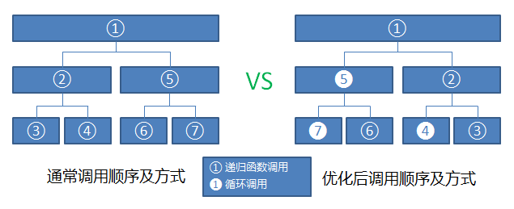

   2. #### 三点中值法

   3. #### 分割算法： __unguarded_partition

   ```c++
   template <class RandomAccessIterator, class T>
   RandomAccessIterator __unguarded_partition(RandomAccessIterator first, 
                                              RandomAccessIterator last, 
                                              T pivot) {
       while (true) {
           while (*first < pivot) ++first;
           --last;
           while (pivot < *last) --last;
           if (!(first < last)) return first;
           iter_swap(first, last);
           ++first;
       }
   } 
   ```

   4. 深度恶化处理：partial_sort(其实是堆排序)`__introsort_loop`的最后一个参数`depth_limit`是前面所提到的判断分割行为是否有恶化倾向的阈值，即允许递归的深度，调用者传递的值为`2logN`。注意看`if`语句，当递归次数超过阈值时，函数调用`partial_sort`，它便是堆排序:

   ```c++
   template <class RandomAccessIterator, class T, class Compare>
   void __partial_sort(RandomAccessIterator first, RandomAccessIterator middle,
                       RandomAccessIterator last, T*, Compare comp) {
       make_heap(first, middle, comp);
       for (RandomAccessIterator i = middle; i < last; ++i)
           if (comp(*i, *first))
               __pop_heap(first, middle, i, T(*i), comp, distance_type(first));
       sort_heap(first, middle, comp);
   }
   
   template <class RandomAccessIterator, class Compare>
   inline void partial_sort(RandomAccessIterator first,
                            RandomAccessIterator middle,
                            RandomAccessIterator last, Compare comp) {
       __partial_sort(first, middle, last, value_type(first), comp);
   }
   ```

   4. 插入排序，在sort大小小于_stl_threadhold的时候开始调用__final_insertion_sort(插入排序优化看上面的文章)

```c++
template <class RandomAccessIterator>
void __final_insertion_sort(RandomAccessIterator first, 
                            RandomAccessIterator last) {
    if (last - first > __stl_threshold) {
        __insertion_sort(first, first + __stl_threshold); //保证最小值一定在序列的最左边
        __unguarded_insertion_sort(first + __stl_threshold, last); //剩下的就可以用不带边界检测的版本排序
    }
    else
        __insertion_sort(first, last);
}
```

插入排序这部分优化非常巧妙，总结来说是这样的：

STL有一个__stl_threshold，快排的时候划分划分到这个threshold就可以停止了。这时候剩下的就是一个每个块之间有序，但是块内部无序的状态

然后接下来，使用插入排序，插入排序对于第一小部分（也就是first - > first+threshold)这部分，使用基本的插入排序。然后对于第一小部分之后的部分，因为已经保证了最小值一定在区间之前，因此可以使用没有边界检测的插入排序，这样更快。

对于特别小的序列，使用插入排序优化，对于递归特别深的部分，直接使用堆排序方式最坏情况

> 单链表可以用sort吗，以及时间复杂度
>
> 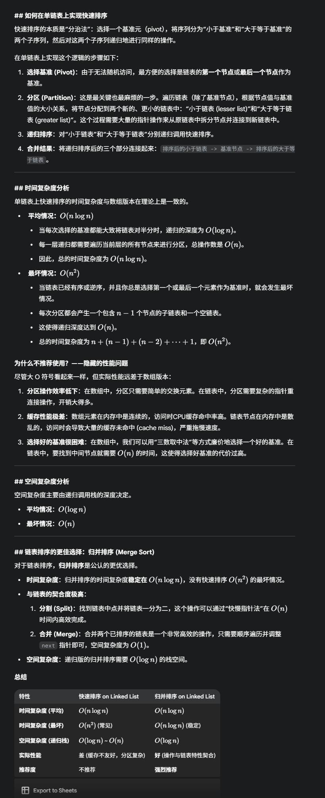

## vector

vector如何释放内存？

就算是vector.clear也没法释放内存，而且vector扩容是只增不减

https://www.cnblogs.com/summerRQ/articles/2407974.html

可以用vector\<int\>().swap(vec)来让vec离开自身作用域，然后释放。或者是vec = {}

## rb_tree

1. map和multimap的区别？

>  multimap 保存多个多个相同的key，而map不可以。multimap不支持下标运算。

原因是都是rb_tree，map使用的插入元素的时候用的是insert_unique，而unordered_map用的是insert_equal

2. 插入删除查找时间复杂度：O(lgN)
3. 和hashtable对比，一般是map和unorderd_map

## allocator

> ```cpp
> // 配置空间，足以存储n个T对象
> pointer allocator::allocate(size_type n, const void* = 0)
> // 释放空间
> void allocator::deallocate(pointer p, size_type n)
> // 调用对象的构造函数，等同于 new((void*)p) T(x) 
> // new((void*)p) T(x) 为placement new，即在指定内存空间下构造函数
> void allocator::construct(pointer p, const T& x)
> // 调用对象的析构函数，等同于 p->~T()
> void allocator::destroy(pointer p)
> ```

allocator是给::new封装了一层，这样默认用new，但是也可以通过重载new来使用新版本。然后再调用构造函数负责构造

析构的时候用deallocate()，方法也一样，先析构，再delete()

## STL的两级分配器


https://blog.csdn.net/qq_44824574/article/details/124001624

https://zhuanlan.zhihu.com/p/576475874

如果要分配的内存过大一般是大于128bytes，那么就调用第一级配置器，用malloc和free

如果是小于128bytes，就用第二级配置器，二级配置器使用内存池+自由链表（free_list)的形式避免了小块内存带来的碎片化，**提高了内存分配的效率以及内存利用率**。（为了降低小块内存带来的内存碎片和频繁申请释放的性能问题）

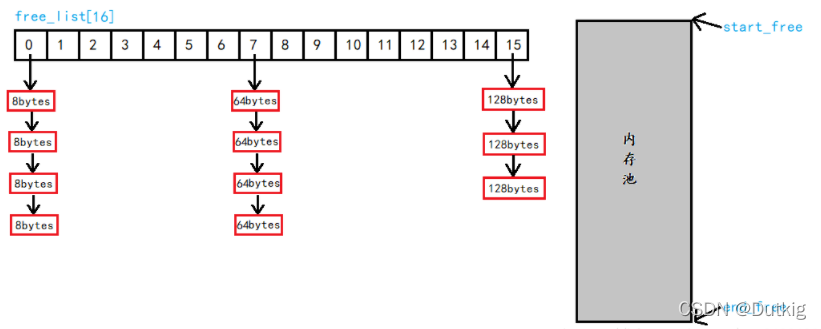

free-list节点的定义：

```c++
 union _Obj {
        union _Obj* _M_free_list_link; // 当块在自由链表上时使用
        char _M_client_data[1];   // 当块被分配给客户端时使用 (实际大小会更大)
  };
```


https://www.bilibili.com/video/BV1mWWeeZEwu?spm_id_from=333.788.player.switch&vd_source=5d4070cc138983fa1babce80b5a31622&p=29

# 设计模式

## 单例模式

https://zhuanlan.zhihu.com/p/37469260

懒汉模式：第一次使用的时候才初始化

```c++
// version 1.0
// 传统的使用指针版本的懒汉模式，第一次初始化的时候时线程不安全的，需要通过双检测锁模式
class Singleton
{
private:
	static Singleton* instance;
private:
	Singleton() {};
	~Singleton() {};
	Singleton(const Singleton&);
	Singleton& operator=(const Singleton&);
public:
	static Singleton* getInstance() 
        {
		if(instance == NULL) 
			instance = new Singleton();
		return instance;
	}
};
// init static member
Singleton* Singleton::instance = NULL;


//-------------还有一个版本可以更好的体现懒汉，利用了C++11的特性，也就是局部静态变量只在第一次调用时初始化，因此就直接时线程安全的了
class LazySingleton {
public:
    // 公有静态方法，返回实例的引用
    static LazySingleton& getInstance() {
        std::cout << "Thread " << std::this_thread::get_id() << " calling getInstance()." << std::endl;
        // 函数局部静态变量，在第一次调用此函数时创建并初始化
        // C++11标准保证这个初始化过程是线程安全的
        static LazySingleton instance;
        return instance;
    }

    void showMessage() {
        std::cout << "Hello from Lazy Singleton (Meyers)!" << std::endl;
    }

private:
    // 私有构造函数
    LazySingleton() {
        std::cout << "LazySingleton constructor called." << std::endl;
    }

    // 禁止拷贝构造和赋值操作
    LazySingleton(const LazySingleton&) = delete;
    LazySingleton& operator=(const LazySingleton&) = delete;

    // 私有析构函数
    ~LazySingleton() {
        std::cout << "LazySingleton destructor called." << std::endl;
    }
};
```

懒汉模式的问题：内存泄漏（也就是说，`static Singleton* instance;`被创建出来之后，如果没有人手动销毁，那么它是不会被销毁的），多线程数据竞争

解决方法:（内存泄漏）

 	1. 是使用智能指针，把`static Singleton* instance;`,换成`static std::unique_ptr<Singleton> instance_ptr;`
 	2. 使用类内静态成员变量（这是因为C++ 静态成员的析构函数是**自动调用**的。当程序终止时，静态成员会按照其构造顺序的逆序被销毁，并自动调用它们的析构函数。这与全局对象的行为类似。

```c++
class Singleton
{
private:
	static Singleton* instance;
private:
	Singleton() { };
	~Singleton() { };
	Singleton(const Singleton&);
	Singleton& operator=(const Singleton&);
private:
	class Deletor {
	public:
		~Deletor() {
			if(Singleton::instance != NULL)
				delete Singleton::instance;
		}
	};
	static Deletor deletor;
public:
	static Singleton* getInstance() {
		if(instance == NULL) {
			instance = new Singleton();
		}
		return instance;
	}
};

// init static member
Singleton* Singleton::instance = NULL;
```

解决方法（多线程）：线程安全问题仅出现在第一次初始化（new）过程中

使用双重检查锁定

```c++
static Singleton* getInstance() {
	if(instance == NULL) {
		Lock lock;  // 基于作用域的加锁，超出作用域，自动调用析构函数解锁
        if(instance == NULL) {
        	instance = new Singleton();
        }
	}
	return instance;
}
//实现：
atomic<Widget*> Widget::pInstance{ nullptr };
Widget* Widget::Instance() {
    if (pInstance == nullptr) { 
        lock_guard<mutex> lock{ mutW }; 
        if (pInstance == nullptr) { 
            pInstance = new Widget(); 
        }
    } 
    return pInstance;
}
```

饿汉模式：

饿汉版（Eager Singleton）：指单例实例在程序运行时被立即执行初始化

```c++
// version 1.3
class Singleton
{
private:
	static Singleton instance;
private:
	Singleton();
	~Singleton();
	Singleton(const Singleton&);
	Singleton& operator=(const Singleton&);
public:
	static Singleton& getInstance() {
		return instance;
	}
}

// initialize defaultly
Singleton Singleton::instance;
```

由于在main函数之前初始化，所以没有线程安全的问题。但是潜在问题在于no-local static对象（函数外的static对象）在不同编译单元中的初始化顺序是未定义的。也即，static Singleton instance;和 如果有**另一个编译单元B**中的某个no-local static对象 `OtherStaticObjectInB` 的初始化（即其构造函数执行）**依赖于** `Singleton::instance` 二者的初始化顺序不确定，如果在初始化完成之前调用 getInstance() 方法会返回一个未定义的实例。

C++并不保证no-local static（也就是非函数内的局部的（local）static变量的初始化顺序）


# 标准库

## std::forword

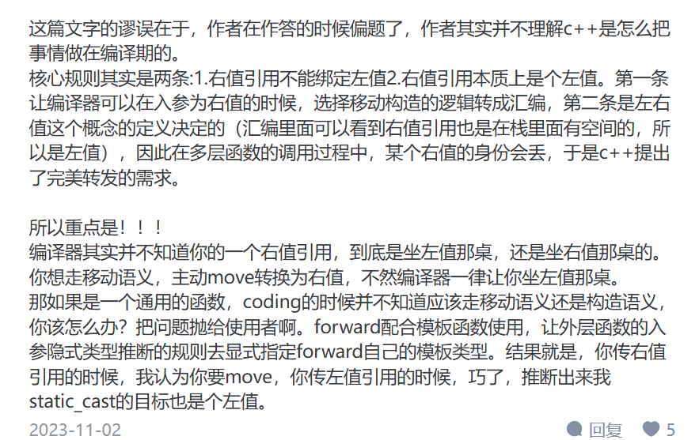

```c++
struct remove_reference {			
    using type                 = _Ty;
    using _Const_thru_ref_type = const _Ty;
};
template <class _Ty>
struct remove_reference<_Ty&> {
    using type                 = _Ty;
    using _Const_thru_ref_type = const _Ty&;
};

template <class _Ty>
struct remove_reference<_Ty&&> { //一般不会匹配到这里
    using type                 = _Ty;
    using _Const_thru_ref_type = const _Ty&&;
};

using remove_reference_t = typename remove_reference<_Ty>::type;
//正常情况下就是走这一条
template <class _Ty>
_NODISCARD constexpr _Ty&& forward(
    remove_reference_t<_Ty>& _Arg) noexcept { // forward an lvalue as either an lvalue or an rvalue
    return static_cast<_Ty&&>(_Arg);
}
 
//容灾：一般不用，只在：试图将一个右值当作左值转发
template <class _Ty>
_NODISCARD constexpr _Ty&& forward(remove_reference_t<_Ty>&& _Arg) noexcept { // forward an rvalue as an rvalue
    static_assert(!is_lvalue_reference_v<_Ty>, "bad forward call");
    return static_cast<_Ty&&>(_Arg);
}
```

std::forword是两套规则一起起作用

第一个是类型推导规则：如果param是一个左值（比如int i =10），那么T就是int&。如果param是右值（比如10），那么T就是int

第二个是引用折叠，

> 
> && + &&->&& : 右值的右值引用是右值
>
> && + &->& : 右值的左值引用是左值
>
> & + &&->& : 左值的右值引用是左值
>
> & + &->& : 左值的左值引用是左值

static_cast<T&&>这里会触发折叠，如果是T是int&，那么static_cast<int& &&>会折叠为static_cast\<int&\>,并且值得注意的是，返回值那里的T&&也会发生折叠，折叠为int&

> Q1：那什么情况下会匹配到：
>
> ```c++
> template <class _Ty>  
> struct remove_reference<_Ty&&> { 
>    using type   = _Ty;
>    using _Const_thru_ref_type = const _Ty&&; 
> 
>  };
> ```
>
> 
>
> 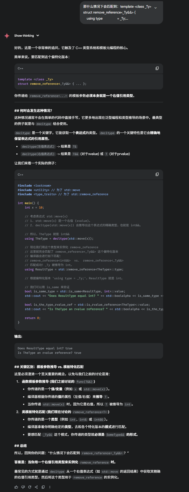
>
> Q2: 正常使用都是用：
>
> ```c++
> template <class _Ty>
> _NODISCARD constexpr _Ty&& forward(
>     remove_reference_t<_Ty>& _Arg) noexcept { // forward an lvalue as either an lvalue or an rvalue
>     return static_cast<_Ty&&>(_Arg);
> }
> ```
>
> 这个版本，为什么？：
>
> 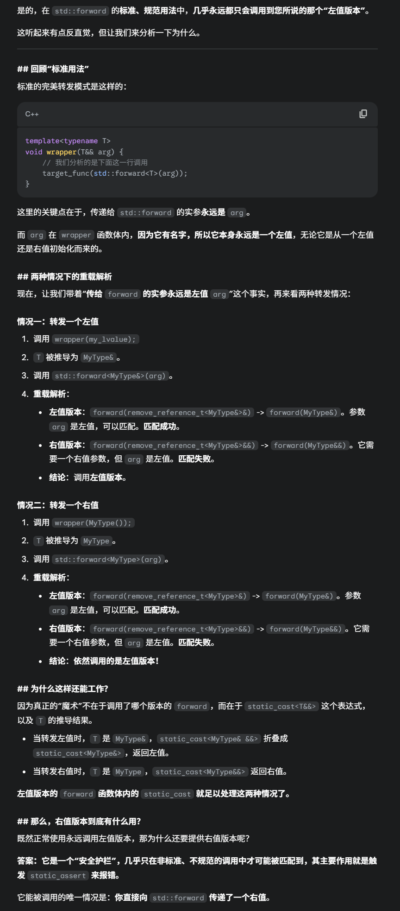
>
> 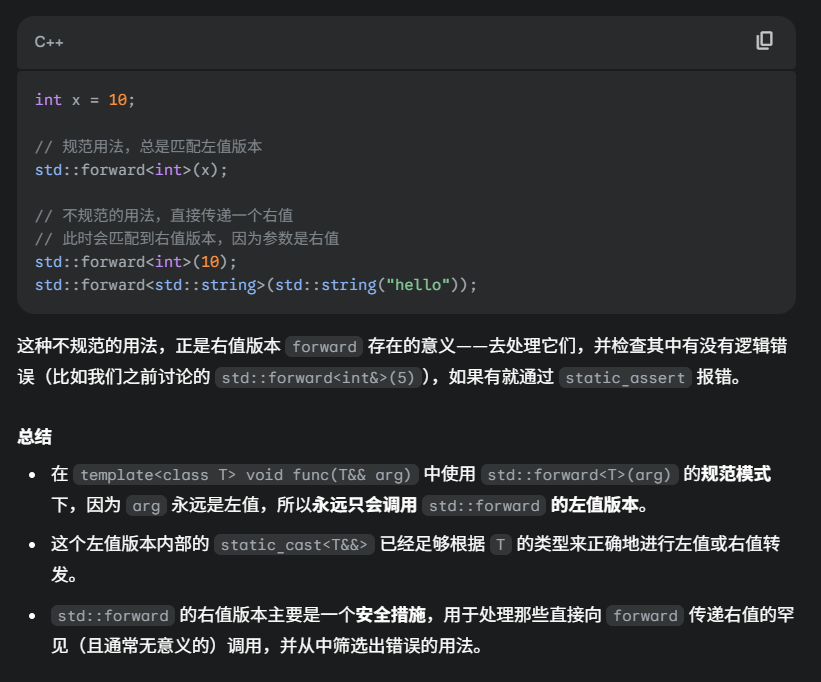
>
> > 那么什么时候才会用下面那个版本呢?
> >
> > ```c++
> > template <class _Ty>
> > _NODISCARD constexpr _Ty&& forward(remove_reference_t<_Ty>&& _Arg) noexcept { // forward an rvalue as an rvalue
> >     static_assert(!is_lvalue_reference_v<_Ty>, "bad forward call");
> >     return static_cast<_Ty&&>(_Arg);
> > }
> > ```
> >
> > 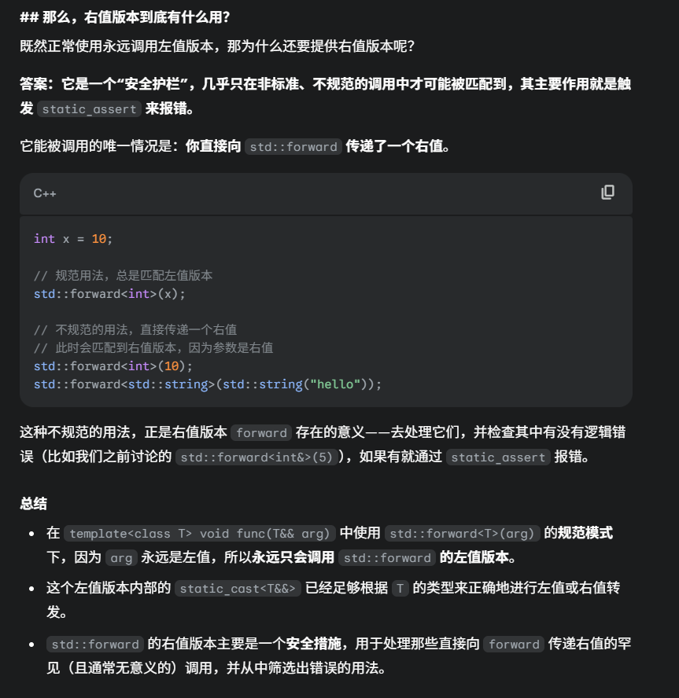
> >
> > 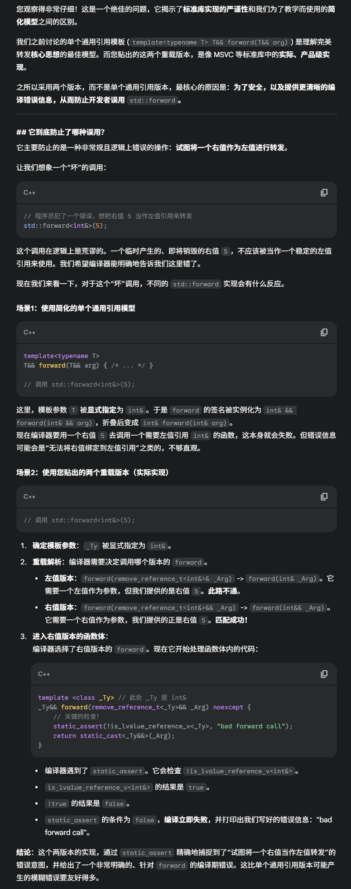

我想来总结一下：实际上，forward的关键在于对于\_Ty到底是什么的推导，以及返回值时候的static_cast。

我们在传入一个参数给std：：forward的时候，一般都是传入一个左值：

```c++
template<T>
void func(T&& arg){
    std::forward<T>(arg);
}
```

这个arg本身就是左值，但是func传入实参的左右值不同，会印象T的推导（实参是左值，那么T就是int&，实参是右值那么T就是int)，进一步对于T类型的推导会导致std::forward这个模板函数的传入模板参数不一样。

最终导致std::forward返回值的时候的引用折叠的不一样。而因为传入的本质上arg就是一个左值，因此正常来说就是会匹配到第一种实现（也就是所谓的左值版本）

右值版本的本质上是为了防止有人写出：arg确实是一个右值（比如42，“”这样的临时变量）传给forward，而模板参数写的又奇奇怪怪的时候：

```c++
std::forward<int&&>(42);//这会调用右值版本，但是是很多余的
```


## std::move

和std::forward的区别其实就是返回值的区别

std::move其实类似于forward，他会先去掉引用，去掉引用的方法就是通过上述两个规则：

```C++
x template <class _Ty> 
_NODISCARD constexpr remove_reference_t<_Ty>&& 
    				move(_Ty&& _Arg) noexcept { // forward _Arg as movable    
    return static_cast<remove_reference_t<_Ty>&&>(_Arg);}
```

根据\_Arg的类型，推断出\_Ty的类型，然后，下面一步就是去除引用，然后把它变为右值（还记得std::move的目的吗？）

这里显然就是由`remove_reference_t`实现的，那么这个`remove_reference_t`是啥呢：

```c++
template <class _Ty>
using remove_reference_t = typename remove_reference<_Ty>::type;

```

原来，`remove_reference_t`是一个别名，它是`remove_reference<_Ty>`这个类的类型成员:

```c++
template <class _Ty>
struct remove_reference {
    using type  = _Ty;
    using _Const_thru_ref_type = const _Ty;
};

template <class _Ty>
struct remove_reference<_Ty&> {
    using type                 = _Ty;
    using _Const_thru_ref_type = const _Ty&;
};

template <class _Ty>
struct remove_reference<_Ty&&> {
    using type                 = _Ty;
    using _Const_thru_ref_type = const _Ty&&;
};
```

# string 优化

https://www.cnblogs.com/YongSir/p/17066405.html

# C++初始化

## 初始化顺序

### 类内变量初始化顺序

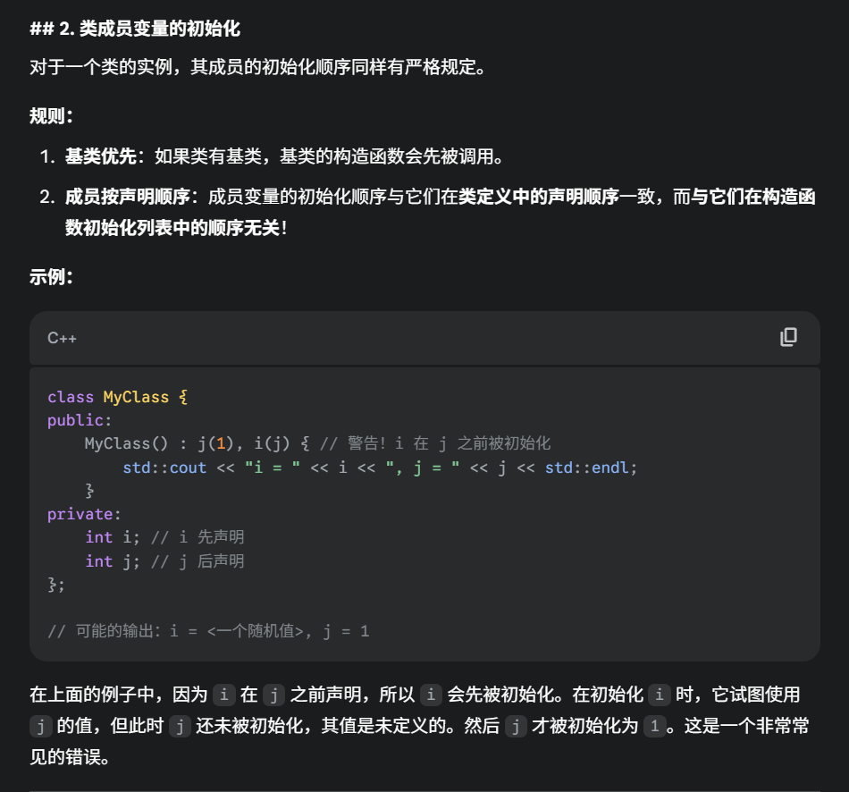 

### c++变量初始化顺序

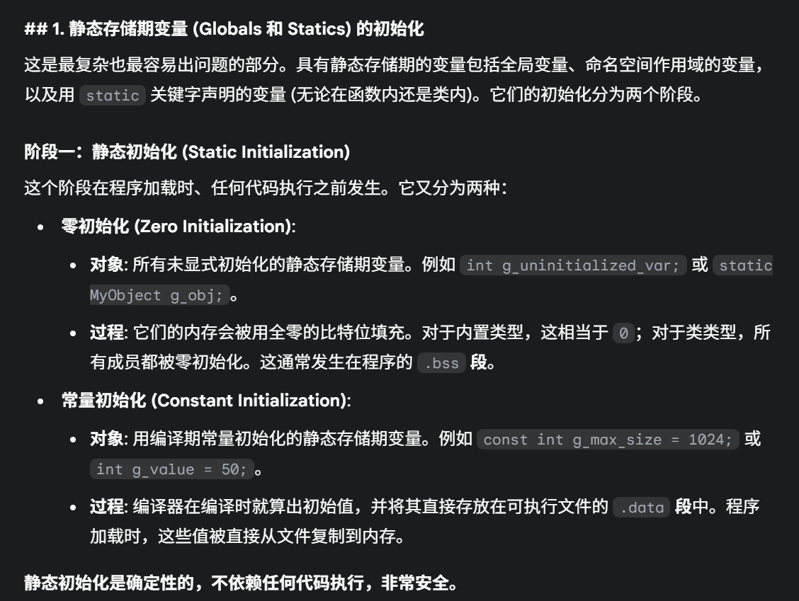

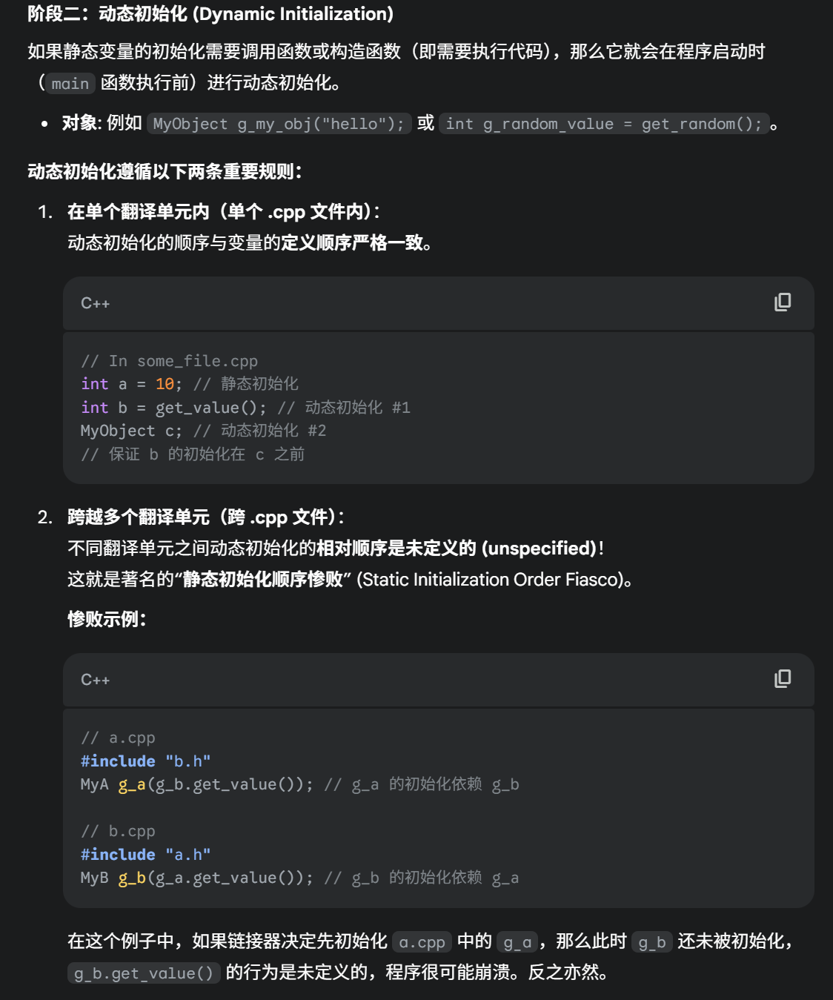

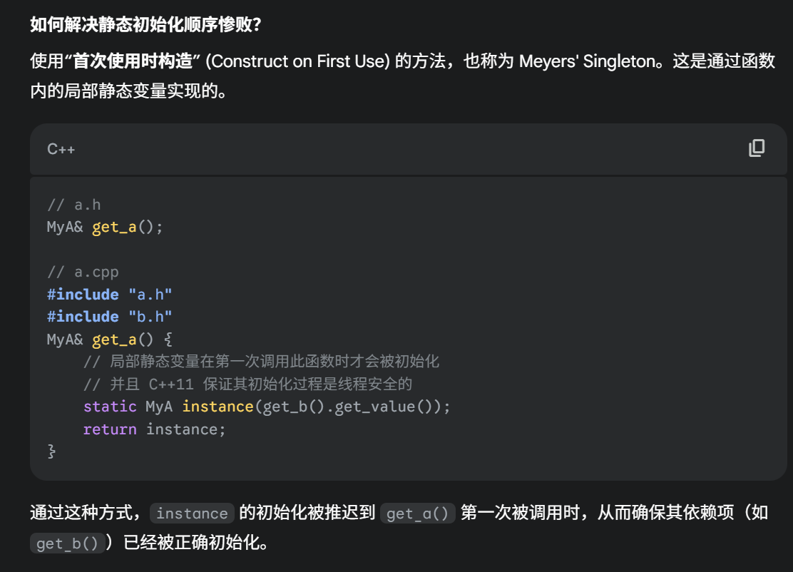

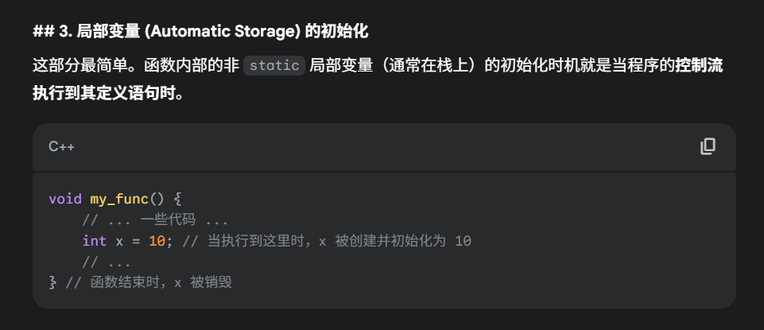

| 类别                  | 初始化顺序 / 时机                                            | 关键点                                                    |
| --------------------- | ------------------------------------------------------------ | --------------------------------------------------------- |
| **静态/全局变量**     | 1. 静态初始化 (零/常量) 在程序加载时。&lt;br>2. 动态初始化在 `main` 之前。 | **单个文件内按定义顺序**，**跨文件顺序未定义 (危险！)**。 |
| **`static` 局部变量** | 第一次调用函数，且执行到其定义时。                           | **线程安全 (C++11后)**。解决“静态初始化顺序惨败”的良方。  |
| **自动 (栈) 变量**    | 控制流执行到其定义时。                                       | 每次函数调用都会重新初始化。                              |
| **类成员变量**        | 1. 基类构造函数。&lt;br>2. 成员按**类内声明顺序**。          | **与构造函数初始化列表的顺序无关！**                      |
| **动态 (堆) 变量**    | 在 `new` 表达式被求值时。                                    | 生命周期由 `new` 和 `delete` (或智能指针) 控制。          |

# 虚函数

> 所谓动态绑定的核心是：在编译期，无法确定是什么类型：
>
> 比如想象一个函数：
>
> void func(A* a){ a->func()};
>
> 在A有基类B的情况下，我们实际上在编译的时候，是不知道传入的这个a到底是A，还是B的。所以内部的这个a->func()也只能靠虚函数这一套来走了（除非没有虚函数，也就是没有动态多态的这种需求）

说虚函数实现的时候，记得说一下虚函数表指针是属于对象的，存在对象的那个那个地方，而不是类

## 基类的析构方法调用虚函数，会呈现多态吗

**不会。**在基类的析构函数中调用虚函数，**不会**呈现多态性。调用的将是**基类版本**的虚函数，而不是派生类的版本。

> 在构造函数和析构函数中调用虚函数时，对象的动态类型被视为当前正在执行构造/析构的那个类的类型。这是一个为了防止访问未初始化或已销毁成员而设计的核心安全特性。
>
> **关键点在于**：当程序的执行流进入基类的析构函数 (`~Base()`) 时，派生类的部分（包括其所有成员变量）**已经被销ย毁了**。此时，从 C++ 运行时的角度来看，这个对象不再是一个完整的 `Derived` 类型对象，它的类型已经“退化”成了一个 `Base` 类型对象。
>
> 既然对象的动态类型已经變成了 `Base`，那么它的虚函数表（vtable）指针也会指向 `Base` 类的虚函数表。因此，任何在 `~Base()` 内部对虚函数的调用，都会通过这个虚函数表解析到 `Base` 类自己的版本，多态机制在此刻已经失效。

实际上，析构的时候，虚函数表指针的值是一层一层退回的，（和构造的时候差不多），都是一层一层赋值回去的。

## 在类的构造函数中调用虚函数会呈现多态吗

也不会，实际上走的也是虚函数表指针，但是，这个时候的虚函数表指针的值，是当前构造中的这个对象的虚函数表指针，而不是任何派生类的版本

> 所以其实，本质上还是走了虚函数表指针，但是，无论是构造还是析构函数中，虚函数表指针的具体版本，都是当前构造或者析构中的版本

## 虚函数表指针的值是什么时候赋值的？

虚函数表指针的数值赋值，是一层一层构造函数构造前一层一层覆盖的

## 在类内的普通函数中调用虚函数，会触发多态吗

会表现出多态

## 两个基类都有虚函数，虚函数表指针放在哪里(对象的内存空间构造)

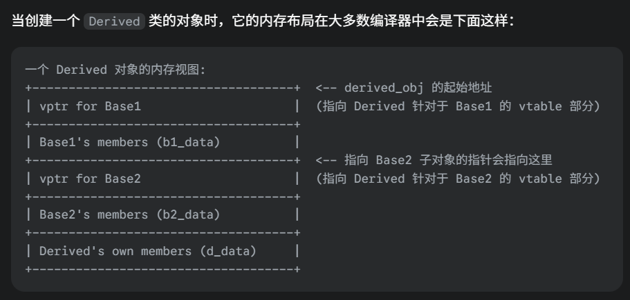

看这里吧:[对象模型](.\C++新经典：对象模型)

## 为什么构造函数不能是虚函数

这是因为构造函数构造的时候，虚函数表指针还没有确定下来。构造过程中对象的类型是动态变化的。对象的构造是“从基类到派生类”逐层进行的。

> vptr 是构造过程的**产物**

## 如果既有虚函数又有虚继承，那么对象内存开头的部分是显示虚表指针还是虚基类表指针

简短的回答是：在绝大多数（几乎所有）编译器的实现中，**如果两者都需要，**虚表指针 (vptr) 会在最前面**。

`vbtptr` (虚基类表指针) 要么在它之后，要么其功能被合并到虚表 (vtable) 中了。

**为什么 `vptr` 在最前面？** `vptr` 对于对象的“类型身份”至关重要。动态转换 (`dynamic_cast`)、`typeid` 以及所有虚函数调用都依赖于它。它是一个类最“核心”的特性，因此它被放在最优先的位置（偏移量为 0）。`vbtptr` 相对“次要”，它只在构造期间或访问虚基类时才需要。


## 虚函数的位置和虚函数表的位置

虚函数存储在Code段

虚函数表的位置存储在data段

虚函数的相对位置在编译的时候就已经确定好了，就像正常的函数一样。

# C++类

## This指针

## 什么是成员函数指针，他和函数指针有什么区别

- **普通函数指针**：就是一个简单的**内存地址**。
- **成员函数指针**：要复杂得多，它需要和**一个对象实例**（即 `this` 指针）**绑定**后才能工作。

普通函数指针是一个变量，存储的是一个**普通函数（或静态成员函数）** 在内存中的**地址**。它指向的代码是**独立且自足**的，它不需要任何“上下文”或对象实例就能运行


## **成员函数指针了解么？可以转换为Void\*么？为什么？**

https://www.cnblogs.com/jans2002/archive/2006/10/13/528160.html

> 成员函数指针的实现是不是不同编译器都不一样啊。我了解下来里面至少要存储：this的delta偏移，虚函数表的索引，函数本身的地址（我猜测应该是一个指向Code段的地址，存储的应该是编译后的指令码）
>
> 
>
> 


## C++当中，一个空类也是有内存大小的，那么为什么要这样呢，以及这个大小中存储的是什么呢

C++ 的设计哲学规定，**“身份” (Identity) 是通过“地址” (Address) 来区分的**。

假设一个空类：

```c++
class Empty {};
```

那么我声明两个Empty对象：

```c++
int main() {
    Empty e1;
    Empty e2;

    // 如果 sizeof(Empty) == 0，那么 e1 和 e2 的地址会是什么？
    // 它们很可能会是同一个地址！
    if (&e1 == &e2) {
        // 这就出问题了！e1 和 e2 是两个不同的对象，
        // 但我们无法在内存中区分它们。
    }
}
```

如果要区分e1和e2，就他们的地址就必须不同，地址不同就导致这俩必须要占用空间

因此，C++ 标准规定，**任何对象（Object）的大小至少为 1 字节**（即使它没有任何成员）。

**这个 1 字节里存储的是什么**

这个 1 字节是**纯粹的“占位符” (Padding)**。

**空基类优化**

你可能会想：“如果我继承一个空类，我的类会变大 1 字节吗？”

**答案：通常不会！** 这就是“空基类优化” (Empty Base Optimization, EBO)。

虽然一个**独立**的空类对象必须占用 1 字节，但当一个空类**作为基类**时，编译器足够聪明，可以“压缩”掉这个字节。

```
class Empty {}; // sizeof(Empty) == 1

class Derived : public Empty { // 继承 Empty
    int data; // sizeof(int) == 4
};
```

**按理说：** `sizeof(Derived)` 应该是 `sizeof(Empty) + sizeof(int) = 1 + 4 = 5` 字节？

**实际上：** 编译器会执行 EBO。它会让 `Empty` 基类部分**“寄宿”** 在 `Derived` 对象的内存中，和 `data` 成员共享同一个起始地址（或者说，让 `Empty` 部分占用 0 字节）。


# 元编程

## CPP中的模板函数的定义大部分都要放在头文件中

https://zhuanlan.zhihu.com/p/596002108


**一句话总结：** **因为模板是“蓝图”，而不是“代码”。** C++ 编译器在编译时，**必须同时“看到”模板的“蓝图（实现）”和“调用（实例化）”**，才能当场生成所需的具体代码。

假设我们把模板的声明和实现分开了：

- **`MyTemplate.h` (头文件 - 声明)**

  C++

  ```
  template <typename T>
  void print(T value); // 只有声明
  ```

- **`MyTemplate.cpp` (实现文件 - 定义)**

  C++

  ```
  #include "MyTemplate.h"
  #include <iostream>
  
  template <typename T>
  void print(T value) { // 蓝图（实现）在这里
      std::cout << value << std::endl;
  }
  ```

- **`Main.cpp` (使用文件 - 调用)**

  C++

  ```
  #include "MyTemplate.h" // 只包含了声明
  
  int main() {
      print(123); // (1) 编译器需要 T=int 的版本
      print(3.14); // (2) 编译器需要 T=double 的版本
  }
  ```

这时候Main.cpp编译的时候，因为他找不到Print\<int\>和Print\<double\>这些版本，因此他会希望链接的时候，从其他编译单元找到Print\<int\>和Print\<double\>这两个函数的实现。

但实际上，其他的编译单元中也没有这两个函数的实现，因为模板只会在使用的时候才会实例化成具体类型

# 杂七杂八

## 头文件的函数在cpp中没有实现会报错吗

不一定，主要取决于这个只声明未实现的函数是否在代码中被调用了。

**情况一：函数只在头文件中声明，但从未被任何代码调用**

完全不会报错。程序可以成功编译和链接。

**解释：**

- **编译阶段**：编译器在处理包含该头文件的 `.cpp` 文件时，看到了函数的声明。它知道了这个函数的存在、它的名字、参数和返回值类型。这对于语法检查来说已经足够了。
- **链接阶段**：链接器的工作是把所有编译好的目标文件 (`.o` 或 `.obj`) 组合起来，并解析各个文件之间的函数调用关系。但是，由于这个函数从未被调用过，所以没有任何代码需要链接器去寻找它的具体实现。因此，链接器会简单地忽略这个未被使用的声明，不会产生任何错误。

**情况二：函数在头文件中声明，并且在代码中被调用了**

结果：编译成功，但链接失败

这是最常见的情况，也是区分编译和链接错误的好例子。

1. **编译阶段 (成功)**
   - 假设在 `main.cpp` 中你调用了这个函数 `my_function()`。
   - 编译器处理 `main.cpp` 时，通过头文件看到了 `my_function()` 的声明。编译器会**信任**这个声明，认为“好的，这个函数存在于某个地方，它的接口是这样的。我现在先生成调用它的指令，具体地址等链接的时候再说。”
   - 编译器成功地将 `main.cpp` 编译成目标文件 `main.o`。在这个目标文件中，`my_function` 是一个“未解析的外部符号”。编译阶段顺利通过。
2. **链接阶段 (失败)**
   - 链接器开始工作，它把 `main.o` 和其他所有目标文件、库文件放在一起。
   - 它发现 `main.o` 中有一个对 `my_function` 的调用请求，需要找到这个函数的具体实现（也就是它的函数体）来获取其内存地址。
   - 链接器会**搜遍**所有提供给它的目标文件和库，但找不到任何地方定义了 `my_function`。
   - **链接器无法完成它的任务，因此报错。**

您好，这是一个非常经典的问题，它能很好地帮我们区分**编译 (Compilation)** 和**链接 (Linking)** 这两个重要的阶段。

答案是：**不一定，主要取决于这个只声明未实现的函数是否在代码中被调用了。**

**特殊情况**

- **内联函数 (inline functions)**：`inline` 函数是个例外。C++ 标准规定，`inline` 函数的定义必须在调用它的每个翻译单元中都可见。因此，`inline` 函数的实现**通常直接写在头文件中**。如果你只在头文件中声明 `inline` 而不实现，并在代码中调用它，同样会产生链接错误。（意思是，对于inline函数，如果没有在头文件实现，而是在cpp实现了，也会报错）
- 类成员函数
  - 如果函数实现在**类的声明内部**（在头文件中），那么它被隐式地当作 `inline` 函数处理，没有问题。
  - 如果只是在类中声明，而你忘记在对应的 `.cpp` 文件中实现它，并在代码中调用了它，那么结果和上面的“情况二”完全一样，会导致**链接错误**。

# Reference

https://zhuanlan.zhihu.com/p/47869981
