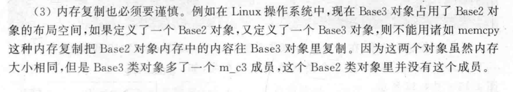

# 对象空间排布

我们知道：

```cpp
class Base{
public:
    int ib;
    char cb;
}
```

由于cpp的对齐，因此`sizeof(Base)`的大小应该是8（在int大小为4的情况下）

它的内存分布应该是：


而在一个继承关系种：

```cpp
class FAC{
public:
    int m_fai;
    int m_faj;
};
class MYACLS:public FAC{
public:
    int m_i;
    int m_j;
};
```

对于MYACLS类型来说，基类部分变量的排布是在FAC变量的排布的后面:


这里有个边界对齐的问题：如果基类需要对齐，那么子类的空间会怎么变化？

我们有类型Base：

```cpp
class Base{
public:
	int m_il;//size:4
	char m_c1l//size:1
	char m_c2;//size:1
	char m_c3;//size:1
}
```

`sizeof(Base)`的大小应该是8，因为对齐了一个字节


把Base类拆分为三个继承类：

```c++
class Base1{
public:
	int m_il;//size:4
	char m_c1l//size:1
};
class Base2:public Base1{
public:
	char m_c2;
};
class Base3:public Base2{
public:
	char m_c3;
};
```

从成员变量的角度来说，Base3实际包含了Base1，Base2的所有成员，Base3和刚才Base的内容是一致的。但是`sizeof(Base3)`的的大小是16（在Windows下，在Linux下是12），但是无论如何都比8大

Base3的内存分布为：


有个很有意思的地方，Base3和Base2在Linux下的对比说明，我们不能随意的内存复制



# 虚函数存在的继承

有个比较有趣的情况：子类有虚函数，父类没有虚函数


或许会以为，是如上图一样的构成，但是实际上，**子类有虚函数，父类没有虚函数**和**子类有虚函数，父类有虚函数**是一样的。也就是虚函数表指针存放在开头

而为什么MYACLS::m_bi（父类成员变量）的偏移会是0呢。这是因为，在父类当中是没有虚函数表指针的。这时候，this指针的位置实际上会发生偏移，偏移到虚函数表指针之后。

也就是说**偏移值实际上反应的是相对于this指针的偏移，而不是类对象开头地址的偏移，实际上this指针的位置是会变的**


而多个父类且父类都有虚函数的子类来说。也会发生this指针调整的情况。比如对于两个父类Base1和Base2.这两个父类各自有虚函数表指针，子类会按照继承顺序拥有两个虚函数表指针。这两个表指针占8字节内存，但是如果我们访问两个父类的第一个成员变量的偏移，就会发现他们的偏移量都是4.（因为都是相对于自己的虚函数表,这两个表指针各自放在两个父类各自内存占用的部位里面，大致如下图：）

这里还有个问题，就是在C的构造函数的时候，A和B的构造函数也会被调用，这时候它们各自构造函数中的this指针的指向就如下图了,this指针的调整是编译器介入的

还有就是用基类指针的时候，也会调整，比如：

```
B* pb=new C();
```

```
C 对象内存布局:
----------------------------
| vptr_A | A 的成员变量 | vptr_B | B 的成员变量 |
----------------------------
^                         ^
|                         |
thisA                    thisB
^
|
thisC
```


很有意思的代码来验证布局：

```cpp
#include<iostream>
using namespace std;
class A{
        public:
                virtual void funcA(){;}
};
class B{
        public:
                virtual void funcB(){;}
};

class C:public A,public B{
        public:
                void funcC();

};


int main(){
//A* p=new C(); //正确，因为A* p确实指向开头
//B* p=new C(); //会报错，因为B* p指向的不是new C()的开头地址
C* p=new C();
delete p;

}
```

## 虚继承

### 虚继承的布局：

虚继承的类的开头放的是“虚基类表指针”，而真正的虚基类会被放在类的最后面，并且随着继承关系的延续而调整。

虚基类表指针指向一个存储在静态内存空间当中的虚基类表，虚基类表是属于整个类的。虚基类表里面存储的是虚基类表指针的首地址和虚基类子对象首地址之间的偏移量


虚基类表内容的前4个字节是对象本身与虚基类表指针成员变量首地址之间的偏移量。


在C++的虚拟继承机制中，虚基类表（VBTable）存储的是偏移量信息，用于帮助编译器在对象的内存布局中找到虚基类的唯一实例。特别是在复杂的继承体系（例如多重和菱形继承）中，VBTable 的偏移量数据使得编译器能够正确地定位虚基类实例的位置。

### VBTable 的内容

虚基类表（VBTable）通常包含以下内容：

1. **偏移量信息**：
   - VBTable 的主要内容是记录虚基类相对于派生类对象起始地址的偏移量。
   - 对于每一个虚基类，VBTable 中都会有一个条目，存储该虚基类实例相对于当前对象的偏移量。
   - 这个偏移量用于在访问虚基类的成员变量或方法时，计算虚基类实例在派生类对象中的位置。
2. **虚基类偏移列表**：
   - 如果一个类存在多个虚基类（即多重虚拟继承），VBTable 会包含多个偏移量条目，每个条目对应一个虚基类。
   - 通过这些偏移量条目，编译器可以在复杂的继承层次中找到每个虚基类的位置，从而确保虚基类的唯一性。
3. **多层次继承支持**：
   - 在多层次的虚拟继承结构中，VBTable 可能包含指向其他 VBTable 的指针，用于处理多级继承的虚基类偏移。
