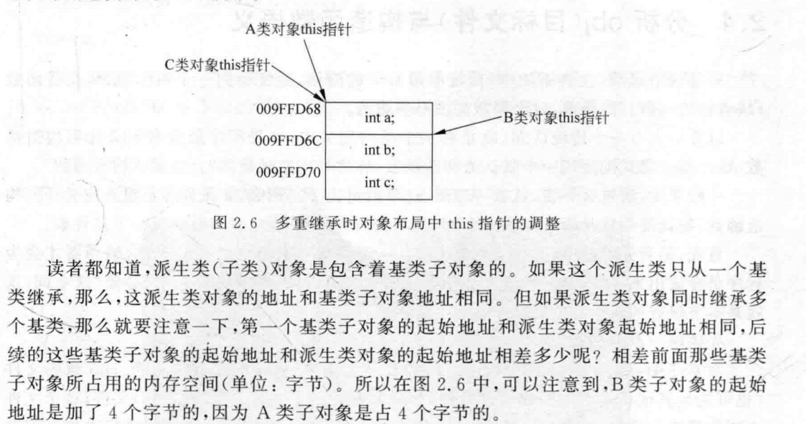
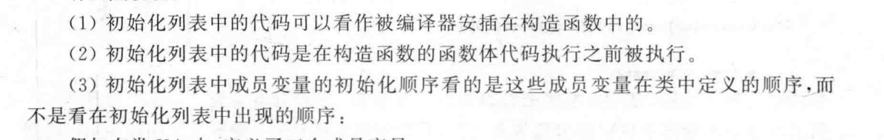

# C++对象结构

1. 空对象取Sizeof也有一个字节的占用：

我们知道，对象当中的static变量、类内方法都属于类而不属于对象，因此他们都不会占用对象的空间。

但是当在类内声明一个virtual 函数之后，对象大小就会从1字节变为4字节。4字节是虚函数表指针（vtbp）

多继承下，this指针的起始位置不一样



## 2. 合成的默认构造函数：

合成的默认构造函数只有在**必要**的时候才会真正的被编译器产生

何时是必要的？

1. 当类中没有自定义的**任何构造函数**（注意是任何构造函数，意味着不只是无参，有参，还是拷贝，移动），并且类内存在**类类型的成员变量**的时候

2. 父类有默认构造函数，但是子类没有**任何构造**函数
3. 一个类有虚函数，但是这个类没有**任何构造**函数
4. 一个类有虚基类，且无构造函数（为了赋值虚基类指针）
5. 在定义成员变量时赋初值

说白了，类的默认构造函数只有在需要在构造函数构造的时候进行一些操作或者调用的时候才会被编译器构造：比如父类的构造，就需要在构造函数当中被调用

注意，每个拥有虚函数的类对象，都会维护一个虚函数表指针，而这个指针的值，就是在构造函数执行的时候被执行赋值的

## 3. 合成的拷贝构造函数

同样也是只有在必要的时候才会合成

非必要时不会合成，比如下面的例子：

```cpp
class B{
public:
    int b;
};
class A{
public:
    int a;
    B b;
       };
int main(void){
    A oa;
    oa.a=10;
    oa.b.b=20;
    A oa2=oa;
}

```

这时候实际上没有生成拷贝构造自动的拷贝构造函数。这时候实际上编译器是直接复制数值到oa里（也就是所谓的bitwise），而不是借助拷贝构造函数。

合成条件如下：

1. 类A没有拷贝构造函数，但是类内包含一个类成员变量，且类成员变量有自定义的拷贝构造函数（这时候生成的目的是为了向类A生成的拷贝构造函数里面嵌入对于成员变量的拷贝构造函数的调用）

2. 类A没有拷贝构造函数，但是A有一个父类，父类有自定义的拷贝构造函数 
3. 类A没有拷贝构造函数，但是类A有虚函数，或者父类有虚函数
4. 类A没有拷贝构造函数，但是有虚基类

## 移动构造函数

1. 如果类中有拷贝构造函数，拷贝赋值运算符或者析构函数中任意一个，那么就**不会**自动生成移动构造函数和移动构造运算符
2. 只有类内没有以上三种任意一个，且类内所有的**非静态变量**都是可移动的，那么才会自动生成

可移动的的条件：1. 内置类型2.类类型变量，但是这个类有自定义的移动构造函数


## 初始化列表

必须在初始化列表中初始化：

1. 引用类型的成员变量必须在初始化列表当中被初始化

```
class A{
public:
 	int& ri;
 	A(int& x):ri(x){
	}
};
```

2. const类型成员变量
3. 基类有参构造函数调用
4. 有一个类类型的成员变量，且这个成员变量只有一个含参构造函数


