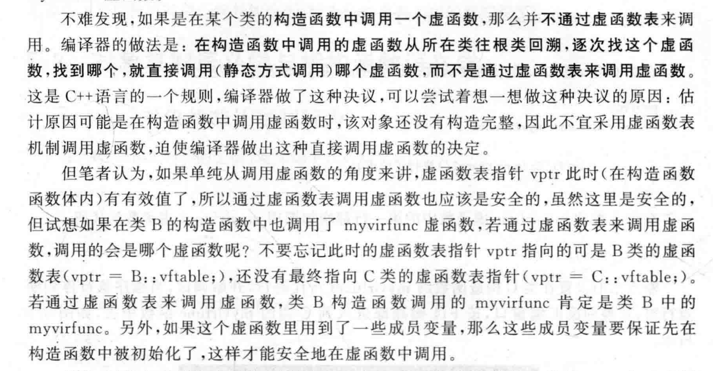
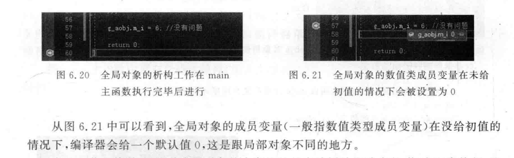
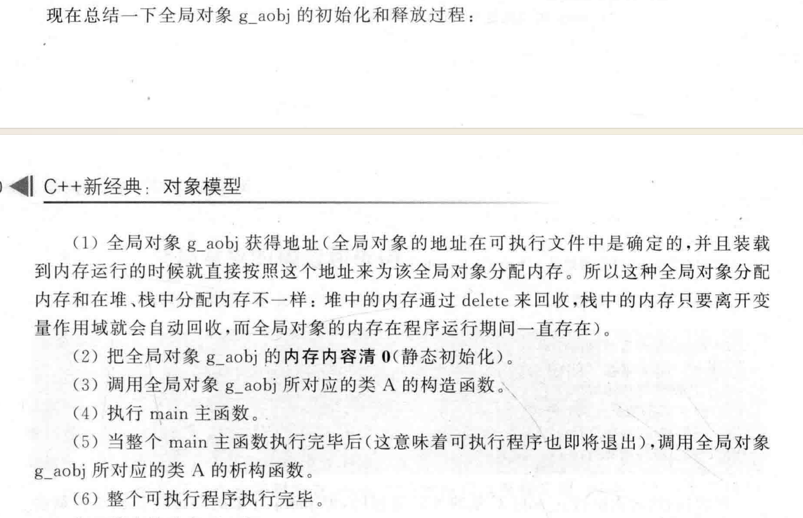

# 构造语义学

## 在构造/析构函数中使用虚函数

实际上，在构造函数中调用虚函数，虚函数的调用是基于当前构造函数所在类的类型，而不是派生类的类型。是通过静态调用而不是经过虚函数表

```cpp
#include <iostream>
using namespace std;

class Base {
public:
    Base() {
        cout << "Base constructor: Calling virtual func()" << endl;
        func();
    }

    virtual void func() {
        cout << "Base::func()" << endl;
    }

    virtual ~Base() {
        cout << "Base destructor" << endl;
    }
};

class Derived : public Base {
public:
    Derived() {
        cout << "Derived constructor" << endl;
    }

    void func() override {
        cout << "Derived::func()" << endl;
    }

    ~Derived() {
        cout << "Derived destructor" << endl;
    }
};

int main() {
    Base* d=new Derived;
    return 0;
}
/*
Base constructor: Calling virtual func()
Base::func()
Derived constructor
*/
```

可以看到，对于动态类型为Derived的对象d，在构造Base的时候，调用了虚函数，但是却并没有执行多态。恰恰相反，构造函数和析构函数里的虚函数是直接调用的



## 变量初始化

全局，static变量，都会默认初始化为空。（0，null）

局部变量则不会默认初始化，比如int，会赋值随机值

类内的成员变量：

+ 对于局部变量，如果不是显式赋值，也不会自动赋默认值，而是也会未定义的随机值。
+ 对于全局变量，如果不显式赋值，会自动赋值为空

```cpp
#include<iostream>
using namespace std;
class A{
public:
	int i;
};
A a1;
int main(){
        A a2;
        cout<<a1.i<<endl;
        cout<<a2.i<<endl;
}
//输出：
//0
//32671
```


为什么全局，static这些变量要保存在数据段里面，想象一下，对于局部变量，它要么存储在Stack上，要么存储在Heap上，都会随着作用域被释放。

而全局变量的作用域是全局的。所以需要一个单独的地方来存储并且管理其生命周期，所以存在.data和.bss段。



