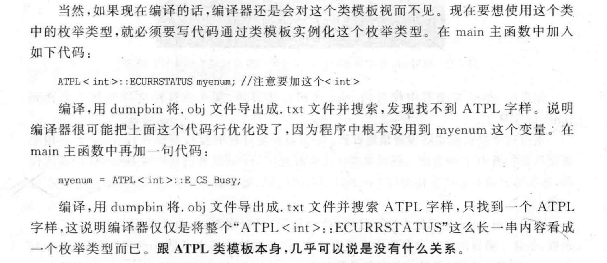

# 模板语义学

## 模板类的实例化

### 类内的enum，static

模板类内的enum或者static变量。如果单单要使用这些成员内的变量或者类型，那么只会对应的实例化这些变量，而不会实例化具体对应的类



### 成员函数的实例化

比如对于:

```cpp
template<class T>
class TA{
public:
    void func1(){}
     void func2(){}
    
};
```

对于TA来说，我们`TA ta`并不会实例化func1和func2.如果我们`ta.func1()`也只会实例化func1，而不会实例化func2.也就是说，模板类的成员函数只有在其被调用的时候，才会实例化。

### 虚函数的实例化

