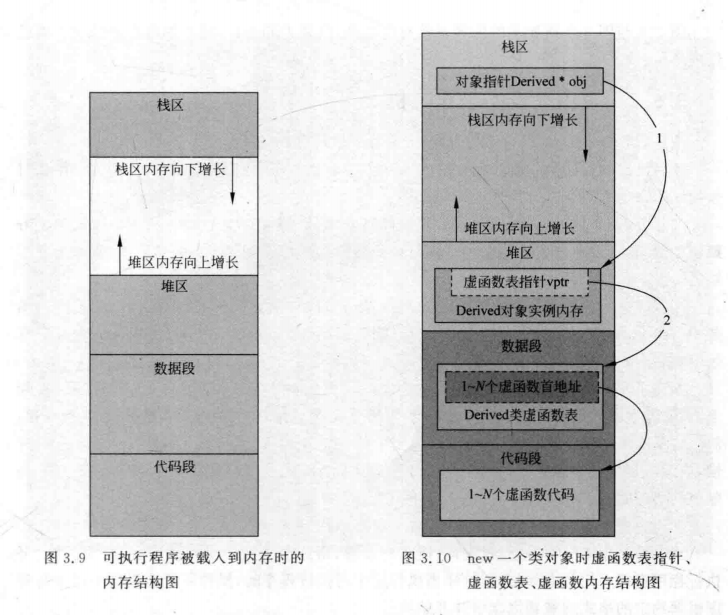
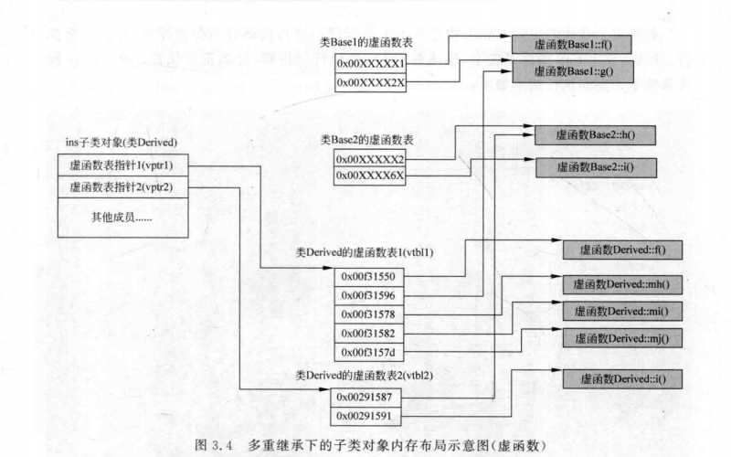
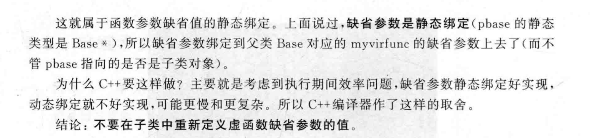

# 虚函数

首先我们要明确，虚函数表是Derived这个类型共享的。每个Derived类型的对象，都会用于一个自己的虚函数表指针。

虚函数表其实是形似这样的一个表格：

| 函数名  | 地址 |
| ------- | ---- |
| func1() | xxxx |

可以看到，虚函数表实际上存储的不是函数实际的内容，而是**指向函数具体实现位置的地址**。

那么这里很自然的有两个问题：

1. 虚函数表存储在哪里？
2. 这个地址具体指向的是哪里？

## 虚函数表和虚函数实现的存储

假设Base* pb=new Derived();

首先new Derived（）会在堆区申请一个动态的地址。然后接下来。Derived的构造函数实际上会在编译时，由编译器插入一个对**虚函数表指针**赋值的语句，这样的话，new Derived()的对象在被创建的时候，就会实际保存一个虚函数表指针的数值。

对于C++来说，一个可执行程序，实际上是分段保存的。代码的具体实现保存在**代码段**，执行时所用得到的数据保存在数据段。

而考虑此，我们就不难理解，存储在对象当中的虚函数表指针，指向的实际上是存储在数据段当中的**虚函数表**。

而虚函数表当中保存的地址，指向了保存在**代码段**当中的**虚函数实现**。我们结合下图的3.10和3.4就不难理解了。

**编译和链接时确定的布局**：编译器在编译和链接时为每个类生成虚函数表，这些表的位置和结构，和大小在编译时就确定了。换句话说，Base作为一个拥有虚函数的类，它自身在编译时就会确定拥有一个虚函数表。而Derived作为它的基类，也会拥有一个属于类的虚函数表，表的存在在编译时就确定了。而表内存储的具体地址，会在链接时确定（因为函数实现可能在其他编译单元当中）

> **编译时**：
>
> - 编译器在编译阶段为每个含有虚函数的类生成一个虚函数表结构，并在每个对象中安排一个指向虚函数表的虚函数表指针（VPtr）。
> - 虚函数表的位置和结构是在编译时确定的，因此编译器知道对象的 VPtr 应该指向哪里。
>
> **链接时**：
>
> - 虚函数表中的每个条目需要指向对应的虚函数实现（即代码段中的函数地址）。
> - 这些具体的函数地址往往在链接阶段才会完全确定，因为链接器需要将不同编译单元中的符号（如函数地址）解析为实际的内存地址。
> - 因此，虚函数表中的每个虚函数指针的确会在链接阶段被填充为指向代码段中实际的虚函数实现地址。





## 为什么要是指针来触发多态

```cpp
Base b=(Base)Derived();
Base* pb=new Derived();
```

我们都知道，上面的第一种写法是无法触发多态的，通过b调用的函数，还是Base类型的函数，这是为什么？

> 一句话总结，b的类型在编译时就已经确定，而pb仅仅确定了一种“约定”，而pb指向内存的具体类型要在运行时确定。而具体调用什么函数，是由内存当中存储的虚函数表指针来确定的。

也许我们会觉得，`Base b=(Base)Derived();`的时候，会调用拷贝构造函数，那么Derived的虚函数表指针值应该会覆盖掉Base类型的b对象的虚函数表指针的值。但是实际上，虚函数表指针值的赋值是由**编译器**控制的，这个赋值行为确实会在构造函数函数体被调用前被执行（由编译器插入）。但是，赋值什么值是由编译器控制的。

编译器会为对象的虚函数表指针，赋值为对象**实际**的类型所对应的数值。比如说在`Base b=(Base)Derived();`，b实际上依然是Base类型的。那么b在调用拷贝构造的时候，首先会触发Derived()的slice。其次拷贝构造函数会把b的虚函数表指针值赋值为Base类型对应的数值。

这时候，实际上在编译期和链接期之后，对于对象b来说，它的**类型就已经是确定的了**，就是Base类型。也因此它的所谓的虚函数的具体地址也已经确定了（就是Base类型虚函数的位置）。这时候也就是所谓的**静态联编**

而`Base* pb=new Derived();`，本质上，Base*只是确定另一种对于**内存的解析的约定**。也就是说，当我们使用pb时，我们会按照Base类型约定的内存结构去解释调用new Derived()申请的内存里的数值。而同时，Derived类型作为Base的子类，前面一部分的内存构造是符合Base的约定的。因此实际上使用的就是Derived类型的对象。

如果只看pb，**实际上pb具体指向的类型并没有确定**，它只是一种Base的内存构造约定，仅此而已。所以在运行时，就会根据pb指向的内存的具体值，再去找到虚函数的具体实现的位置，也就是所谓的**动态联编**(为什么是运行时呢，就是因为是运行时才真正在堆上new出来一个对象，编译时这个对象在堆的哪里什么的都不确定)

> **Q**:
>
> 所以即使用的是Base b，调用虚函数也还是要通过虚函数表，只是说用Base b的话，指向哪个虚函数表在编译时就已经确定了
>
> ###### ChatGPT 说：
>
> ChatGPT
>
> 完全正确！即使使用的是 `Base b`，调用虚函数时仍然通过虚函数表来进行，但在这种情况下，由于对象的静态类型是 `Base`，**在编译时已经确定了 `b` 的虚函数表指针（VPtr）会指向 `Base` 的虚函数表**，而不会涉及动态多态性。
>
> ### 具体原理分析
>
> 1. **VPtr 的设置**：
>    - 当 `Base b = Derived();` 发生对象切片时，编译器会自动设置 `b` 的虚函数表指针，使其指向 `Base` 的虚函数表。
>    - 这个设置在编译和链接阶段就已确定，因为 `b` 的类型是 `Base`，而不是 `Derived`。
> 2. **虚函数调用的静态分派**：
>    - 虽然 `func` 是一个虚函数，通常会走虚函数表来实现动态绑定，但在这种对象切片的情况下，`b` 的类型是 `Base`。
>    - 因此，编译器知道 `b` 的虚函数表指针只会指向 `Base` 的虚函数表，调用 `b.func()` 时，它会直接找到 `Base` 的 `func` 实现，而不会尝试查找 `Derived` 的 `func` 实现。
> 3. **没有动态多态**：
>    - 因为 `b` 是一个实际的 `Base` 对象，并且其 VPtr 在构造时已设置为指向 `Base` 的虚函数表，所以没有机会通过 VPtr 指向 `Derived` 的虚函数表。
>    - 这种情况下，虚函数的调用仍然是通过虚函数表完成的，但它是**静态绑定**，而不是动态绑定。
>
> ### 总结
>
> - 当使用 `Base b = Derived();` 时，编译器在构造 `b` 时就已经确定了 `b` 的 VPtr 指向 `Base` 的虚函数表。
> - 即使调用的是虚函数，`b` 的虚函数表指针会直接指向 `Base` 的虚函数表，调用的是 `Base` 的虚函数实现。
> - **动态多态性在这种情况下无法实现**，因为对象的实际类型已经静态确定为 `Base`。

## 小知识点

### 虚函数与缺省值

我们知道，非虚成员变量调用哪个取决于静态绑定，而虚函数的调用取决于动态绑定。

但是如果我们为虚函数定义缺省值，那么会是什么情况呢？

```cpp
class B{
public:
	virtual void func(int i=1){
		cout<<"B::func "<<i<<endl;
	};

};
class A:public B{
public:
	virtual void func(int i=2){
		cout<<"A::func "<<i<<endl;
	}
};
B* pb=new A();
pb->func();
//输出结果：
//A::func 1
```

初看会觉得有点奇怪，但是实际上，缺省参数是静态绑定的，而pb的静态类型为B，动态类型为A，因此i的值实际上是跟着B走的

