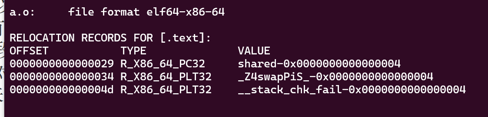
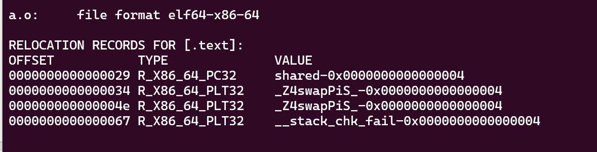
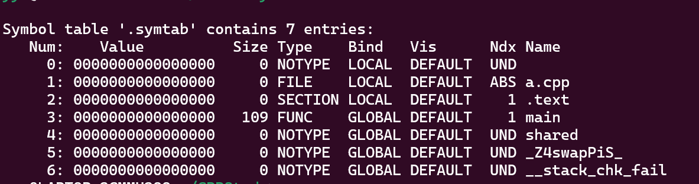

# C++编译

## 符号


## 重定位

符号在链接之前就已经知道自身相对于当前编译单元当前段的偏移量了。因此链接时只需要知道自身所属段处于什么位置，就可以根据偏移量+段地址计算出符号的地址了。

得到符号的虚拟地址之后，还需要把符号更新后的地址，写入在比如代码段中的引用的位置。这个就叫做重定位

一般来说，重定位表用于管理各种符号以及其重定位的入口位置（相对于段的偏移量）。重定向表存在重定向段中，比如对于.text段的重定向段一般叫做.rel.text

不难理解，如果有同一个符号在一个编译单元内多次被使用，且需要重定向，那么他就会在重定向表中有多个项：

```cpp
extern int shared;
extern void swap(int* a,int* b);
int main(){
        int a=100;
        swap(&a,&shared);
        int b=200;
        swap(&b,&a);
}
```




```cpp
extern int shared;
extern void swap(int* a,int* b);
int main(){
        int a=100;
        swap(&a,&shared);
        int b=200;
        swap(&b,&a);
}
```



## 符号表

