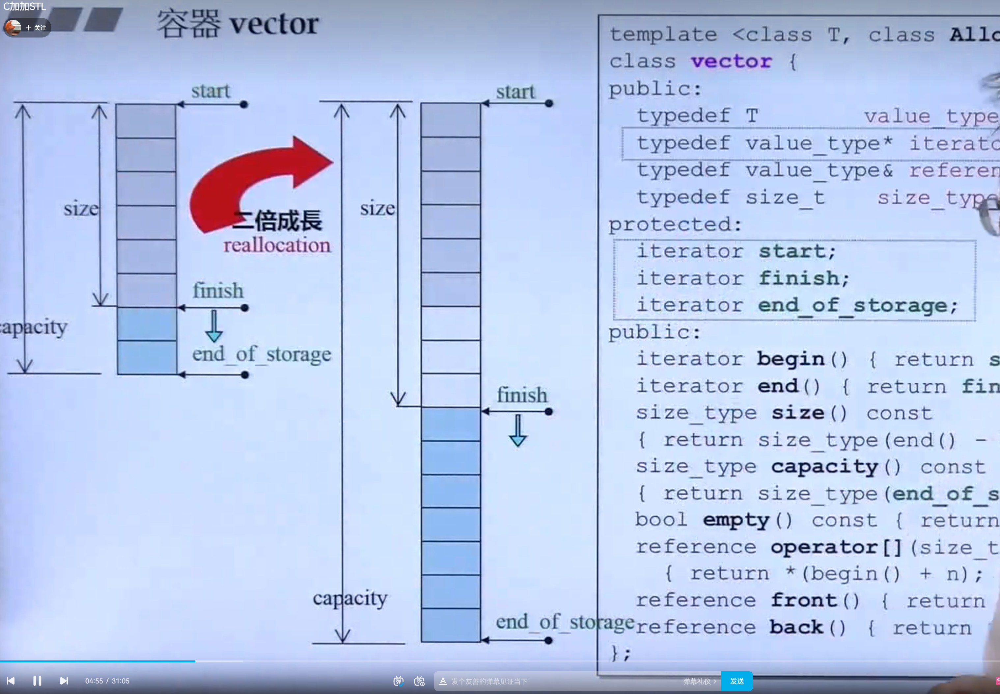
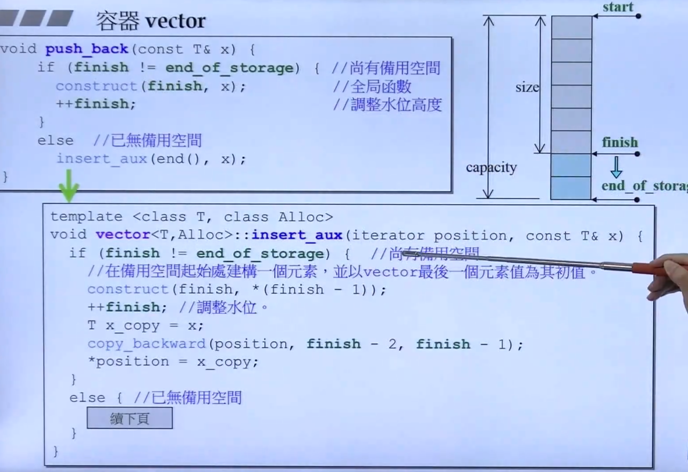
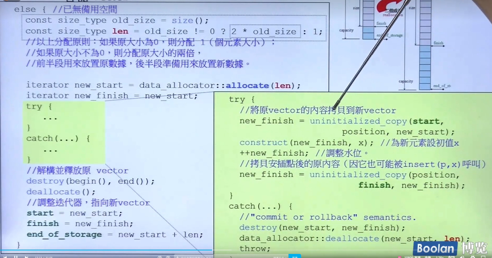

# STL

## 复杂度

## 容器

基本原则:前闭后开

### 关联容器

Map和Unordered_map

map的复杂度是O(logn)

unordered_map的复杂度是O(1)，最坏退化到O(N)

> C++中的`unordered_map`和`map`在查询时的时间复杂度是不同的，具体如下：
>
> ### 1. **`unordered_map`：**
>
> - **查询时间复杂度**：**O(1)**（平均情况）
>
>   `unordered_map`是基于哈希表实现的，它通过哈希函数将键值映射到一个桶（bucket）中。在最优情况下，查找操作是常数时间复杂度 **O(1)**，因为哈希表可以直接根据哈希值定位到桶，然后通过桶内部的链表（或其他数据结构）查找元素。
>
>   但是，如果出现了哈希冲突（即不同的键值被映射到同一个桶），那么查找时间可能会退化为 **O(n)**，其中n是桶内元素的数量。但一般来说，哈希冲突较少发生，**查询操作通常是O(1)**。
>
>   总结：`unordered_map`在一般情况下，查询复杂度为 **O(1)**，但在最坏情况下可能退化到 **O(n)**。
>
> ### 2. **`map`：**
>
> - **查询时间复杂度**：**O(log n)**
>
>   `map`是基于**红黑树（Red-Black Tree）**实现的，它维护了一个有序的键值对结构。查询时，`map`会通过树的结构进行二分查找，查找一个元素的时间复杂度是对数级别的，即 **O(log n)**。
>
>   总结：`map`的查询操作时间复杂度始终是 **O(log n)**，即使数据已经高度分布或已经有很多元素，也不会退化。
>
> ### 对比总结：
>
> - `unordered_map`：**平均查询复杂度为 O(1)**，但最坏情况下可能为 **O(n)**。
> - `map`：**查询复杂度始终为 O(log n)**，由于使用红黑树，它在任何情况下都不会退化。
>
> 因此，**`unordered_map`在查询时在大多数情况下通常快于`map`**，但是`map`的查询复杂度是**稳定的**，无论数据的分布情况如何。

### 顺序容器

#### List

List是一个双向链表

迭代器：Bidirectional Iterator

#### Vector

迭代器：Random Access Iterator，在一些版本的实现中，就是一个指针。指针本身就是一个Random Access Iterator，也可以是一个类

存储：连续空间

capacity是能容纳的最大空间，size是vector现在用来存储的空间

capacity的空间是两倍成长。size一不够用，就两倍扩张capacity

Vector有三根指针：start，finish和end_of_storage。所以sizeof(vector)就是三根指针的大小




#### 两倍增长：

如果finish和end_of_storage指针是一致的，那么久调用insert_aux扩容（这里会再判断一次，因为其他函数也调用这个insert_aux）

扩容会开辟一个新的空间，空间大小是原来的两倍大小，一半用来存储原来的，后一半存储新的。这是会重新设置start，finish和end_of_storage指针。

开辟新空间会调用uninitialized_copy方法（用于向未初始化空间的拷贝）。uninitialized_copy会调用**拷贝构造函数**

```cpp
template<class InputIterator, class ForwardIterator>
ForwardIterator uninitialized_copy(InputIterator first, InputIterator last, ForwardIterator result);
```

```cpp
#include<vector>
#include<iostream>
using namespace std;
class A{
        public:
                A(){
                        cout<<"A"<<endl;
                }
                A(const A& a){
                        cout<<"CA"<<endl;
                }
};
int main(void){
vector<A> vec;
vec.push_back(A());
vec.push_back(A());
}
//输出：
//A		创建临时变量A()
//CA	第一个临时对象拷贝到vector
//A		创建临时变量A()
//CA	容器扩容时，现有元素被复制到新的内存中，调用拷贝构造函数
//CA	第二个临时对象拷贝到vector
```

如果类定义了**移动构造函数**，扩容时会查看移动构造函数有没有noexcept修饰，如果有，那么就会扩容时就会使用移动构造函数，但是如果没有noexcept修饰，那么就不会调用移动构造函数而是拷贝构造函数

```cpp
#include<vector>
#include<iostream>
using namespace std;
class A{
        public:
                A(){
                        cout<<"A"<<endl;
                }
                A(const A&&a){
                        cout<<"MA"<<endl;
                }
                A(const A& a){
                        cout<<"CA"<<endl;
                }
};
int main(void){
vector<A> vec;
vec.push_back(A());
vec.push_back(A());
}
//A		创建临时变量A()
//MA  第一个临时对象移动到 vector
//A		创建临时变量
//MA   第二个临时对象移动到 vector
//CA	空间不足，调用移动构造函数移动第一次插入的对象
```







## Iterator

Iterator分类

ChatGPT

在 C++ 中，迭代器（Iterator）是一种用来在容器（如数组、链表、向量等）中遍历元素的工具。根据功能和适用范围，标准库将迭代器分为以下五种类型：

------

### 1. **输入迭代器（Input Iterator）**

- 特点

  ：

  - **单向读取**：支持从容器中逐个读取元素。
  - **只读**：不允许修改所指向的元素。
  - **一次性**：适合一次性遍历，无法返回重新访问。

- 支持的操作

  ：

  - `*it`：获取元素值。
  - `++it` 或 `it++`：移动到下一个元素。
  - 比较操作：`==` 和 `!=` 用于判断两个迭代器是否相等。

- **应用场景**：如从输入流（`std::istream`）读取数据。

- 示例

  ：

  ```
  cpp复制代码std::istream_iterator<int> input_it(std::cin);
  std::istream_iterator<int> end;
  while (input_it != end) {
      std::cout << *input_it << std::endl;
      ++input_it;
  }
  ```

------

### 2. **输出迭代器（Output Iterator）**

- 特点

  ：

  - **单向写入**：支持向容器中逐个写入元素。
  - **只写**：不支持读取和修改已有元素。
  - **一次性**：适合顺序写入操作。

- 支持的操作

  ：

  - `*it = value`：将值写入迭代器所指位置。
  - `++it` 或 `it++`：移动到下一个写入位置。

- **应用场景**：如输出流（`std::ostream`）或插入迭代器（`std::back_inserter`）。

- 示例

  ：

  ```
  cpp复制代码std::ostream_iterator<int> output_it(std::cout, " ");
  *output_it = 42;  // 输出 "42 "
  ++output_it;
  *output_it = 99;  // 输出 "99 "
  ```

------

### 3. **前向迭代器（Forward Iterator）**

- 特点

  ：

  - **单向访问**：可以顺序访问容器中的元素。
  - **可读写**：支持读取和修改元素。
  - **多次遍历**：可以重复遍历容器。

- 支持的操作

  ：

  - `*it`：访问元素。
  - `++it` 或 `it++`：移动到下一个元素。
  - 比较操作：`==` 和 `!=`。

- **应用场景**：如 `std::forward_list`。

- 示例

  ：

  ```
  cpp复制代码std::forward_list<int> fl = {1, 2, 3};
  for (auto it = fl.begin(); it != fl.end(); ++it) {
      std::cout << *it << " ";
  }
  ```

------

### 4. **双向迭代器（Bidirectional Iterator）**

- 特点

  ：

  - **双向访问**：可以顺序前进（`++`）或倒退（`--`）。
  - **可读写**：支持读取和修改元素。
  - **多次遍历**：可以多次访问容器。

- 支持的操作

  ：

  - `*it`：访问元素。
  - `++it` 或 `it++`：移动到下一个元素。
  - `--it` 或 `it--`：移动到前一个元素。
  - 比较操作：`==` 和 `!=`。

- **应用场景**：如 `std::list`、`std::map` 和 `std::set`。

- 示例

  ：

  ```
  cpp复制代码std::list<int> lst = {1, 2, 3};
  auto it = lst.end();
  while (it != lst.begin()) {
      --it;
      std::cout << *it << " ";
  }
  ```

------

### 5. **随机访问迭代器（Random Access Iterator）**

- 特点

  ：

  - **随机访问**：可以通过算术运算（如加减）直接访问任意元素。
  - **最高级的迭代器**：支持所有迭代器功能。
  - **性能优越**：适合需要高效访问容器中元素的场景。

- 支持的操作

  ：

  - `*it`：访问元素。
  - `++it` 和 `--it`：移动到下一个或前一个元素。
  - `it + n` 和 `it - n`：移动到任意偏移位置。
  - `it[n]`：访问第 `n` 个位置的元素。
  - 比较操作：`==`、`!=`、`<`、`>`、`<=`、`>=`。

- **应用场景**：如 `std::vector`、`std::deque` 和原生数组。

- 示例

  ：

  ```
  cpp复制代码std::vector<int> vec = {1, 2, 3, 4};
  auto it = vec.begin();
  std::cout << it[2] << std::endl;  // 输出 3
  std::cout << *(it + 3) << std::endl;  // 输出 4
  ```

------

### 6. **总结：迭代器分类与容器的关系**

| 迭代器类型     | 支持操作               | 典型容器                    |
| -------------- | ---------------------- | --------------------------- |
| 输入迭代器     | 单向读取               | `std::istream_iterator`     |
| 输出迭代器     | 单向写入               | `std::ostream_iterator`     |
| 前向迭代器     | 单向可读写，多次遍历   | `std::forward_list`         |
| 双向迭代器     | 双向可读写，多次遍历   | `std::list`、`std::set`     |
| 随机访问迭代器 | 双向、随机访问，可读写 | `std::vector`、`std::deque` |

------

### 7. **扩展：迭代器适配器**

标准库还提供了多种迭代器适配器，用于特定场景，例如：

- `std::reverse_iterator`：反向遍历容器。
- `std::back_inserter`：向容器末尾插入元素。
- `std::front_inserter`：向容器开头插入元素。
- `std::insert_iterator`：向容器指定位置插入元素。

这些适配器通过包装现有迭代器扩展功能，进一步增强了迭代器的灵活性和适用范围。