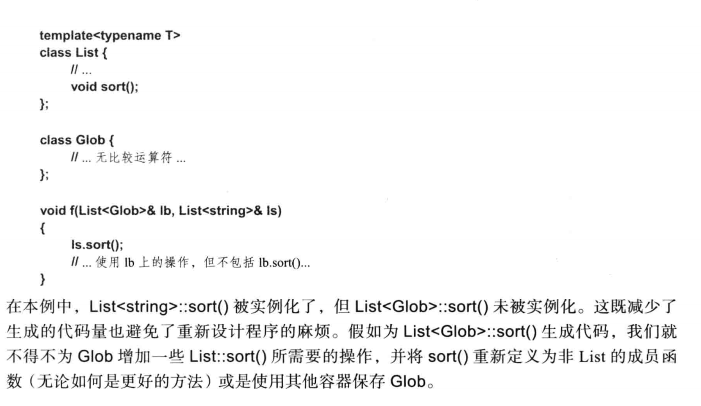

# 实例化

对于一个模板类来说，除非程序中真正需要其定义，否则不会实例化。一个很反直觉的例子就是：模板类的指针是不需要实例化的：

```c++
template<class T>
class Link{
	Link* p;//不需要Link的定义

};

class X；
X* x1;//正确，不需要X的定义
X x2;//错误，没有X的定义
```

而对于一个模板函数来说，只有当它被真正使用的时候，才会真正被实例化。在类模板当中这句话的意思就是，在实例化一个类模板的时候，不需要实例化它所有的成员函数，只有当模板类中的成员函数被真正使用的时候，才会真正实例化

