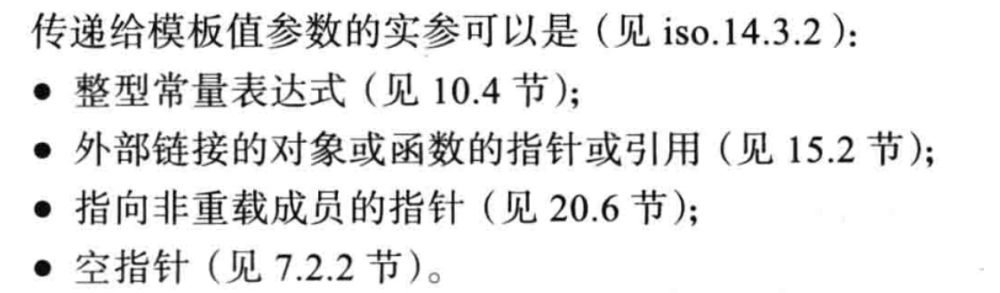
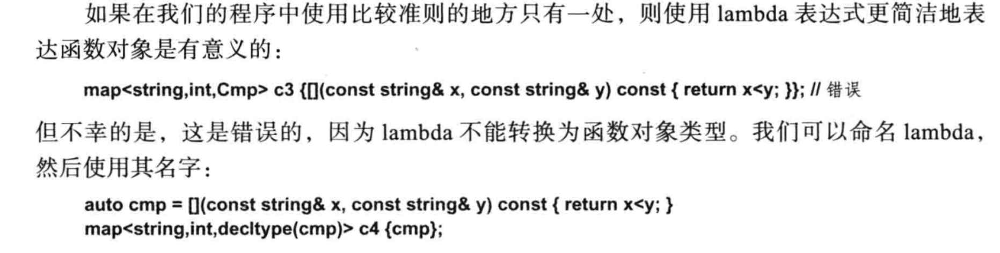
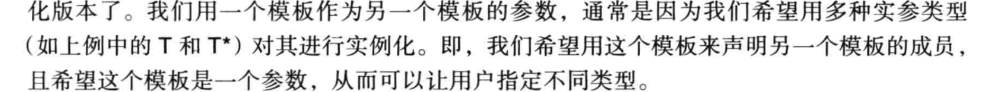
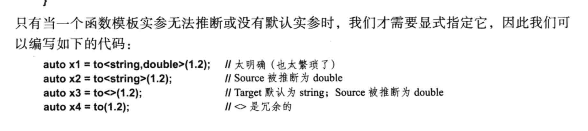

# 模板、实参与特化

## 值类型作为实参

非类型或模板的 模板参数被成为值类型，传递给它的实参成为值实参

例如，可以利用整数实参提供大小和限制：

```c++
template<class T,int max>
class Buffer{
	T v[max];
}
constexpr int max=200;
void f(int i){
    Buffer<i> b1;  //错误
    BUffer<max> b2;//正确
}
```

这里很好理解，但是我们再往下想一下，首先，我们在Buffer<T，int max>里面声明了一个T类型的长度为max的数组，而数组的长度声明需要是一个常量表达式。因此我们可以得到第一个值类型特化条件：整形常量表达式

在此基础上，值实参还可以是：



这里特别验证一下外部链接对象。

比如对于一个template<class T,char* tc>，我们期望传入一个char*类型的值实参：

```c++
#include<iostream>
using namespace std;

template<class T,char* lable>
class X{

};
char gc[]="AAA";
int main(void){
        char lc[]="AAA";
     	static char sc[]="AAA";
        
        X<int,gc> gx; //正确
        X<int,lc> lx; //错误
    	X<int,sc> sx; //正确
}
```

这里很显然的，声明在global和static的char[]，链接性为外部链接，而在main函数内的局部char[]变量链接性为内部链接。

这里还有个问题，char*类型的值类型参数不允许传入字面值常量。

```c++
X<int,"AAA"> x; //错误
```


在类型模板参数列表当中，一个类型模板参数出现之后立刻就可以被当作是一个类型使用：

```c++
template<class T,T value>
void f1(T t){cout<<value<<endl;}
template<class T,T value=T{}> //调用类型T的默认构造函数
void f2(T t){ cout<<value<<endl;}

int main(void){
    int i=0;
    f1<int,100>(i); //100
    f2<int>(i);    //0
}
```

## 操作作为实参

考虑构造一个map类型

```c++
template<class K,class V>
class map{...}
```

我们该如何为不同类型的K和V指定具体的比较方法？

一个比较直观的方法是结合上面第一部分：用函数指针作为一个值类型，传入模板，然后再用这个指针进行处理

例如：

```c++
#include<iostream>
#include<vector>
using namespace std;
template<class K,class V,bool(*cmp)(const K& ,const K& )>
class map{
public:
        map(int len):store(len){
                ;
        }
        void insert(K key,V value);
        void test(){
                cmp(store[0],store[1]);
}
private:
        vector<K> store;
};
template<class K,class V,bool(*cmp)(const K&,const K&)>
void map<K,V,cmp>::insert(K key,V value){
        store.push_back(key);
}


bool cmp(const int& a,const int& b){
        cout<<"cmp"<<endl;
        return true;
}

int main(void){
       map<int,int,cmp> m(0);
        m.insert(1,0);
        m.insert(1,1);
        m.test();
}
```

但是，这样的限制显然太多了而且很不灵活，用户必须使指定一个确定的函数指针。

因此有了第二种方法：把比较的操作看作一种类型，把这个类型作为一个模板类型参数进行传递，（或者说视为一个函数对象）

```c++
template<class K,class V,typename Compare>
class map{...}

```

作为一种类型的比较方法，可以携带状态，从而更加灵活，比如：

```c++
template<class K,class V,typename Compare=std::less<K>>
class map{
public:
	map(){...}
	map(Compare cmp){...} 

}

```

这样的方法不止可以使用functional，使用对象还可以使用函数指针以及lambda表达式

对于lambda表达式：



## 模板作为实参

在SFINAE那一节当中，在最后封装is_detected的时候，就是用了模板作为模板的参数

```
template <typename, template <typename...> class Op, typename... T>
struct is_detected_impl : std::false_type {};
```

这里注意：`template<tyename...> class op`实际上，为了将一个模板声明为模板参数，我们就必须指定其所需要的实参。所以这里就相当于要指定一个typename去实例化class op

这里怎么拆分`template<tyename...> class op`呢，这里的class op和typename op一样，就是指定了一个类型op，但是前面的`template<tyename...>`说明了这是一个模板类型



## 对于函数模板

函数模板和类模板是不一样的，因为函数在调用的时候，有很大的概率是有机会直接推断用于实例化的类型，但是类不行



C++只支持函数的完整特例化