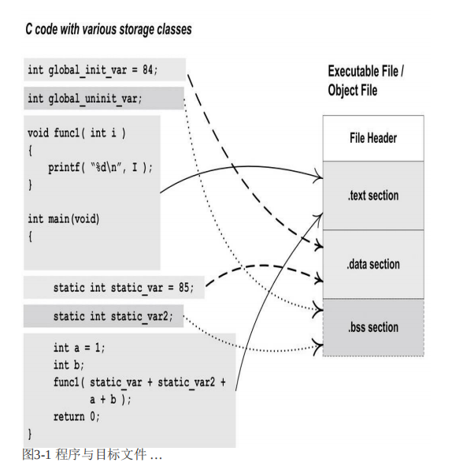

# 程序的分段（一）

我们知道，一个C++源文件经过**预处理，编译和链接**之后，就会变成一个可执行文件。

而当我们想要使用这个文件的时候，就要将它**装载**到内存之中，并且完成虚拟地址到物理地址的映射。

而今天我们不讨论具体的装载过程和映射（这是之后的主题），我们只讨论:C++编译器是如何组织文件结构的

## 分段（Segment）的缘由

我们先问问GPT：

> **C++ 文件中的分段**：编译器和链接器会将代码和数据分成不同的段（如代码段、数据段、BSS 段等），以便在程序加载到内存中时管理不同类型的内容。这种分段主要是为了解决代码和数据的存储和访问问题，并提高内存管理效率。

很自然的，让我们考虑一个可执行文件应该包括哪些内容：

+ 应该包括可执行的由代码翻译来的机器码
+ 应该包括我们要用到的数据
+ 复杂机制的实现：虚函数，虚继承。。。
+ 不同的权限管理：只读（代码），可读写。。。（数据）
+ 等等。。

对于以上的需求，C++很自然的选择了通过把不同类型不同需求的数据组织为**分段**的方法。

## 分段

分段的过程在编译和链接期就已经完成，请大家记住这一点，因为一些高级特性，比如类似于**虚函数表**和**虚函数**的具体位置，实际上是存储在.data和.code(.text)段当中的，结合上面这一点，我们就不难想到，它们的存在都是在编译链接期确定的。

段的种类名称有很多，这实际上是按照各家编译器都有自己的实现。但是万变不离其宗，我们这里关注的是最重要的三个段：.data，.bss，.code(.text)段。




## .Code

先说.Code也就是代码段，非常好理解的是，代码段里存储的就是代码编译后的机器码。

代码段一般来说有三个特性：

> **只读**：代码段通常被标记为只读，以防止任何对代码的修改。这样可以保护程序的指令不被意外或恶意篡改。
>
> **可执行**：操作系统会为代码段设置“可执行”权限，使得 CPU 能够运行其中的指令。
>
> **共享性**：在现代操作系统中，相同程序的多个实例可以共享相同的代码段，因为它是只读的。这样多个进程可以共用同一个代码段，从而节省物理内存。

只读和可执行都很好理解，这里解释一下共享性。

代码段的存在和相对位置在是在链接阶段确定的，而它的物理地址则是在加载入内存的时候确定的。代码段的存在让运行库函数成为了可能。比如下面这个例子：
```cpp
#include <iostream>
void hello() {
    std::cout << "Hello, World!" << std::endl;
}
int main() {
    hello();
    return 0;
}
```

在上述这个例子里面出现了两种函数：一个是hello()这种定义在当前编译单元里面的函数，另一种是比如std::cout这种库函数。库函数在实现的时候追求的是动态链接，我们的是分离类似于std::cout这种库函数和我们自己编码的函数内容的。而且库函数在使用的时候是会被很多个进程都使用的，比如我们可以想象的是一个操作系统中有一百个进程都使用了std::cout。

因此这时候，在不同的进程间共享同一份代码，就可以有效的降低内存中因为保存代码实例所花费的内存。具体的做法就是把同一个代码段的内容，映射到不同进程的虚拟地址里面。

```
### 1. **编译阶段**：

- 在编译阶段，编译器会把源代码转换为目标文件（例如 `.o` 或 `.obj` 文件），这些文件包含了机器指令，但它们只是部分的编译结果，不包含完整的地址信息。
- 在目标文件中，代码段的相对位置是确定的，但没有分配绝对地址。目标文件中的代码段一般使用相对地址，以便在链接过程中可以调整。

### 2. **链接阶段**：

- 链接器（Linker）会将多个目标文件合并为一个可执行文件，过程中会把所有的代码段合并在一起，并确定代码段在整个程序中的相对位置。
- 链接器会生成代码段的逻辑地址（相对于整个程序的起始位置）。这时，代码段在可执行文件中的相对位置已确定。
- 可执行文件的格式（如 ELF、PE）中会记录代码段的相对地址、大小等信息。

### 3. **加载阶段**：

- 真正的**绝对内存地址**是在程序运行时，由操作系统的加载器（Loader）来分配的。
- 加载器读取可执行文件，将代码段加载到进程的虚拟地址空间中的某个固定区域，并赋予该区域“只读”和“可执行”权限。
- 在现代操作系统中，加载器会通过**虚拟内存管理**来映射代码段到某个实际的物理内存区域，这个映射对用户是透明的。这样即使程序每次运行时实际的物理内存地址不同，虚拟地址空间中代码段的起始地址通常是一样的。
```

## .BSS和.data

C++种，未显示初始化以及初始化为0或者null的，全局和静态变量都会被放在.bss段，而显示初始化的全局和静态变量放在.data段

在 C++ 中，未初始化的全局变量确实会被放在 `.bss` 段（Block Started by Symbol）。`.bss` 段是一个特殊的内存区域，用来存储程序中未显式初始化的全局和静态变量。

具体特点如下：

- **`.bss` 段的特点**：它占用内存空间，但不占用实际的文件大小（在可执行文件中通常为零字节）。
- **默认值**：未初始化的全局或静态变量在 `.bss` 段中都会被自动初始化为零。
- **作用**：减少文件大小，因为所有未初始化的全局变量会在程序加载时由系统自动清零，而无需在文件中存储实际的零值。

因此，将未初始化的全局变量放在 `.bss` 段中可以节省存储空间，同时确保程序启动时这些变量的值是确定的（初始化为零）。

`.bss`段的数据在程序文件和内存中的表现有所不同。具体来说：

1. 在文件空间中的表现

- `.bss`段的数据在可执行文件中**不占用文件空间**。**文件空间中不占用实际存储**，仅记录所需的大小。
- `.bss`段用于存储**未初始化的全局变量**和**静态变量**，它们的初始值通常是零。因为这些变量的初始值是统一的，通常为零，因此不需要在文件中实际存储这些值。
- 在可执行文件的文件头信息中，会记录`.bss`段所需的空间大小，但不会实际存储这些零值。

2. 在内存空间中的表现

- `.bss`段的数据在程序加载到内存时**会占据内存空间**。
- 当程序运行时，操作系统会为`.bss`段分配指定大小的内存，并自动将这部分内存初始化为零。
- 这意味着，在程序加载到内存后，`.bss`段的变量会占用实际的内存空间，但不会占用磁盘上的文件空间。

## 段和段

当我们看到段的时候，也许会想起Heap和Stack。在程序中，**`.bss`**、**`.data`** 和 **`.text`**（代码段）这几个段的地址分配与**堆（heap）**和**栈（stack）**还是有一些差别的。这里GPT答得很好：

### 1. **`.Code/.text`（代码段）、`.data` 和 `.bss` 段的地址**

- **在编译和链接时确定**：`.text`、`.data` 和 `.bss` 段的地址在编译和链接阶段就已经确定。
- 编译器和链接器会将这些段的地址写入可执行文件的文件头中。
- 当程序加载到内存中时，操作系统会根据这些地址分配空间，加载可执行文件中的数据到指定位置。因此，在加载后，它们的地址是固定的，不会改变。
- 具体来说：
  - **`.text`段**：存储程序的机器指令代码，通常是只读的，并且位于内存的低地址区域。
  - **`.data`段**：存储已初始化的全局变量和静态变量。
  - **`.bss`段**：存储未初始化的全局变量和静态变量。加载时会被初始化为零。
- 所以，对于存储在上面几个段里的数据或者函数，在运行时打印他们的地址和在编译后，用nm指令查看的地址都是一样的

### 2. **堆（Heap）和栈（Stack）段的地址**

- **堆和栈的起始地址范围通常在程序加载时确定**，但具体的内存分配是在运行时动态管理的。

- 栈

  ：通常从高地址向低地址增长。栈的起始地址（高地址位置）在程序加载时设定，操作系统会分配栈的初始大小和最大允许大小。

  - 程序运行时，栈会随着函数调用和局部变量的分配自动增长和收缩。

- 堆

  ：通常从低地址向高地址增长。堆的起始地址在程序加载时设定，操作系统会分配堆的初始大小和最大允许大小。

  - 堆空间的具体分配（如`malloc`或`new`的使用）是在程序运行时进行的，堆会根据内存的分配需求增长。

### 总结

- **`.text`（代码段）、`.data` 和 `.bss` 段的地址**在**编译和链接时就已经确定**，加载时按照设定的地址分配，不会再发生变化。
- **栈和堆的地址范围**在**程序加载时确定**，但具体的内存分配是在程序运行时动态变化的。