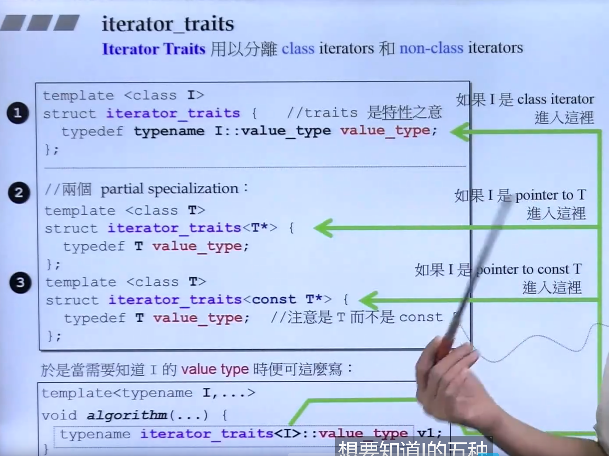

# 萃取（traits）

## Iterator traits

在算法通过Iterator操纵容器元素的时候，会有一些必要的特性需要被算法知道，这时候就要通过萃取机制捕捉信息

iterator_traits<_Iter>::iterator_category()

目的：萃取机制要能够区分传入的到底是1. native的pointer还是2.一个iterator class

方法：部分特化

