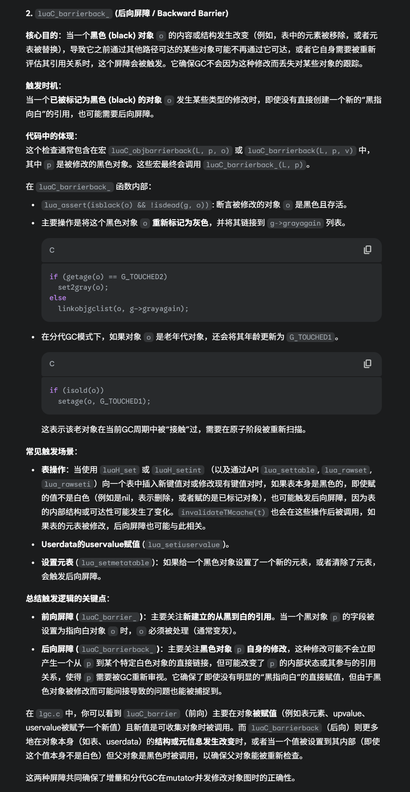

# LuaGC

https://zhuanlan.zhihu.com/p/133939450

https://zhuanlan.zhihu.com/p/393150733

https://www.zhihu.com/collection/687256602

LuaGC在5.2版本加入了分代，但是在5.3之后去除掉了

所以现在的LuaGC是一个渐进式的GC过程

> 渐进式GC：其实本质上，Lua的渐进式GC就是一个状态机，LuaGC是一步一步做的，每一步被称为一个`luaC_step`，Lua的GC是把一个完整的GC过程拆开，和程序的进行交错串行，执行一会程序执行一会GC（这里的问题是决定这种小步的切换的依据是什么？）
>
> 切换的依据：
>
> + Lua从程序切换到GC依赖的是一种叫做GCdebt的机制，每次程序分配内存的时候`luaM_realloc_`最后会减少GCdebt，而在Lua的主循环，之后或者一些操作码之后，就会检查GCdebt是否小于零，如果小于零，就会切换进入到LuaGC中执行一步GC
> + 从GC切换到程序：进入luaC_Step之后，执行什么，是根据当前GC处于什么阶段来决定的，
>   + `incstep` 函数会计算在当前 `luaC_step` 调用中需要完成多少“工作单元”（`work2do`）。这个值是根据GC参数 `LUA_GCPSTEPMUL`（GC速度乘数）和 `LUA_GCPSTEPSIZE`（GC步进粒度）来计算的。`incstep` 会循环调用 `singlestep`，直到 `work2do` 耗尽，或者GC进入了某些特殊状态（如完成了一个完整的回收周期并进入 `GCSpause`，或者完成了原子阶段）。
>   + 并且GC每执行一步工作，都会增加 `GCdebt`

## 三色标记法

LuaGC是依靠三色标记法的。

## 阶段

LuaGC是一个状态机，那么讨论状态机的状态就很有必要，LuaGC的状态分为以下几个：（注意，要特别关注，LuaGC在当前状态下，的singlestep是如何推进的）

1. **暂停阶段(GCSpause)**：GCdebat还有，所以就不会进行GC。当满足启动新一轮GC的条件时，GC会从这个状态开始。

   1. 当开始的时候处于这个状态，会首先调用 `restartcollection` 函数：

      - 清除所有灰色对象列表 (`cleargraylists`)。
      - 重置 `GCmarked` 计数器（用于统计标记的字节数）。
      - 标记根集合 (Root Set)，包括：
        - 主线程 (`markobject(g, mainthread(g))`)。
        - 注册表 (`markvalue(g, &g->l_registry)`)。
        - 所有基本类型的元表 (`markmt`)。
        - 可能存在的、上一周期未完成终结的对象 (`markbeingfnz`)。

      GC状态切换到 `GCSpropagate`。

2. **传播阶段 (GCSpropagate)**

   - 这是标记的主要阶段，会逐步执行。
   - `singlestep` 函数在此阶段会调用 `propagatemark`。
   - `propagatemark` 从灰色对象列表 (`g->gray`) 中取出一个灰色对象，将其标记为黑色，然后遍历该对象引用的所有其他对象
     - 如果引用的对象是白色的，则将其标记为灰色，并加入到灰色列表中。
     - 不同类型的对象有不同的遍历方式（`traversetable`, `traverseLclosure`, `traversethread` 等）。
   - 此阶段会持续进行，直到灰色列表为空，或者GC步进控制暂停了当前工作。
   - 如果灰色列表为空（或在 "fast" 模式下），状态切换到 `GCSenteratomic`。
   - **写屏障** 在此阶段非常重要。如果mutator修改了一个黑色对象的引用，使其指向一个白色对象，写屏障会确保该白色对象被正确地标记为灰色，以防被遗漏。

3. **原子阶段 (GCSatomic)**（主要是因为渐进式GC的问题）

   - 这是一个短暂的 "stop-the-world" 阶段。

   - **标记当前运行的线程 (`markobject(g, L)`)**： 确保当前执行流的根（即当前线程的栈和状态）被正确标记。

     **重新标记关键全局根对象**：

     - 标记注册表 (`markvalue(g, &g->l_registry)`)。
     - 标记所有基本类型的元表 (`markmt(g)`)。 这些对象可能在C API调用中被修改，因此需要在原子阶段重新确认其可达性。

     **完成所有标记传播 (`propagateall(g)`)**：

     - 清空 `g->gray` 列表，将所有灰色对象及其引用的对象标记为黑色。

     - ###### 处理 `g->grayagain` 列表：这个列表包含了那些在标记阶段被后向写屏障标记（例如，黑色对象被修改后重新变灰）或者需要特殊处理（如线程、某些弱表）的对象。再次调用 `propagateall(g)` 来处理这些对象。

     **重新处理Upvalues (`remarkupvals(g)`)**： 对于可能已经死亡但其upvalue仍活动的线程，需要重新检查这些upvalue指向的值，确保它们被正确标记。

     **Ephemeron表收敛 (`convergeephemerons(g)`)**： 这是处理弱键表（ephemeron table）的关键步骤。它会迭代地标记那些键可达且对应的值也通过这个键变得可达的条目。这个过程需要多次迭代直到没有新的标记产生（即“收敛”）。如果mutator在此期间修改ephemeron表或相关对象的可达性，收敛过程可能无法正确完成。

     **处理弱值表 (`clearbyvalues(g, g->weak, NULL); clearbyvalues(g, g->allweak, NULL)`)**： 清除那些值已经是白色（不可达）的条目。这个操作需要在标记完成后进行，以确定哪些值确实是不可达的。

     **分离待终结对象 (`separatetobefnz(g, 0)`)**： 将所有不可达的、且带有 `__gc` 元方法的对象从 `finobj` 列表移动到 `tobefnz` 列表。这个决策基于当前的标记结果。

     **标记待终结对象及其可达图 (`markbeingfnz(g)`)**： `tobefnz` 列表中的对象（以及它们通过 `__gc` 方法可能引用的对象）被认为是存活的，需要被标记，以防止它们在执行 `__gc` 方法前被回收。

     **再次传播标记和处理Ephemeron表**： 由于 `markbeingfnz` 可能使一些对象“复活”，需要再次调用 `propagateall(g)` 和 `convergeephemerons(g)` 来确保所有可达对象都被正确标记。

     **清空字符串缓存 (`luaS_clearcache(g)`)**： API中用于字符串的缓存可能包含已死的字符串。

     ###### **翻转白色 (`g->currentwhite = cast_byte(otherwhite(g))`)**： 这是为下一轮GC做准备的关键步骤。当前所有被标记为存活的对象（黑色）在下一轮GC开始时，相对于新的 `currentwhite` 将是“旧的白色”。新分配的对象将使用新的 `te`。这个全局状态的改变必须是原子的。

4. **清扫阶段 (GCSswp\*)** 这个阶段也是增量执行的，通过 `sweepstep` 函数逐步进行。

- **GCSswpallgc**: 清扫 `allgc` 链表中的常规对象。`sweeplist` 函数会遍历对象，如果对象被标记为“旧白”（即 `isdeadm(ow, marked)` 为真），则将其从链表中移除并调用 `freeobj` 释放内存。存活的对象（当前周期的白色）会被重置其年龄为 `G_NEW` 并保留。
- **GCSswpfinobj**: 类似地清扫 `finobj` 链表（带有终结器但尚未准备好终结的对象）。
- **GCSswptobefnz**: 类似地清扫 `tobefnz` 链表（等待执行终结器的对象）。
- **GCSswpend**: 清扫完成，检查并调整字符串表大小 (`checkSizes`)。GC状态切换到 `GCScallfin`。

> 1. ###### **写屏障**
>
>    写屏障是为了处理这样一个目的：就是因为是增量GC，所以在标记的过程中，也可能会切换回程序执行，并且，在程序执行的时候也可能会创建新的对象，并且使得之前标记的一个黑色对象指向这个新的对象。
>
>    如果没有写屏障，我们就会把这个新加入的对象作为一个白色对象，但是，在三色标记法中，黑色对象不可以指向白色对象是一个基本原则，（黑色只能指向黑色或者灰色）。因此通过写屏障，Lua就会把新加入的被黑色对象指向的对象，标记为灰色，并放入`grayagain`列表，之后原子阶段会重新扫描这个新加入的对象（也就是重新扫一遍grayagain）
>
>    **写屏障有一个非常重要的部分，就是写屏障的加入是为了处理渐进式GC，也就是在GC的时候，程序也会执行**，这时候就会有两个问题：1. 如果本来被标记为黑色的object，指向了一个新创建的白色object怎么办，2. 本来是黑色的object，被修改了怎么办（比如本身黑色的object是一个表，表中的元素被移除了）
>
>    ​	1. **`luaC_barrier_` (前向屏障 / Forward Barrier)**
>
>    **核心目的**：防止一个**黑色 (black)** 对象（GC已扫描完毕）直接指向一个**白色 (white)** 对象（GC尚未扫描或认为是潜在垃圾），因为这可能导致白色对象被错误回收
>
>    当一个**已被标记为黑色 (black) 的对象 `o`**（父对象）的某个字段（例如，表的一个元素，闭包的一个upvalue，userdata的一个uservalue）被**赋值或修改**，使其**指向了一个白色 (white) 的对象 `v`**（子对象）时，前向屏障会被触发。
>
>    如果对象 `v` 是简单类型（如字符串、已关闭的upvalue）或者是不需要进一步扫描其内部引用的类型（如没有uservalue的userdata），它会直接被标记为**黑色**。
>
>    如果对象 `v` 是复杂类型（如表、闭包、线程、包含uservalue的userdata、原型），它会被标记为**灰色**，并通过 `linkobjgclist(o, g->gray)` 链接到**`g->gray`** 列表中。
>
>    ​	2.  **`luaC_barrierback_` (后向屏障 / Backward Barrier)**
>
>    **核心目的**：当一个**黑色 (black) 对象 `o`** 的内容或结构发生改变（例如，表中的元素被移除，或者元表被替换），导致它之前通过其他路径可达的某些对象可能不再通过它可达，或者它自身需要被重新评估其引用关系时，这个屏障会被触发。它确保GC不会因为这种修改而丢失对某些对象的跟踪。
>
>    **触发时机**： 当一个**已被标记为黑色 (black) 的对象 `o`** 发生某些类型的修改时，即使没有直接创建一个新的“黑指向白”的引用，也可能需要后向屏障。
>
>    主要操作是将这个黑色对象 `o` **重新标记为灰色**，并将其链接到 `g->grayagain` 列表。
>
> 
>
> 2. ###### 旧白和新白：一句话总结：添加新对象的时候，统统添加为当前白；标记的时候，不管是什么白，都标记；但是回收的时候只回收旧白，而不回收当前白。
>
>    ​	其实是一种为了实现增量回收的设计：主要是由这样一个场景，因为是增量式设计，并且GC和程序交替进行，所以就可能会在GC标记阶段之后，还有新的变量被申请，但是这个时候因为标记已经结束了，所以新的加入的变量就一定还是白色的。为了确保不会被错误回收，因此区分了旧白和新白。
>
>    + 在回收阶段，GC只会回收当前白（也就是旧白）。在原子阶段的末尾，GC会做一个反转，就是把新白（当前白）和旧白的标记交换。这样的结果是，在这一轮次的GC中，标记的白色（标记为新白），以及上一轮次标记阶段后申请的变量（也标记的是新新白），会被转换为旧白。（注意，这是原子操作的，是不允许被打断的，也就是说在转换的过程中是不允许新的变量被申请的）。而在原子阶段之后的回收阶段，再申请的变量就都是反转后的新白了，这些新白不会再被标记，而是会参与到下一轮的GC标记
>
> 3. ###### GCRoot：
>
>    GC Root（垃圾回收根）是垃圾回收算法开始遍历对象图的**起点**。GC假定这些根对象是**固有存活 (intrinsically live)** 的，或者说，它们是程序执行所必需的，不能被回收。从这些根对象出发，任何通过一连串引用可达的对象也都是存活的。GC Root主要在每个回收周期的开始阶段（如 `restartcollection` 函数）以及原子阶段（`atomic` 函数）被确定和标记。它们包括：
>
>    1. **主线程 (`mainthread(g)`)**：
>
>       - `global_State` 结构中的 `mainth` 字段代表了Lua状态的主执行线程。它是最核心的根之一。`markobject(g, mainthread(g))` 会标记它。
>
>       **注册表 (`g->l_registry`)**：
>
>       - 注册表是一个特殊的、C代码可以访问的表，用于存储需要在不同C调用之间共享的Lua值，或者一些全局性的配置信息。它的内容必须被保留。`markvalue(g, &g->l_registry)` 标记注册表本身及其内容。
>       - 注册表中预定义了一些重要的槽位，例如：
>         - `LUA_RIDX_GLOBALS` (索引2)：指向全局环境表 (`_G`)。
>         - `LUA_RIDX_MAINTHREAD` (索引3)：指回主线程。
>         - `LUA_LOADED_TABLE` (`_LOADED`): 存储已加载模块的表。
>         - `LUA_PRELOAD_TABLE` (`_PRELOAD`): 存储预加载模块的加载器。
>         - `CLIBS` (`_CLIBS`): 存储已加载的C库的句柄。
>
>       **当前活动线程的栈 (`L->stack.p` 到 `L->top.p`)**：
>
>       - 在原子阶段，会显式调用 `markobject(g, L)` 来标记当前正在执行的线程 `L`（如果它与主线程不同的话，但通常原子阶段是在主线程或某个线程的上下文中执行）。
>       - `traversethread(g, th)` 函数会遍历线程 `th` 的整个活动栈，从 `th->stack.p` 到 `th->top.p`，标记所有栈上的值（局部变量、函数参数、临时值等）。
>       - 每个 `CallInfo` 结构（代表一个函数调用帧）中的 `ci->func` 指向栈上的函数对象，也是根。
>
>       **打开的Upvalues (`L->openupval` 和 `g->twups`)**：
>
>       - 所有线程中打开的upvalue（那些仍然指向栈上局部变量的upvalue）必须被视为根，因为它们引用的局部变量可能仍然存活，或者闭包本身是存活的。
>       - `traversethread` 会遍历线程的 `openupval` 列表，标记这些upvalue对象。
>       - `remarkupvals` 函数在原子阶段会再次检查所有在 `g->twups` 列表（包含有打开upvalue的线程列表）中的线程的upvalue，确保它们的值被正确标记。
>
>       **基本类型的元表 (`g->mt[LUA_NUMTYPES]`)**：
>
>       - 存储在 `global_State` 中的 `mt` 数组包含了Lua基本类型（如string、number等，如果它们有元表的话）的元表。这些元表在 `markmt` 函数中被标记。
>
>       **待终结对象列表 (`g->tobefnz`)**：
>
>       - 在`restartcollection` 和 `atomic` 阶段，会调用 `markbeingfnz` 来标记 `g->tobefnz` 列表中的所有对象。这些对象是那些被标记为需要执行 `__gc` 元方法的对象，它们本身以及它们通过 `__gc` 方法可能访问到的对象都需要被认为是存活的，直到终结器执行完毕。
>
>       **固定对象 (`g->fixedgc`)**：
>
>       - 这个列表包含那些永远不应被GC回收的对象，例如Lua的保留字字符串、元方法名字符串、以及内存错误消息字符串 (`g->memerrmsg`)。 `luaC_fix` 函数用于将对象移到这个列表。
>
>       **C API中通过 `luaL_ref` 创建的引用**：
>
>       - 当C代码使用 `luaL_ref` 在一个表中创建一个引用时，这个被引用的对象实际上是被存储在作为参数传入的那个表（通常是注册表）中。由于注册表是根，所以这些被引用的对象也就间接成为了根。当使用 `luaL_unref` 时，这个引用才从表中移除，对象才可能被回收。
>
> 4. 注册表：
>
>    
>
> 5. gray_list的加入对象的时间：
>
>    最开始的gray是通过标记gcroot完成的，同时，在gcroot标记为灰色的同时，会从灰色中取出对象进行传播；如果当一个**黑色**对象`o`的字段被赋值，指向了一个**白色**对象`v`，如果v是复杂类型，那么会触发前向屏障，v加入gray

## LuaGC的缺点：

lua的缺点：

1. luagc是不会整理内存的，是一个非搬迁式的，不会对数据进行转移

2. 第二个问题是，在标记阶段，luagc会有一个阶段从灰色节点的链表中取出节点，然后去查看他是否有子节点，但是因为这个取节点检查的过程是通过遍历来做的，很耗时，所以lua每次只会取一个出来做。这样带来的问题是，如果程序运行时创建新节点的速度，远远大于从灰色链表中取出再处理的速度的话。（因为前向屏障加入的新的与已标记黑色object链接的复杂对象，都是放在grayList里面的）那么gc就会被卡在这一步

## 注释

1. 前向和后向barriar

