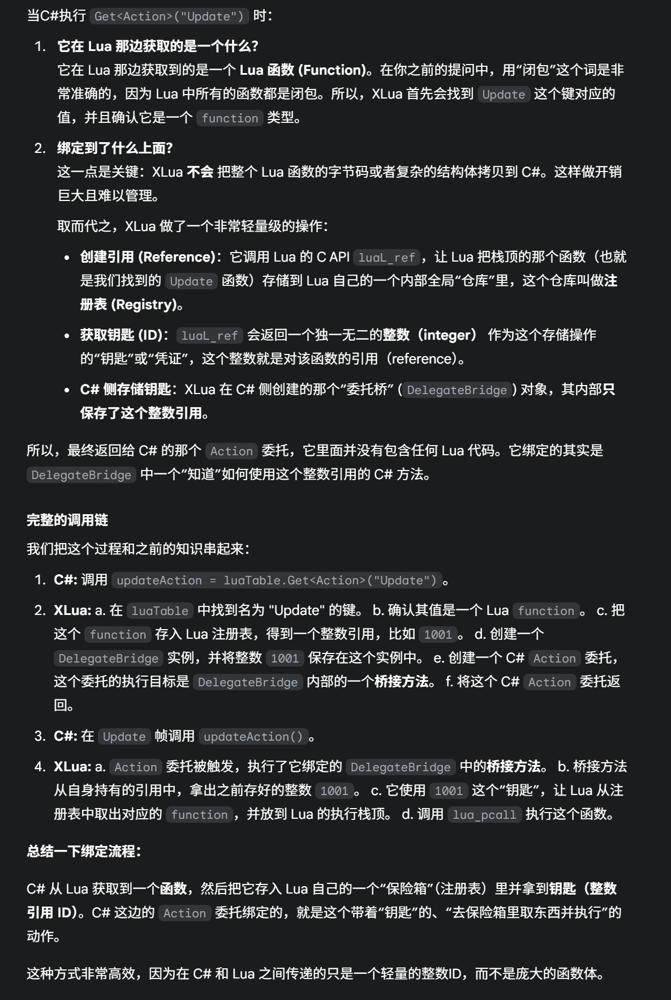

# Lua与C#

1. 比如C#当中一个函数Update，在Lua当中实现，问题是，当C#调用到这个Update的时候，是如何找到并且调用Lua那边的实现呢？

2. Lua当中有一个函数，希望调用到C#当中的逻辑，比如我的UI逻辑是在Lua当中实现的，而一些函数在C#当中，如何通过Lua调用C#

   > `__index` 和 `__newindex` 元方法会被触发。
   >
   > 这些元方法对应的 C# 回调函数 (位于 `StaticLuaCallbacks.cs`) 会被执行。
   >
   > `ObjectTranslator` 解析要访问的成员名称（例如 "AddComponent"）。
   >
   > 通过 C# 的反射 (`System.Reflection`) 查找对应的类型、方法或属性。
   >
   > 将 Lua 栈上的参数转换为 C# 需要的类型，然后调用成员。
   >
   > 如果 C# 方法有返回值，`ObjectTranslator` 再将返回值转换为 Lua 类型并压回 Lua 栈。

## Lua访问C#

访问到C#的类的方法有2种：

1. 第一种是动态反射，通过userdata查到C#那边的Dictionary，


2. 第二种生成wrap，这个类会在游戏启动的时候，作为一个表被注册进入虚拟机

> <font color=yellow>如果是静态的Lua访问C#类，那么它会在Lua虚拟机启动的时候就直接注册到Lua虚拟当中作为一个表，并且函数什么的也是直接注册到原表当中对吗</font>
>
> > 这个表述中存在问题，XLua用的是惰性注册，按需注册，只在用到这个类的时候才会去注册Wrap类作为一个不表

> 
>
> <font color=yellow> Wrap类的表对应的元表是什么样子的呢？</font>
>
> 关键在于：
>
> 1. 普通的字段的getter和setter也好，方法也好，都是直接注册到metatable当中的。为了让wrap类的 table可以查询，metatable的\_\_index指向的是自身
> 2. 对于构造函数，走的是\_\_call这一条路线
> 3. 而对于静态方法，是直接注册到wrap类对应的表的
>
> 

访问类内的方法有两种:动态反射和静态wrap


### 动态查找：反射

首先要知道的是，userdata是可以设置metatable的

在Lua访问C#的类的时候，实际上，C#的类在Lua中是以一个userdata的形式存在的。这里的userdata里存储的是这个C#类在C#注册表中的索引。而同时，这个userdata绑定一个metatbale。在将 `userdata` 推送到 Lua 栈上的时候，XLua 就会把这个元表**设置**给那个 `userdata`。这个操作发生在 C++ 核心库的 `xlua_pushcsobject` 函数中，（PS:这个Dictionary<object, int> objects_map,本身是一个C#对象的缓存系统，其目的是保证同一个C#对象在Lua中对应唯一的userdata，而它附带了一个“ID回收”机制，但并非C#对象本身的池化。，也就是它可以存储不同id对应着同一个类的不同对象)

> C#<font color=yellow>注册表</font>的解释
>
> 

> 当 Lua 代码执行 `my_csharp_obj.SomeProperty` 时，Lua 发现 `my_csharp_obj` 这个 `userdata` 没有名叫 "SomeProperty" 的成员。
>
> 于是 Lua 自动查找它的元表，并访问元表的 `__index` 字段。
>
> XLua 已经将这个 `__index` 设置为了 `StaticLuaCallbacks.IndexMeta` 这个 C# 函数。
>
> 因此，`IndexMeta` 被调用，它再通过 C# 反射找到 `my_csharp_obj` 真正的 `SomeProperty` 属性，获取其值并返回给 Lua。

### 静态：生成wrap类

有一些标记的类，也就是我们事前知道要加入到Lua当中的类型，那么可以加入一个标记，LuaCallCSharp。然后再Build，会生成一个对应类型的Wrap类

```c#
// 声明这个列表里的类型是 Lua 希望调用的 C# 类型
[LuaCallCSharp]
public static List<Type> LuaCallCSharp = new List<Type>()
{
    typeof(System.Object),
    typeof(UnityEngine.Object),
    typeof(UnityEngine.Vector3),
    // ... 以及其他你需要从 Lua 访问的 C# 类型
};

// 声明这个列表里的接口/委托是 C# 希望调用，但由 Lua 来实现的
[CSharpCallLua]
public static List<Type> CSharpCallLua = new List<Type>()
{
    typeof(Action),
    typeof(Func<double, double, double>),
    typeof(UnityEngine.Events.UnityAction),
    // ... 以及其他需要被 Lua 实现的委托或接口
};
```


这里的访问操作也是通过原表实现的：考虑一个生成了wrap的类，我们从lua那边访问的时候，是什么流程？

首先还是拿到这个类型，然后调用它的metatabke，而它的metatale里面的元方法，是在register当中注册的：


## C#访问Lua

> 比如C#当中一个函数Update，在Lua当中实现，问题是，当C#调用到这个Update的时候，是如何找到并且调用Lua那边的实现呢？

这个过程的核心是 XLua 创建的一个“**委托桥 (Delegate Bridge)**”。它在 C# 的委托（Delegate）和 Lua 的函数（Function）之间建立了一座桥梁。

我们需要在 C# 代码中获取到 Lua 中实现的 `Update` 函数，并把它存为一个 C# 对象。通常我们会把它存为一个 `Action` 类型的委托，因为 `Update` 函数没有参数也没有返回值。

```c#
// 假设 luaScript 是一个指向 Lua table 的 LuaTable 对象，
// 这个 table 里有 Awake, Start, Update 等函数。
// public class LuaBehaviour : MonoBehaviour

private Action luaUpdate;

void Awake()
{
    // ...
    // 从 Lua table 中获取名为 "Update" 的函数，并将其转换为一个 Action 委托
    luaUpdate = luaScript.Get<Action>("Update"); 
    // ...
}

void Update()
{
    // 如果成功获取到了 Lua 函数，就调用它
    if (luaUpdate != null)
    {
        luaUpdate();
    }
}
```

当 `Get<Action>` 被调用时，`ObjectTranslator` 发现你想要的是一个委托类型，并且 Lua 侧对应的是一个 `function`。这时，它不会简单返回一个 `LuaFunction` 对象，而是会执行一个更高级的操作：**创建一个符合 `Action` 委托签名的动态代理**。

这个创建过程的“心脏”是 **`DelegateBridge.cs`**。

**文件:** `Assets/XLua/Src/DelegateBridge.cs`

`DelegateBridge` 的作用就是为**每一种委托签名**（例如 `void()`、`void(int, string)`、`bool(GameObject)`）创建一个唯一的“桥接器”。

> 所以它的核心是要从Lua那边，获取一个

这个过程同样分为动态和静态两种模式：

> 

其实本质上就是，C#这边获取Lua那边的一个引用id，Lua那边可以通过这个id获取到对应的方法闭包。在调用的时候，先根据方法的id，从Lua那边获取函数，然后把函数压入栈，然后再把参数压入栈，然后调用。最后从栈中获取返回值。


> Lua的闭包在C#这边是怎么存储的
>
> A：这里有一个需要注意的是，C#从头到尾都没有拿到函数的实体，而是拿到了Lua注册表当中的索引。
>
> Lua的函数，userdata，table等都会在注册表中注册，并且有一个全局唯一的id。
>
> 


<font color=yellow>所以其实类的动态访问和方法的动态反射的访问是一个流程的：先是获得id，然后作为userdata压入栈，在设置userdata的元表的时候设置元表里面的__index是一个调用反射查找的方法。</font>

在动态模式下，所有未生成代码的C#成员（包括静态方法、实例方法、属性、字段等）的访问，都统一由这一套基于 `userdata` 和 `__index` 反射的流程来处理。XLua 用同一套“后备”逻辑，优雅地统一处理了所有动态访问，这正是它灵活性的体现。


<font color=yellow>而生成wrap的话，也是一套流程：生成wrap类，那么就会惰性注册类作为一个表，并且会把static方法直接注册到wrap表当中，而普通函数和getset方法注册到元表，并且通过metatable的|__index指向自己来访问</font>


本质上，Lua与C#的交互都是依靠虚拟的托管堆进行的。

为了方便讨论，我们先对Lua和C#可能存在的交互行为进行分类：

1. C#调用Lua代码，Lua调用C#代码
2. 类
3. 函数
   1. 静态函数
   2. 类内静态函数
   3. 类内非静态函数


## C#调用Lua代码

先定义什么叫做C#调用Lua代码：我们定义，从C#启动一段Lua的代码逻辑，叫做用C#调用Lua代码。

我们可以先思考一下在C#当中是如何使用XLua调用Lua代码的：

```lua
LuaEnv luaEnv;
string str = string.Format("require('{0}')", fileName);
luaEnv.DoString(str);
```

我们先看LuaEnv是个什么，关注LuaEnv的构造函数

```lua
// Create State
】rawL = LuaAPI.luaL_newstate();
```


1. 大模型接口
2. 爬虫Readme
   1. Readme里有网址，然后大模型对应的去找网址。
   2. Discussions，问答对。
3. 代理查ClickHouse对应项目的Issue+Pr
   1. Issue的提问，作为一个排除的方法，比如有的人想提issue，然后可以问是否有人提过了（本地查询然后提交类似Issue交给大模型判断）
4. 喂给大模型做prompt工程


要做的事情：

1. 选几个仓库作为demo演示的仓库
2. 获取对应仓库的dissussion
3. 获取对应仓库的Issue和状态
4. 设计prompt和对应的功能
   1. 对项目的介绍（获取discussions）
   2. 提问issue的排除和查询

