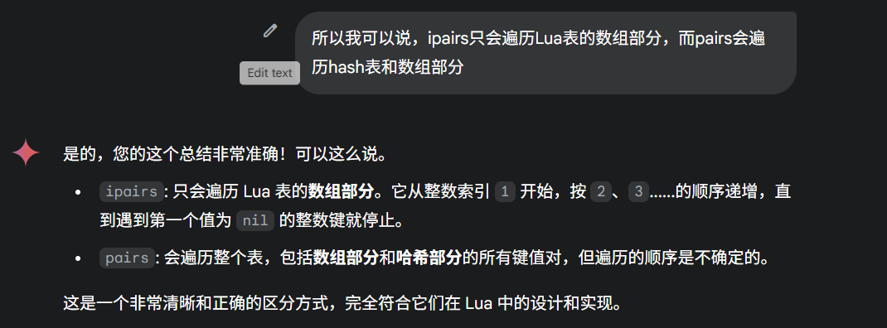

# Pairs和IPair



`pairs` 和 `ipairs` 的区别是 Lua 中一个非常基础且重要的概念。从您提供的源代码角度分析，它们的根本区别在于使用了**完全不同的迭代机制**，这直接导致了它们遍历范围和顺序的差异。

### `ipairs` 的实现原理：顺序的、基于整数索引的数组遍历

`ipairs` 的设计目标是像在其他语言中遍历一个**数组（Array）或列表（List）**一样，严格按照数字顺序进行。

- **核心实现**： `ipairs` 函数本身（在 `lbaselib.c` 中实现为 `luaB_ipairs`）并不执行遍历。它是一个**迭代器工厂**，它返回三个值给 `for` 循环：
  1. 一个自定义的、用C编写的迭代函数 `ipairsaux`。
  2. 被遍历的表 `t`（作为状态）。
  3. 初始索引值 `0`。
- **迭代函数 `ipairsaux` 的逻辑**： `for` 循环每次调用 `ipairsaux` 时，该函数会：
  1. 接收上一次的索引 `i`（第一次调用时是0）。
  2. 计算下一个索引：`i = i + 1`。
  3. 使用 `lua_geti(L, 1, i)` 从表 `t` 中获取整数键 `i` 对应的值。`lua_geti` 是一个专门用于高效获取整数键值的C API函数，它会优先查找表的数组部分。
  4. 检查获取到的值：
     - 如果值是 `nil`，说明遇到了数组的“空洞”或末尾，迭代就此**结束**。
     - 如果值不是 `nil`，则将新的索引 `i` 和这个值返回给 `for` 循环。
- **源码分析结论**： `ipairs` 的实现完全不依赖于表的哈希部分或通用的 `next` 函数。它的行为是固定的、可预测的：
  - **顺序性**：严格按照整数 `1, 2, 3, ...` 的顺序进行。
  - **范围**：只遍历表的**数组部分**。
  - **中断条件**：一旦遇到第一个值为 `nil` 的整数键，遍历就会立即停止，即使后面还有非 `nil` 的整数键值对。

### `pairs` 的实现原理：完整的、无序的哈希表遍历

`pairs` 的设计目标是遍历一个**字典（Dictionary）或哈希映射（Hash Map）**，确保表中的**每一个**元素都能被访问到，而不关心顺序。

- **核心实现**： `pairs` 函数（在 `lbaselib.c` 中实现为 `luaB_pairs`）在默认情况下（即没有 `__pairs` 元方法时），返回三个值给 `for` 循环：
  1. Lua 的**原生 `next` 函数**（在C层面对应于 `lua_next` API，其核心是 `ltable.c` 中的 `luaH_next` 函数）。
  2. 被遍历的表 `t`（作为状态）。
  3. 初始控制变量 `nil`。
- **迭代函数 `luaH_next` 的逻辑**： `luaH_next` 函数的设计是为了能走遍表中的所有键值对。它的内部遍历顺序如下：
  1. **首先，遍历数组部分**：它会从头到尾扫描表的数组部分 (`t->array`)。
  2. **然后，遍历哈希部分**：接着，它会从头到尾扫描表的哈希部分 (`t->node`)。
  3. 对于 Lua 程序员来说，哈希部分元素的存储位置取决于键的哈希值以及解决哈希冲突的策略，因此遍历哈希部分的顺序是**不确定的**。
- **源码分析结论**： `pairs` 的实现依赖于 Lua 表的底层数据结构，这决定了它的行为：
  - **完整性**：它保证会访问到表中的**所有**非`nil`元素，无论键是整数、字符串还是其他类型。
  - **无序性**：虽然内部有一个固定的遍历顺序（先数组后哈希），但由于哈希部分元素的存储位置不可预测，所以从用户的角度看，`pairs` 的遍历顺序是**不确定的**。
  - **健壮性**：它会跳过值为 `nil` 的键（因为在 Lua 中，给一个键赋值 `nil` 等同于从表中删除这个键），所以不会像 `ipairs` 那样因为一个“空洞”而提前中断。

### 总结对比

| 特性         | `ipairs` (源码角度)           | `pairs` (源码角度)                         |
| ------------ | ----------------------------- | ------------------------------------------ |
| **迭代函数** | 自定义 C 函数 `ipairsaux`     | 原生 C 函数 `luaH_next` (通过 `next` 暴露) |
| **核心操作** | `lua_geti`，按序递增整数索引  | 遍历表内部的数组和哈希两个数据结构         |
| **遍历范围** | 仅限从 1 开始的连续整数键     | 所有键值对                                 |
| **顺序**     | 严格按 `1, 2, 3, ...` 顺序    | **不确定**                                 |
| **中断条件** | 遇到第一个值为 `nil` 的整数键 | 遍历完所有元素                             |

Export to Sheets

从源码的角度看，`ipairs` 是一个为“数组”这种特定数据结构量身定制的高效、有序遍历器；而 `pairs` 则是一个通用的、用于“哈希表”这种数据结构的完整、但无序的遍历器。

# Lua字符串存储

是一个哈希表

Lua项目中，字符串的存储和管理是一个非常精巧且高效的系统，是Lua性能优异的关键之一。其核心设计是根据字符串的长度将其分为两类并采用不同的策略：**短字符串 (Short Strings)** 和 **长字符串 (Long Strings)**。

### 核心数据结构：`TString`

所有字符串在Lua内部都由 `TString` 结构体表示，它定义在 `lobject.h` 中。这个结构体包含了所有GC对象的通用头部 (`CommonHeader`)，以及字符串特有的信息。

C

```c++
typedef struct TString {
  CommonHeader;
  lu_byte extra;  // 短字符串用于标记保留字, 长字符串用于标记是否已计算哈希
  ls_byte shrlen; // 短字符串的长度。对于长字符串，这是一个负数标志
  unsigned int hash;
  union {
    size_t lnglen;         // 长字符串的长度
    struct TString *hnext; // 在哈希表中的下一个节点（仅用于短字符串）
  } u;
  char *contents;   // 指向长字符串内容的指针
  lua_Alloc falloc; // 外部字符串的释放函数
  void *ud;         // 外部字符串的用户数据
} TString;
```

关键在于 **`shrlen`** 字段：

- 如果 `shrlen >= 0`，它表示这是一个**短字符串**，并且`shrlen`就是它的长度。
- 如果 `shrlen < 0`，它表示这是一个**长字符串**，`shrlen`的值作为一个标志位来区分不同类型的长字符串。

------

### 短字符串 (Short Strings) 的存储：内部化 (Interning)

- **定义**：长度小于等于 `LUAI_MAXSHORTLEN`（在此项目中定义为40）的字符串被视为短字符串。

- **核心机制 - 内部化 (Interning)**： 这是短字符串管理的核心。**对于任何内容相同的短字符串，Lua在内存中只保留一份唯一的拷贝**。

  - **字符串表 (String Table)**：`global_State` 结构中有一个哈希表 `strt`，它专门用于存储和快速查找所有唯一的短字符串。

  - 创建流程 (`internshrstr` 函数)

    ：当创建一个新的短字符串时（例如，通过 

    ```c++
    luaS_newlstr
    ```

     或 

    ```c++
    luaS_new
    ```

    ），程序会：

    1. 计算字符串内容的哈希值。
    2. 使用哈希值在字符串表 `strt` 中查找。
    3. **如果找到了内容完全相同的字符串**，就直接返回已存在的那个`TString`对象的引用。
    4. **如果没找到**，Lua会分配一个新的`TString`对象，拷贝字符串内容，然后将这个新对象存入字符串表中，以备将来复用。

- **内存布局**： 对于短字符串，`TString` 结构体头部和字符串的实际字符数据是**在同一块连续的内存中**分配的。宏 `sizestrshr(l)` 计算了这个连续块的大小。`TString` 结构体中的 `contents` 字段实际上并不存在，而是通过宏 `getshrstr(ts)` 计算得出，指向紧随结构体头部的字符数据区。

- **优点**：

  1. **节约内存**：大量重复的短字符串（如变量名、表字段名、代码中的短文本）在内存中只有一份实例。
  2. **快速比较**：由于所有内容相同的短字符串都指向同一个对象，比较两个短字符串是否相等，只需要比较它们的指针地址 (`eqshrstr(a,b)` 宏，即 `a == b`)，这比逐字符比较 (`memcmp`) 快得多。

------

### 长字符串 (Long Strings) 的存储：独立分配

- **定义**：长度大于 `LUAI_MAXSHORTLEN` 的字符串。
- **核心机制 - 不内部化 (No Interning)**： 与短字符串相反，长字符串**不会被内部化**。每次创建一个长字符串（即使内容完全相同），Lua都会分配一个新的、独立的`TString`对象和内存空间来存储它。这个逻辑在 `luaS_newlstr` 函数中实现，当长度 `l > LUAI_MAXSHORTLEN` 时，它会调用 `luaS_createlngstrobj`。
- **内存布局**： 对于常规的长字符串 (`LSTRREG`)，其`TString`头部和字符数据也是在同一块连续内存中分配的。其长度存储在 `u.lnglen` 字段中。
- **比较与哈希**：
  - 比较两个长字符串需要调用 `luaS_eqlngstr`，它会先比较长度，如果长度相同再逐字节比较 (`memcmp`)。
  - 长字符串的哈希值是**按需计算**的（第一次需要时计算），并缓存到`hash`字段中，由`extra`字段标记是否已计算 (`luaS_hashlongstr`)。

------

### 外部字符串 (External Strings)

这是一个高级特性，主要用于C API。通过 `lua_pushexternalstring` API（内部调用 `luaS_newextlstr`），Lua可以创建一个`TString`对象来“管理”一块由外部（C代码）分配和拥有的内存缓冲区。

- **作用**：避免了将C字符串拷贝到Lua内存空间的开销。
- **内存管理**：可以为这个外部字符串提供一个**释放函数 (`falloc`)**。当这个`TString`对象被垃圾回收时，Lua的GC会调用这个函数来释放外部缓冲区，防止内存泄漏。

------

### 与垃圾回收 (GC) 的关系

- 无论是短字符串还是长字符串，`TString`都是可回收对象 (`GCObject`)。
- **短字符串的回收**：一个内部化的短字符串只有在**没有任何地方引用它**时，才可能被回收。GC在清扫阶段，如果发现一个短字符串是“死的”，会调用`luaS_remove`将它从字符串哈希表中移除，然后释放其内存。 需要注意的是，像保留字（`"and"`, `"while"`等）和元方法名（`"__index"`等）这些字符串在Lua状态初始化时被创建并设置为“固定”(`luaC_fix`)，永远不会被回收。
- **长字符串的回收**：长字符串遵循普通的GC规则。当没有任何地方引用一个长字符串对象时，它就会在GC的清扫阶段被回收。

**总结**

| 特性         | 短字符串 (Short String)                          | 长字符串 (Long String)             |
| ------------ | ------------------------------------------------ | ---------------------------------- |
| **定义**     | 长度 ≤ 40                                        | 长度 > 40                          |
| **核心策略** | **内部化 (Interning)**                           | **独立分配**                       |
| **内存**     | 内容相同的字符串共享一份内存拷贝                 | 每个字符串对象都有独立的内存空间   |
| **存储**     | 存储在全局的字符串哈希表中                       | 不进入字符串表，作为独立GC对象存在 |
| **比较**     | 指针比较 (非常快)                                | 长度比较 + `memcmp` (较慢)         |
| **GC**       | 只有当完全没有引用时才会被从字符串表中移除并回收 | 当引用计数为零时被回收             |

# Lua热更新

https://gwb.tencent.com/community/detail/120538

https://www.jianshu.com/p/30416db4f649

https://blog.codingnow.com/2016/11/lua_update.html

>  更新的思路，归纳为两点：
>
> 将模块中旧的函数替换成新的函数，这个新的函数可以放到一个lua文件中，或者以字符串的形式给出。
>
> 将模块中旧的函数，当前用到的所有上值，（什么是上值，后面有讲到）保存到起来，用于新函数引用，保证新函数作为模块中的一部分能够正确运行。

