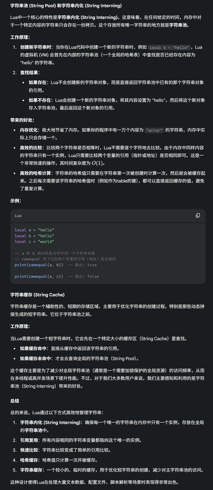
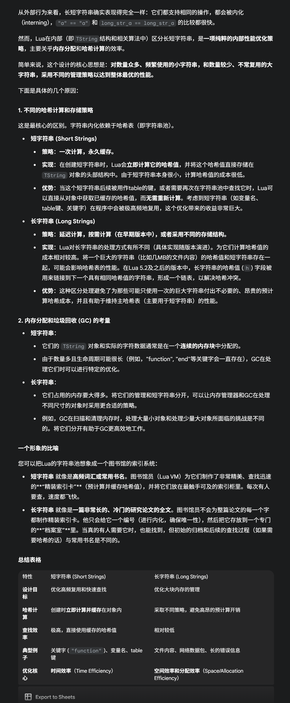
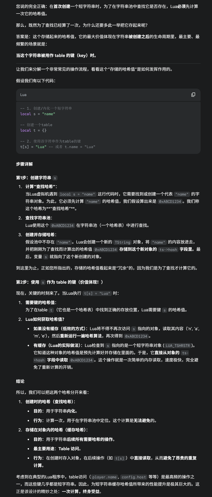
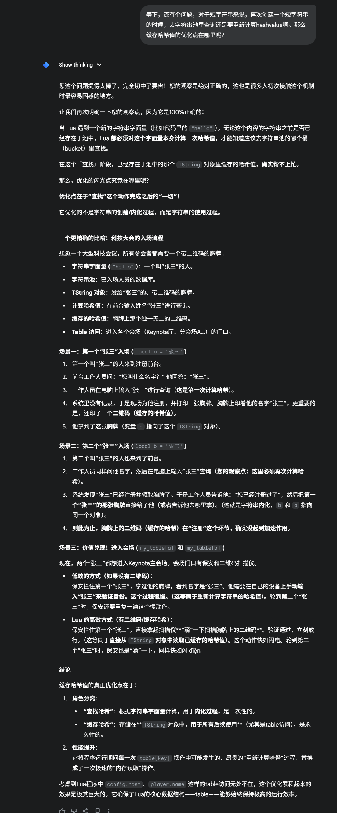
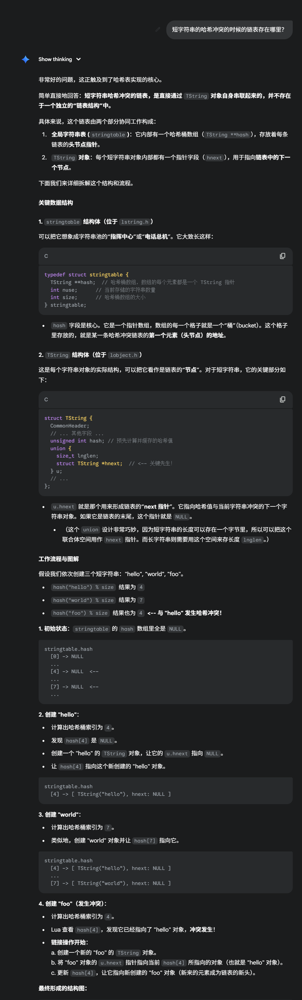
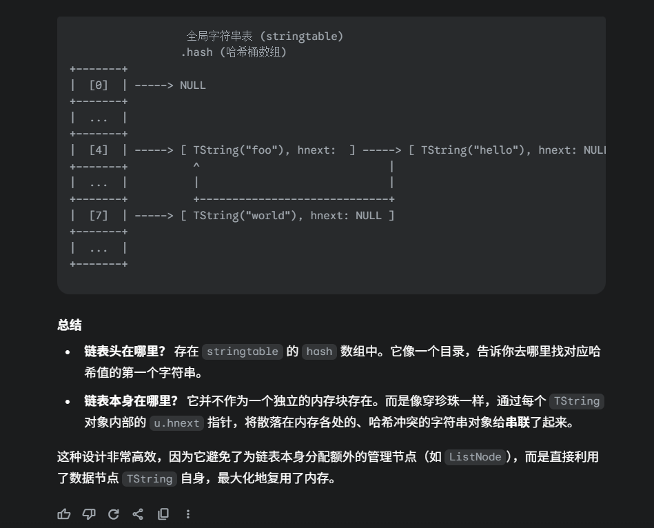

# Lua的字符串

Lua的String基于了字符串池和字符串缓存这两个设计

## 长短字符串

Lua会区分长短字符串

这俩的区别是：

1. 短字符串会缓存哈希值
2. 长字符串不会缓存哈希值

短字符串的哈希值，主要是用来，当它作为一个table 的key的时候，不需要再次计算它的hashvalue

## 疑问：但是通过“name”获取对应的TString缓存对象这个过程本身也需要计算一次hashvalue，总数上没有减少哈希值的计算次数 啊

答案：和Lua的机制有关，Lua会编译一次，执行多次的语言

