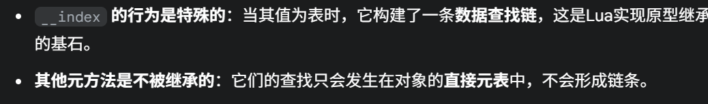

先记录一下什么是metatable

我发现之前的理解都有偏差，metatable本身其实和table是一体的。

比如对于一个table A，我给A设置元方法可以，但是如果A当中读操作的时候，他不会去找A的\_\_index，而是会去找A的metatable 的\_\_index。也就是说，元方法只能在元表中使用。

在OOP当中，往往只会实现\_\_index，而不会去实现\_\_newIndex（仔细想一下，读取的时候，如果子类没有，就返回父类的，写入的时候直接在子类创建新的就可以了）

同时，是元方法才会递归查找，意思是查找\_\_index指向的表，然后再去往下一直查

```c++
// lvm.c 中的 luaV_finishget 函数简化逻辑
for (loop = 0; loop < MAXTAGLOOP; loop++) {
  // ... 获取元表中的 __index 元方法 'tm' ...
  tm = fasttm(L, hvalue(t)->metatable, TM_INDEX);

  if (notm(tm)) { // 如果没有 __index 元方法
    // ... 查找结束，返回 nil ...
  }

  if (ttisfunction(tm)) { // 如果 __index 是一个函数
    // ... 调用该函数，并返回其结果 ...
  }

  t = tm;  // <-- 核心步骤！如果 __index 是一个表
  // ... 在新的表 't' 上重新尝试原始的 get 操作 ...
  // 如果找到了，就返回；如果还没找到，循环会继续，
  // 检查这个新的表 't' 是否也有元表和 __index
}
```

而metatable是不会被继承的，比如B是A的原表，C是B的原表，那么C中的元方法是不会被A触发的

```c++
const TValue *luaT_gettmbyobj (lua_State *L, const TValue *o, TMS event) {
  Table *mt;
  switch (ttype(o)) {
    case LUA_TTABLE:
      mt = hvalue(o)->metatable; // 1. 直接获取对象o的元表
      break;
    // ... (其他类型的处理) ...
  }
  // 2. 如果元表mt存在，则直接在mt中查找元方法。
  //    如果找不到，就返回nil，不会继续查找mt的元表。
  return (mt ? luaH_Hgetshortstr(mt, G(L)->tmname[event]) : &G(L)->nilvalue);
}
```

而如果给A的元表中的metatable\_\_index设置为B，B的元表metatable\_\_index设置为C，就可以通过\_\_index的递归查下去



对于构造函数，走的是\_\_call这一条路线