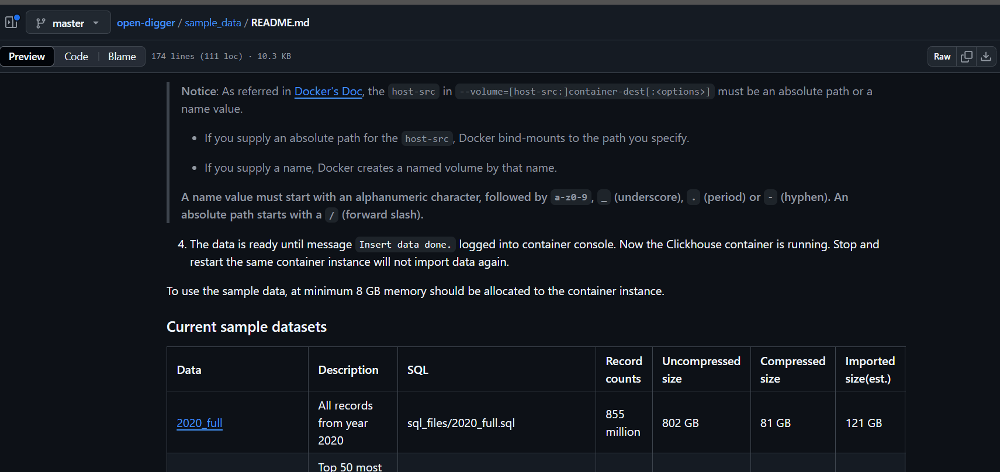

# Open Galaxy

## 初步计划

### 重构优点

1. 视觉效果
   1. Unity可以直接导出WebGL：基础上应该是可以达到和之前学长的效果的：
      1. [大屏]https://www.bilibili.com/video/BV15J4m1h7As/?spm_id_from=333.337.search-card.all.click&vd_source=5d4070cc138983fa1babce80b5a31622
      2. [Unity WebGL游戏部署]https://www.bilibili.com/video/BV1Np421D7pH/?spm_id_from=333.337.search-card.all.click&vd_source=5d4070cc138983fa1babce80b5a31622
   2. 视觉效果上可以有比较丰富的拓展空间，比如加入一些着色器编辑，纹理贴图的编辑。
      1. 这一部分实际上是有困难的，就是大屏、可视化一部分的困难在技术上，另一部分实际上在美术上。不过这部分资源是比较丰富的，可以至少有一个看得过去的效果。
      2. 对于渲染效果的控制是有一套更丰富的效果的
2. 开发难度
   1. 代码问题
      1. 代码质量。之前这部分质量上比较参差，耦合比较严重，可能真正写起来会有比较大的限制。
   2. 优化问题：大量实体渲染问题：静态/动态合批处理，LOD，视锥体剔除。
      1. 方案成熟，有值得研究的部分：现在企业当中这也是一部分值得研究处理的方向
      2. 引擎自身有优化方案，比如上述的内容都可以自定义处理也可以通过引擎自带的效果进行处理，
      3. 我比较熟悉，我能钻研：这就是我的私心了，我希望能把这个项目和我自己的发展结合起来，这样对我和对项目都有更好的聚合。
3. 后续的拓展
   1. 如果只是纯粹的前端页面，基本上就是纯可视化，但是如果结合这种引擎类的生态，Unity自身有比较成熟的物理模拟系统，之后可以做交互上的拓展。
      1. 
   2. 图形效果的提升：Shader，贴图，甚至可以做成用户可以自定义自身节点皮肤的效果（这就是后话了）
   3. 资源管理系统比较成熟，也方便做资源管理，方便开发和拓展。
   4. 方便之后的同学开发。因为Unity和UE现在都在做可视化编程，比如UE的蓝图系统，其实都不需要懂代码也可以做出比较好的Demo。
      1. 我想要尽可能的提高这部分代码质量，唐学长之前的代码我看了一下，可能时间比较久远，所以可拓展性不是很强。（不过我尽力Oz）
   5. 方便迁移，Unity的多端拓展还是比较好的。而且作为一个网页也是完全可以部署的。
      1. Unity是在图形API的基础上封装了一层自己的图形操作层，叫做 Universal Render Pipeline。还有一个SRP，是可编程的Render Pipeline。通过这些中间层，Unity可以实现的是借助他自己的打包方案做到多平台打包发布。比如我们想在Web上展示，那就可以打包到WebGL，如果想要Window平台作为一个应用，那就可以DX，还有OpenGL这些可选。

### 问题

1. 图形质量依赖建模：但是实际上纯基于WebGL的部分也依赖建模
2. 具体选择什么引擎，UE开发难度大，基础效果好，可迁移性弱。Unity效果一般，开发相对简单，可迁移性强。
3. 

### 我目前的打算

1. 项目重构，换技术，换平台。
2. 提高性能表现，因为如果想要更多的数据可视化展示出来，那就不可避免的要有更好的性能表现
3. 节点的组织，如何很好的组织节点直接的关系，这部分可能需要一点图算法的参与。
4. 我打算先从静态数据入手，就是把交互数据用Open Digger Down下来，然后先完成一个原型，然后去进一步推进。

> 之后的后端交互先暂且一放，比如后面前面展示完成了或者有新同学加入再推进。
>
> 我希望能把这部分接口做的可拓展一点，到时候也许还能迁移到其他的项目上面。

4. 模型选择上还是先以简单的球体这些为主，一方面是契合主题，另一方面是美工确实不好解决，但是这些都是效果的问题，我希望我的主要部分是放在代码能解决的问题上面。

# 流程

1. 搞清楚数据来源和结构

> 1. 数据来自：https://oss.x-lab.info/
> 2. 全部数据来自：

2. 搞清楚节点排布方式（图算法之类的）

3. 网络服务访问。
