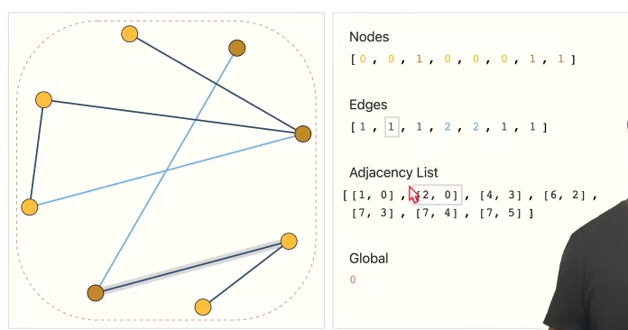

# A Gentle Introduction to Graph Neural Networks

> 地址：https://distill.pub/2021/gnn-intro/

## 图神经网络任务

1. 图

   > 图的分类，有无环

2. Node

   > 图当中节点的分类（单独点的属性判断）

3. Edge

   > 节点之间的关系（给出节点然后预测节点之间的关系）

## 对于神经网络难点

链接性该如何表示？

> 1. 稀疏矩阵表示，高效计算很困难
> 2. 排序不影响结果

使用了Adjacency List

## GNN

### 定义：

> 1. 只改变属性，不改变链接性（拓扑结构）
> 2. 图进去图出来
> 3. 排序不影响结果

### 最简单情况

分别对顶点，边，和全局的向量属性进行MLP。（这里还没有学习到关系）。然后比如要做N分类问题，最后接一个输出为N的FC就可以了

#### Pooling

比如有全局和边信息，缺少顶点信息，就可以通过对顶点汇聚边和全局的信息来预测

### 结构化信息：信息传递

对于顶点来说，进入MLP之前不只是自己的向量，而是自己和邻居所有的向量的加和再进入MLP（类似于卷积每个像素权重为1时的卷积操作）
