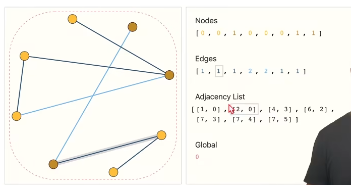
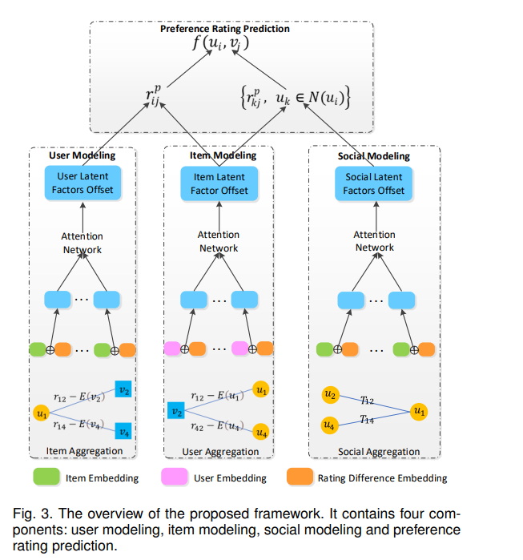

# A Gentle Introduction to Graph Neural Networks

> 地址：https://distill.pub/2021/gnn-intro/

## 图神经网络任务

1. 图

   > 图的分类，有无环

2. Node

   > 图当中节点的分类（单独点的属性判断）

3. Edge

   > 节点之间的关系（给出节点然后预测节点之间的关系）

## 对于神经网络难点

链接性该如何表示？

> 1. 稀疏矩阵表示，高效计算很困难
> 2. 排序不影响结果

使用了Adjacency List

## GNN

### 定义：

> 1. 只改变属性，不改变链接性（拓扑结构）
> 2. 图进去图出来
> 3. 排序不影响结果

### 最简单情况

分别对顶点，边，和全局的向量属性进行MLP。（这里还没有学习到关系）。然后比如要做N分类问题，最后接一个输出为N的FC就可以了

#### Pooling

比如有全局和边信息，缺少顶点信息，就可以通过对顶点汇聚边和全局的信息来预测

### 结构化信息：信息传递

对于顶点来说，进入MLP之前不只是自己的向量，而是自己和邻居所有的向量的加和再进入MLP（类似于卷积每个像素权重为1时的卷积操作）

# GDSRec: Graph-Based Decentralized Collaborative Filtering for Social Recommendation

| 项目 |                                                              |
| ---- | ------------------------------------------------------------ |
| 综述 | 否                                                           |
| 代码 | [MEICRS/GDSRec (github.com)](https://github.com/MEICRS/GDSRec) |
| 亮点 | 1. 通过使用一个bias向量来获得对于用户偏见的捕捉（比如对于一个用户来说，它的习惯就是不打高分，要考虑进来这个因素）去中心化图（好像是图当中要找一遍用户打分和平均分的偏差，来去中心化） 2. 分散图（decentralized graph）替代二分图 |
| 时间 | 2022                                                         |
| 参考 | [GDSRec：Graph-Based Decentralized Collaborative Filtering for Social Recommendation - 知乎 (zhihu.com)](https://zhuanlan.zhihu.com/p/582630872) |

> For the general recommendation task, there are two main types of algorithms: content-based algorithms [12] and collaborative filtering algorithms [13], [14].

文章的模型主要分为三个部分组成

User Model，Item Model，Social Model

所有的部分都是在分散图上进行的，分散图把原本的二分图拆成了三种图：User-Item，Item-User，User-User

User部分可以理解为是用户对于于自己发生过交互的商品本身的喜好程度的捕捉

Item部分可以理解为是商品对于不同用户的吸引力的不同

Social体现的是用户之间社群的互相影响

在建模之后，还有个防止过拟合的操作

> **节点丢失**
> 在分散的用户-项目图和社交图中，每个用户或项目都有不同数量的交互。
> 例如，一个用户可能与十几个项目进行了交互，但另一个用户只与几个项目进行了互动。为了防止过多交互对表征学习的过度拟合影响，我们需要在训练阶段减少一些交互。基于上述思想，提出了节点丢失。在[34]中，作者介绍了一种以概率丢弃节点的方法交互记录很少的节点。因此，在学习用户和项目的潜在因素偏移的过程中，我们为每个节点随机保留多达 K 个交互节点，这样我们可以保护学习资源较少的节点。