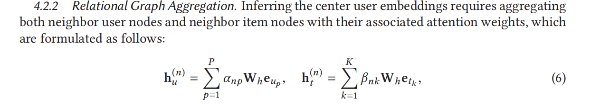
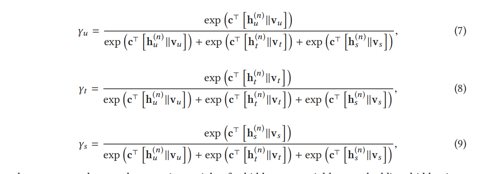
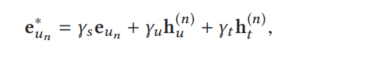

# **Federated Social Recommendation with GraphNeural Network**

| 项目 |                                                              |
| ---- | ------------------------------------------------------------ |
| 综述 | 否                                                           |
| 代码 |                                                              |
| 地址 |                                                              |
| 亮点 | 1. 异质性图 2. 隐私保护 联邦推荐系统               |
| 时间 | 2022                                                         |
| 参考 | 1. https://blog.csdn.net/xingzhe123456789000/article/details/139635471  |
| 论文 |                                   |

## 解决的问题：

1. 冷启动问题

**冷启动问题**是指在推荐系统中，当用户或物品的数据记录较少时，系统难以准确预测用户对物品的潜在兴趣，从而影响到学习到的用户/物品嵌入（embeddings）的质量和推荐性能。

> ‌**冷启动问题**‌是指在推荐系统的初期阶段，由于数据缺乏，如何实现推荐系统有效运转的过程。具体分为以下三类：
>
> 1. ‌**用户冷启动**‌：新注册用户由于缺乏历史行为数据和用户画像数据，难以进行个性化推荐。
> 2. ‌**物品冷启动**‌：新物品加入推荐系统时，缺乏与用户的交互信息和场效数据。
> 3. ‌**系统冷启动**‌：推荐系统构建初期，由于缺乏所有相关用户、物品及交互数据，难以实现

推荐系统有冷启动问题，用户刚加入的时候没法推荐，但是利用社交系统来做初步的推荐。（两个人隔得近，那就可以推荐）

2. 隐私问题

现有方法都需要集中存储用户信息，本文提出了一个去中心化方法。=>用了联邦学习

## 学习

联邦学习部分只做了一点点了解，主要是看GNN部分。

异构图它是这样一个思路，对于一个local graph，首先分别用两个GAT对节点的邻居和物品分别进行处理，然后根据注意力的参数分别获得节点对于邻居（hu）以及对于物品（ht）的embedding【这里我的一个疑问是，对于邻居，一般是只做一个hop的，那么对于物品也是这样吗？好像也是，但是还要再确定】

然后因为是异构图，模型对于邻居和物品的关注程度肯定也是不一样的，所以再做一遍注意力，来获取对于自身，对于节点以及对于物品的关注度【ps，这里突然想到embedding 的另一个用处，就是提高了模型的复用性，如果不用embedding，模型对于输入数据的要求就很高，维度都有硬性要求，但是embedding了之后反正都是高纬度，调整一下W的输出维度就行了】

这部分就是GAT的attention的部分了，做了一个softmax，但是这次的输入是三种embedding。最后也是学习了三个权重

