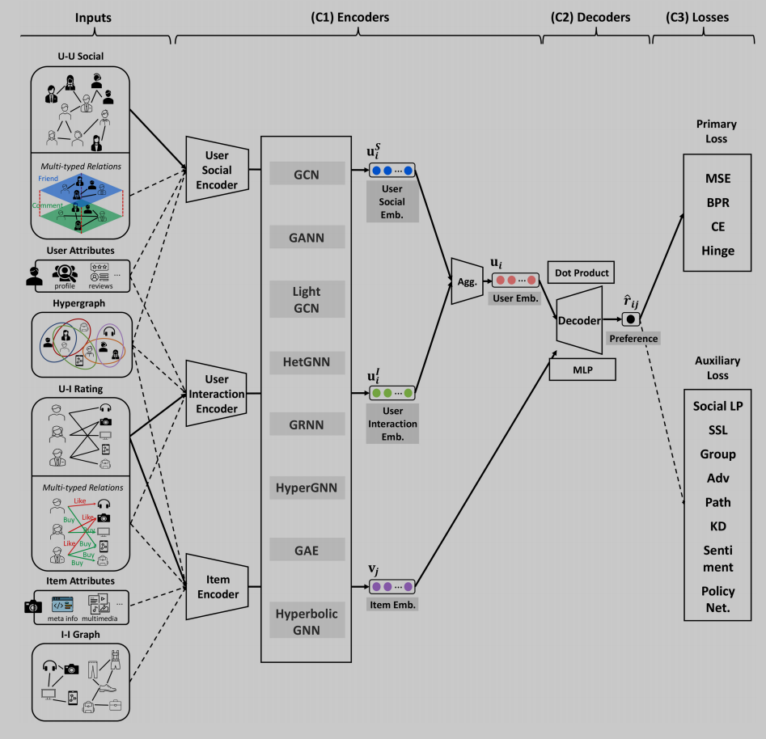

# **A Survey of Graph Neural Networks for Social** **Recommender Systems**

| 项目 |                        |
| ---- | ---------------------- |
| 综述 | 是                     |
| 代码 |                        |
| 地址 |                        |
| 亮点 |                        |
| 时间 | 2024（综述整理到2022） |
| 级别 | A                      |
| 参考 |                        |

Multiplex Graph（多层的图，比如人与人之间有很多种社交关系，star，fork，follow。。。）可以把这些关系叠加起来e [24, 114, 128].

HyperGraph：大概是组织？s [134], both user-user and user-item joint hyperedges [122], and

user-user and item-item hyperedges [24].

GRNN：有时间感知的推荐系统

s [9, 22, 44, 45, 67, 83, 84, 99, 111]

HyperGNN：捕捉更复杂的社交关系