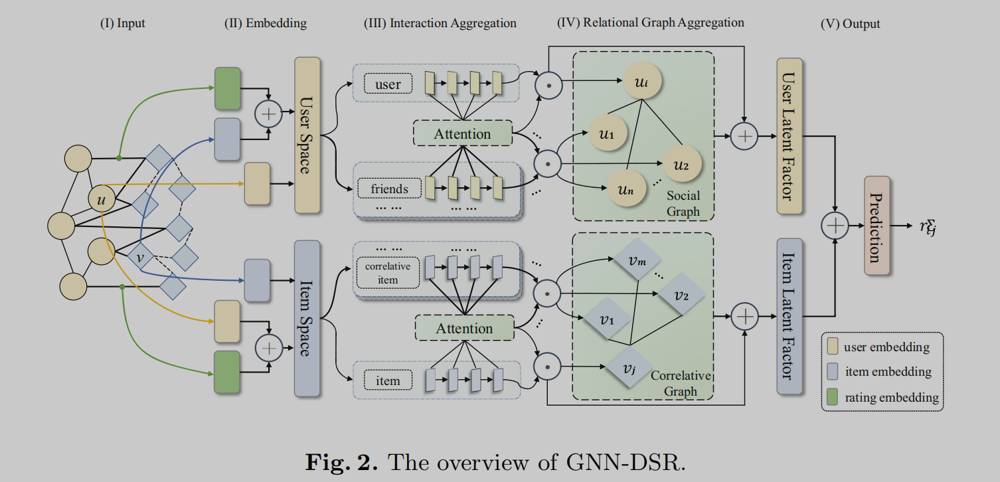

# Graph Neural Networks with Dynamic and Static Representations for Social **Recommendation**

| 项目 |                      |
| ---- | -------------------- |
| 综述 |                      |
| 代码 |                      |
| 地址 |                      |
| 亮点 | 时间序列预测节点变化 |
| 时间 | 2022                 |
| 级别 | A                    |
| 参考 |                      |

大概看懂了，第三部分Iteraction Aggregation是主要部分

这部分的聚合分成两个part，一个短期的动态表示一个长期的静态表示

短期的动态表示部分用了RNN（LSTM），大概是这样的：

> 以用户和物品的交互和评分为例子。首先就是做embedding，包括了物品的特征embedding和GraphRec的评分embedding。然后contact在一起然后做一个MLP，这样就会得到一个向量$h_{u_i}^t$表示对于用户i来说，与它有关系物品的embedding向量。
>
> 然后这里还有个t，t代表了一个时间序列。因为关系是会变的。可能是有新的物品链接，可能是有新的评分，但是无所谓，我们可以在时间序列上不断的用之前的h和新的h去做RNN（LSTM）最后，这个网络会输出一个预测的h。

长期静态表示部分我觉得是反应了一个长期不动的关系，我觉得假设应该是人在一个比较长的时间里主要的评价是不太会发生变化的。这部分就是传统的用GAT做embedding。也会获得一个h

然后再把这两个h，contact起来

第四部分就是社交关系还有物品的社交关系这些了，也用到了前一层的h，做了一个GAT聚合。最后第三四层的h合在一起contact然后多层感知机