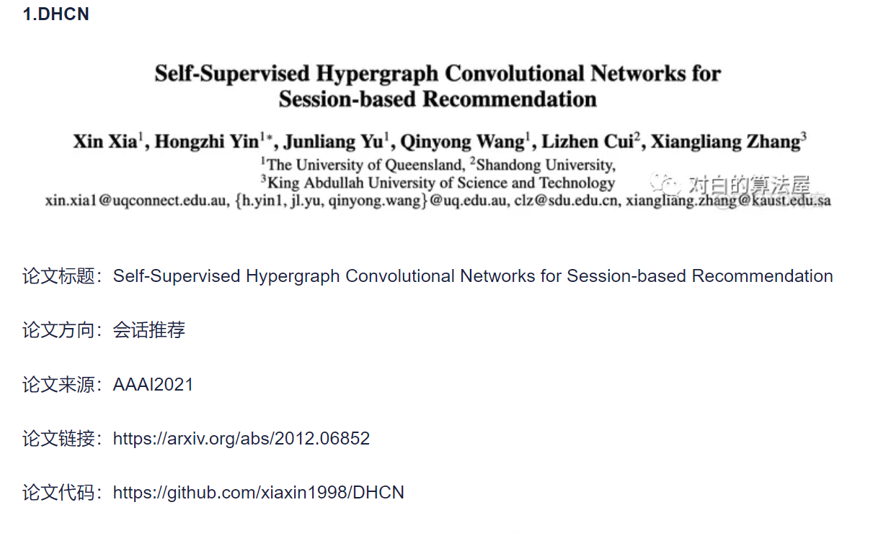

# **DH-HGCN: Dual Homogeneity Hypergraph Convolutional** **Network for Multiple Social Recommendations**

| 项目 |                                                          |
| ---- | -------------------------------------------------------- |
| 综述 |                                                          |
| 代码 |                                                          |
| 地址 |                                                          |
| 亮点 | 异质图当中的同质性                                       |
| 时间 | 2021                                                     |
| 参考 | https://blog.csdn.net/ZZZ___bj/article/details/116498732 |

冷启动+数据稀疏

现有方法主要使用的是一阶邻居信息，很少考虑社交扩散

用户之间的关系通常是复杂的。社会关系有多种类别：信任，评论。。。

类似的物品对于用户用类似的吸引力（高阶关系的复杂性）

>  异质图当中的同质性

## 论文：

1. 用很多种超图来表示社交关系当中的多种复杂关系
2. 用Kmeans对物品做了一个聚类。然后建立了一个物品静态属性超图

为了控制信息输入，文章使用了SGU，自门控技术，这种机制能够根据模型学习到的权重动态地调整信息的传递，从而优化用户嵌入的质量。

