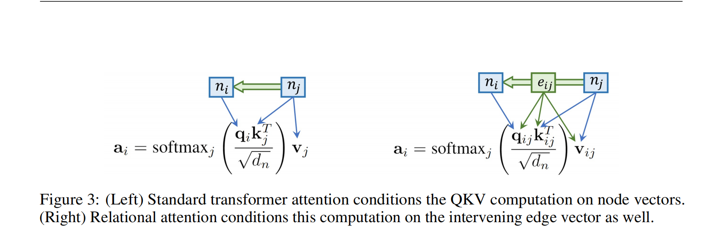

# **E-commerce Search via Content Collaborative Graph Neural**

| 项目 |                                                    |
| ---- | -------------------------------------------------- |
| 综述 |                                                    |
| 代码 |                                                    |
| 地址 | https://dl.acm.org/doi/pdf/10.1145/3580305.3599320 |
| 亮点 |                                                    |
| 时间 | 2023                                               |
| 参考 | https://zhuanlan.zhihu.com/p/655950271             |

# RELATIONAL ATTENTION: GENERALIZING TRANSFORMERS FOR GRAPH-STRUCTURED TASKS

| 项目 |                                  |
| ---- | -------------------------------- |
| 综述 |                                  |
| 代码 |                                  |
| 地址 |                                  |
| 亮点 |                                  |
| 时间 |                                  |
| 参考 |                                  |
| 论文 |  |

提出了关系注意力机制。

过去的方法都是节点的注意力聚合。然后RELATIONAL ATTENTION则是把节点的关系变成一个Vector也加入到训练当中。

左边是过去的方法，右边是RELATIONAL ATTENTION方法

