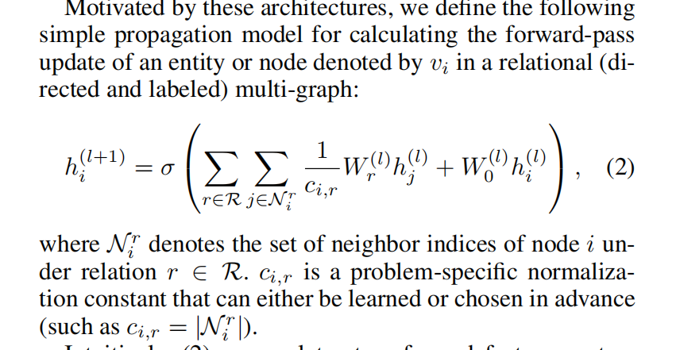
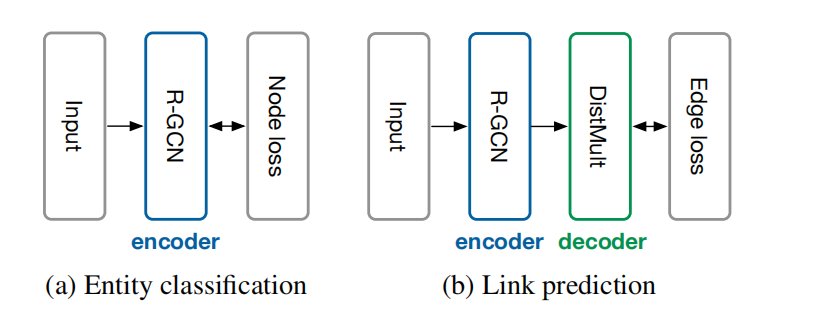

# RGCN:Modeling Relational Data with Graph Convolutional Networks

| 项目 |                                                             |
| ---- | ----------------------------------------------------------- |
| 综述 | 否                                                          |
| 代码 |                                                             |
| 地址 |                                                             |
| 亮点 |                                                             |
| 时间 | 2017                                                        |
| 参考 | https://blog.csdn.net/qq_41895003/article/details/129192082 |

同质节点异质关系的开山之作

核心思路就是把一张异质关系图看作是一个一个同质关系图的集合

更新节点的feature的时候做了一个双循环。对邻居节点中每种类型的关系分别处理，最后再加在一起。同时考虑了自链接

本文还有两个优化的tirck，正则化防止过拟合**参数共享及稀疏化约束**

还有一个就是backbone的使用：主干网络就是负责特征提取的。至于接下来什么任务就是看后面接什么了

