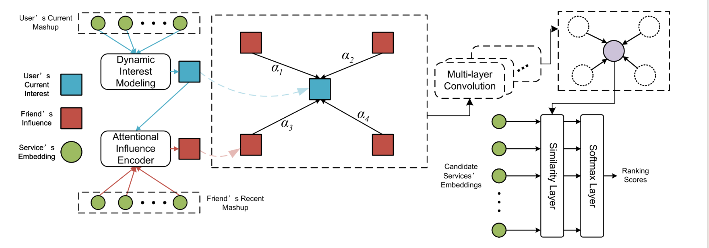

# Time-Aware Service Recommendation With Social-Powered Graph Hierarchical Attention Network

| 项目 |                                                              |
| ---- | ------------------------------------------------------------ |
| 综述 | 否                                                           |
| 代码 |                                                              |
| 地址 |                                                              |
| 亮点 |                                                              |
| 时间 | 2023                                                         |
| 级别 | CCF-A                                                        |
| 参考 |                                                              |
| 论文 |  |

有两个关键：

1. 用户自身的兴趣会变化，所以用LSTM捕捉用户在时间变化上的兴趣
2. 在社交网络中，用户对朋友当前关联服务的兴趣也不同，所以用一个LSTM去捕捉感兴趣的，还会再加一个Attention

