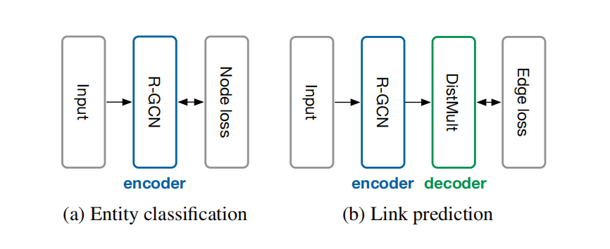

深度学习模型的backbone本质就是一种特征提取

当完成特征提取之后，再通过再backbone之后接一个模块来把特征用于不同的任务

比如对于分类任务，就是接全连接层然后输出类别。如下图：

对于encoder来说，本质就是特征提取器，当然不一定是把低维度的特征映射到高纬度，也有可能是降维

而decoder对应的则是把提取的特征转换回原始类型数据的部分。

对于不同类型的任务，选择不同类型的loss fuction即可