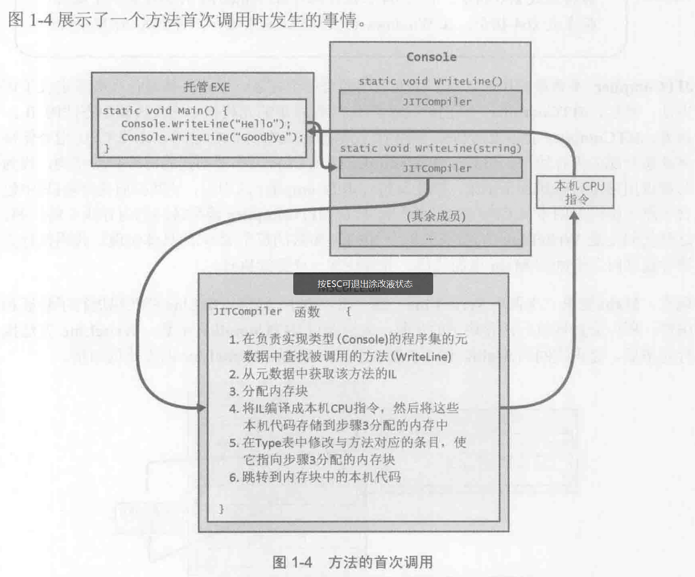
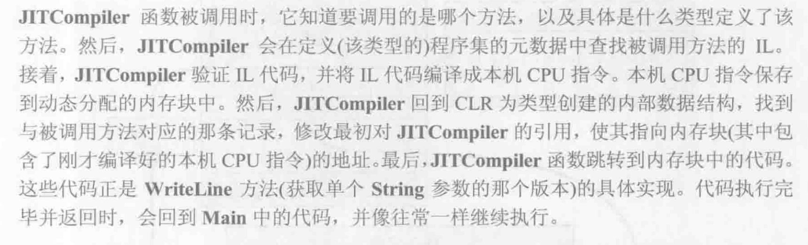
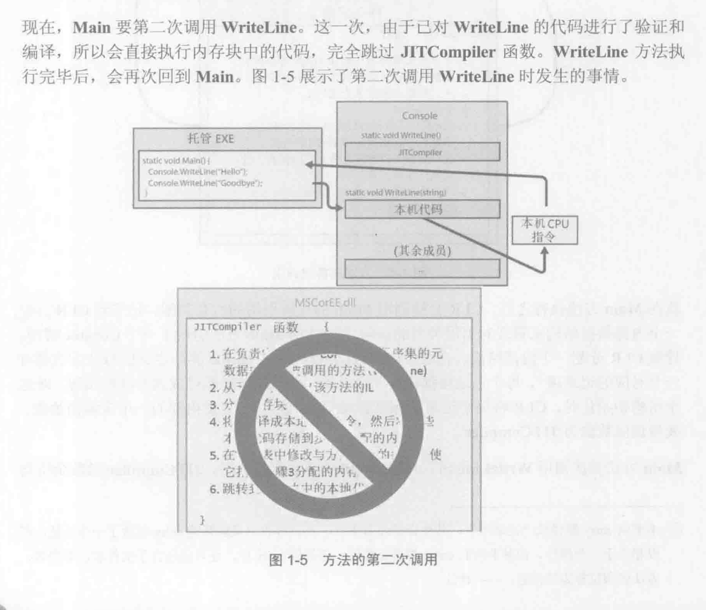

# C# CLR

## 元数据+IL

IL与元数据是在C#等高级语言被编译之后生成的。编译器将源代码编译为一个.NET数据集(.dll或exe），这个程序集主要包括两部分：

**元数据**：描述程序中的类型、方法、字段、属性等信息，是程序的自描述部分。元数据提供了对类型、成员以及程序集引用的描述，帮助 CLR 了解程序的结构。

**MSIL**：源代码被编译为一种独立于平台的中间语言，称为 MSIL，供 .NET 平台上的 JIT 编译器进一步转换为特定平台的机器代码

## 反射与元数据

反射机制依赖元数据实现，最常见的例子就是序列化与反序列化

## JIT

JIT的处理方法有点像解释型语言。在运行时，把IL编译为本机可以执行的CPU指令

