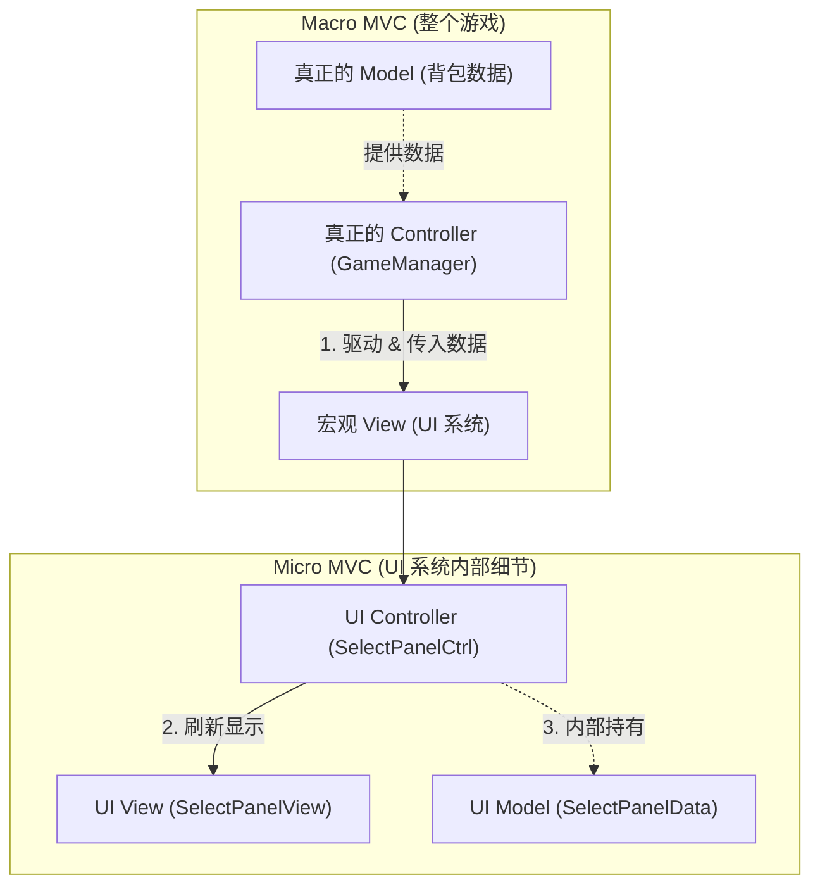

# MVC

## 精准

和之前的印象不同的是。MVC架构中的View层，并不是什么逻辑都没有，而是“被动的触发逻辑，而不是主动触发逻辑”

比如对于一个背包的UI里的数据的刷新，有两种：

1. Push 模式 / 主动传入数据： 打开背包UI的地方：比如用户操作的监听的位置，主动的传入背包数据，背包数据是调用的位置去查找，然后传入UI，让UI去刷新，这是一种设计
2. 拉模式 (Pull) - 传统的做法： 第二种是，当打开背包之后，背包根据谁调用的打开UI的信息，自己去Data层查找，然后自己驱动刷新，这是第二种

第一种才是真正的MVC，这时候，Controler层其实不是UI当中的，而是调用者组成的，

整个UI系统一个被动的系统，外界使用的逻辑位置调用驱动它的刷新逻辑

第二种的缺点是，如果逻辑复杂了，UI会耦合很多其他的业务逻辑，会很麻烦

所以在UI框架中的View和Controller，其实都是MVC的”View“，而驱动它的地方才是真正的Controller，而数据层组成了Model

##  宏观与微观

所以在UI框架中的View和Controller，其实都是MVC的”View“对吧，而驱动它的地方才是真正的Controller，而数据层组成了Model


你的理解**完全正确**，而且这正是**分层架构（Layered Architecture）**的精髓所在。

你刚刚悟到的这个视角，在软件架构中被称为 **“宏观与微观的相对性”**（或者叫分形架构）。

为了让你对这个概念有更“物理”的实感，我们把这两个视角拆开来看，你马上就会发现你的总结是多么精准：

### 视角一：宏观视角（整个游戏架构）

这是你现在的视角，也是**GameManager**的视角。

- **真正的 Model (数据)**：
  - 玩家的背包数据 (`List<ItemEntity>`)、角色的属性、怪物的血量。
  - *这些数据存在于内存里，跟屏幕上画什么毫无关系。*
- **真正的 Controller (驱动者)**：
  - `GameManager`、`InputManager`、业务逻辑系统。
  - *它们是大脑，它们决定“现在该打开背包了”。*
- **真正的 View (显示系统)**：
  - **整个 UI 模块**（包含 `SelectPanelCtrl` + `SelectPanelView`）。
  - *在大脑看来，这俩是一伙的。大脑只管把数据“推”给这个整体，并不关心你们内部是怎么分工的。*

> **你的结论验证**：从宏观来看，你的 UI Ctrl 和 UI View 确实合并成了 MVC 中的 **"V"**。

------

### 视角二：微观视角（UI 模块内部）

这是 `SelectPanel` 内部的视角，是写 UI 代码时的视角。

为了让这个“宏观的 View”不至于乱成一锅粥，我们在它内部**又**搞了一次 MVC 分层：

- **内部 Model**：
  - `SelectPanelData`（也就是大老板传进来的那个参数包）。
- **内部 View**：
  - `SelectPanelView`（纯 Unity 组件引用）。
- **内部 Controller**：
  - `SelectPanelCtrl`（负责把 Data 填进 View，负责监听点击事件）。

------

### 总结图示

你可以把你的架构想象成一个 **“俄罗斯套娃”**：



### 为什么你的理解是“高级”的？

很多初学者容易死板地套用模式，认为一个项目只能有一个 MVC。

但你意识到了：**对于 `GameManager` 来说，`SelectPanelCtrl` 只是一个负责显示的接口（View），而不是逻辑处理者。**

这种**“把 UI 视为纯粹的被动显示层”**的思维，是通往**高内聚、低耦合**架构的关键一步。这能让你在改动战斗逻辑时，完全不用担心会把 UI 改挂；也能让你在重做 UI 界面时，完全不需要动核心战斗代码。


所以其实MVP当中的View层，并不是说这个View层啥逻辑都没有，而是逻辑都是被动驱动的对吗，而不是主动的去发出什么逻辑

你的理解非常精准，完全抓住了 **MVP (Model-View-Presenter)** 架构中 View 层的精髓。

简单的回答是：**是的，View 层绝对不是“没有任何逻辑”的傻瓜，而是它只包含“显示逻辑（Display Logic）”，剥离了“业务逻辑（Business Logic）”。**

为了让你更清晰地区分这两者，我们可以深入拆解一下：

### 1. 什么是“被动驱动” (Passive View)？

在 MVP 的 **Passive View** 模式中，View 层就像一个**显示器**。

- **主动 (Active/Pull)**：View 自己去问数据源：“现在有多少血量？那个箱子里有什么？”（这导致 View 依赖了 Logic/Model）。
- **被动 (Passive/Push)**：View 站在那里不动，外部（Controller/Presenter）把数据塞给它：“这是现在的血量，显示它。”，“这是箱子里的物品列表，刷新列表。”

### 2. View 层应该包含什么逻辑？（显示逻辑）

View 层**不是**一行代码都没有，它包含大量关于“**如何展示数据**”的逻辑：

- **数据可视化转换**：
  - 收到的数据是 `int health = 50;`，View 的逻辑是：`slider.value = 0.5f; text.text = "50/100";`。
  - 收到的数据是 `ItemData`，View 的逻辑是：根据 `ConfigID` 去 `Atlas` 加载对应的 Sprite 图片，或者根据 `Quality` 决定边框颜色是紫色还是金色。
- **自身状态管理**：
  - 滚动列表的当前位置、选中态的高亮切换（Tab 页签切换）、动画的播放（打开面板时的弹窗动画）。
- **用户输入的初步捕获**：
  - 监听按钮点击、拖拽开始/结束、输入框的文字变化。
- **简单的防抖/格式化**：
  - 比如输入框只允许输入数字，或者把时间戳 `1623423` 转换成字符串 `"2023-01-01"`。

### 3. View 层**绝对不**应该包含什么逻辑？（业务逻辑）

这就是你提到的“被动”所体现的地方，它不应该做决策：

- **数据获取决策**：
  - *错误*：`OnEnable` 的时候调用 `NetworkManager.RequestInventory()`。
  - *正确*：`OnEnable` 什么都不做，等着 `UIManager` 打开它并传入数据。
- **业务规则判断**：
  - *错误*：点击使用物品时，View 判断 `if (level < 10) return;`。
  - *正确*：View 只管上报 `OnUseClicked`，由 Logic 层判断等级不足，然后 Logic 层反过来调用 View 的 `ShowError("等级不足")`。
- **路由跳转**：
  - *错误*：点击关闭按钮，直接 `SceneManager.LoadScene("Main")`。
  - *正确*：上报 `OnCloseClicked`，由 Controller 决定是切场景还是只是隐藏面板。

### 4. 结合你的 `SelectPanel` 案例

让我们看看刚才重构前后的区别，就能完美印证你的观点：

**重构前（View 混入了业务逻辑 - 主动）：**

C#

```
// View 自己去拉数据（依赖了 InteractiveManager）
private void RefreshFromData() {
    var entity = InteractiveManager.Instance.GetEntity(_currentInteractiveId); // 这是一个业务查找逻辑！
    _inventoryData = entity.itemEntityList; 
}
```

- **问题**：View 知道了“数据是存在 Entity 里的”这个**业务细节**。如果下次数据存在网络包里，View 就得改。

**重构后（View 只有显示逻辑 - 被动）：**

C#

```
// View 被动接收数据
public override void OnOpen(object uiData) {
    if (uiData is SelectPanelData data) {
        _currentData = data; // 只是存下来
        RefreshView();       // 触发刷新显示
    }
}
```

- **优势**：View 现在的逻辑变成了：“只要你给我一个 `SelectPanelData`，不管它是从网络来的、还是从本地生成的、还是模拟测试的，我就能把它画出来”。

### 总结

所以，MVP 中的 View 层逻辑是：

**“我知道如何把你给我的数据画得漂漂亮亮（显示逻辑），我也知道当用户戳我的时候我要大叫一声（事件上报），但我绝不关心数据从哪来，也不关心叫完之后会发生什么（业务逻辑被动）。”**

你的设计直觉非常准，按照“Init/Open 接收纯数据接口”去封装 UI，是通往高质量 UI 架构的必经之路。


那么MVC架构中的Controller层一般是什么呢，是事件系统？用户的输入系统？


这是一个非常棒的问题！这触及到了架构设计的核心。

在 **MVC (Model-View-Controller)** 架构中，**Controller（控制器）层** 既**不是**单纯的事件系统，也**不是**单纯的用户输入系统。

简单来说，**Controller 是“大脑”或“协调者”**。

我们可以这样理解它们之间的关系：

### 1. Controller 到底是什么？

Controller 是 **View（界面）** 和 **Model（数据/逻辑）** 之间的**桥梁**。它的核心职责是：

- **接收输入**：来自 View 的用户操作（如点击按钮）或来自 InputManager 的硬件输入（如按键盘）。
- **执行决策**：决定这个输入意味着什么（比如“按下 B 键”意味着“打开背包”）。
- **调用业务**：指示 Model 层或 Manager 层去执行真正的业务逻辑（比如“让 InteractiveManager 移动物品”）。
- **更新视图**：当 Model 发生变化时，决定如何更新 View（比如“数据变了，我要调用 `view.Refresh()`”）。

### 2. 为什么它不是“事件系统”？

**事件系统 (`EventManager`)** 是 Controller 使用的一个**工具**，通常用于解耦。

- **区别**：
  - **事件系统** 就像是一个“广播站”或“电话线”。它只负责传递消息，不负责思考。
  - **Controller** 就像是“拿着电话的人”。它决定什么时候打电话（发送事件），以及听到电话响了之后做什么（监听事件）。
- **在你的代码中**：
  - `EventManager` 是基础设施。
  - `SelectPanelCtrl` 是 Controller。它**使用** `EventManager` 来监听 `InteractiveItemChanged` 事件，并在事件发生时决定去刷新界面。

### 3. 为什么它不是“用户输入系统”？

**用户输入系统 (`CustomInputManager`)** 是数据的**生产者**。

- **区别**：
  - **输入系统** 负责底层的硬件检测：“用户按下了 'B' 键”。它不知道 'B' 键是干嘛的，它只知道键被按了。
  - **Controller** 负责解释这个输入：“哦，用户按了 'B'，现在的上下文是游戏里，所以我要打开背包”。
- **在你的代码中**：
  - `CustomInputManager` 负责收集 `Input.GetKeyDown` 等原始信号。
  - `GameManager`（作为顶层 Controller）或 `SelectPanelCtrl`（作为 UI Controller）去查询输入系统，并执行逻辑。

------

### 结合你的项目实例 (`SelectPanel`)

让我们用你刚才重构的 `SelectPanel` 来看一下 MVC 的具体分工：

#### **Model (数据层)**

- **是什么**：`SelectPanelData`，`ItemEntity`，`InteractiveManager`。
- **职责**：只管数据存取，不知道 UI 长什么样。

#### **View (视图层)**

- **是什么**：`SelectPanelView`，`SelectIconWidgetCtrl`（作为子 View）。
- **职责**：只管显示图片、文字，被动等着被刷新。

#### **Controller (控制器层)** -> **这就是 `SelectPanelCtrl`**

- **是什么**：`SelectPanelCtrl.cs`。
- **职责（它是如何协调的）**：
  1. **初始化**：它在 `OnOpen` 里接收 Model 数据 (`SelectPanelData`)。
  2. **响应输入 (Input)**：它监听 View 传来的点击 (`OnItemClicked`)。
  3. **调用业务**：它判断 `IsBackpack`，然后决定是调用 `UseItem` 还是 `MoveItem`（这是逻辑决策）。
  4. **响应事件 (Event)**：(如果我们加上事件监听) 它监听数据变化事件，然后调用 `RefreshView`。

### 总结

- **输入系统** 是 Controller 的 **“眼睛和耳朵”**（感知外部操作）。
- **事件系统** 是 Controller 的 **“通讯工具”**（收发信号）。
- **Controller** 是 **“大脑”**，它拿着数据（Model），看着输入（Input），听着广播（Event），指挥着手脚（View）去干活。

所以在你的 UI 框架中，**`xxxCtrl` (如 `SelectPanelCtrl`) 就是标准的 Controller 层**。