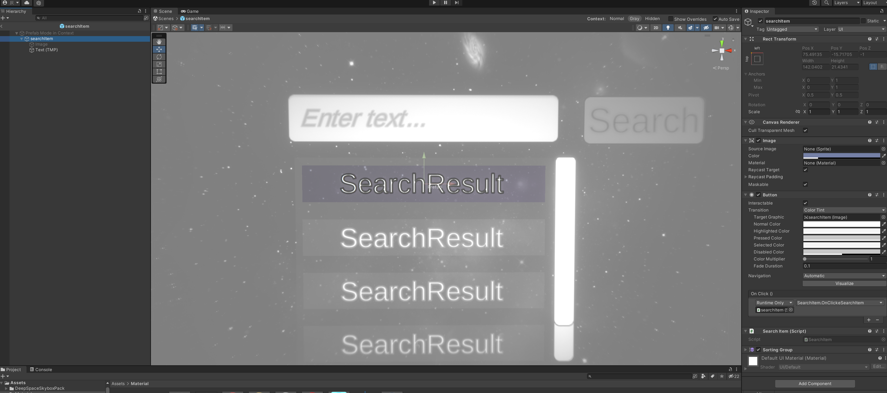

# Prefab本质初探

prefab的本质就是一个配置文件，一个YAML格式的配置文件，看下面这个例子：

这个预制体本体是一个Button，叫做searchItem，searchItem有两个子物体，一个是Image，一个是Text(TMP)



找到预制体文件，然后用打开文本文件的方法打开它：

```yaml
%YAML 1.1
%TAG !u! tag:unity3d.com,2011:
--- !u!1 &5613436317888334052
GameObject:
  m_ObjectHideFlags: 0
  m_CorrespondingSourceObject: {fileID: 0}
  m_PrefabInstance: {fileID: 0}
  m_PrefabAsset: {fileID: 0}
  serializedVersion: 6
  m_Component:

  - component: {fileID: 5613436317888334053}
  - component: {fileID: 5613436317888334055}
  - component: {fileID: 5613436317888334054}
  - component: {fileID: 1250347712723157288}
  - component: {fileID: 658214208917998453}
  - component: {fileID: 5511464330552917934}
    m_Layer: 5
      m_Name: searchItem
      m_TagString: Untagged
      m_Icon: {fileID: 0}
      m_NavMeshLayer: 0
      m_StaticEditorFlags: 0
      m_IsActive: 1
    --- !u!224 &5613436317888334053
    RectTransform:
      m_ObjectHideFlags: 0
      m_CorrespondingSourceObject: {fileID: 0}
      m_PrefabInstance: {fileID: 0}
      m_PrefabAsset: {fileID: 0}
      m_GameObject: {fileID: 5613436317888334052}
      m_LocalRotation: {x: 0, y: 0, z: 0, w: 1}
      m_LocalPosition: {x: 0, y: 0, z: -1}
      m_LocalScale: {x: 1, y: 1, z: 1}
      m_ConstrainProportionsScale: 0
      m_Children:
  - {fileID: 5412071507424372013}
  - {fileID: 5613436317986627680}
    m_Father: {fileID: 0}
      m_RootOrder: 0
      m_LocalEulerAnglesHint: {x: 0, y: 0, z: 0}
      m_AnchorMin: {x: 0, y: 0}
      m_AnchorMax: {x: 0, y: 0}
      m_AnchoredPosition: {x: 0, y: 0}
      m_SizeDelta: {x: 142.0402, y: 21.4341}
      m_Pivot: {x: 0.5, y: 0.5}
    --- !u!222 &5613436317888334055
    CanvasRenderer:
      m_ObjectHideFlags: 0
      m_CorrespondingSourceObject: {fileID: 0}
      m_PrefabInstance: {fileID: 0}
      m_PrefabAsset: {fileID: 0}
      m_GameObject: {fileID: 5613436317888334052}
      m_CullTransparentMesh: 1
    --- !u!114 &5613436317888334054
    MonoBehaviour:
      m_ObjectHideFlags: 0
      m_CorrespondingSourceObject: {fileID: 0}
      m_PrefabInstance: {fileID: 0}
      m_PrefabAsset: {fileID: 0}
      m_GameObject: {fileID: 5613436317888334052}
      m_Enabled: 1
      m_EditorHideFlags: 0
      m_Script: {fileID: 11500000, guid: fe87c0e1cc204ed48ad3b37840f39efc, type: 3}
      m_Name: 
      m_EditorClassIdentifier: 
      m_Material: {fileID: 0}
      m_Color: {r: 0.45852613, g: 0.50171864, b: 0.6509434, a: 0.19215687}
      m_RaycastTarget: 1
      m_RaycastPadding: {x: 0, y: 0, z: 0, w: 0}
      m_Maskable: 1
      m_OnCullStateChanged:
    m_PersistentCalls:
      m_Calls: []
      m_Sprite: {fileID: 0}
      m_Type: 0
      m_PreserveAspect: 0
      m_FillCenter: 1
      m_FillMethod: 4
      m_FillAmount: 1
      m_FillClockwise: 1
      m_FillOrigin: 0
      m_UseSpriteMesh: 0
      m_PixelsPerUnitMultiplier: 1
    --- !u!114 &1250347712723157288
    MonoBehaviour:
      m_ObjectHideFlags: 0
      m_CorrespondingSourceObject: {fileID: 0}
      m_PrefabInstance: {fileID: 0}
      m_PrefabAsset: {fileID: 0}
      m_GameObject: {fileID: 5613436317888334052}
      m_Enabled: 1
      m_EditorHideFlags: 0
      m_Script: {fileID: 11500000, guid: 4e29b1a8efbd4b44bb3f3716e73f07ff, type: 3}
      m_Name: 
      m_EditorClassIdentifier: 
      m_Navigation:
    m_Mode: 3
    m_WrapAround: 0
    m_SelectOnUp: {fileID: 0}
    m_SelectOnDown: {fileID: 0}
    m_SelectOnLeft: {fileID: 0}
    m_SelectOnRight: {fileID: 0}
      m_Transition: 1
      m_Colors:
    m_NormalColor: {r: 1, g: 1, b: 1, a: 1}
    m_HighlightedColor: {r: 0.9607843, g: 0.9607843, b: 0.9607843, a: 1}
    m_PressedColor: {r: 0.78431374, g: 0.78431374, b: 0.78431374, a: 1}
    m_SelectedColor: {r: 0.9607843, g: 0.9607843, b: 0.9607843, a: 1}
    m_DisabledColor: {r: 0.78431374, g: 0.78431374, b: 0.78431374, a: 0.5019608}
    m_ColorMultiplier: 1
    m_FadeDuration: 0.1
      m_SpriteState:
    m_HighlightedSprite: {fileID: 0}
    m_PressedSprite: {fileID: 0}
    m_SelectedSprite: {fileID: 0}
    m_DisabledSprite: {fileID: 0}
      m_AnimationTriggers:
    m_NormalTrigger: Normal
    m_HighlightedTrigger: Highlighted
    m_PressedTrigger: Pressed
    m_SelectedTrigger: Selected
    m_DisabledTrigger: Disabled
      m_Interactable: 1
      m_TargetGraphic: {fileID: 5613436317888334054}
      m_OnClick:
    m_PersistentCalls:
      m_Calls:
      - m_Target: {fileID: 658214208917998453}
        m_TargetAssemblyTypeName: SearchItem, Assembly-CSharp
        m_MethodName: OnClickeSearchItem
        m_Mode: 1
        m_Arguments:
          m_ObjectArgument: {fileID: 0}
          m_ObjectArgumentAssemblyTypeName: UnityEngine.Object, UnityEngine
          m_IntArgument: 0
          m_FloatArgument: 0
          m_StringArgument: 
          m_BoolArgument: 0
        m_CallState: 2
        --- !u!114 &658214208917998453
        MonoBehaviour:
          m_ObjectHideFlags: 0
          m_CorrespondingSourceObject: {fileID: 0}
          m_PrefabInstance: {fileID: 0}
          m_PrefabAsset: {fileID: 0}
          m_GameObject: {fileID: 5613436317888334052}
          m_Enabled: 1
          m_EditorHideFlags: 0
          m_Script: {fileID: 11500000, guid: b80779ce0ddf7054684376644acc3319, type: 3}
          m_Name: 
          m_EditorClassIdentifier: 
        --- !u!210 &5511464330552917934
        SortingGroup:
          m_ObjectHideFlags: 0
          m_CorrespondingSourceObject: {fileID: 0}
          m_PrefabInstance: {fileID: 0}
          m_PrefabAsset: {fileID: 0}
          m_GameObject: {fileID: 5613436317888334052}
          m_Enabled: 1
          m_SortingLayerID: -1625993563
          m_SortingLayer: 2
          m_SortingOrder: 0
        --- !u!1 &5613436317986627687
        GameObject:
          m_ObjectHideFlags: 0
          m_CorrespondingSourceObject: {fileID: 0}
          m_PrefabInstance: {fileID: 0}
          m_PrefabAsset: {fileID: 0}
          serializedVersion: 6
          m_Component:
  - component: {fileID: 5613436317986627680}
  - component: {fileID: 5613436317986627682}
  - component: {fileID: 5613436317986627681}
    m_Layer: 5
      m_Name: Text (TMP)
      m_TagString: Untagged
      m_Icon: {fileID: 0}
      m_NavMeshLayer: 0
      m_StaticEditorFlags: 0
      m_IsActive: 1
    --- !u!224 &5613436317986627680
    RectTransform:
      m_ObjectHideFlags: 0
      m_CorrespondingSourceObject: {fileID: 0}
      m_PrefabInstance: {fileID: 0}
      m_PrefabAsset: {fileID: 0}
      m_GameObject: {fileID: 5613436317986627687}
      m_LocalRotation: {x: -0, y: -0, z: -0, w: 1}
      m_LocalPosition: {x: 0, y: 0, z: -1.0009999}
      m_LocalScale: {x: 1, y: 1, z: 1}
      m_ConstrainProportionsScale: 0
      m_Children: []
      m_Father: {fileID: 5613436317888334053}
      m_RootOrder: 1
      m_LocalEulerAnglesHint: {x: 0, y: 0, z: 0}
      m_AnchorMin: {x: 0, y: 0}
      m_AnchorMax: {x: 1, y: 1}
      m_AnchoredPosition: {x: -1.381897, y: 0.21640015}
      m_SizeDelta: {x: -14.49, y: -3.6728}
      m_Pivot: {x: 0.5, y: 0.5}
    --- !u!222 &5613436317986627682
    CanvasRenderer:
      m_ObjectHideFlags: 0
      m_CorrespondingSourceObject: {fileID: 0}
      m_PrefabInstance: {fileID: 0}
      m_PrefabAsset: {fileID: 0}
      m_GameObject: {fileID: 5613436317986627687}
      m_CullTransparentMesh: 1
    --- !u!114 &5613436317986627681
    MonoBehaviour:
      m_ObjectHideFlags: 0
      m_CorrespondingSourceObject: {fileID: 0}
      m_PrefabInstance: {fileID: 0}
      m_PrefabAsset: {fileID: 0}
      m_GameObject: {fileID: 5613436317986627687}
      m_Enabled: 1
      m_EditorHideFlags: 0
      m_Script: {fileID: 11500000, guid: f4688fdb7df04437aeb418b961361dc5, type: 3}
      m_Name: 
      m_EditorClassIdentifier: 
      m_Material: {fileID: 0}
      m_Color: {r: 1, g: 1, b: 1, a: 1}
      m_RaycastTarget: 1
      m_RaycastPadding: {x: 0, y: 0, z: 0, w: 0}
      m_Maskable: 1
      m_OnCullStateChanged:
    m_PersistentCalls:
      m_Calls: []
      m_text: SearchResult
      m_isRightToLeft: 0
      m_fontAsset: {fileID: 11400000, guid: 8f586378b4e144a9851e7b34d9b748ee, type: 2}
      m_sharedMaterial: {fileID: 2180264, guid: 8f586378b4e144a9851e7b34d9b748ee, type: 2}
      m_fontSharedMaterials: []
      m_fontMaterial: {fileID: 0}
      m_fontMaterials: []
      m_fontColor32:
    serializedVersion: 2
    rgba: 4294967295
      m_fontColor: {r: 1, g: 1, b: 1, a: 1}
      m_enableVertexGradient: 0
      m_colorMode: 3
      m_fontColorGradient:
    topLeft: {r: 1, g: 1, b: 1, a: 1}
    topRight: {r: 1, g: 1, b: 1, a: 1}
    bottomLeft: {r: 1, g: 1, b: 1, a: 1}
    bottomRight: {r: 1, g: 1, b: 1, a: 1}
      m_fontColorGradientPreset: {fileID: 0}
      m_spriteAsset: {fileID: 0}
      m_tintAllSprites: 0
      m_StyleSheet: {fileID: 0}
      m_TextStyleHashCode: -1183493901
      m_overrideHtmlColors: 0
      m_faceColor:
    serializedVersion: 2
    rgba: 4294967295
      m_fontSize: 15.85
      m_fontSizeBase: 36
      m_fontWeight: 400
      m_enableAutoSizing: 1
      m_fontSizeMin: 10
      m_fontSizeMax: 30
      m_fontStyle: 0
      m_HorizontalAlignment: 2
      m_VerticalAlignment: 512
      m_textAlignment: 65535
      m_characterSpacing: 0
      m_wordSpacing: 0
      m_lineSpacing: 0
      m_lineSpacingMax: 0
      m_paragraphSpacing: 0
      m_charWidthMaxAdj: 0
      m_enableWordWrapping: 0
      m_wordWrappingRatios: 0.4
      m_overflowMode: 0
      m_linkedTextComponent: {fileID: 0}
      parentLinkedComponent: {fileID: 0}
      m_enableKerning: 1
      m_enableExtraPadding: 0
      checkPaddingRequired: 0
      m_isRichText: 1
      m_parseCtrlCharacters: 1
      m_isOrthographic: 1
      m_isCullingEnabled: 0
      m_horizontalMapping: 0
      m_verticalMapping: 0
      m_uvLineOffset: 0
      m_geometrySortingOrder: 0
      m_IsTextObjectScaleStatic: 0
      m_VertexBufferAutoSizeReduction: 0
      m_useMaxVisibleDescender: 1
      m_pageToDisplay: 1
      m_margin: {x: 0, y: 0, z: 0, w: 0}
      m_isUsingLegacyAnimationComponent: 0
      m_isVolumetricText: 0
      m_hasFontAssetChanged: 0
      m_baseMaterial: {fileID: 0}
      m_maskOffset: {x: 0, y: 0, z: 0, w: 0}
    --- !u!1 &8128235108551375545
    GameObject:
      m_ObjectHideFlags: 0
      m_CorrespondingSourceObject: {fileID: 0}
      m_PrefabInstance: {fileID: 0}
      m_PrefabAsset: {fileID: 0}
      serializedVersion: 6
      m_Component:
  - component: {fileID: 5412071507424372013}
  - component: {fileID: 687650936119042200}
  - component: {fileID: 506938306801352693}
    m_Layer: 5
      m_Name: Image
      m_TagString: Untagged
      m_Icon: {fileID: 0}
      m_NavMeshLayer: 0
      m_StaticEditorFlags: 0
      m_IsActive: 0
    --- !u!224 &5412071507424372013
    RectTransform:
      m_ObjectHideFlags: 0
      m_CorrespondingSourceObject: {fileID: 0}
      m_PrefabInstance: {fileID: 0}
      m_PrefabAsset: {fileID: 0}
      m_GameObject: {fileID: 8128235108551375545}
      m_LocalRotation: {x: 0, y: 0, z: 0, w: 1}
      m_LocalPosition: {x: 0, y: 0, z: 2}
      m_LocalScale: {x: 1, y: 1, z: 1}
      m_ConstrainProportionsScale: 0
      m_Children: []
      m_Father: {fileID: 5613436317888334053}
      m_RootOrder: 0
      m_LocalEulerAnglesHint: {x: 0, y: 0, z: 0}
      m_AnchorMin: {x: 0.5, y: 0.5}
      m_AnchorMax: {x: 0.5, y: 0.5}
      m_AnchoredPosition: {x: -0.000061035, y: -0.000020623}
      m_SizeDelta: {x: 142.04, y: 21.434}
      m_Pivot: {x: 0.5, y: 0.5}
    --- !u!222 &687650936119042200
    CanvasRenderer:
      m_ObjectHideFlags: 0
      m_CorrespondingSourceObject: {fileID: 0}
      m_PrefabInstance: {fileID: 0}
      m_PrefabAsset: {fileID: 0}
      m_GameObject: {fileID: 8128235108551375545}
      m_CullTransparentMesh: 1
    --- !u!114 &506938306801352693
    MonoBehaviour:
      m_ObjectHideFlags: 0
      m_CorrespondingSourceObject: {fileID: 0}
      m_PrefabInstance: {fileID: 0}
      m_PrefabAsset: {fileID: 0}
      m_GameObject: {fileID: 8128235108551375545}
      m_Enabled: 1
      m_EditorHideFlags: 0
      m_Script: {fileID: 11500000, guid: fe87c0e1cc204ed48ad3b37840f39efc, type: 3}
      m_Name: 
      m_EditorClassIdentifier: 
      m_Material: {fileID: 2100000, guid: 1df062edd8d4c924f9e269c526915809, type: 2}
      m_Color: {r: 0.3185, g: 0.6708437, b: 0.8301887, a: 1}
      m_RaycastTarget: 1
      m_RaycastPadding: {x: 0, y: 0, z: 0, w: 0}
      m_Maskable: 1
      m_OnCullStateChanged:
    m_PersistentCalls:
      m_Calls: []
      m_Sprite: {fileID: 0}
      m_Type: 0
      m_PreserveAspect: 0
      m_FillCenter: 1
      m_FillMethod: 4
      m_FillAmount: 1
      m_FillClockwise: 1
      m_FillOrigin: 0
      m_UseSpriteMesh: 0
      m_PixelsPerUnitMultiplier: 1
```

我们用GPT解释一下这个预制体文件：

> 这段YAML文件是一个Unity 3D对象的配置文件，它描述了一个包含多个组件的`GameObject`。以下是一些关键部分的解释：
>
> 1. **GameObject (ID: 5613436317888334052)**：
>    - 这是整个对象的定义，包含多个组件（`component`），每个组件对应一个唯一的`fileID`。
>    - `m_Name`字段设定为`searchItem`。
>    - `m_IsActive: 1`表明这个对象是激活的。
> 2. **组件 (component)**：
>    - `RectTransform`：定义了对象的空间位置、旋转和缩放信息。
>    - `CanvasRenderer`：用于渲染UI元素，`m_CullTransparentMesh: 1`表示会剔除透明网格。
>    - `MonoBehaviour`：包含自定义脚本的引用（`m_Script`包含脚本的`guid`），以及与脚本相关的属性，如颜色（`m_Color`）。
>    - `SortingGroup`：控制排序层和排序顺序。
> 3. **第二个GameObject (ID: 5613436317986627687)**：
>    - 这是另一个对象，组件包括`RectTransform`、`CanvasRenderer`和`MonoBehaviour`。
>    - 其`MonoBehaviour`部分包含文本`SearchResult`，这表明这是一个文本对象。
>    - 文字的字体、颜色、字体大小、对齐方式等信息都在该部分中定义。
> 4. **子GameObject (ID: 8128235108551375545)**：
>    - 这是一个子对象，命名为`Image`。
>    - 包含一个`RectTransform`、`CanvasRenderer`和`MonoBehaviour`。
>    - `MonoBehaviour`部分设置了`m_Color`为一种蓝绿色，并带有透明度，这可能是一个图像的组件。

用字符码表示一下文件的结构：
```
GameObject (ID: 5613436317888334052)
│
├── m_Name: searchItem
├── m_IsActive: 1
└── Components:
    ├── RectTransform (ID: 5613436317888334053)
    │   ├── m_LocalPosition: {x: 0, y: 0, z: -1}
    │   ├── m_SizeDelta: {x: 142.0402, y: 21.4341}
    │   └── m_Pivot: {x: 0.5, y: 0.5}
    │
    ├── CanvasRenderer (ID: 5613436317888334055)
    │   └── m_CullTransparentMesh: 1
    │
    ├── MonoBehaviour (ID: 5613436317888334054)
    │   ├── m_Color: {r: 0.45852613, g: 0.50171864, b: 0.6509434, a: 0.19215687}
    │   └── m_RaycastTarget: 1
    │
    ├── MonoBehaviour (ID: 1250347712723157288)
    │   ├── m_Transition: 1
    │   └── m_OnClick:
    │       └── m_Target: SearchItem, Assembly-CSharp
    │
    ├── MonoBehaviour (ID: 658214208917998453)
    │   └── m_Script: {fileID: 11500000, guid: b80779ce0ddf7054684376644acc3319, type: 3}
    │
    └── SortingGroup (ID: 5511464330552917934)
        ├── m_SortingLayerID: -1625993563
        └── m_SortingOrder: 0

GameObject (ID: 5613436317986627687)
│
├── m_Name: Text (TMP)
├── m_IsActive: 1
└── Components:
    ├── RectTransform (ID: 5613436317986627680)
    │   ├── m_LocalPosition: {x: 0, y: 0, z: -1.0009999}
    │   └── m_SizeDelta: {x: -14.49, y: -3.6728}
    │
    ├── CanvasRenderer (ID: 5613436317986627682)
    │   └── m_CullTransparentMesh: 1
    │
    └── MonoBehaviour (ID: 5613436317986627681)
        ├── m_text: SearchResult
        ├── m_fontAsset: {guid: 8f586378b4e144a9851e7b34d9b748ee}
        └── m_fontSize: 15.85

GameObject (ID: 8128235108551375545)
│
├── m_Name: Image
├── m_IsActive: 0
└── Components:
    ├── RectTransform (ID: 5412071507424372013)
    │   ├── m_LocalPosition: {x: 0, y: 0, z: 2}
    │   └── m_SizeDelta: {x: 142.04, y: 21.434}
    │
    ├── CanvasRenderer (ID: 687650936119042200)
    │   └── m_CullTransparentMesh: 1
    │
    └── MonoBehaviour (ID: 506938306801352693)
        ├── m_Material: {guid: 1df062edd8d4c924f9e269c526915809}
        └── m_Color: {r: 0.3185, g: 0.6708437, b: 0.8301887, a: 1}

```


Image组件被设置为Active：false因此它的m_IsActive字段就标记为false

m_Name字段和图中GameObject的名字是对应的

来看这个：

```
GameObject (ID: 5613436317888334052)
│
├── m_Name: searchItem
├── m_IsActive: 1
└── Components:
    ├── RectTransform (ID: 5613436317888334053)
    │   ├── m_LocalPosition: {x: 0, y: 0, z: -1}
    │   ├── m_SizeDelta: {x: 142.0402, y: 21.4341}
    │   └── m_Pivot: {x: 0.5, y: 0.5}
    │
    ├── CanvasRenderer (ID: 5613436317888334055)
    │   └── m_CullTransparentMesh: 1
    │
    ├── MonoBehaviour (ID: 5613436317888334054)
    │   ├── m_Color: {r: 0.45852613, g: 0.50171864, b: 0.6509434, a: 0.19215687}
    │   └── m_RaycastTarget: 1
    │
    ├── MonoBehaviour (ID: 1250347712723157288)
    │   ├── m_Transition: 1
    │   └── m_OnClick:
    │       └── m_Target: SearchItem, Assembly-CSharp
    │
    ├── MonoBehaviour (ID: 658214208917998453)
    │   └── m_Script: {fileID: 11500000, guid: b80779ce0ddf7054684376644acc3319, type: 3}
    │
    └── SortingGroup (ID: 5511464330552917934)
        ├── m_SortingLayerID: -1625993563
        └── m_SortingOrder: 0
```

第一个MonoBehaviour对应的是Image组件，m_RaycastTarget表示的是设置是不是会被Raycast相应

第二个MonoBehaviour对应的是Button组件。可以看到它的OnClick被设置为SearchItem里的方法，SearchItem是我自己定义的MonoBehaviour的Component

第三个MonoBehaviour对应的就是SearchItem组件。

```c#
using System.Collections;
using System.Collections.Generic;
using UnityEngine;

public class SearchItem : MonoBehaviour
{
    private string itemName;
    private Vector3 offset = new Vector3(20, 20, 20);
    private Vector3 verticalOffset = new Vector3(0, -0, 0);
    public void SetItemName(string str)
    {
        itemName = str;
    }
    public void OnClickeSearchItem()
    {
        Debug.Log(itemName);
        GameObject obj= GameObject.Find(itemName);
        SearchBar.Instance.SetSelectedStar(obj);

        Camera.main.transform.position = obj.transform.position+ offset+ verticalOffset;

        Vector3 towardsTo = (obj.transform.position- Camera.main.transform.position).normalized;
        
        Camera.main.transform.forward = towardsTo;
 
        SearchBar.Instance.SetSelectedStarActive();
        //Camera.main.transform.rotation*=
    }

```

