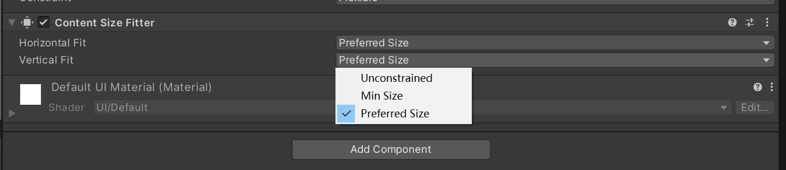

# UGUI阅读笔记

https://zhuanlan.zhihu.com/p/3445975684

https://zhuanlan.zhihu.com/p/2583367098

## UGUI架构

https://www.bilibili.com/video/BV17W4y1d7dY/

绘制，事件系统，射线检测，合批


## Pivot和Anchor

实际上，在Editor当中，是根据Anchor的四个点设置RecTransform。是相对于父节点的位置

而在实际渲染当中，UGUI会把这个相对的位置转换成相对于Pivot为原点的坐标系下。并且进行渲染。

在编辑器中，Piviot是移动，旋转的中心


这四个其实是一起看的，对应的分别是子物体的四个边（上下左右）相对于Anchor四个点围成的四个边的相对位置


1. 这种情况，表示子物体纵向大小不随父节点变化，而横向有比例缩放。这时候，右下表示的就是Height，即子节点的高度（绝对）。而右上则是Pivot距离父节点相对节点的位置。

或者这样思考：Anchor表示的是，子节点相对于父物体的相对位置。在这个例子中，首先横向是有规定的，因此确定子节点left和right两个边的具体位置，只需要根据Anchor的left和right的位置即可

但是我们思考纵向，确定位置需要两个信息：1. 长度 2.参考边。所以Height在这里确定的就是长度。而参考边如何给出？就是根据Pivot（根据子节点自身为参考系的原点）相对于Anchor那一条线的位置。


所以，无论纵向怎么拉伸，子节点相对父节点Anchor的位置以及长度都是不变的。


但是纵向一拉就变了。

所以同理，如果Anchor都拉开了，那么其实就不需要Pivot来确定子UI的位置了。它只是用来确定一个位移和旋转的中心罢了

### **1. Anchor（锚点）**

- Anchor 是 UI 元素相对于父容器的位置参考点

  。

  - **Anchor** 决定了 UI 元素在父容器中的对齐方式（左对齐、右对齐、居中等）。
  - 它还可以定义元素在父容器中的伸缩规则（是否跟随父容器拉伸）。

#### **比喻：Anchor 就像地图上的定位点**

想象一个房间（父容器），Anchor 是你在房间里确定 UI 元素放在哪里的“参考点”。例如：

- **左下角**：Anchor 在父容器的左下角，UI 元素的位置基于父容器左下角计算。
- **中心点**：Anchor 在父容器的中心，UI 元素的位置基于父容器中心计算。

#### **Anchor 示例**：

- Anchor 设置为左上角：
  - 元素的位置是相对于左上角的。
- Anchor 设置为中心：
  - 元素的位置是相对于父容器的中心点的。

------

### **2. Pivot（枢轴点）**

- Pivot 是 UI 元素自身的中心点

  ，用于控制元素的

  旋转

  和

  缩放中心

  。

  - Pivot 影响的是 UI 元素自身（本地坐标）的变换行为。
  - Pivot 的位置决定了旋转、缩放、定位等操作围绕哪个点进行。

#### **比喻：Pivot 就像物体的转轴**

想象你拿着一张纸（UI 元素），Pivot 是你手指按住纸的位置：

- **Pivot 在中心**：旋转时，纸张绕中心旋转。
- **Pivot 在左下角**：旋转时，纸张绕左下角旋转。

------

### **Anchor 和 Pivot 的区别**

| 属性         | Anchor（锚点）                                       | Pivot（枢轴点）                     |
| ------------ | ---------------------------------------------------- | ----------------------------------- |
| **作用范围** | 父容器，决定 UI 元素相对于父容器的对齐方式和位置计算 | UI 元素自身，决定旋转和缩放的中心点 |
| **参考点**   | 参考父容器的坐标系统                                 | 参考 UI 元素自己的坐标系统          |
| **控制内容** | UI 元素的位置和拉伸                                  | UI 元素的变换中心                   |


## Graph

### Image

绘制基类：Graphic

```c#
    /// <summary>
    /// Set all properties of the Graphic dirty and needing rebuilt.
    /// Dirties Layout, Vertices, and Materials.
    /// </summary>
    public virtual void SetAllDirty()
    {
        // Optimization: Graphic layout doesn't need recalculation if
        // the underlying Sprite is the same size with the same texture.
        // (e.g. Sprite sheet texture animation)

        if (m_SkipLayoutUpdate)
        {
            m_SkipLayoutUpdate = false;
        }
        else
        {
            SetLayoutDirty();
        }

        if (m_SkipMaterialUpdate)
        {
            m_SkipMaterialUpdate = false;
        }
        else
        {
            SetMaterialDirty();
        }

        SetVerticesDirty();
        SetRaycastDirty();
    }
```

当 UI 元素的属性（如颜色、尺寸、材质、图像等）发生变化时，需要调用 `SetAllDirty()` 来确保这些变化能够正确地反映在 UI 上。例如：

```c#
// 修改 Image 组件的颜色
image.color = Color.red;
image.SetAllDirty();
```

如果创建了自定义的 **Graphic** 组件，并在脚本中动态修改了其属性（如自定义顶点数据），则需要调用 `SetAllDirty()` 来确保自定义渲染逻辑能够正确执行。

#### 例子1：设置颜色

```c#
public class SetColor : MonoBehaviour
{
    [SerializeField] private Image image;
    [SerializeField] private Button button;
    // Start is called before the first frame update
    void Start()
    {
        button.onClick.AddListener(() =>
        {
            Set();
        });
    }
    void Set()
    {
        image.color = Color.green; //  <==== 断点
    }
}
```

点击button之后，跳转到这里，然后点进去

```c#
//Graphic.cs
public virtual Color color { 
    get { return m_Color; } 
    set { 
        	if (SetPropertyUtility.SetColor(ref m_Color, value))  
                SetVerticesDirty(); //  <==== 断点
    } 
}
```

```c#
        public virtual void SetVerticesDirty()
        {
            if (!IsActive())
                return;

            m_VertsDirty = true;
            CanvasUpdateRegistry.RegisterCanvasElementForGraphicRebuild(this); //  <==== 断点

            if (m_OnDirtyVertsCallback != null)
                m_OnDirtyVertsCallback();
        }
```

```c#
        public static void RegisterCanvasElementForGraphicRebuild(ICanvasElement element)
        {
            instance.InternalRegisterCanvasElementForGraphicRebuild(element);  //  <==== 断点：注册了什么
        }
```

```c#
        private bool InternalRegisterCanvasElementForGraphicRebuild(ICanvasElement element)
        {
            if (m_PerformingGraphicUpdate)
            {
                Debug.LogError(string.Format("Trying to add {0} for graphic rebuild while we are already inside a graphic rebuild loop. This is not supported.", element));
                return false;
            }

            return m_GraphicRebuildQueue.AddUnique(element); //<==断点:添加到了一个m_GraphicRebuildQueue的队列
        }
```

我们发现，当我们在运行时修改UI颜色的时候，这个UI组件被添加到了一个m_GraphicRebuildQueue的队列。


而经过查找，这个队列最终在一个叫做PerformUpdate的函数里面被使用：（注意这个函数在游戏刚运行，绘制所有UI的时候也会被调用，它每一帧都会被调用，并且针对每个UI都会Check。如果没有需要更新的东西，每个Canvas的m_GraphicRebuildQueue都会是空的。静态的不变化的UI，就不会再被它重绘了）

（假设好几个Canvas，他们上的UI都会被放在同一个全局的m_GraphicRebuildQueue。CanvasUpdate.PostLayout;这些代表的是渲染阶段）

```c#
public enum CanvasUpdate
{
    Prelayout = 0,      // 布局更新之前
    Layout,             // 布局更新
    PostLayout,         // 布局更新之后
    PreRender,          // 渲染更新之前
    LatePreRender,     // 渲染更新的后期
    MaxUpdateValue      // 最大更新值，用于标记循环结束
}

```


```c#
 private void PerformUpdate()
        {
            UISystemProfilerApi.BeginSample(UISystemProfilerApi.SampleType.Layout);
            CleanInvalidItems();

            m_PerformingLayoutUpdate = true;

            m_LayoutRebuildQueue.Sort(s_SortLayoutFunction);

            for (int i = 0; i <= (int)CanvasUpdate.PostLayout; i++)
            {
                UnityEngine.Profiling.Profiler.BeginSample(m_CanvasUpdateProfilerStrings[i]);

                for (int j = 0; j < m_LayoutRebuildQueue.Count; j++)
                {
                    var rebuild = m_LayoutRebuildQueue[j];
                    try
                    {
                        if (ObjectValidForUpdate(rebuild))
                            rebuild.Rebuild((CanvasUpdate)i);
                    }
                    catch (Exception e)
                    {
                        Debug.LogException(e, rebuild.transform);
                    }
                }
                UnityEngine.Profiling.Profiler.EndSample();
            }

            for (int i = 0; i < m_LayoutRebuildQueue.Count; ++i)
                m_LayoutRebuildQueue[i].LayoutComplete();

            m_LayoutRebuildQueue.Clear();
            m_PerformingLayoutUpdate = false;
            UISystemProfilerApi.EndSample(UISystemProfilerApi.SampleType.Layout);
            UISystemProfilerApi.BeginSample(UISystemProfilerApi.SampleType.Render);

            // now layout is complete do culling...
            UnityEngine.Profiling.Profiler.BeginSample(m_CullingUpdateProfilerString);
            ClipperRegistry.instance.Cull();
            UnityEngine.Profiling.Profiler.EndSample();

            m_PerformingGraphicUpdate = true;

            for (var i = (int)CanvasUpdate.PreRender; i < (int)CanvasUpdate.MaxUpdateValue; i++)
            {
                UnityEngine.Profiling.Profiler.BeginSample(m_CanvasUpdateProfilerStrings[i]);
                for (var k = 0; k < m_GraphicRebuildQueue.Count; k++)
                {
                    try
                    {
                        var element = m_GraphicRebuildQueue[k];
                        if (ObjectValidForUpdate(element))
                            element.Rebuild((CanvasUpdate)i); //<==看这里
                    }
                    catch (Exception e)
                    {
                        Debug.LogException(e, m_GraphicRebuildQueue[k].transform);
                    }
                }
                UnityEngine.Profiling.Profiler.EndSample();
            }

            for (int i = 0; i < m_GraphicRebuildQueue.Count; ++i)
                m_GraphicRebuildQueue[i].GraphicUpdateComplete();

            m_GraphicRebuildQueue.Clear();
            m_PerformingGraphicUpdate = false;
            UISystemProfilerApi.EndSample(UISystemProfilerApi.SampleType.Render);
        }
```

在PerformUpdate里面，有这样一块代码：

```c#
                        var element = m_GraphicRebuildQueue[k];
                        if (ObjectValidForUpdate(element))
                            element.Rebuild((CanvasUpdate)i); //<==看这里
```

需要被更新的UI组件被从Rebuild队列中取出来，然后对element调用Rebuild函数

这个Rebuild函数，继承自`ICanvasElement`接口

```c#
    public interface ICanvasElement
    {
        /// <summary>
        /// Rebuild the element for the given stage.
        /// </summary>
        /// <param name="executing">The current CanvasUpdate stage being rebuild.</param>
        void Rebuild(CanvasUpdate executing);
    	//...
    }
```

`Graphic`类实现了`ICanvasElement`接口

```c#
public virtual void Rebuild(CanvasUpdate update)
        {
            if (canvasRenderer == null || canvasRenderer.cull)
                return;

            switch (update)
            {
                case CanvasUpdate.PreRender:
                    if (m_VertsDirty) //<==true
                    {
                        UpdateGeometry();  //<==走这条线
                        m_VertsDirty = false;
                    }
                    if (m_MaterialDirty)
                    {
                        UpdateMaterial();
                        m_MaterialDirty = false;
                    }
                    break;
            }
        }
```

进入`UpdateGeometry()`

```c#
        protected virtual void UpdateGeometry()
        {
            if (useLegacyMeshGeneration)
            {
                DoLegacyMeshGeneration();
            }
            else
            {
                DoMeshGeneration();	//<==走这条线
            }
        }
```

```c#
        private void DoMeshGeneration()
        {
            if (rectTransform != null && rectTransform.rect.width >= 0 && rectTransform.rect.height >= 0)
                OnPopulateMesh(s_VertexHelper);		//<============走这条线
            else
                s_VertexHelper.Clear(); // clear the vertex helper so invalid graphics dont draw.

            var components = ListPool<Component>.Get();
            GetComponents(typeof(IMeshModifier), components);

            for (var i = 0; i < components.Count; i++)
                ((IMeshModifier)components[i]).ModifyMesh(s_VertexHelper);

            ListPool<Component>.Release(components);

            s_VertexHelper.FillMesh(workerMesh);
            canvasRenderer.SetMesh(workerMesh);
        }
```

在`OnPopulateMesh`，当中会根据我们在面板当中选择的Image的Image Type，构建Image


```c#
        protected override void OnPopulateMesh(VertexHelper toFill) //这是个虚函数，继承自Graphic
        {
            if (activeSprite == null)
            {
                base.OnPopulateMesh(toFill);
                return;
            }

            switch (type)
            {
                case Type.Simple:
                    if (!useSpriteMesh)
                        GenerateSimpleSprite(toFill, m_PreserveAspect);
                    else
                        GenerateSprite(toFill, m_PreserveAspect);
                    break;
                case Type.Sliced:
                    GenerateSlicedSprite(toFill);
                    break;
                case Type.Tiled:
                    GenerateTiledSprite(toFill);
                    break;
                case Type.Filled:
                    GenerateFilledSprite(toFill, m_PreserveAspect);
                    break;
            }
        }
```

```c#
        void GenerateSimpleSprite(VertexHelper vh, bool lPreserveAspect)
        {
            Vector4 v = GetDrawingDimensions(lPreserveAspect);
            var uv = (activeSprite != null) ? Sprites.DataUtility.GetOuterUV(activeSprite) : Vector4.zero;

            var color32 = color;  //<===颜色更新
            vh.Clear();
            vh.AddVert(new Vector3(v.x, v.y), color32, new Vector2(uv.x, uv.y));
            vh.AddVert(new Vector3(v.x, v.w), color32, new Vector2(uv.x, uv.w));
            vh.AddVert(new Vector3(v.z, v.w), color32, new Vector2(uv.z, uv.w));
            vh.AddVert(new Vector3(v.z, v.y), color32, new Vector2(uv.z, uv.y));

            vh.AddTriangle(0, 1, 2);
            vh.AddTriangle(2, 3, 0);
        }

```

到此，颜色被更新。

这里有个问题，PerformUpdate是如何被调用的？

```c#
       protected CanvasUpdateRegistry()
        {
            Canvas.willRenderCanvases += PerformUpdate;
        }
```

它是被 Canvas.willRenderCanvases这个事件注册的

```c#
//UnityEngine.Canvas
 public static event WillRenderCanvases willRenderCanvases;
```

这个事件是在Canvas被绘制之前被触发的

验证了一下这个事件什么时候会被触发：

```c#
        protected CanvasUpdateRegistry()
        {
            Canvas.willRenderCanvases += OnCanvas_willRenderCanvases;
            Canvas.willRenderCanvases += PerformUpdate;
        }

        private void OnCanvas_willRenderCanvases()
        {
            Debug.Log("Canvas.willRenderCanvases");
        }

```

可以发现，在play的时候，每个Update都会被调用一次，并且在edit模式，当鼠标移动或者有一些可视化效果更新的时候也会触发这个事件


#### 分析一下`GenerateSimpleSprite`

```c#
    void GenerateSimpleSprite(VertexHelper vh, bool lPreserveAspect)
    {
        Vector4 v = GetDrawingDimensions(lPreserveAspect);
        Debug.Log(v);
        var uv = (activeSprite != null) ? Sprites.DataUtility.GetOuterUV(activeSprite) : Vector4.zero;

        var color32 = color;
        vh.Clear();
        vh.AddVert(new Vector3(v.x, v.y), color32, new Vector2(uv.x, uv.y));
        vh.AddVert(new Vector3(v.x, v.w), color32, new Vector2(uv.x, uv.w));
        vh.AddVert(new Vector3(v.z, v.w), color32, new Vector2(uv.z, uv.w));
        vh.AddVert(new Vector3(v.z, v.y), color32, new Vector2(uv.z, uv.y));

        vh.AddTriangle(0, 1, 2);
        vh.AddTriangle(2, 3, 0);
    }
```

**方法概述**

```c#
void GenerateSimpleSprite(VertexHelper vh, bool lPreserveAspect)
{
    Vector4 v = GetDrawingDimensions(lPreserveAspect);
    var uv = (activeSprite != null) ? Sprites.DataUtility.GetOuterUV(activeSprite) : Vector4.zero;

    var color32 = color;
    vh.Clear();
    vh.AddVert(new Vector3(v.x, v.y), color32, new Vector2(uv.x, uv.y));
    vh.AddVert(new Vector3(v.x, v.w), color32, new Vector2(uv.x, uv.w));
    vh.AddVert(new Vector3(v.z, v.w), color32, new Vector2(uv.z, uv.w));
    vh.AddVert(new Vector3(v.z, v.y), color32, new Vector2(uv.z, uv.y));

    vh.AddTriangle(0, 1, 2);
    vh.AddTriangle(2, 3, 0);
}
```

**参数说明**

- **`VertexHelper vh`**: 用于构建顶点和三角形的辅助类。`VertexHelper` 提供了一系列方法来简化网格的创建和操作。
- **`bool lPreserveAspect`**: 一个布尔值，指示是否在生成网格时保持精灵的纵横比。

**方法步骤详解**

1. **获取绘制区域的维度**

   ```c#
   Vector4 v = GetDrawingDimensions(lPreserveAspect);
   ```

   - **`GetDrawingDimensions`** 方法根据当前 UI 元素的大小和 `lPreserveAspect` 参数，计算出绘制区域的四个边界（左、下、右、上）。
   - 返回的 `Vector4` 通常包含四个值：`x`（左边界）、`y`（下边界）、`z`（右边界）、`w`（上边界）。
   - 这四个值，是相对于RectTransform的局部坐标系，其中心点由Pivot决定，大小由Width，Height决定

   > 比如在这个例子里：Pivot在0.5，0.5的位置，也就是长度的中心和宽度的中心位置，而长宽一个是300一个是100
   >
   > 
   >
   > 因此，这个Vector4就是以Pivot为中心，横纵坐标分别偏移Width/2和Height/2（注意，这里存在一点误差是因为有padding）
   >
   > 
   >
   > 如果我把Pivot的X改为0，那么Y上的偏移不变，而X的偏移是从最左侧开始的：
   > 

2. **获取精灵的 UV 映射**

   ```csharp
   var uv = (activeSprite != null) ? Sprites.DataUtility.GetOuterUV(activeSprite) : Vector4.zero;
   ```

   - **`activeSprite`**: 当前 `Graphic` 组件使用的精灵（Sprite）。
   - **`Sprites.DataUtility.GetOuterUV(activeSprite)`**: 获取精灵在纹理中的外部 UV 坐标。UV 坐标用于将纹理正确映射到网格顶点。
   - 如果没有设置 `activeSprite`，则 UV 坐标默认为 `Vector4.zero`（全为零），这意味着没有纹理映射。

3. **获取当前颜色**

   ```csharp
   var color32 = color;
   ```

   - **`color`**: `Graphic` 组件的颜色属性。所有顶点将使用此颜色进行渲染。

4. **清空现有的顶点数据**

   ```csharp
   vh.Clear();
   ```

   - 清除 `VertexHelper` 中已有的顶点和三角形数据，准备添加新的顶点和三角形。

5. **添加四个顶点**

   ```csharp
   vh.AddVert(new Vector3(v.x, v.y), color32, new Vector2(uv.x, uv.y));
   vh.AddVert(new Vector3(v.x, v.w), color32, new Vector2(uv.x, uv.w));
   vh.AddVert(new Vector3(v.z, v.w), color32, new Vector2(uv.z, uv.w));
   vh.AddVert(new Vector3(v.z, v.y), color32, new Vector2(uv.z, uv.y));
   ```

   - 每个 `AddVert` 调用添加一个顶点，参数分别为：
     - **位置 (`Vector3`)**: 顶点在局部空间中的位置。这里使用 `v` 中的边界值来定义矩形的四个角。
     - **颜色 (`Color32`)**: 顶点的颜色，所有顶点使用相同的颜色。
     - **UV 坐标 (`Vector2`)**: 顶点的纹理坐标，用于将精灵纹理正确映射到顶点。
   - 添加的四个顶点分别对应矩形的四个角：
     1. 左下角 (`v.x`, `v.y`)
     2. 左上角 (`v.x`, `v.w`)
     3. 右上角 (`v.z`, `v.w`)
     4. 右下角 (`v.z`, `v.y`)

6. **添加两组三角形以形成一个矩形**

   ```csharp
   vh.AddTriangle(0, 1, 2);
   vh.AddTriangle(2, 3, 0);
   ```

   - 使用顶点索引创建两个三角形：
     - 第一个三角形：顶点 0、1、2（左下、左上、右上）
     - 第二个三角形：顶点 2、3、0（右上、右下、左下）
   - 这两个三角形共同组成一个矩形，用于渲染精灵图像。

小小调试一下：

```c#
            vh.AddVert(new Vector3(v.x, v.y), color32, new Vector2(uv.x, uv.y));
            vh.AddVert(new Vector3(v.x, v.w), color32, new Vector2(uv.x, uv.w));
            vh.AddVert(new Vector3(v.z, v.w), color32, new Vector2(uv.z, uv.w));
            //vh.AddVert(new Vector3(v.z, v.y), color32, new Vector2(uv.z, uv.y));

            vh.AddTriangle(0, 1, 2);
            //vh.AddTriangle(2, 3, 0);
```


图片就只有一个三角形了

#### 分析一下`GetDrawingDimensions`

```c#
private Vector4 GetDrawingDimensions(bool shouldPreserveAspect)
{
    var padding = activeSprite == null ? Vector4.zero : Sprites.DataUtility.GetPadding(activeSprite);
    Debug.Log("padding:" + padding);
    var size = activeSprite == null ? Vector2.zero : new Vector2(activeSprite.rect.width, activeSprite.rect.height);
	//size:真实图片大小
    Rect r = GetPixelAdjustedRect();
    // Debug.Log(string.Format("r:{2}, size:{0}, padding:{1}", size, padding, r));

    int spriteW = Mathf.RoundToInt(size.x);
    int spriteH = Mathf.RoundToInt(size.y);

    var v = new Vector4(
        padding.x / spriteW,
        padding.y / spriteH,
        (spriteW - padding.z) / spriteW,
        (spriteH - padding.w) / spriteH);

    if (shouldPreserveAspect && size.sqrMagnitude > 0.0f)
    {
        PreserveSpriteAspectRatio(ref r, size);
    }

    v = new Vector4(
        r.x + r.width * v.x,
        r.y + r.height * v.y,
        r.x + r.width * v.z,
        r.y + r.height * v.w
    );

    return v;
}
```

**方法功能**

**`GetDrawingDimensions`** 方法的主要功能是计算一个 UI 元素在屏幕上的绘制区域，考虑了精灵的内边距和是否需要保持纵横比。返回的 **`Vector4`** 包含四个值，分别代表绘制区域的 **左边界（Left）**、**下边界（Bottom）**、**右边界（Right）** 和 **上边界（Top）**，这些边界值是相对于 **RectTransform** 的局部坐标系的。


**代码详解**

**1. 获取内边距（Padding）**

```c#
var padding = activeSprite == null ? Vector4.zero : Sprites.DataUtility.GetPadding(activeSprite);
Debug.Log("padding:" + padding);
```

- **`activeSprite`**：当前 `Graphic` 组件使用的精灵。如果没有设置精灵，则为 `null`。
- **`Sprites.DataUtility.GetPadding(activeSprite)`**：获取精灵的内边距信息。内边距通常用于定义精灵的非绘制区域，常见于带有九宫格（9-slice）切割的精灵。
- **`Vector4.zero`**：如果没有设置精灵，默认内边距为零。
- x,y,z,w分别代表绘制区域的 **左边界（Left）**、**下边界（Bottom）**、**右边界（Right）** 和 **上边界（Top）**，这些边界值是相对于 **RectTransform** 的局部坐标系的。

**2. 获取精灵的尺寸**

```c#
var size = activeSprite == null ? Vector2.zero : new Vector2(activeSprite.rect.width, activeSprite.rect.height);
```

- **`size`**：获取精灵的宽度和高度。如果没有精灵，尺寸为零。

**3. 获取调整后的矩形区域**

```c#
Rect r = GetPixelAdjustedRect();
// Debug.Log(string.Format("r:{2}, size:{0}, padding:{1}", size, padding, r));
```

- **`GetPixelAdjustedRect()`**：获取 UI 元素的像素调整后的矩形区域。该方法考虑了 Canvas 的缩放和像素对齐等因素，确保绘制区域精确。
- **Rect 的组成**：
  - **`x`**：左边界相对于 Pivot 点的水平偏移。
  - **`y`**：下边界相对于 Pivot 点的垂直偏移。
  - 

**4. 计算精灵的宽度和高度（整数值）**

```c#
int spriteW = Mathf.RoundToInt(size.x);
int spriteH = Mathf.RoundToInt(size.y);
```

- **`spriteW` 和 `spriteH`**：将精灵的宽度和高度四舍五入为整数值，便于后续计算。

**5. 计算内边距比例**

```c#
 var v = new Vector4(
                padding.x / spriteW,                //左
                padding.y / spriteH,                //下
                (spriteW - padding.z) / spriteW,    //右（相对于左）
                (spriteH - padding.w) / spriteH);   //上（相对于下）
```

- **`v.x`（Left）**：左内边距占精灵宽度的比例。
- **`v.y`（Bottom）**：下内边距占精灵高度的比例。
- **`v.z`（Right）**：精灵宽度减去右内边距，再除以精灵宽度，得到右边界的比例。
- **`v.w``（Top）**：精灵高度减去上内边距，再除以精灵高度，得到上边界的比例。
- 这里可能有个疑惑，就是为什么前两个算的是直接的比例（padding宽度/整体宽度），而后两个要先用(宽度-padding)的宽度。实际上，这个padding的比例是相对于左和下的。也就是如下图：


这种比例计算方式有助于在不同分辨率和缩放情况下保持内边距的一致性。

**6. 保持纵横比（如果需要）**

```c#
if (shouldPreserveAspect && size.sqrMagnitude > 0.0f)
{
    PreserveSpriteAspectRatio(ref r, size);
}
```

- **`shouldPreserveAspect`**：布尔参数，指示是否需要保持精灵的纵横比。
- **`size.sqrMagnitude > 0.0f`**：确保精灵尺寸不为零，避免除以零错误。
- **`PreserveSpriteAspectRatio(ref r, size)`**：根据精灵的尺寸调整矩形区域 `r`，以保持纵横比。该方法通常会在 `Graphic` 类或其子类中定义，用于调整 `Rect` 的宽高比。

**7. 计算最终的绘制边界**

```c#
v = new Vector4(
    r.x + r.width * v.x,
    r.y + r.height * v.y,
    r.x + r.width * v.z,
    r.y + r.height * v.w
);
```

- 计算方式

  - **左边界（Left）**：`r.x`（矩形的左边起点）加上 `r.width * v.x`（内边距比例乘以矩形宽度）。
  - **下边界（Bottom）**：`r.y`（矩形的下边起点）加上 `r.height * v.y`（内边距比例乘以矩形高度）。
  - **右边界（Right）**：`r.x` 加上 `r.width * v.z`。
  - **上边界（Top）**：`r.y` 加上 `r.height * v.w`。
  - 结合上面5.内边距的计算就可以直接得到内部图形的具体位置。

  这样计算得到的 

  ```c#
  Vector4
  ```

   就是相对于 

  ```c#
  RectTransform
  ```

   的局部坐标系的绘制区域。

###### **整体流程**

1. **获取内边距和精灵尺寸**：根据是否有 `activeSprite`，获取内边距和精灵的宽高。
2. **获取像素调整后的矩形区域**：确保绘制区域在当前 Canvas 缩放和像素对齐下是准确的。
3. **计算内边距的比例**：将内边距转换为相对于精灵尺寸的比例。
4. **保持纵横比（可选）**：如果需要，调整矩形区域以保持精灵的纵横比。
5. **计算最终绘制边界**：基于矩形区域和内边距比例，计算出具体的绘制区域边界。
6. **返回绘制边界**：以 `Vector4` 的形式返回左、下、右、上边界。

#### 总结1

1. 其实对于每个组件，它都有一个RectTransform，而实际上每个组件都有一个局部坐标系，其中Pivot，就是它的原点，因此这个原点的相对于整个组件的位置（比如是正中，左下中。。）会影响到组件中三角形顶点的相对位置。也会影响到上面Rect对应的数值
2. GenrateSimpleSprite的绘制过程：
   1. 获取除掉了Padding之后，相对于RectTransform以Pivot为原点的局部坐标系下，Sprite的四个边界的偏移位置（偏离了多少由Pivot和Width以及Height共同决定）
   2. 获取UV
   3. 写入顶点位置（根据上面的偏移位置）
   4. 写入Triangle的Index顺序
3. 绘制流程：
   1. PerformUpdate函数注册Canvas.willRenderCanvases事件，每一帧的 **渲染阶段** 都会触发一次（一般来说，一帧一次）（也就是有一个总的Update，会每次Update每帧调用一次，因为单个的Update也是一帧一次）
   2. PerformUpdate函数会按照Canvas分层遍历每个Canvas的绘制队列（这部分存疑），然后遍历每个绘制队列，如果队列里有UI组件（初次绘制或者重绘）。那就拿出来，调用它的Rebuild方法（修改UI组件的时候会把这个UI组件的一些标志反转，把UI加入重绘队列）
   3. Rebuild方法会根据一些DIrty指示，更新Geometry（UpdateGeometry）或者Material（UpdateMaterial）
   4. UpdateGeometry是一个虚函数，基类Graphic的版本里会调用DoMeshGeneration，然后DoMeshGeneration会调用OnPopulateMesh（也是个虚函数）。完成初步的绘制
   5. Image对OnPopulateMesh有个重载（知识点，在C#里面，非虚函数调用虚函数会触发多态，未重载的虚函数里调用了重载的虚函数也会触发重载的多态，也就是说只要能多态就多态）。所以DoMeshGeneration是基类版本，OnPopulateMesh是Image版本。
   6. 然后OnPopulateMesh，如果activeSprite不存在，是null，那么就会调用基类版本。反之，如果activeSprite存在，那么就会根据ImageType(Simple,Tile,Slice,Fill)，选择对应的Genrate方法构建UI绘制

## EventSystem


### Button点击事件触发（通过调用堆栈）

```c#
    public virtual void OnPointerClick(PointerEventData eventData)
    {
        if (eventData.button != PointerEventData.InputButton.Left)
            return;

        Press();
    }
```

找到Press方法，这里我们注意的是Press()方法里使用的IsInteractable()

```c#
    private void Press()
    {
        if (!IsActive() || !IsInteractable())
            return;

        UISystemProfilerApi.AddMarker("Button.onClick", this);
        m_OnClick.Invoke();
    }
```


```c#
        public virtual bool IsInteractable()
        {
            return m_GroupsAllowInteraction && m_Interactable;
        }
```

我们发现m_GroupsAllowInteraction，在：

```c#
        protected override void OnCanvasGroupChanged()
        {
			//...
            if (groupAllowInteraction != m_GroupsAllowInteraction)
            {
                m_GroupsAllowInteraction = groupAllowInteraction;
                OnSetProperty();
            }
        }
```

不难猜测m_GroupsAllowInteraction是和CanvasGroup相关


输入模块：IInputModule：输入模块负责捕捉和处理用户的输入（如鼠标、键盘、触摸等），并将这些输入转换为事件，以便 **EventSystem** 分发给相应的 UI 元素（如 Button、Slider、InputField 等）

在 Unity 的 **EventSystem** 中，每一帧（每一个 `Update` 调用），通常只会处理一个 **Input Module**，而这个 **Input Module** 可以处理多个同类型的 UI 事件

1. **EventSystem 的角色**

`EventSystem` 是 Unity 用于管理和分发用户输入事件（如鼠标点击、键盘输入、触摸事件等）的核心组件。它负责接收输入数据，并将这些数据转换为 UI 元素可以理解和处理的事件。

2. **Input Module 的角色**

**Input Module**（输入模块）是实现 **`IInputModule`** 接口的组件，负责具体捕捉和处理特定类型的输入。例如，`StandaloneInputModule` 处理鼠标和键盘输入，`TouchInputModule` 处理触摸输入等。

EventSystem 里会管理一个InputModule的List，然后每一次Update选择一个可激活的InputModule（也许是捕捉到输入的）激活，然后调用它的Process方法(一个Abstract方法)

而一般来说Unity键盘鼠标都是StandaloneInputModule这种类型的InputModule，并且StandaloneInputModule : PointerInputModule : BaseInputModule


在StrandaloneInputModule里：

```c#
public override void Process()
        {
            if (!eventSystem.isFocused && ShouldIgnoreEventsOnNoFocus())
                return;

            bool usedEvent = SendUpdateEventToSelectedObject();

            // case 1004066 - touch / mouse events should be processed before navigation events in case
            // they change the current selected gameobject and the submit button is a touch / mouse button.

            // touch needs to take precedence because of the mouse emulation layer
            if (!ProcessTouchEvents() && input.mousePresent)
                ProcessMouseEvent();	<========this

            if (eventSystem.sendNavigationEvents)
            {
                if (!usedEvent)
                    usedEvent |= SendMoveEventToSelectedObject();

                if (!usedEvent)
                    SendSubmitEventToSelectedObject();
            }
        }


protected void ProcessMouseEvent()
        {
            ProcessMouseEvent(0);
        }


protected void ProcessMouseEvent(int id)
        {
            var mouseData = GetMousePointerEventData(id);
            var leftButtonData = mouseData.GetButtonState(PointerEventData.InputButton.Left).eventData;

            m_CurrentFocusedGameObject = leftButtonData.buttonData.pointerCurrentRaycast.gameObject;

            // Process the first mouse button fully
            ProcessMousePress(leftButtonData);
            ProcessMove(leftButtonData.buttonData);
            ProcessDrag(leftButtonData.buttonData);

            // Now process right / middle clicks
            ProcessMousePress(mouseData.GetButtonState(PointerEventData.InputButton.Right).eventData);
            ProcessDrag(mouseData.GetButtonState(PointerEventData.InputButton.Right).eventData.buttonData);
            ProcessMousePress(mouseData.GetButtonState(PointerEventData.InputButton.Middle).eventData);
            ProcessDrag(mouseData.GetButtonState(PointerEventData.InputButton.Middle).eventData.buttonData);

            if (!Mathf.Approximately(leftButtonData.buttonData.scrollDelta.sqrMagnitude, 0.0f))
            {
                var scrollHandler = ExecuteEvents.GetEventHandler<IScrollHandler>(leftButtonData.buttonData.pointerCurrentRaycast.gameObject);
                ExecuteEvents.ExecuteHierarchy(scrollHandler, leftButtonData.buttonData, ExecuteEvents.scrollHandler);
            }
        }
```

> 分析一下ProcessMouseEvent的行为，结合上面InputModule的调用，当发生事件之后，InputModule就会被处理，然后依次在ProcessMouseEvent里面依次处理各种事件，比如MousePress，Move，Drag...可能实际上指发生一个事件比如“Press”，但是所有的类型的事件都会被依次处理
>
> 在具体执行事件对应的函数的时候，实际上是一个面向接口的思路。会先找到谁能处理对应的事件(是一个实现IPointerClickHandler的组件)`GameObjet pointerClickHandler = ExecuteEvents.GetEventHandler<IPointerClickHandler>(currentOverGo);`，然后把这个组件（GameObject），对应的事件数据(`PointerEventData pointerEvent`)和处理方法（` ExecuteEvents.pointerClickHandler`）都传入`ExecuteEvents.Execute`。
>
> 之后，就用`pointerClickHandler`处理`pointerEvent`和`pointerClickHandler `:`functor(arg, eventData);`（所以其实是个转发）

解释一下：GetEventHandler

比如我在点击Button这个时候，直接被射线检测到的其实是Button下的TMP。TMP没有实现IPointerClickHandler这个接口，因此他就会去找父节点中有没有实现这个接口的，直到找不到位置，所以就可以一层一层的找到Button组件（实现了IPointerClickHandler接口），因此它就可以响应点击

```c#
        public static GameObject GetEventHandler<T>(GameObject root) where T : IEventSystemHandler
        {
            if (root == null)
                return null;

            Transform t = root.transform;
            Debug.Log("GetEventHandler:Transform.name:" + t.name);
            while (t != null)
            {
                if (CanHandleEvent<T>(t.gameObject))
                    return t.gameObject;
                t = t.parent;
            }
            return null;
        }
```

所以，点击这个事件，其实是需要实现IPointerClickHandler接口，重写`OnPointerClick`方法来达到的。（因此可以通过让Image组件实现IPointerClickHandler接口来让他支持点击事件的响应）。

> 注意，事件系统其实每次Update都在“检查”，对于鼠标事件来说，就是每次都调用ProcessMouseEvent，而当真实世界的某个事件发生的时候，比如“点击了左键”，那么检查的时候就会发现这个点击的行为，然后找到能处理这个行为的地方（有的时候，空点击没有处理的意义那就不处理了）。

回到上面的Button的Press()，这个函数的调用实际上是相应点击事件的结果。

这里有个问题，就是我们的ProcessMouseEvent既然要触发对应的事件，那么就一定要能获得到点击的信息（比如到底点击是空点击还是真的点击到了什么组件）

```c#
protected void ProcessMouseEvent(int id)
        {
            Debug.Log("ProcessMouseEvent");
            var mouseData = GetMousePointerEventData(id); //<===看这里
            var leftButtonData = mouseData.GetButtonState(PointerEventData.InputButton.Left).eventData;

            m_CurrentFocusedGameObject = leftButtonData.buttonData.pointerCurrentRaycast.gameObject;

            // ................
	}
```

进入`GetMousePointerEventData`,这是继承自PointerInputModule的虚函数有这样一段：

```c#
        protected virtual MouseState GetMousePointerEventData(int id)
        {
            // Populate the left button...
            PointerEventData leftData;
            var created = GetPointerData(kMouseLeftId, out leftData, true);

            leftData.Reset();

            if (created)
                leftData.position = input.mousePosition;

            Vector2 pos = input.mousePosition;
            if (Cursor.lockState == CursorLockMode.Locked)
            {
                // We don't want to do ANY cursor-based interaction when the mouse is locked
                leftData.position = new Vector2(-1.0f, -1.0f);
                leftData.delta = Vector2.zero;
            }
            else
            {
                leftData.delta = pos - leftData.position;
                leftData.position = pos;
            }
            leftData.scrollDelta = input.mouseScrollDelta;
            leftData.button = PointerEventData.InputButton.Left;
            eventSystem.RaycastAll(leftData, m_RaycastResultCache); //<-----------“射线检测”
            var raycast = FindFirstRaycast(m_RaycastResultCache);
            leftData.pointerCurrentRaycast = raycast;
            m_RaycastResultCache.Clear();
            //....
        }
```

也就说，这部分射线检测实际上类似于这样一个行为:

```
void Update(){
	Raycast r;
	if(r){
		LeftMouseButtonDown...
	}
}
```


这里RaycastALL不只是“射线检测”还会记录一些Mouse的基本信息 eventSystem.RaycastAll(leftData, m_RaycastResultCache);会对所有的组件都判断一下是否会被检测到（不是点击了再检测，而是先检测，再根据是否点击决定是否处理）

然后这个检测的过程也值得分析一下，（实际上是Canvas下的Graphic Raycaster这个组件做的检测）实际上我猜测这并不是用了射线检测，而是用的UI的Rec框框直接去比对Mouse的Position，计算是否有交集，包括一些反转检测的操作


## Layout

### Content Size Fitter

我们知道ContentSizeFitter需要和LayoutGroup配合使用，这是为什么呢？

我们要从它的调用流程来看：

我们知道PerforUpdate会每帧被事件触发

而渲染流程当中，会首先计算Layout（布局），然后计算渲染相关的内容。

```c#
private void PerformUpdate()
        {
            UISystemProfilerApi.BeginSample(UISystemProfilerApi.SampleType.Layout);
            CleanInvalidItems();

            m_PerformingLayoutUpdate = true;

            m_LayoutRebuildQueue.Sort(s_SortLayoutFunction);

            for (int i = 0; i <= (int)CanvasUpdate.PostLayout; i++)
            {
                UnityEngine.Profiling.Profiler.BeginSample(m_CanvasUpdateProfilerStrings[i]);

                for (int j = 0; j < m_LayoutRebuildQueue.Count; j++)
                {
                    var rebuild = m_LayoutRebuildQueue[j];
                    try
                    {
                        if (ObjectValidForUpdate(rebuild))
                            rebuild.Rebuild((CanvasUpdate)i); <===看这里
                    }
                    catch (Exception e)
                    {
                        Debug.LogException(e, rebuild.transform);
                    }
                }
                UnityEngine.Profiling.Profiler.EndSample();
            }

            for (int i = 0; i < m_LayoutRebuildQueue.Count; ++i)
                m_LayoutRebuildQueue[i].LayoutComplete();

            m_LayoutRebuildQueue.Clear();
            m_PerformingLayoutUpdate = false;
            UISystemProfilerApi.EndSample(UISystemProfilerApi.SampleType.Layout);
            UISystemProfilerApi.BeginSample(UISystemProfilerApi.SampleType.Render);

            // now layout is complete do culling...
            UnityEngine.Profiling.Profiler.BeginSample(m_CullingUpdateProfilerString);
            ClipperRegistry.instance.Cull();
            UnityEngine.Profiling.Profiler.EndSample();

            m_PerformingGraphicUpdate = true;

            for (var i = (int)CanvasUpdate.PreRender; i < (int)CanvasUpdate.MaxUpdateValue; i++)
            {
                UnityEngine.Profiling.Profiler.BeginSample(m_CanvasUpdateProfilerStrings[i]);
                for (var k = 0; k < m_GraphicRebuildQueue.Count; k++)
                {
                    try
                    {
                        var element = m_GraphicRebuildQueue[k];
                        if (ObjectValidForUpdate(element))
                            element.Rebuild((CanvasUpdate)i);
                    }
                    catch (Exception e)
                    {
                        Debug.LogException(e, m_GraphicRebuildQueue[k].transform);
                    }
                }
                UnityEngine.Profiling.Profiler.EndSample();
            }

            for (int i = 0; i < m_GraphicRebuildQueue.Count; ++i)
                m_GraphicRebuildQueue[i].GraphicUpdateComplete();

            m_GraphicRebuildQueue.Clear();
            m_PerformingGraphicUpdate = false;
            UISystemProfilerApi.EndSample(UISystemProfilerApi.SampleType.Render);
        }

```

`Rebuild`函数，是一个虚函数，对于Layout而言，Rebuild函数会有以下的重载：

```c#
public class LayoutRebuilder : ICanvasElement{
	    public void Rebuild(CanvasUpdate executing)
        {
            switch (executing)
            {
                case CanvasUpdate.Layout:  
                    // It's unfortunate that we'll perform the same GetComponents querys for the tree 2 times,
                    // but each tree have to be fully iterated before going to the next action,
                    // so reusing the results would entail storing results in a Dictionary or similar,
                    // which is probably a bigger overhead than performing GetComponents multiple times.
                    //先计算大小，再设置大小
                    PerformLayoutCalculation(m_ToRebuild, e => (e as ILayoutElement).CalculateLayoutInputHorizontal()); 
                    PerformLayoutControl(m_ToRebuild, e => (e as ILayoutController).SetLayoutHorizontal());
                 
                    PerformLayoutCalculation(m_ToRebuild, e => (e as ILayoutElement).CalculateLayoutInputVertical());
                    PerformLayoutControl(m_ToRebuild, e => (e as ILayoutController).SetLayoutVertical());
                    break;
            }
        }
}
```

可以看到，在LayoutRebuilder当中，Rebuild被重载了，当进行到:CanvasUpdate.Layout阶段的时候，函数会被真正的处理

在PerformLayoutCalculation会真正的处理Layout的计算逻辑

```c#
///递归函数：
        ///首先是递归一直往子节点往下
        ///然后，再调用action（CalculateLayoutInputHorizontal）重新计算一些size，比如minSize，PreferedSize之类的
        ///CalculateLayoutInputHorizontal每一次，都会首先根据当前节点获取所有的子节点，然后根据子节点计算大小。
        private void PerformLayoutCalculation(RectTransform rect, UnityAction<Component> action)
        {
            if (rect == null)
                return;
            var components = ListPool<Component>.Get();
            rect.GetComponents(typeof(ILayoutElement), components);
            StripDisabledBehavioursFromList(components);

            // If there are no controllers on this rect we can skip this entire sub-tree
            // We don't need to consider controllers on children deeper in the sub-tree either,
            // since they will be their own roots.
            if (components.Count > 0  || rect.GetComponent(typeof(ILayoutGroup)))
            {
                // Layout calculations needs to executed bottom up with children being done before their parents,
                // because the parent calculated sizes rely on the sizes of the children.
                //递归计算
                for (int i = 0; i < rect.childCount; i++)
                    PerformLayoutCalculation(rect.GetChild(i) as RectTransform, action);

                for (int i = 0; i < components.Count; i++)
                    action(components[i]);
            }
            ListPool<Component>.Release(components);
        }

```

action是一个回调函数：CalculateLayoutInputHorizontal

CalculateLayoutInputHorizontal会根据一个Component的子节点，重新计算其自身的大小

```c#
public class  HorizontalOrVerticalLayoutGroup
  {
		public virtual void CalculateLayoutInputHorizontal(){
            m_RectChildren.Clear();
            var toIgnoreList = ListPool<Component>.Get();
            for (int i = 0; i < rectTransform.childCount; i++)
            {
                var rect = rectTransform.GetChild(i) as RectTransform;
                if (rect == null || !rect.gameObject.activeInHierarchy)
                    continue;

                rect.GetComponents(typeof(ILayoutIgnorer), toIgnoreList);

                if (toIgnoreList.Count == 0)
                {
                    m_RectChildren.Add(rect);
                    continue;
                }
			//获取子节点
                for (int j = 0; j < toIgnoreList.Count; j++)
                {
                    var ignorer = (ILayoutIgnorer)toIgnoreList[j];
                    if (!ignorer.ignoreLayout)
                    {
                        m_RectChildren.Add(rect);
                        break;
                    }
                }
            }
            ListPool<Component>.Release(toIgnoreList);
            m_Tracker.Clear();
        } 
}

public class VerticalLayoutGroup : HorizontalOrVerticalLayoutGroup
    {

        /// <summary>
        /// Called by the layout system. Also see ILayoutElement
        /// </summary>
        public override void CalculateLayoutInputHorizontal()
        {
            base.CalculateLayoutInputHorizontal();
            CalcAlongAxis(0, true);
        }
    }
```

CalcAlongAxis执行计算

```c#

//HorizontalOrVerticalLayoutGroup.cs
protected void CalcAlongAxis(int axis, bool isVertical)
        {
            float combinedPadding = (axis == 0 ? padding.horizontal : padding.vertical);
            bool controlSize = (axis == 0 ? m_ChildControlWidth : m_ChildControlHeight);
            bool useScale = (axis == 0 ? m_ChildScaleWidth : m_ChildScaleHeight);
            bool childForceExpandSize = (axis == 0 ? m_ChildForceExpandWidth : m_ChildForceExpandHeight);

            float totalMin = combinedPadding;
            float totalPreferred = combinedPadding;
            float totalFlexible = 0;

            bool alongOtherAxis = (isVertical ^ (axis == 1));
            var rectChildrenCount = rectChildren.Count;
            for (int i = 0; i < rectChildrenCount; i++)
            {
                RectTransform child = rectChildren[i];
                float min, preferred, flexible;
                GetChildSizes(child, axis, controlSize, childForceExpandSize, out min, out preferred, out flexible);

                if (useScale)
                {
                    float scaleFactor = child.localScale[axis];
                    min *= scaleFactor;
                    preferred *= scaleFactor;
                    flexible *= scaleFactor;
                }

                if (alongOtherAxis)
                {
                    totalMin = Mathf.Max(min + combinedPadding, totalMin);
                    totalPreferred = Mathf.Max(preferred + combinedPadding, totalPreferred);
                    totalFlexible = Mathf.Max(flexible, totalFlexible);
                }
                else
                {
                    totalMin += min + spacing;
                    totalPreferred += preferred + spacing;

                    // Increment flexible size with element's flexible size.
                    totalFlexible += flexible;
                }
            }

            if (!alongOtherAxis && rectChildren.Count > 0)
            {
                totalMin -= spacing;
                totalPreferred -= spacing;
            }
            totalPreferred = Mathf.Max(totalMin, totalPreferred);
            SetLayoutInputForAxis(totalMin, totalPreferred, totalFlexible, axis);
        }
```

所以总结一下流程：

PerformUpdate执行到Layout更新的流程时，会调用对应的Perform函数。而对应的Perform函数会递归的根据每个节点的子节点大小计算重新计算其大小（自底向上）

我们注意到，回调函数需要传入一个ILayoutElement。而xxxLayoutGroup都继承自ILayoutElement这个接口。因此我们可以知道，重新计算大小，需要的是LayoutGroup的参与。并且LayoutGroup是不会真正改变挂载对象的大小的。

为什么不回改变大小呢？我们回到这段代码：

```c#

        public void Rebuild(CanvasUpdate executing)
        {
            switch (executing)
            {
                case CanvasUpdate.Layout:
                    // It's unfortunate that we'll perform the same GetComponents querys for the tree 2 times,
                    // but each tree have to be fully iterated before going to the next action,
                    // so reusing the results would entail storing results in a Dictionary or similar,
                    // which is probably a bigger overhead than performing GetComponents multiple times.
                    //先计算大小，再设置大小
                    PerformLayoutCalculation(m_ToRebuild, e => (e as ILayoutElement).CalculateLayoutInputHorizontal()); 
                    PerformLayoutControl(m_ToRebuild, e => (e as ILayoutController).SetLayoutHorizontal());
                 
                    PerformLayoutCalculation(m_ToRebuild, e => (e as ILayoutElement).CalculateLayoutInputVertical());
                    PerformLayoutControl(m_ToRebuild, e => (e as ILayoutController).SetLayoutVertical());
                    break;
            }
        }
```

我们可以看到，实际上，对于横纵来说，都是先计算大小，再设置大小。计算大小通过ILayoutElement元素也就是各种LayoutGroup。而设置过程则是依靠了ILayoutController。而ContentSizeFiller则是继承自PerformLayoutControl

```c#
//ContentSizeFiller.cs
        private void HandleSelfFittingAlongAxis(int axis)
        {
            FitMode fitting = (axis == 0 ? horizontalFit : verticalFit);
            if (fitting == FitMode.Unconstrained)
            {
                // Keep a reference to the tracked transform, but don't control its properties:
                m_Tracker.Add(this, rectTransform, DrivenTransformProperties.None);
                return;
            }

            m_Tracker.Add(this, rectTransform, (axis == 0 ? DrivenTransformProperties.SizeDeltaX : DrivenTransformProperties.SizeDeltaY));

            // Set size to min or preferred size
            if (fitting == FitMode.MinSize)
                rectTransform.SetSizeWithCurrentAnchors((RectTransform.Axis)axis, LayoutUtility.GetMinSize(m_Rect, axis));
            else
                rectTransform.SetSizeWithCurrentAnchors((RectTransform.Axis)axis, LayoutUtility.GetPreferredSize(m_Rect, axis));
        }

        /// <summary>
        /// Calculate and apply the horizontal component of the size to the RectTransform
        /// </summary>
        public virtual void SetLayoutHorizontal()
        {
            m_Tracker.Clear();
            HandleSelfFittingAlongAxis(0);
        }
```

这里有个问题，LayoutGroup是如何影响子节点位置的

答案是，LayoutGroup也继承了ILayoutController，因此在设置的时候也会调用LayoutGroup的方法。

那是如何设置的呢？


LayoutGroup对应的ILayoutController的Set函数，本质上是设置了子节点的位置：

```c#
//VerticalLayoutGroup 
public override void SetLayoutHorizontal()
    {
        SetChildrenAlongAxis(0, true);
    }
```


```c#

//HorizontalOrVerticalLayoutGroup.cs
protected void SetChildrenAlongAxis(int axis, bool isVertical)
        {
            float size = rectTransform.rect.size[axis];
            bool controlSize = (axis == 0 ? m_ChildControlWidth : m_ChildControlHeight);
            bool useScale = (axis == 0 ? m_ChildScaleWidth : m_ChildScaleHeight);
            bool childForceExpandSize = (axis == 0 ? m_ChildForceExpandWidth : m_ChildForceExpandHeight);
            float alignmentOnAxis = GetAlignmentOnAxis(axis);

            bool alongOtherAxis = (isVertical ^ (axis == 1));
            int startIndex = m_ReverseArrangement ? rectChildren.Count - 1 : 0;
            int endIndex = m_ReverseArrangement ? 0 : rectChildren.Count;
            int increment = m_ReverseArrangement ? -1 : 1;
            if (alongOtherAxis)
            {
                float innerSize = size - (axis == 0 ? padding.horizontal : padding.vertical);

                for (int i = startIndex; m_ReverseArrangement ? i >= endIndex : i < endIndex; i += increment)
                {
                    RectTransform child = rectChildren[i];
                    float min, preferred, flexible;
                    GetChildSizes(child, axis, controlSize, childForceExpandSize, out min, out preferred, out flexible);
                    float scaleFactor = useScale ? child.localScale[axis] : 1f;

                    float requiredSpace = Mathf.Clamp(innerSize, min, flexible > 0 ? size : preferred);
                    float startOffset = GetStartOffset(axis, requiredSpace * scaleFactor);
                    if (controlSize)
                    {
                        SetChildAlongAxisWithScale(child, axis, startOffset, requiredSpace, scaleFactor);
                    }
                    else
                    {
                        float offsetInCell = (requiredSpace - child.sizeDelta[axis]) * alignmentOnAxis;
                        SetChildAlongAxisWithScale(child, axis, startOffset + offsetInCell, scaleFactor);
                    }
                }
            }
            else
            {
                float pos = (axis == 0 ? padding.left : padding.top);
                float itemFlexibleMultiplier = 0;
                float surplusSpace = size - GetTotalPreferredSize(axis);

                if (surplusSpace > 0)
                {
                    if (GetTotalFlexibleSize(axis) == 0)
                        pos = GetStartOffset(axis, GetTotalPreferredSize(axis) - (axis == 0 ? padding.horizontal : padding.vertical));
                    else if (GetTotalFlexibleSize(axis) > 0)
                        itemFlexibleMultiplier = surplusSpace / GetTotalFlexibleSize(axis);
                }

                float minMaxLerp = 0;
                if (GetTotalMinSize(axis) != GetTotalPreferredSize(axis))
                    minMaxLerp = Mathf.Clamp01((size - GetTotalMinSize(axis)) / (GetTotalPreferredSize(axis) - GetTotalMinSize(axis)));

                for (int i = startIndex; m_ReverseArrangement ? i >= endIndex : i < endIndex; i += increment)
                {
                    RectTransform child = rectChildren[i];
                    float min, preferred, flexible;
                    GetChildSizes(child, axis, controlSize, childForceExpandSize, out min, out preferred, out flexible);
                    float scaleFactor = useScale ? child.localScale[axis] : 1f;

                    float childSize = Mathf.Lerp(min, preferred, minMaxLerp);
                    childSize += flexible * itemFlexibleMultiplier;
                    if (controlSize)
                    {
                        SetChildAlongAxisWithScale(child, axis, pos, childSize, scaleFactor);
                    }
                    else
                    {
                        float offsetInCell = (childSize - child.sizeDelta[axis]) * alignmentOnAxis;
                        SetChildAlongAxisWithScale(child, axis, pos + offsetInCell, scaleFactor);
                    }
                    pos += childSize * scaleFactor + spacing;
                }
            }
        }

```


这三个参数也就可以理解了




思考：CanvasUpdate是个很妙的设计。我们可以想到，对于同一个Object。如果它同时是Image又挂载了LayoutGroup和ContentSizeFitter

那么，在Layout阶段，他会Perform处理Layout和Content相关的内容（存放在m_LayoutRebuildQueue）当中进行更新处理（而这俩同时出现在一个Object上，好像是会覆盖的，也就是m_LayoutRebuildQueue只会出现一个，但是不知道为什么效果是对的）

而在渲染阶段，会处理在m_GraphicRebuildQueue里的Componet（比如Image）。

所以，这个更新是以Component为基本单位来做的。

## UGUI合批处理

1. 按照Canvas为单位合批

   

2. 材质相同的合批

   

3. 贴图Texture：

   1. 如果两个Image用一个Sprite且材质一样（仅仅颜色不同材质也是一样的）也是一个批次

      

4. 合批首先是基于同材质，再结合深度信息。同一批次的元素会合并到一个网格，绘制时只执行一次drawcall

5. 图集在一个合批

6. 实际合批时处理规则会更复杂，比如不同deeps但材质相同的元素，可能会被合批

https://blog.csdn.net/sinat_25415095/article/details/112388638

https://mp.weixin.qq.com/s?__biz=MzU1ODY1ODY2NA==&mid=2247486153&idx=1&sn=66282b6c8d9121ddcae4ef51534815cc&chksm=fc226fcecb55e6d80e607556db8e44fb7347f2a89cd85f6b51cc4bfce096e1bc9ec23ad2581f&cur_album_id=2024185966827012100&scene=189#wechat_redirect

合批过程：

首先要明白什么是depth。

depth是UI元素定义的一个用于合批计算的参数吧，可以简单的理解为“覆盖率”

depth的计算是把元素放在一个Grid里，每个Grid的每个格子存储了所被覆盖的元素，这样查找的时候就直接查格子就可以了。

depth计算规则如下：


合批会先对UI元素进行排序。按照：


排序是为了加速合批时的查找速度。

排序完之后，进行合批的分组，按顺序遍历UI元素队列，如果一个元素和前一个元素可以合批，那么就加入当前的合批队列，如果断批了，那就新开一个合批队列。合批条件如下：


