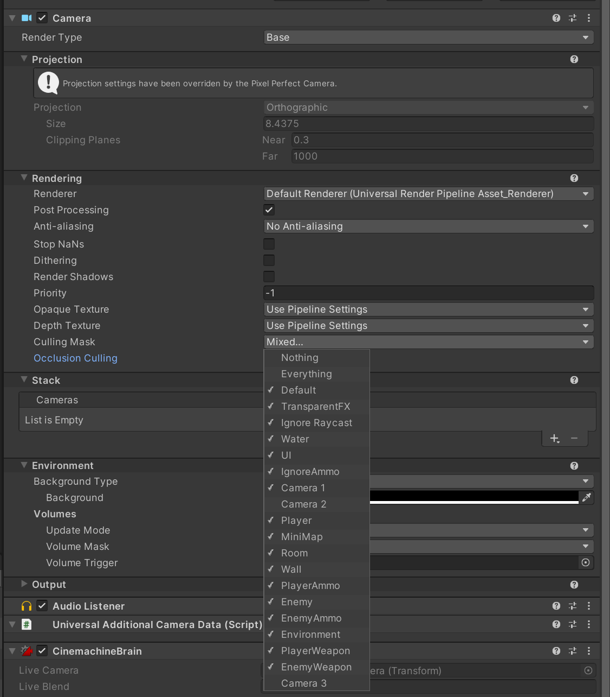
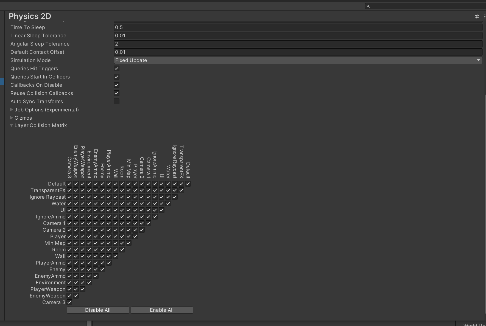
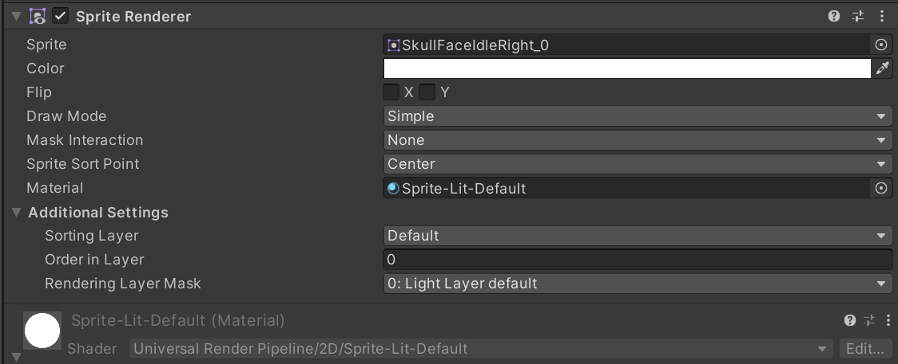
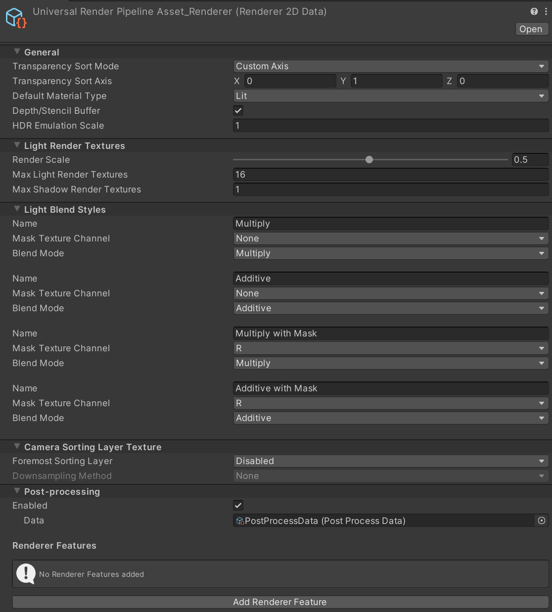

# Camera

## 1. Layer

Layer的第一个作用是和Camer的Culling Mask配合的，Camera只会渲染Culling Mask里出现的Layer标记的对象。



Layer的第二个作用是和物理碰撞配合，制定一些层和另一些层碰撞



Layer的第三个用处是射线检测，LayerMask

## 2. SortingLayers

定义渲染顺序。

从上往下画，下面画在上面。

在2D渲染过程中，UI渲染中，没有深度，非常重要。尤其是Spirite的绘制



在SortingLayer相等的时候，就看Order in Layer。Order in Layer越大，越后绘制。

3D主要靠深度

3. Transparency Sort Mode

如果使用了URP，在URP中可以设置Transparency Sort Mode，Transparency Sort Mode会在Sorting Layer之前被使用。比如对于以下例子。会根据Y轴的位置进行绘制排序。因此更靠近屏幕底部的Spirite会被绘制在更上方：




4. Tag

tag就是tag，用来查找或者用来做判断条件的

### **2. Tag 的主要用途**

#### **a. 组织和管理**

- **分类对象**：通过标签，可以将具有相似功能或特性的 GameObject 分类，例如所有敌人对象都可以被赋予标签 `Enemy`。
- **快速查找**：在 **Hierarchy（层级）** 面板中，使用标签可以更容易地找到和选择特定的 GameObject。

#### **b. 脚本中的引用和操作**

- **查找对象**：

  - 使用 `GameObject.FindWithTag("TagName")` 可以在运行时查找具有特定标签的第一个 GameObject。
  - 使用 `GameObject.FindGameObjectsWithTag("TagName")` 可以查找所有具有特定标签的 GameObject。

  ```csharp
  // 查找单个对象
  GameObject player = GameObject.FindWithTag("Player");
  
  // 查找所有敌人
  GameObject[] enemies = GameObject.FindGameObjectsWithTag("Enemy");
  ```

- **条件判断**：在碰撞检测或其他事件处理中，可以根据标签来决定如何响应特定的对象。

  ```csharp
  码void OnCollisionEnter(Collision collision)
  {
      if (collision.gameObject.CompareTag("Enemy"))
      {
          // 处理与敌人的碰撞
      }
  }
  ```

  ## 2. Unit,PPU与Pixel

  https://blog.csdn.net/weixin_43757333/article/details/129018889