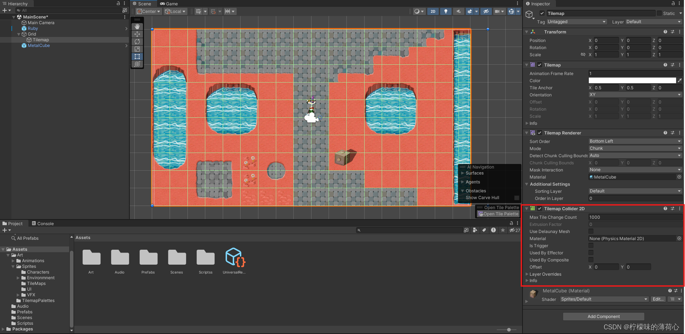
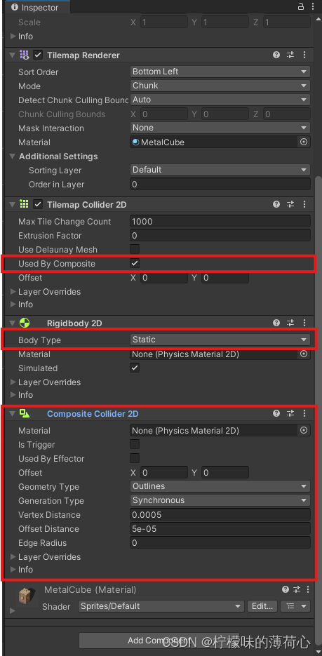
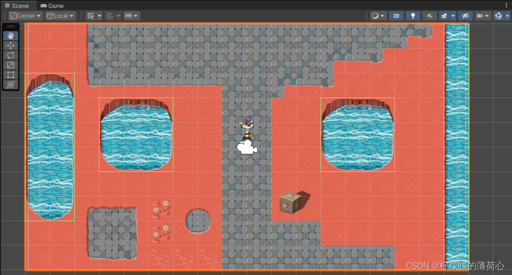
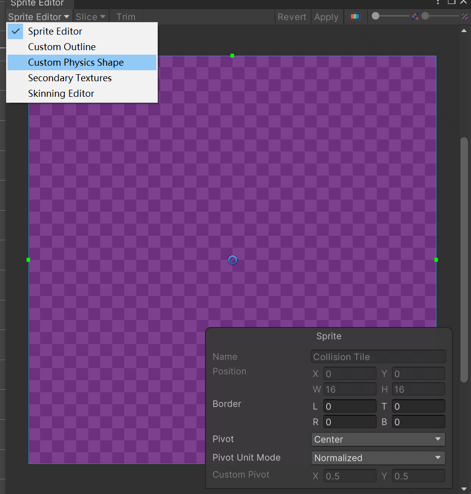
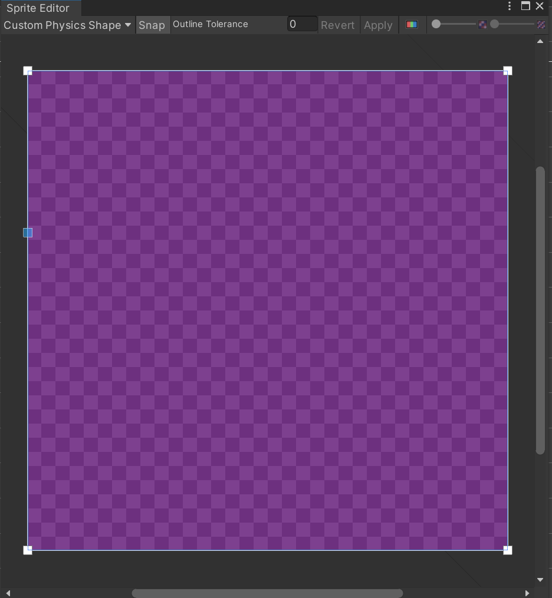
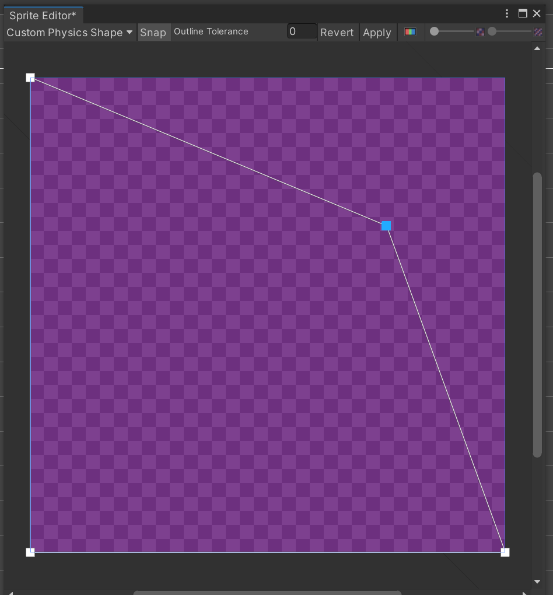

# Collider

## 1. 2D Collider

## 2. 3D Collider

## 3. Tilemap Collider

Tilemap Collider 2D会为每一个Tile生成一个Collider。然后可以自定义的管理每个tile的Collider

上图中，湖上不可行走，但是其实可以把湖上的Collider合并为一个Collider。就可以使用Composite Collider 2D

Reference：https://blog.csdn.net/qq_55048532/article/details/138626769

对于有物理碰撞效果的Tilemap来说，我们需要设置它的Physics Shape，Physics Shape是用来控制一个Tilemap的物理检测碰撞点的

