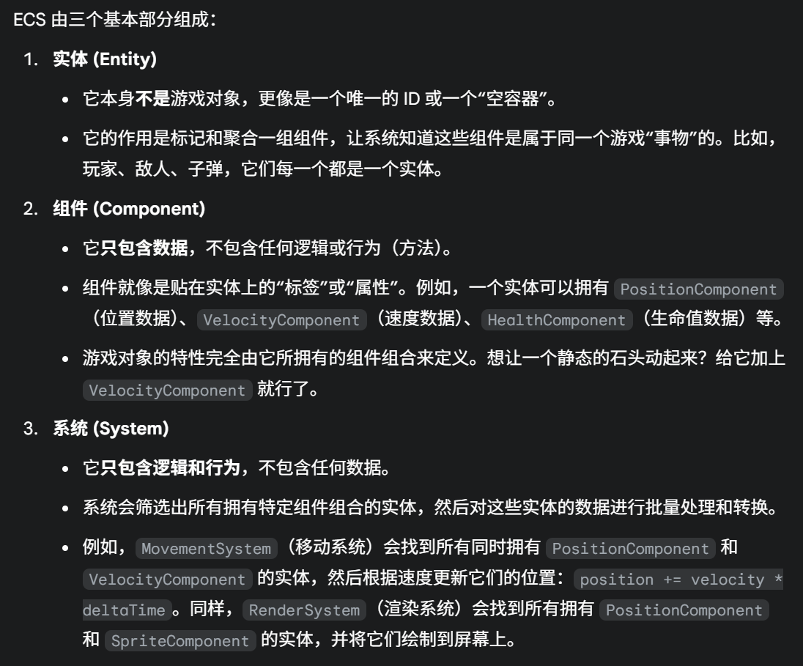
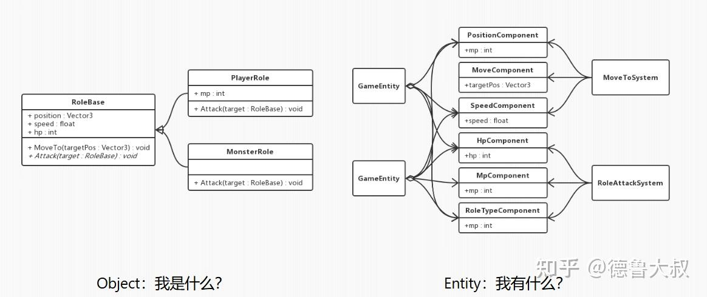
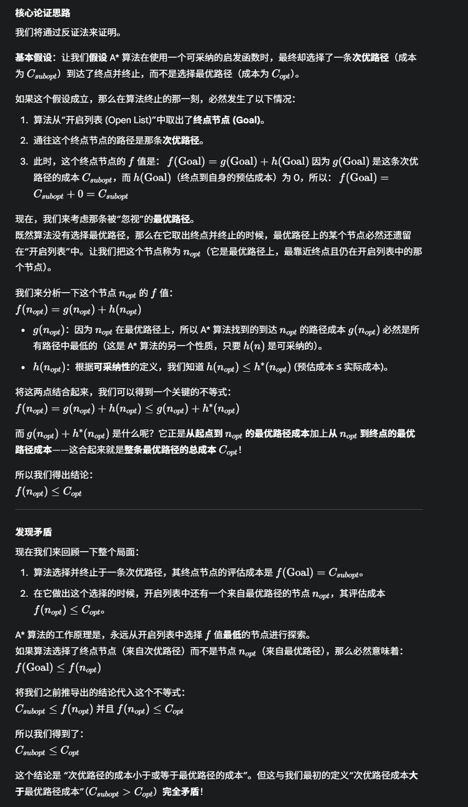
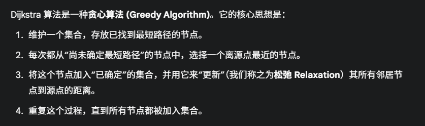

# UGUI

## 合批

动态/静态合批 + UGUI合批

https://gwb.tencent.com/community/detail/113040

https://gwb.tencent.com/community/detail/114323

## Rebuild和Rebatch的区别

https://zhuanlan.zhihu.com/p/3445975684

Rebuild类似于，对于单个组件（比如一个Image，重新构建它的网格还有材质等的过程）进行处理，他的作用对象是Graphic组件。

> **`Rebuild` 是 UI 元素自身数据发生变化后，为了生成新的、可供渲染的几何体和材质信息而执行的过程。**
>
> Q: 为什么需要Rebuild，而不是直接修改定点数据呢？
>
> A： 其实是一种封装，首先为所有的组件提供了统一的修改接口，其次，它使得所有的组件都在统一的一个阶段中统一的修改自身的属性，这避免了UI状态的频繁改变导致的重复重建（比如一个节点的颜色可能在一帧多次改变，而对于Rebuild来说，他只会在预定的阶段执行一次修改，然后执行一次重新渲染）

而Rebatch的作用对象则是整个Canvas下的所有可见并且未被剔除的CanvasRenderer，也就是当CanvasRenderer里的数据发生了变化。那么就会导致需要重新进行合批的检测（并不等于直接重新合批了），这个检测过程会做一个排序，然后试图将可以兼容的渲染状态作为一个连续的绘制操作合成一个批次，而如果在这个排序中发现，材质贴图不匹配（也就是根据depth排序后连续的排序不能塞在一个批次，那么就打断合批了）


重新（检测合批）和重新（打断）合批是不一样的

任何网格，材质的变化都会导致重新检测合批，而只有当不同的材质，贴图纹理，导致了排序之后，相邻的两个CanvasRenderer的渲染状态的不同，才会真的打断合批

> **用户代码/动画/输入** -> 改变 UI 属性
>
> **`Graphic.SetDirty()`** -> 标记需要更新
>
> **`CanvasUpdateRegistry` 收集脏元素**
>
> **(渲染循环中) `Canvas.willRenderCanvases` 事件触发**
>
> - `CanvasUpdateRegistry.PerformUpdate()` 被调用
>   - 对所有脏的 Layout 元素执行布局计算
>   - 对所有脏的 `Graphic` 元素执行 `Rebuild` (生成新的顶点和材质数据，更新 `CanvasRenderer`)
>
> **(渲染循环中) `Canvas` 实际渲染**
>
> - 收集所有 `CanvasRenderer`
> - 执行 `Rebatch` (基于最新的 `CanvasRenderer` 数据合批)
> - 执行 Draw Calls (将批次发送到 GPU)
>
> **屏幕显示更新**

Rebuild：

MeshRebuild继承链：

```
ICanvasElement <--- Graphic <--- Image
	|					|
（Rebuild方法） <--- (重写Rebuild方法)

CanvasUpdateRegistry(单例模式)
```

比如一个Image，当我修改他的color的时候，这时候颜色的修改仅仅是修改了Image这个类里面的color，和他渲染出来的颜色还没有建立起链接。 

 但是在赋值的时候会设置为脏，并且在rebuild的时候，根据Image的颜色属性重新设置它对应的CanvasRenderer的渲染数据

```c#
// 文件: com.unity.ugui/Runtime/UGUI/UI/Core/Graphic.cs
public virtual void Rebuild(CanvasUpdate update)
{
    if (canvasRenderer == null || canvasRenderer.destroyed)
        return;

    if (update == CanvasUpdate.PreRender)
    {
        if (m_VertsDirty) // 因为颜色改变，m_VertsDirty 为 true
        {
            UpdateGeometry(); // 调用 UpdateGeometry 来重建网格
            m_VertsDirty = false;
        }
        if (m_MaterialDirty) // 如果是材质改变，则走这里
        {
            UpdateMaterial();
            m_MaterialDirty = false;
        }
    }
}
//UpdateGeometry() 方法会调用虚方法 OnPopulateMesh(VertexHelper vh)。对于 Image 组件，它会重写此方法来生成其特有的顶点数据。
// 文件: com.unity.ugui/Runtime/UGUI/UI/Core/Graphic.cs (UpdateGeometry 方法内部)
protected virtual void UpdateGeometry()
{
    // ...
    s_VertexHelper.Clear();
    OnPopulateMesh(s_VertexHelper); // 调用 Image.OnPopulateMesh
    // ... (应用 IMeshModifier 如 Shadow, Outline) ...
    s_VertexHelper.FillMesh(workerMesh); // 将 VertexHelper 中的数据填充到临时 Mesh 中
    canvasRenderer.SetMesh(workerMesh); // 将这个包含新顶点数据的 Mesh 设置给 CanvasRenderer
}
```

`Rebuild` 过程充当了一个桥梁，将 `Image` 组件高级属性（如 `color`）的变化，转化为底层的顶点数据更新，并最终通过 `CanvasRenderer` 反映到渲染层面。

willRenderCanvases事件的触发时机是在所有update之后，canvas渲染之前

LayoutRebuild继承链：

```
ICanvasElement <--- LayoutRebuilder
ILayoutElement 
		//任何实现了 ILayoutElement 接口的组件，都可以告诉布局系统：
		//“我最小需要多大空间？”
		//“我理想情况下希望有多大空间？”
		//“如果有多余的空间，我是否愿意以及如何伸展？”
ILayoutController <--- LayoutGroup
				<---- ILayoutSelfController <--- ContentSizeFitter
```

比如一个组件的`HorizontalLayoutGroup` 的 `spacing` 或 `padding` 改变,相关的布局组件会调用 `SetDirty()` 方法

```c#
// 文件: com.unity.ugui/Runtime/UGUI/UI/Core/Layout/LayoutGroup.cs
protected virtual void SetDirty()
{
    if (!IsActive())
        return;

    // 避免在布局重建过程中重复将自己标记为脏
    if (!CanvasUpdateRegistry.IsRebuildingLayout())
    {
        // 调用 LayoutRebuilder 的静态方法，将当前组件的 RectTransform 加入到 LayoutRebuilder 的重建队列
        LayoutRebuilder.MarkLayoutForRebuild(rectTransform);
    }
    else
    {
        // 如果已经在重建布局，则安排到下一帧再标记，避免无限循环
        Canvas.willRenderCanvases += MarkDirtyNextFrame;
    }
}

private void MarkDirtyNextFrame()
{
    Canvas.willRenderCanvases -= MarkDirtyNextFrame;
    LayoutRebuilder.MarkLayoutForRebuild(rectTransform);
}
```

再或者一个Image的Hierarchy的改变，会触发一个事件：

```c#
class Image{
            protected override void OnCanvasHierarchyChanged()
        {
            base.OnCanvasHierarchyChanged();
            if (canvas == null)
            {
                m_CachedReferencePixelsPerUnit = 100;
            }
            else if (canvas.referencePixelsPerUnit != m_CachedReferencePixelsPerUnit)
            {
                m_CachedReferencePixelsPerUnit = canvas.referencePixelsPerUnit;
                if (type == Type.Sliced || type == Type.Tiled)
                {
                    SetVerticesDirty();
                    SetLayoutDirty(); //<-- Layout设置为Dirty
                }
            }
        }
}

//Graph.cs
        public virtual void SetLayoutDirty()
        {
            if (!IsActive())
                return;

            LayoutRebuilder.MarkLayoutForRebuild(rectTransform); //<--- 标记为Layout需要重构

            if (m_OnDirtyLayoutCallback != null)
                m_OnDirtyLayoutCallback();
        }
```

LayoutRebuilder不挂载在任何物体上面（因为只是实现了ICanvasElement，实现了Rebuild接口）

按照上面的流程，当一个UI元素的Layout发生变化之后，会设置该元素的Layout为Dirty，并且随后会调用LayoutRebuilder的MarkLayoutForRebuild函数并且把自身的RectTransform传入

LayoutRebuilder是一个什么呢？它的设计很巧妙：

```c#
    public class LayoutRebuilder : ICanvasElement
    {
        private RectTransform m_ToRebuild;
        
        private int m_CachedHashFromTransform;

        static ObjectPool<LayoutRebuilder> s_Rebuilders = new ObjectPool<LayoutRebuilder>(() => new LayoutRebuilder(), null, x => x.Clear());
    }
```

它有一个static对象池，并且它还有一个m_ToRebuild成员变量。因此它起到的作用是：对于每一个需要被重新计算Layout的UI元素，建立一个映射。

这里的作用取决于它的MarkLayoutForRebuild

```c#
//LayoutRebuilder
public static void MarkLayoutForRebuild(RectTransform rect)
{
    // 1. 基本的空检查
    // 如果传入的 RectTransform 为空，或者其关联的 GameObject 为空，则直接返回，不做任何操作。
    if (rect == null || rect.gameObject == null)
        return;

    // 2. 获取组件列表池中的列表
    // ListPool<Component>.Get() 是一个对象池模式的实现，用于获取一个 Component 类型的列表。
    // 这样做可以避免频繁地创建和销毁列表对象，从而减少垃圾回收（GC）的压力，提高性能。
    var comps = ListPool<Component>.Get();

    // 3. 初始化变量并开始向上查找布局根节点
    bool validLayoutGroup = true; // 用于控制循环是否继续，表示当前检查的父级是否包含有效的布局组
    RectTransform layoutRoot = rect; // 初始化布局根节点为传入的 rect
    var parent = layoutRoot.parent as RectTransform; // 获取当前 layoutRoot 的父节点，并尝试转换为 RectTransform

    // 4. 向上遍历父级，查找最顶层的有效布局组 (Layout Root)
    // 这个循环会一直向上查找，直到找到一个没有有效 ILayoutGroup 的父级，或者到达场景的根部 (parent == null)。
    while (validLayoutGroup && !(parent == null || parent.gameObject == null))
    {
        validLayoutGroup = false; // 先假设当前父级没有有效的布局组
        // 获取父对象上所有实现了 ILayoutGroup 接口的组件
        parent.GetComponents(typeof(ILayoutGroup), comps);

        // 遍历获取到的所有 ILayoutGroup 组件
        for (int i = 0; i < comps.Count; ++i)
        {
            var cur = comps[i];
            // 检查组件是否有效，是否是 Behaviour 类型，并且该 Behaviour 是否处于激活并启用的状态
            if (cur != null && cur is Behaviour && ((Behaviour)cur).isActiveAndEnabled)
            {
                // 如果找到了一个有效的、激活的布局组组件
                validLayoutGroup = true; // 标记找到了有效的布局组，循环可以继续向上查找
                layoutRoot = parent;    // 将布局根节点更新为当前的父节点
                break;                  // 跳出当前 for 循环，因为已经在这个父节点上找到了一个有效的布局组
            }
        }

        // 继续向上查找，将当前父节点设置为其父节点
        parent = parent.parent as RectTransform;
    }
    // 循环结束后，layoutRoot 指向的是包含最初 rect 的、最外层的、且自身是激活的布局组的 RectTransform。
    // 如果 rect 本身没有被任何激活的布局组管理，则 layoutRoot 仍然是最初的 rect。

    // 5. 验证最终确定的 layoutRoot 是否真的包含有效的布局控制器
    // 如果 layoutRoot 最终还是最初传入的 rect（意味着 rect 本身就是最顶层的布局元素，或者它不在任何布局组内），
    // 并且这个 layoutRoot 自身没有有效的布局控制器（ValidController 函数的逻辑未在此处给出，
    // 但它通常会检查 layoutRoot 上是否有激活的 ILayoutController 组件，如 ContentSizeFitter 或 LayoutElement 之外的布局组），
    // 那么就认为没有必要重建布局。
    //
    // 注意：comps 列表此时可能包含的是最后一次 GetComponents 调用的结果，即最顶层 parent 的 ILayoutGroup 组件。
    // ValidController 可能会复用这个 comps 列表，或者重新获取 layoutRoot 上的组件来判断。
    // 通常，如果一个元素是 Layout Group（如 HorizontalLayoutGroup），它本身就是一个 Layout Controller。
    // ContentSizeFitter 也是一个 Layout Controller。
    if (layoutRoot == rect && !ValidController(layoutRoot, comps))
    {
        // 释放之前从对象池获取的列表
        ListPool<Component>.Release(comps);
        return; // 直接返回，不进行标记
    }

    // 6. 标记布局根节点需要重建
    // 这个函数（具体实现未在此处给出）会真正将 layoutRoot 添加到 CanvasUpdateRegistry 中，
    // 告知系统在下一帧的特定阶段（通常是 "LateUpdate" 之后）处理这个布局根节点的重建请求。
    MarkLayoutRootForRebuild(layoutRoot); //<---这里很重要

    // 7. 释放组件列表到对象池
    // 确保从对象池获取的资源被正确释放，以便后续复用。
    ListPool<Component>.Release(comps);
}
```

继续看：

```c#
        private static void MarkLayoutRootForRebuild(RectTransform controller)
        {
            if (controller == null)
                return;

            var rebuilder = s_Rebuilders.Get();
            rebuilder.Initialize(controller); //<--- 注意这个Initialize
            if (!CanvasUpdateRegistry.TryRegisterCanvasElementForLayoutRebuild(rebuilder)) //<--把自身注册到CanvasUpdateRegistry的m_LayoutRebuildQueue
                s_Rebuilders.Release(rebuilder);
        }

        private void Initialize(RectTransform controller)
        {
            m_ToRebuild = controller; //<---给m_ToRebuild赋值了
            m_CachedHashFromTransform = controller.GetHashCode();
        }
```

所以，LayoutRebuilder的行为其实是：从对象池获取一个LayoutRebuilder，然后把它管理到自身的m_ToRebuild，并且注册到CanvasUpdateRegistry的m_LayoutRebuildQueue队列，等待PerformUpdate的调用。

**(也因此，每一个Layout的变化都会标记组件/RectTransform，这也是为什么ContentSizeFitter和LayoutGroup可以同时起作用的原因)**

而在PerformUpdate的时候，会调用对应的Rebuild（是LayoutRebuilder继承了ICanvasElement）

```c#
//LayoutRebuilder
        public void Rebuild(CanvasUpdate executing)
        {
            switch (executing)
            {
                case CanvasUpdate.Layout:
                   //第二个参数是一个回调函数，所以，不同的ILayoutElement最后影响的实际上是回调的处理
                    PerformLayoutCalculation(m_ToRebuild, e => (e as ILayoutElement).CalculateLayoutInputHorizontal());
                    PerformLayoutControl(m_ToRebuild, e => (e as ILayoutController).SetLayoutHorizontal());
                    PerformLayoutCalculation(m_ToRebuild, e => (e as ILayoutElement).CalculateLayoutInputVertical());
                    PerformLayoutControl(m_ToRebuild, e => (e as ILayoutController).SetLayoutVertical());
                    break;
            }
        }

```

并且，计算和控制这两个函数都是递归的：
```c#
        private void PerformLayoutCalculation(RectTransform rect, UnityAction<Component> action)
        {
            if (rect == null)
                return;

            var components = ListPool<Component>.Get();
            rect.GetComponents(typeof(ILayoutElement), components);
            StripDisabledBehavioursFromList(components);

            // If there are no controllers on this rect we can skip this entire sub-tree
            // We don't need to consider controllers on children deeper in the sub-tree either,
            // since they will be their own roots.
            if (components.Count > 0  || rect.TryGetComponent(typeof(ILayoutGroup), out _))
            {
                // Layout calculations needs to executed bottom up with children being done before their parents,
                // because the parent calculated sizes rely on the sizes of the children.
				//递归当前元素的子元素的布局
                for (int i = 0; i < rect.childCount; i++)
                    PerformLayoutCalculation(rect.GetChild(i) as RectTransform, action);
				//然后再根据子元素计算自身的布局
                for (int i = 0; i < components.Count; i++)
                    action(components[i]);
            }

            ListPool<Component>.Release(components);
        }
```


```c#
        private void PerformLayoutControl(RectTransform rect, UnityAction<Component> action)
        {
            if (rect == null)
                return;

            var components = ListPool<Component>.Get();
            rect.GetComponents(typeof(ILayoutController), components);
            StripDisabledBehavioursFromList(components);

            // If there are no controllers on this rect we can skip this entire sub-tree
            // We don't need to consider controllers on children deeper in the sub-tree either,
            // since they will be their own roots.
            if (components.Count > 0)
            {
                // Layout control needs to executed top down with parents being done before their children,
                // because the children rely on the sizes of the parents.

                // First call layout controllers that may change their own RectTransform
                for (int i = 0; i < components.Count; i++)
                    if (components[i] is ILayoutSelfController)
                        action(components[i]);

                // Then call the remaining, such as layout groups that change their children, taking their own RectTransform size into account.
                //控制自身
                for (int i = 0; i < components.Count; i++)
                    if (!(components[i] is ILayoutSelfController))
                    {
                        var scrollRect = components[i];

                        if (scrollRect && scrollRect is UnityEngine.UI.ScrollRect)
                        {
                            if (((UnityEngine.UI.ScrollRect)scrollRect).content != rect)
                                action(components[i]);
                        }
                        else
                        {
                            action(components[i]);
                        }
                    }
				//递归的控制自己的子类
                for (int i = 0; i < rect.childCount; i++)
                    PerformLayoutControl(rect.GetChild(i) as RectTransform, action);
            }

            ListPool<Component>.Release(components);
        }
```

也就是说：计算的时候是先递归，然后从下到上的根据自己的子节点计算自身的布局，而控制的时候是从自身出发，自上而下的控制自己和自己子节点的布局。

# ECS

https://zhuanlan.zhihu.com/p/6489668907



组件化架构 和 ECS:

组件化架构的例子：

> 比如说我这样一个帧同步框架： 
>
>  对于Move，我有一个MoveManager，而Player作为一个PlayerEntity，下面有一个MoveComponent。而EnemyEntity也有一个MoveComponent。 
>
>  MoveManager不知道什么Entity，它只知道MoveComponent的索引，在驱动的时候，每一次Update运行的时候，MoveManager都会调用它索引的MoveComponent的Update。

```c#
class MoveComponent {
    void Update() {
        // 移动的逻辑在这里
    }
}

class MoveManager {
    List<MoveComponent> components;
    void Update() {
        for (comp in components) {
            comp.Update(); // 调用组件自己的方法
        }
    }
}
```

而ECS的例子：

```c#
struct MoveComponent { // 这是一个纯数据结构 (struct)
    Vector3 speed;
    float rotationSpeed;
}

struct TransformComponent {
    Vector3 position;
}

class MoveSystem { // 注意这里叫 System
    void Update(float deltaTime) {
        // 查询所有同时拥有 MoveComponent 和 TransformComponent 的实体
        for (Entity e : world.Query<MoveComponent, TransformComponent>()) {
            MoveComponent& moveData = world.GetComponent<MoveComponent>(e);
            TransformComponent& transformData = world.GetComponent<TransformComponent>(e);

            // 移动的逻辑完全在 System 中！
            transformData.position += moveData.speed * deltaTime;
        }
    }
}
```

组件化和纯粹 ECS 最大的区别在于 **“逻辑放在了哪里”**。

- `MoveManager` 调用 `MoveComponent` **自己的 `Update` 方法**。这意味着**逻辑（行为）存在于组件（Component）中**。
- **纯粹的 ECS 设计**: **组件（Component）只包含数据，不包含任何方法或逻辑**。**系统（System）（Manager）包含所有逻辑**，它会获取组件的数据并对其进行处理。



# 寻路

## A*

gained（已知）和heuristic（预测）final（最终）

每次从openList中取出一个节点（openList根据FCost排序，每次取FCost最小）

+ 查看邻居节点，并且对于不在closeList的邻居，计算邻居节经由当前节点的GCost(gained)。
  + 如果邻居在OpenList中，且新的GCost<它在OpenList里的GCost，那么就说明找到了一条新的更短的路径
  + 如果不在OPenList里，就直接加入

> 为什么AStar算法能保证找到一条最短路径？
>
> 启发函数（也就是HCost的计算），必须是可采纳的，也就是估计出来的到终点的距离必须小于等于真实的成本
>
> 


## BFS，DFS，Floyd，Dijkstra

Dijkstra:

> **如果将 A\* 算法的启发函数 h(n) 设为 0，那么 A* 算法就完全等价于 Dijkstra 算法。**
>
> Dijkstra 算法和 A* 算法**关系非常密切，可以说 A\* 算法就是 Dijkstra 算法的一个优化和扩展**。

Dijkstra 算法是一种用于在**带权有向图或无向图**中，查找从**单个源点**到所有其他节点**最短路径**的算法。它的一个核心前提是：图中所有的边的**权重都必须是非负数**。



## Navmesh

# C#和C++

## Unity运行时

## IL2CPP

# 垃圾回收

# UnityGC原理


# 优化原理

