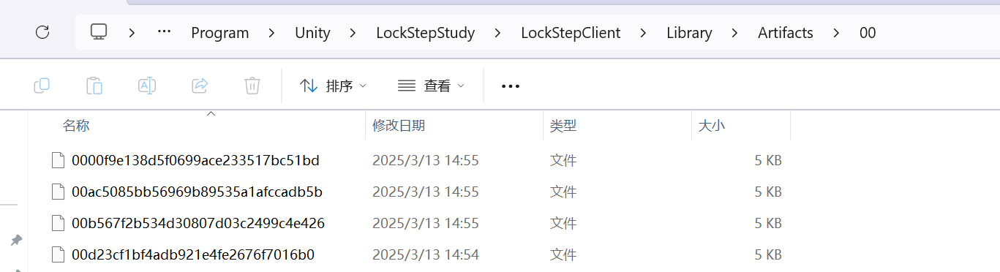
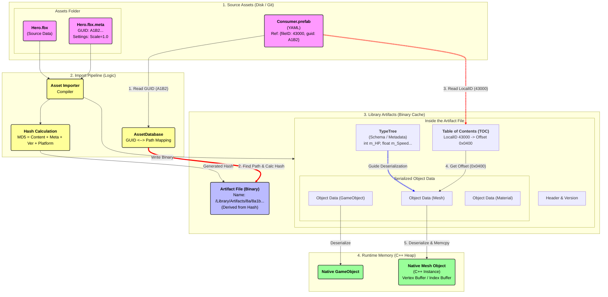

# Unity文件管理

## 文件存储的本质

首先明确一件事情，一个文件（比如一个FBX文件），进入Unity的时候是需要Importer的。

这有很多原因，主要是因为FBX的数据存储格式并不能直接被GPU等利用。因此Unity需要给它在导入的时候处理一下，这样运行时就不需要再处理了

处理完之后的文件存在哪里呢？高版本Unity中是存储在\Library\Artifacts下



上面图中的每一个文件，我们成为一个Asset。是文件层面上，Unity资源的最小物理实例。

但是这并不是最小的物理单元。

比如一个FBX文件，它里面包括了顶点数据，Indice数据，Mesh，Material等等。这些被成为Object。他们原本也许有各种各样的数据结构，但是导入的时候，经过UnityImporter的导入，会被处理为各种以Unity.Object为基类的Object。这些Object就是我们在Unity中引用的时候，引用的那个对象

好，既然上面提到了\Library\Artifacts下一个文件是一个Asset，那Object存储在哪里呢？

答案是，他们是被存储为Asset二进制文件中的一个个数据块。

Asset文件的组成很有趣，文件头部存在一个目录表 (Table of Contents)，这个目录表里存储着一个id和一个偏移量的映射，例如：

| **偏移量 (Offset)** | **内容 (Content)**                                           | **逻辑身份 (Identity)**                     |
| ------------------- | ------------------------------------------------------------ | ------------------------------------------- |
| **0x0000**          | **文件头 (Header)**   包含文件版本、目标平台信息             | N/A                                         |
| **0x0100**          | **数据块 A (Data Block)**   所有的顶点坐标、UV、法线二进制流 | **Object 1 (Mesh)**   LocalID: 4300000      |
| **0x0500**          | **数据块 B (Data Block)**   材质属性表、Shader 引用          | **Object 2 (Material)**   LocalID: 2100000  |
| **0x0800**          | **数据块 C (Data Block)**   根节点的变换矩阵                 | **Object 3 (GameObject)**   LocalID: 100000 |
| **...**             | ...                                                          | ...                                         |

具体看文件头里存在目录表：

| LocalID: `4300000` | Offset: 0x0100 | 是 GameObject    |
| ------------------ | -------------- | ---------------- |
| LocalID: `4300002` | Offset: 0x0400 | 是Mesh           |
| LocalID: `7400000` | Offset: 0x0800 | 是 AnimationClip |

这些Object的数据块是什么呢？是序列化的C++对象。因为Unity的底层是C++，所以，这些Object实际上是内存上序列化后的C++对象，这样做可以使得，使用的时候只需要直接反序列化为C++对象就可以在底层运行

## 查找文件的流程——FileGUID和LocalID

现在可以引入FileGUID和LocalID了。

FileGUID对应的是文件系统中的一个具体的文件。比如对于我们上面说的，FileGUID对应的就是那个.FBX文件。

FileGUID实际上是一个逻辑概念，它是给.meta文件使用的。

想象这样一个场景，Unity中一个Asset_A（一个prefab）里引用了另一个Asset_B（一个FBX）里的Object_A（假设是一个Mesh）。

如果Unty解析这个过程，实际上是要先查询Asset_A的prefab文件（这是一个YAML）。发现它里面引用了一个FIleGUID下的一个LocalID对应的Object。

这时候，Unity内部会维护一张FileGUID和文件路径的大表（AssetDatabase，它是驻留在内存里的 B-Tree 或类似的高效索引结构），这张表可以帮助我们找到上面说的FIleGUID对应的那个文件，找到了这个文件也就找到了它的.meta文件的路径。

然后，Unity会计算这个文件和它的.meta文件的hash。这个hash对应的就是上面提到的\Library\Artifacts下的Asset的文件名。

> 1. `Hero.fbx` 的文件内容哈希 (Content Hash)。
> 2. `Hero.fbx.meta` 的设置哈希 (Importer Settings Hash)。
> 3. **Importer 版本号** (比如 ModelImporter 升级了，哈希必须变)。
> 4. **目标平台** (PC 和 Android 的纹理压缩格式不同，哈希必须不同)。
>
> **计算**：`ArtifactHash = MD5(Content + Meta + Version + Platform)`。
>
> **意义**：这个 Hash 代表了“当前这一刻，这个资源应该生成的二进制产物的唯一指纹”。

这时候Unity就得到了真正的Asset的路径了。接着，Unity就找到这个Asset，打开它，然后使用上面找到的LocalID对应的Offset，找到对应的数据块。把它反序列化（严格来说，Asset文件里存储的不只是Object的序列化二进制，也包含了TypeTree，这东西是为了防止不同版本反序列化时候的不兼容）

### 总结一下：

GUID 锁定身份，Hash 锁定版本，Library 存储实体，LocalID 锁定分量

> ### 核心流程梳理 (这也是 Unity 后台做的事)
>
> 当你请求加载一个资源时（比如编辑器里 `AssetDatabase.LoadAssetAtPath`），发生了以下步骤：
>
> **第一步：逻辑定位 (GUID -> Source)**
>
> - **输入**：FileGUID (来自 .meta)。
> - **动作**：Unity 查表（AssetDatabase）。
> - **确认**：GUID `1a2b...` 当前对应的是 `Assets/Models/Hero.fbx`。
>   - *注意：如果文件被移动了，AssetDatabase 会更新这个映射，但 GUID 不变。*
>
> **第二步：计算哈希 (Source + Meta -> Hash)**
>
> - **输入**：
>   1. `Hero.fbx` 的文件内容哈希 (Content Hash)。
>   2. `Hero.fbx.meta` 的设置哈希 (Importer Settings Hash)。
>   3. **Importer 版本号** (比如 ModelImporter 升级了，哈希必须变)。
>   4. **目标平台** (PC 和 Android 的纹理压缩格式不同，哈希必须不同)。
> - **计算**：`ArtifactHash = MD5(Content + Meta + Version + Platform)`。
> - **意义**：这个 Hash 代表了“当前这一刻，这个资源应该生成的二进制产物的唯一指纹”。
>
> **第三步：物理定位 (Hash -> Library Path)**
>
> - **输入**：ArtifactHash。
> - **动作**：去 `Library/Artifacts` 文件夹里找有没有在这个 Hash 命名的文件。
>   - *命中 (Cache Hit)*：直接用，不用重新导入（这就是为什么 Library 叫 Cache）。
>   - *未命中 (Cache Miss)*：说明源文件改了，或者 Importer 变了。**触发 Reimport**，重新生成二进制，写入这个 Hash 路径。
> - **结果**：拿到二进制产物文件句柄 `FileHandle_LibraryBlob`。
>
> **第四步：提取对象 (LocalID -> Object)**
>
> - **输入**：LocalID (来自持有引用（原始Prefab的） YAML)。
> - **动作**：在 `FileHandle_LibraryBlob` 内部查偏移量表。
> - **结果**：`memcpy` 数据到内存，反序列化为 C++ 对象 (Runtime Object)。

## 名词严谨描述

下面严谨的描述上面提到的名字

**Source Asset (源资产)**：`Assets/Hero.fbx`。这是逻辑上的输入。

**Artifact (产物)**：`Library/Artifacts/xx/...`。这是物理上的二进制输出。

**Object (对象)**：`Runtime Memory Object`。这是内存里的实例。 **Library 里的那个文件，准确地说是 "Artifact"（产物包），而不是通常意义上说的 Asset。**

.Meta :存储GUID和一些修改配置。当我们在UnityEditor里修改一个贴图的RenderMode啊，WrapMode之类的时候，这些就是存储在.meta文件里的

对于简单资源（Texture, Material, Shader, Script），Meta文件完全不存储LocalID，对于复杂复合资源（FBX 模型）默认不存储，但为了防止“引用丢失”，它会存储一张“映射表”。

```meta
fileFormatVersion: 2
guid: a1b2c3d4...
TextureImporter:  <-- 重点来了：这是 Importer 的配置区
  fileIDToRecycleName: {}
  externalObjects: {}
  serializedVersion: 11
  mipmaps:
    mipMapMode: 0
    enableMipMap: 1    <-- 你勾选了 "Generate Mip Maps"
    sRGBTexture: 1     <-- 你勾选了 "sRGB (Color Texture)"
    linearTexture: 0
  fadeOut: 0
  borderMipMap: 0
  mipMapsPreserveCoverage: 0
  alphaTestReferenceValue: 0.5
  mipMapFadeDistanceStart: 1
  mipMapFadeDistanceEnd: 3
  convertToNormalMap: 0  <-- 你是否把它当算法线贴图
  externalNormalMap: 0
  heightScale: 0.25
  normalMapFilter: 0
  isReadable: 0         <-- "Read/Write Enabled"
  streamingMipmaps: 0
  streamingMipmapsPriority: 0
  vTOnly: 0
  ignoreMasterTextureLimit: 0
  platformSettings:     <-- 不同平台的覆盖设置
  - serializedVersion: 3
    buildTarget: Android
    maxTextureSize: 2048
    resizeAlgorithm: 0
    textureFormat: 50   <-- 你选的压缩格式 (比如 ETC2)
    textureCompression: 1
    compressionQuality: 50
    crunchedCompression: 0
    allowsAlphaSplitting: 0
    overridden: 1
    androidETC2FallbackOverride: 0
    forceMaximumCompressionQuality_BC6H_BC7: 0
  spriteMode: 1        <-- "Texture Type" 选了 Sprite
```

> 假设你有一个 `Hero.fbx`，里面有 3 个 Mesh。
>
> Meta 文件里**并没有**记录这 3 个 Mesh 的物理位置，甚至通常也不直接列出这 3 个 Mesh 的清单（除非涉及 Remap）。 Meta 主要记录的是：
>
> - **GUID**: `a1b2...` (我是谁，我的全局身份证)
> - **Settings**: `globalScale: 1`, `importBlendShapes: 1` (怎么处理我，比如要不要压缩)

## 一些问题

### **为什么改了 .meta 里的 Texture Compression 也要转圈圈？**

- 因为 `Meta` 变了 -> `ArtifactHash` 变了 -> `Library` 里找不到对应的旧 Hash 文件了 -> 触发 Reimport -> 生成新文件。

### **为什么切换平台（Switch Platform）这么慢？**

- 因为 `Platform` 参数变了 -> 所有资源的 `ArtifactHash` 全都变了 -> Unity 必须去 Library 里找新平台对应的文件。
- *好消息*：如果你切过一次，Library 里就会保留那份 Hash 文件。切回来时，Hash 命中，瞬间完成。

### **GUID 和 Hash 的区别？**

- **GUID (Persistent ID)**：是给**人**（和开发者）用的。它保证了“无论你怎么改文件，它还是它”。
- **Hash (Content ID)**：是给**构建系统**用的。它保证了“只要文件内容没变，我就不重新编译”。

## 为啥还要保留源文件呢（。FBX）

意思是，有了Library/Artifacts/xx/下的处理后的产物，为啥还要源文件保留，其实这就是为了开发方便，当打包之后，源文件其实就真的消失了而留下的就是Library/Artifacts/xx/里的Asset文件

## TODO：

TypeTree


## 流程图



## InstanceID

InstanceID本质上是一个缓存系统，对于已经加载过的Object，PersistentManager会维护Instance ID和File GUID、Local ID的映射关系，定位Object源数据的位置以及维护内存中（如果有）Object的实例。

只要系统解析到一个Instance ID，就能快速找到代表这个Instance ID的已加载的对象。如果Object没有被加载，File GUID和Local ID也可以快速地定位到指定的Asset资源从而即时进行资源加载。
