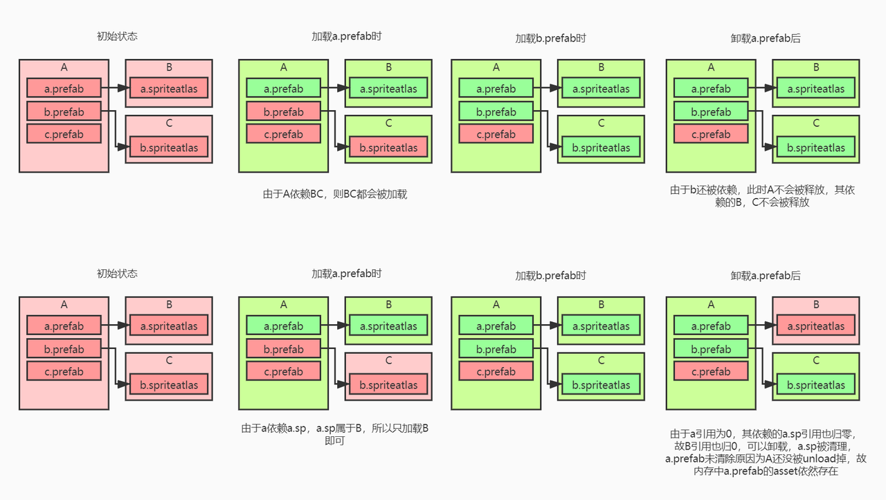

# Unity资源管理初探

https://blog.uwa4d.com/archives/USparkle_Addressable1.html

https://blog.uwa4d.com/archives/USparkle_inf_UnityEngine.html

https://mp.weixin.qq.com/s/0XFQt8LmqoTxxst_kKDMjw?

## ！！Unity文件管理

[Unity文件管理](./Unity文件管理.md)

## 资源分类

我们显然需要一个资源管理方案，来适配游戏开发的流程。而我们只有先了解Uinty自身的资源管理方案才能指定自己的资源管理器

对于Unity，我们可以把资源分类为这几类

+ 资源文件
+ 代码文件
+ 序列化文件
+ 文本文档
+ 非序列化文件
+ Meta文件

资源文件很好理解，比如模型文件，图片文件这种，当美术完成导入之后，我们不会在Unity当中进行修改了。

序列化文件则是Unity自身管理的一类文件，比如最典型的Prefab文件，场景文件，Asset文件，材质球，如果打开过Prefab就会发现，Prefab的本质其实就是一个YAML配置文件。类似的文件的本质，是在运行的时候由Unity根据它的配置信息，反序列化为对应类的实例

非序列文件是Unity无法识别的文件，比如一个文件夹也会被认为是一个文件，但是无法识别。

## Meta文件

对于Unity的文件管理，我们先从Meta文件开始。。Meta文件实质上是一个文本文档，只是采用的是一种叫做YAML的格式来写的。

Unity当中，会为每一个文件分配一个GUID，这个GUID由Unity保证了全局唯一性。

这里我们在讨论Object，我们知道一个Asset可能对应多个子文件，比如一个Prefab下可能有多个子文件。一个图集下有多个图片。那么这个GUID只能对应一个文件，而对于一个文件下有多个文件的情况，就需要另外一个ID来表示，这就是LocalID。更习惯用Meta文件中的名字FileID。

## AB包

https://blog.uwa4d.com/archives/USparkle_Addressable3.html


## UMT-AB包

****

第一组图的核心逻辑是：

**AB包是以包为单位的**：加载和卸载都是针对整个包。

**加载B包是因为a.prefab被访问**：a.prefab依赖B包中的资源，导致B包被自动加载。

**释放B包需要A包被释放**：仅释放a.prefab的实例不足以卸载B包，必须卸载A包才能解除对B包的依赖。

**a.prefab的释放跟随包**：a.prefab的资源定义是A包的一部分，只有A包卸载时它才会被从内存中移除。

第二组图的核心逻辑是：

- 基于资产（asset）的依赖关系，通过管理每个资产的引用计数来决定AB包的卸载时机。
- 当B包内的所有资产的引用计数都降为0时，说明这些资产不再被任何对象使用，此时B包可以被安全卸载。

## AssetBundle, Resources 和 AssetDatabase 

https://www.youtube.com/watch?v=uNpBS0LPhaU

说这些包，指的其实都是在游戏“运行时”

### AssetDatabase 

AssetDatabase 单独说，这个API只能作用在编辑器内，也就是只有在编辑器环境下才能用

AssetDatabase会从Assets文件夹下的文件进行查找

```c#
public T LoadResource<T>(string path) where T : Object
{
    // 1. 如果是在编辑器里按了 Play (作弊模式)
#if UNITY_EDITOR
    // 直接走 AssetDatabase 读取硬盘文件，完全不用打 AB 包，改了资源立马生效！
    // 这就是你说的“编辑器内的运行时加载”
    return UnityEditor.AssetDatabase.LoadAssetAtPath<T>(path);

    // 2. 如果是打包发布的真机 (正常模式)
#else
    // 老老实实去加载 AssetBundle
    var bundle = AssetBundle.LoadFromFile(...);
    return bundle.LoadAsset<T>(path);
#endif
}
```

### Resources

 Resources：内置的运行时 API (Runtime)，但它是“内置死”的

放在 `Resources` 文件夹下的资源。打包时，Unity 会把这些东西无脑塞进最终的安装包里，并且生成一个巨大的查找表（红黑树）。

- `Resources.Load<GameObject>("Hero");` 
- **什么时候用？** 原型开发、或者极少数永远不会变且必须存在的东西（比如开机Logo配置）。
- **本质问题：** 一旦打包，它就和安装包“长”在一起了。你想换个图？对不起，让玩家重新下载整个游戏。而且它的查找表会导致游戏启动变慢。

### Asset Bundle

Asset Bundle： 外卖/快递包裹

**核心定位：运行时 API (Runtime)，灵活、可更新**

- **这是啥？** 你通过代码（BuildPipeline）把资源压缩成的一个个外部文件。这些文件可以放在用户硬盘里，也可以放在服务器上。

- **怎么用？** 先加载包：`myBundle = AssetBundle.LoadFromFile("路径/hero.ab");` 再加载资源：`myBundle.LoadAsset<GameObject>("Hero");`

- **什么时候用？** **正经做商业游戏时用。** 它是实现热更新的基础。

- **关系：** 在编辑器里，你用 `AssetDatabase` 找到资源，然后调用 `BuildPipeline` 把它打成 `AssetBundle`。在游戏运行时，你就不再通过 `AssetDatabase` 找资源了，而是去读 `AssetBundle` 文件。

  

#### StreamingAssets 

AB包本地开发的时候要配合StreamingAssets来，

**StreamingAssets 的核心规则是：**

> 放在这个文件夹里的任何文件，Unity 在打包时**完全不处理**（不压缩、不加密、不转格式），直接**原样复制**到最终的安装包里。

####  为什么需要它？（使用场景）

既然有了 AB 包和 Resources，为啥还要这个？

- **存放 AssetBundles 的初始包** 这是最常见的用法。你把做好的 AB 包（热更资源）放在服务器上让玩家下载。但是，玩家第一次安装游戏时，总不能连“登录界面”都要去下载吧？ 所以，我们会把**首包（基础资源）**的 AB 包直接扔进 `StreamingAssets`。游戏一启动，先读这里的包。
- **视频文件 (.mp4)** Unity 的 VideoPlayer 组件通常需要一个直接的文件路径才能流畅播放视频。如果你把视频压进 Resources，解码会很慢。放在 StreamingAssets 里，它就是个普通的 mp4 文件，播放器能直接读。
- **PC 游戏的 Mod 或 配置文件** 如果你做的是 Steam 游戏，想让玩家能自己改数据（比如 `config.json`）或者换皮肤。放在这里，玩家打开游戏安装目录就能看到这些文件，直接用记事本改，改完游戏里就生效。

| **特性**     | **Resources**        | **AssetBundles**        | **StreamingAssets**            |
| ------------ | -------------------- | ----------------------- | ------------------------------ |
| **打包处理** | 压缩、加密、转二进制 | 压缩、LZ4/LZMA          | **无** (原样拷贝)              |
| **主要用途** | 原型开发             | 动态加载、热更          | **存放 AB 包**、视频、配置文件 |
| **读取方式** | `Resources.Load`     | `AssetBundle.Load`      | `File.IO` 或 `UnityWebRequest` |
| **读写权限** | 只读                 | 自身只读 (可解压到别处) | **只读** (PC端特殊情况除外)    |

其实StreamingAssets 唯一的作用就是没有二次处理，不会被压缩，初始的AB包一般就放在这里，


| **阶段**       | **资源位置**                 | **操作**                                                     |
| -------------- | ---------------------------- | ------------------------------------------------------------ |
| **开发打包时** | 电脑硬盘                     | BuildPipeline 打出 AB 包 -> **手动复制进 StreamingAssets**   |
| **玩家下载时** | 应用商店                     | 包含 StreamingAssets 数据的安装包                            |
| **首次启动时** | **StreamingAssets** (只读区) | 代码检测沙盒没文件 -> **复制** -> **PersistentDataPath** (读写区) |
| **热更新时**   | 资源服务器 (CDN)             | 对比版本号 -> **下载新包** -> **PersistentDataPath** (读写区) |
| **正常游戏时** | **PersistentDataPath**       | 游戏引擎直接 `LoadFromFile` 读取沙盒里的文件                 |

#### StreamingAssets 除了放 AB 包，还能干啥？

虽然配合 AB 包是它的主业（占了 90% 的用途），但它还有其他“副业”：

1. **视频播放 (VideoPlayer)**
   - Unity 的 VideoPlayer 组件往往不能直接播放 AB 包里的视频。
   - 最稳妥的做法是把 `.mp4` 放在 StreamingAssets 里，传个路径给播放器直接读。
2. **音频中间件 (Wwise / FMOD)**
   - 如果你以后接触到高级音频引擎（如 Wwise），它们生成的音频数据包（SoundBanks）通常也是放在 StreamingAssets 里的。
3. **PC 游戏的 Mod 支持 / 配置文件**
   - 比如你想让玩家可以自己把一张图片放到游戏目录下变成角色的贴图。
   - 或者放一个 `config.json` 让玩家改游戏数值。
   - 放在这里，玩家在 Windows 文件夹里能直接看见并修改。
4. **WebGl 的数据**
   - 做网页游戏时，外部数据通常也是通过这里加载。

#### **配合 StreamingAssets 的流程是这样的：**

1. 开发者把核心资源（UI、第一关、主角）打成 AB 包，直接丢进 `StreamingAssets`。
2. 玩家安装游戏时，这部分 AB 包就已经在手机里了。
3. **游戏启动** -> 检测到是第一次运行 -> **快速把 StreamingAssets 里的 AB 包拷贝到沙盒目录（PersistentDataPath）**。
4. 玩家立刻开始玩第一关。
5. 在后台或者玩到第二关时，再去网络下载后续的 AB 包。

> **Addressables 系统默认也是这么干的**：当你把 Addressables 的组设置为 "Local" 时，它打包后生成的 `.bundle` 文件，实际上就是被自动放进了 `StreamingAssets` 里。

## Unity运行

### Application.persistentDataPath

它是 Unity 引擎提供的一个**只属于你这个游戏**的、**可读写**的、**永久存在**的沙盒目录。

**`persistentDataPath` 是操作系统“赐予”你这个 App 的一块私有领地。**

- **特性 1：可读可写** 这是它和 `StreamingAssets` 最大的区别。你可以在这里创建文件、删除文件、修改文件。
- **特性 2：持久化 (Persistent)** 当你关闭游戏，甚至手机重启后，这里面的文件**依然存在**。
- **特性 3：隐私（沙盒）** 通常情况下，其他 App 访问不到你这里的资料（除非手机 Root 越狱）。

| **平台**    | **路径位置**                                             | **特点**                       |
| ----------- | -------------------------------------------------------- | ------------------------------ |
| **Windows** | `C:\Users\用户名\AppData\LocalLow\公司名\游戏名`         | 很多 Steam 游戏的存档都在这    |
| **Mac**     | `~/Library/Application Support/公司名/游戏名`            | 隐藏文件夹里                   |
| **Android** | `/storage/emulated/0/Android/data/包名/files`            | 安卓的数据目录，卸载游戏会被删 |
| **iOS**     | `/var/mobile/Containers/Data/Application/GUID/Documents` | 绝对封闭，只有越狱能看         |

### 它在“热更新”流程中的核心地位

结合之前的 `StreamingAssets` 和 `AB包`，现在的完整逻辑是这样的：

1. **初始状态**： 游戏刚安装好，`persistentDataPath` 是**空**的。所有的资源都在 `StreamingAssets`（安装包）里。
2. **解压/释放资源**： 游戏第一次启动，代码发现 `persistentDataPath` 里没东西，于是把 `StreamingAssets` 里的基础 AB 包**复制**一份到 `persistentDataPath`。
   - *为什么要复制？* 因为 `StreamingAssets` 是只读的，如果我们以后想修改这些包，必须把它们搬到一个能写字的地方。
3. **热更新 (下载)**： 游戏运营了一周，出新活动了。代码去服务器下载新的 AB 包。
   - **下载到哪？** 只能下载到 `persistentDataPath`。
4. **读取资源**： 以后游戏运行时，代码会优先去 `persistentDataPath` 找资源。
   - 如果有新版，就读新的。
   - 如果没有，就读旧的。