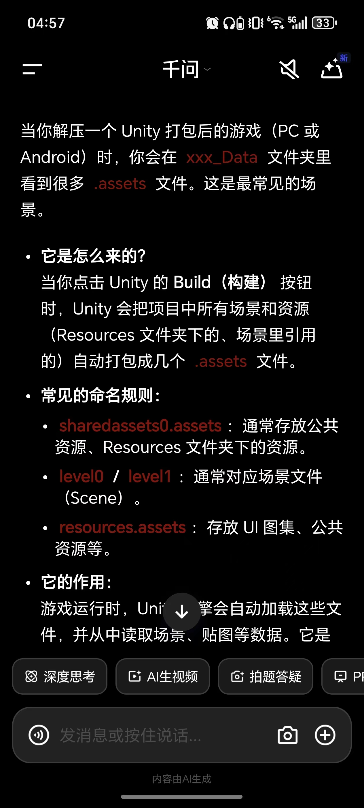
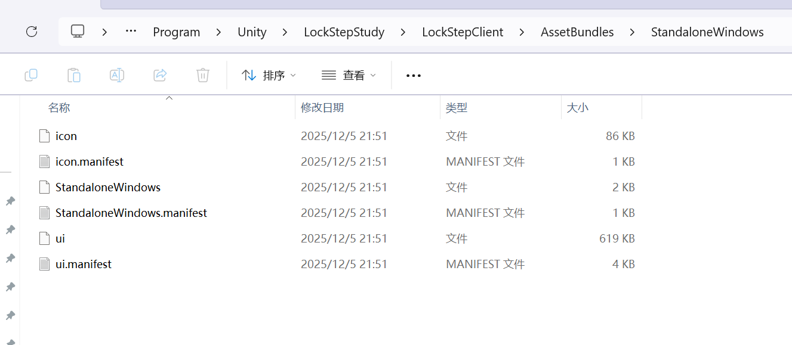
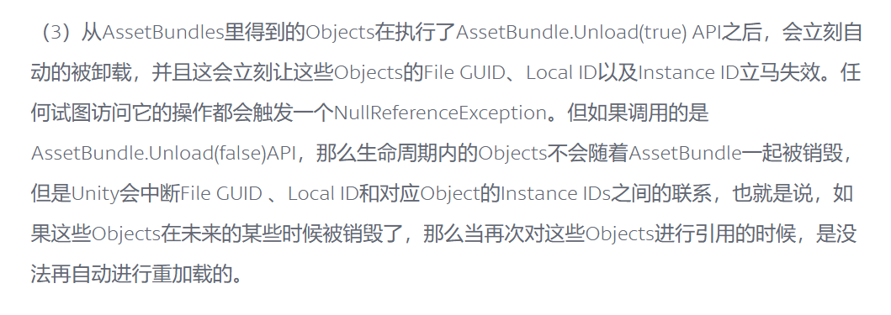
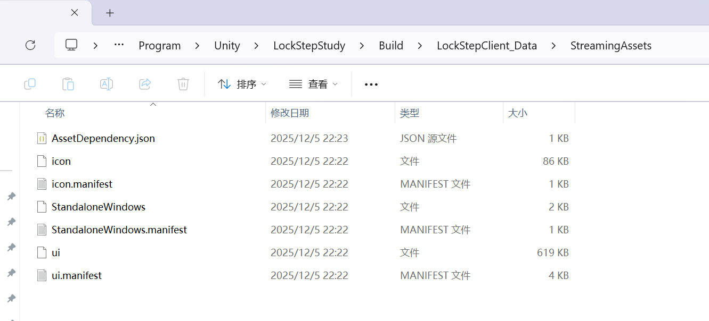

# Unity资源管理初探（二）

## AB包

AB包本质是一种压缩。压缩的是什么呢？其实就是.assets文件，ab包的SeriliazedFile，就是Unity打包完之后的.assets文件，或者说，只要ab包解压完之后，就是.assets。这些.assets文件才是打包后unity运行时的基础。ab包相当于一个快递员

AB包的物理存储单位是Block，逻辑上的单元是Serialized File，逻辑上的最小单元是精简后的Object数据，AB包里已经没有Asset或者Artifact的概念，只有Object

AB包有三层索引，第一层索引是根据Manifest或者自定义的系统找到的AB包，找到AB包之后，AB包是会维护AssetName和(FileGUID,LocalID）这个映射关系的。之后用FileGUID找到对应的SeriliaizedFile，第三层是用LocalID找到对应的Object。这个FileGUID是全局AB包唯一的

AB包里的prefab是如何索引其他AB包里的Texture的呢？答案也是通过FileGUID和LocalID。
prefab是一个yaml，如果在编辑器环境下他存储的是一个GUID和LocalID，用来找到Library下的artifact，打AB包的时候，是把yaml里转换为了AB里的FileGUID和LocalID了。这时候的FileGUID指向的就是SeriliazedFile了。
上面有提到默认的.assets和ab包里的SeriliazedFile本质上完全一样。因此他们的寻址方式我也是一样的。
只是说ab包是多个.assets文件压缩在一起，而默认的.assets是分开放，但是他们都有唯一的fileguid
同时，AB包的，AssetName和Fileguid以及Localid的映射是AB包喝开发者管理来管理的，但是默认assets是Unity管理的（其实二者最底层都还是Unity在管



## ManiFest

Manifest里存储了：包体之间的依赖关系，Manifest 主要负责存储包与包之间的依赖关系。虽然生成的 .manifest 文件里记录了包内包含的资源列表，但为了加载效率，我们通常会自己维护一套‘资源名 -> AB包名’的映射表。当调用 LoadFromFile 时，实际上只是把 AB 的头部索引信息加载进内存，只有真正调用 LoadAsset 时，系统才会根据索引去磁盘读取对应的资源数据。因此需要另外一个系统维护，AB包LoadFile的时候只是让它加载啥它加载啥

**Manifest分两种**

一个是主Manifest，这里不存Asset，只存有哪些AB包，以及这些AB包依赖哪些AB包，还有AB包的hash。
第二种是每个AB包对应的Manifest，这里面存储每个AB包对应的Asset，这个文件是YAML文件，一般都不用，而是自己维护一个映射，这一般是编辑器环境下AssetDatabase的GetALLDependense会使用。

上面这两种.manifest都是YAML格式的，都是给人看的，运行时大部分情况下删了也没事。

那么Unity是如何知道包之间的依赖关系的呢？答案是读主包，

比如下面这个例子里面，StadaloneWindows这个主包是以二进制的方式存储了所以的依赖关系，这个关系是Bundle级别的（而不是Asset级别的，实际上，原生的AB包是没法直接获得Asset依赖哪些包的，所以如果有这种需求就要自己写）



```c#
// 1. 加载二进制的【主包】
AssetBundle mainAB = AssetBundle.LoadFromFile("StandaloneWindows");

// 2. 从主包里【提取】清单对象（这个对象才是真正的依赖关系网）
AssetBundleManifest manifest = mainAB.LoadAsset<AssetBundleManifest>("AssetBundleManifest");

// 3. 询问：加载 A 包之前需要什么？
string[] deps = manifest.GetAllDependencies("hero.ab");
```


ps：.asset文件是ScriptableObject

## AB包API

[AssetBundle的原理及最佳实践 - UWA问答 | 博客 | 游戏及VR应用性能优化记录分享 | 侑虎科技](https://blog.uwa4d.com/archives/USparkle_Addressable3.html)

### 卸载

```c#
public void Unload(bool unloadAllLoadedObjects);
```

无论传入参数为 true 或是 false，调用Unload都可以Destroy当前AssetBundle对象

>  unloadAllLoadedObjects == true：

不仅Destroy了AssetBundle这个对象，而且**这个AssetBundle下包含的所有对象，只要实例化了，有一个算一个，统统释放掉。**

```c#
//类似于
foreach(Object  asset in assets){
	if(asset != null)｛
		delete asset;	
		asset = null;
	｝
｝
```

比如你通过ab.LoadAsset(apple)后，将apple设置给go_0的一个Renderer，如果这时候ab.Unload(true)，那go_0就傻了，咋回事儿啊，图咋没了呢

它的好处是：**不会有重复资源问题的情况发生，每次都处理的干干净净。**

> unloadAllLoadedObjects == true：

仅仅Destroy了AssetBundle这个对象，但是并没有释放这个AssetBundle下的任何Asset，因此如果有对象引用了这些Asset，也不会有问题。

它的风险(代价)是：下次再Load这个AssetBundle，并且通过这个AssetBundle重新读取了这个Asset，会在内存中重新创建一份，这样如果之前的Asset没有被释放，那么现在内存中就有两份Asset了。



### 加载

#### LoadAssetWithSubAsset

值得说的是LoadAssetWithSubAsset

我们知道在 **SerializedFile**（AB包内部的二进制数据块）中，所有东西确实都是以 **Object**（Unity 原生对象）的形式平铺存储的。这是物理层的存储方式，但是在逻辑上，依然存在者从属关系，也就是主资源和子资源

比如一个 FBX 里的资源在 SerializedFile 里可能是这样的：

- Object 1 (Local ID: 1): `GameObject` (英雄模型)
- Object 2 (Local ID: 2): `Mesh` (英雄网格)
- Object 3 (Local ID: 3): `AnimationClip` (跑步动画)

从 SerializedFile 的角度看，它们是**平等**的，都是一段二进制数据。但是逻辑上是有从属关系的

Unity 在打包 AB 包时，需要知道：**“如果用户只加载这个包里的 'Hero'，我该把哪个对象给他？”**

- **主资源 (Main Asset)**：这是你在文件夹里能看到的那个物理文件本身。比如 `Hero.fbx`。当你请求加载这个名字时，Unity 默认返回对应的 `GameObject`。
- **子资源 (Sub Asset)**：这是**“寄生”**在主文件里的对象。它们没有独立的磁盘文件（你没法在 Windows 资源管理器里看到 `Run.anim`，它被锁在 `Hero.fbx` 里）。

如果我们向直接获取FBX的Mesh这个Object，就要用这个方法。这个好处是它只会加载需要加载的子资源，不会导致所有的东西被全部加载进来。


## Resources和StreamingAssets

Resources下的资源，会被直接打包进.assets里面

而StreamingAssets也会一起被打包，但是区别是，他没有被二进制化，也就是他没有被塞进.assets里，而是被原模原样的放到了StreamingAssets文件夹下



如何使用StreamingAssets呢。使用的时候需要先把它手动拿出来，放在PersistentDataPath路径下的沙盘里:

```c#
IEnumerator CopyAssets()
{
    // 1. 源路径 (在 APK 包肚子里，只读)
    string srcPath = Application.streamingAssetsPath + "/data.json";
    
    // 2. 目标路径 (在手机沙盒里，可读写)
    string destPath = Application.persistentDataPath + "/data.json";

    // 3. 必须通过网络请求的方式去“下载”本地的 StreamingAssets 文件 (Android特供坑点)
    var request = UnityWebRequest.Get(srcPath);
    yield return request.SendWebRequest();

    // 4. 手动写入沙盒
    File.WriteAllBytes(destPath, request.downloadHandler.data);
    
    Debug.Log("复制完毕，现在你可以修改这个 json 了");
}
```


在实际的商业游戏框架（比如基于 Addressables 或自己写的管理器）中，为了兼顾**“包体小”**和**“能热更”**，通常采用**“不主动复制，按需查找”**的策略。也就是：
```c#
public string GetReadablePath(string fileName)
{
    // 1. 先去沙盒（Persistent）找，看有没有“下载过的新版本”
    string sandBoxPath = Application.persistentDataPath + "/" + fileName;
    if (File.Exists(sandBoxPath))
    {
        return sandBoxPath; // 找到了！用新的！
    }

    // 2. 如果沙盒里没有，说明没更新过，那就用包里自带的（Streaming）
    // 注意：安卓下这里返回的路径只能用 WebRequest 读，不能用 File.IO 读
    return Application.streamingAssetsPath + "/" + fileName; 
}
```

有一种方法是这样的：对于一个游戏，默认的一些资源放在StreamingAssets下，第一次启动的时候，就把他放进persistentDataPath下，而之后启动的时候就不用再Copy了，而是直接看persistentDataPath下面的就可以了，而后续的更新也直接更新到persistentDataPath下就可以了。

还可以如果默认启动的情况下persistentDataPath下没东西，就用SteamingAssets下的资源（不复制到persistentDataPath的缺点是，SteamingAssets是只读的，没法真的持久化，而persistentDataPath下则是可以存储所有需要持久化的东西），而之后更新了，就用persistentDataPath下的资源了，也就是上面代码给出的逻辑


## 问题

### 1.  运行时加载贴图

运行时加载贴图成本很大，因为我们知道如果提前导入贴图，他会被Importer导出为二进制的Object，这个Object是C++内存的序列化后的结果。但是如果运行时加载的话，就需要在运行时编码

所以要尽可能提前导入

### 2. 打包的时候有什么会被打进包体里

1. Resources下所有文件，会被打包进.assets

2. Assets下，非Resources的，是按需打包。

   比如：场景里的某个脚本有一个 `public GameObject myPrefab;` 变量，并且你把这个预制体**拖拽赋值**给了它。Unity 顺着场景找到了这个预制体，它会被打包进 `sharedassets.assets` 文件里

   注意：代码引用不算数，假设你有一个预制体 `Enemy.prefab` 在 Assets 文件夹下，**没有**在场景里引用它，但是你写了这行代码：

   ```c#
   // 这里的代码虽然写了名字，但 Unity 打包引擎看不懂这个字符串关联
   GameObject go = AssetDatabase.LoadAssetAtPath("Assets/Enemy.prefab");
   ```

   这个预制体会被剔除