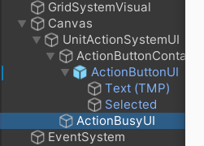

# 战旗项目技术总结

C# Lambda表达式

BaseAction是所有Action 的基类，然后所有Action调用的时候都通过实现一个TakeAction方法。不同的Action可能需要不同的参数传入，那么就用继承的方法封装参数

```c#
class BaseParam{
    
}
class MoveParam:BaseParam{
    
}
class SpinParam:BaseParam{
    
}
```

3. 检测鼠标指针位于UI上方：

```c#
//
if (EventSystem.current.IsPointerOverGameObject())
{
   return;
}
```

4. UI系统选中一个Acition

ActionSystem暴露一个SelectedAction接口。然后选中的时候，让UI Listener调用这个选中的接口。如果选中，就把baseAction传给ActionSystem

```c#
//UI:
button.Listener(()=>{
	ActionSystem.Instance.SetSelectedAction(baseAction);
});

```

5. UI变化用事件触发来替代Update

6. UICanvas上的顺序是渲染顺序（按照画家算法，从上向下渲染， 因此Hierarchy的Canvas排序中，下面的就是在上方

（ActionBusyUI会绘制在ActionButtonUI上方，覆盖住了）

