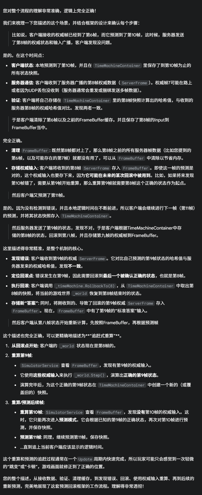
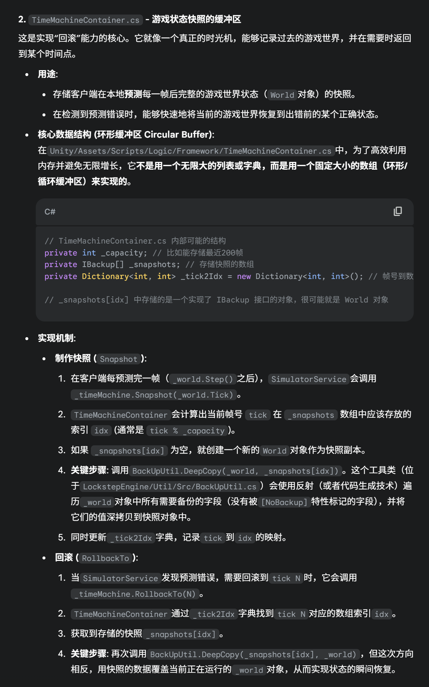
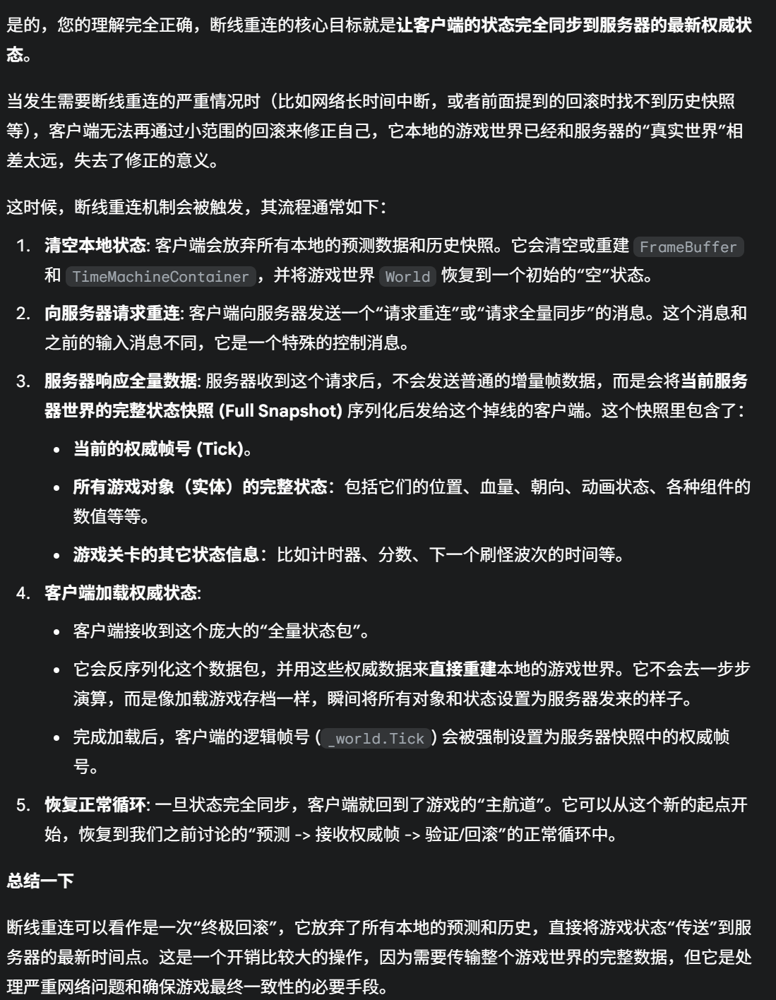

1. 选择什么协议

2. 客户端：

   1. 存储的Buffer如何实现

      1. 客户端接收的权威帧已经到了第6帧，而它预测到了第10帧，这时候，服务器发送了第8帧的权威状态和输入广播，客户端发现没问题。于是客户端清除了第6帧以及之前的FrameBuffer缓存。并且保存了第8帧的Input到FrameBuffer当中。 

          然后客户端又预测了第11帧。 

          然后服务器发送了第9帧的状态，发现不对，于是客户端根据TimeMachineContainer中存储的第8帧的状态，回滚到第八帧，并且存储第九帧的权威帧到FrameBuffer。然后客户端从第八帧状态开始重新计算，先按照FrameBuffer，再根据预测帧

         

      2. FrameBuffer:**`FrameBuffer.cs`**: 只存储从**服务器**接收到的**权威帧数据 (`ServerFrame`)**。你可以把它看作是“标准答案”的存放地。它的作用是为回滚和追帧提供正确的输入和哈希值。

         

      3. 状态Buffer:

         

   2. 保留多少用于回滚的备份，如果超过了要求的上限怎么办？

      1. 由于 `TimeMachineContainer` 是一个**环形缓冲区 (Circular Buffer)**，它的设计天然地处理了“超过上限”的问题。

      2.  **最新的快照会自动覆盖掉最旧的快照**。例如，如果缓冲区容量是200帧（索引0-199），当客户端需要制作第201帧的快照时，它会覆盖掉第1帧的快照数据。

      3. 系统**不会**因为超过上限而崩溃或报错，而是会自然地丢弃掉最老旧的历史记录。这是一种“先进先出”（FIFO）的策略。正常情况下，只要网络延迟不至于大到超过整个缓冲区的时长，这个机制就能良好运作。如果真的发生了需要回滚的帧数超过了缓冲区容量的极端情况，那就意味着客户端已经无法自行恢复，通常会触发断线重连逻辑。（也就是说，如果发生了无法回滚到正确过去状态的情况下，就直接断线重连）

          

   3. 如果客户端预测超过规定的帧，服务器还没有发来权威帧信息，怎么办？

      1. 最大预测帧数” (Max Prediction Frames)，冻结游戏逻辑 (Stall/Freeze

         ```c#
         // 在 SimulatorService.cs 的 Update 方法中
         
         private void Update(){
             // ... 其他逻辑 ...
         
             // 从 FrameBuffer 获取服务器最新帧号
             int latestServerTick = _frameBuffer.LatestServerTick; 
         
             // 检查是否预测超前过多 (假设阈值是30帧)
             const int MAX_PREDICTION_FRAMES = 30;
             if (_world.Tick > latestServerTick + MAX_PREDICTION_FRAMES) {
                 // 预测帧数超过上限，暂停逻辑更新
                 Debug.Log("Waiting for server frames...");
                 // 可以触发一个UI事件，显示“正在追赶/网络延迟”的图标
                 GlobalState.EventHelper.Trigger(EEvent.OnStall, true); 
                 return; // 不再执行后续的 _world.Step()
             }
         
             // 如果之前暂停了，现在恢复了，就隐藏UI
             GlobalState.EventHelper.Trigger(EEvent.OnStall, false); 
         
             // ... 继续正常的预测执行 ...
             _world.Step();
         
             // ...
         }
         ```

         

   4. 回滚的时候，如何回滚，如何备份。

      1. 序列化和反序列化，如何特殊处理引用类型和值类型
      2. 不同平台字节序的支持

   5. 如何校验预测的帧是否符合预期？（保存的是状态还是操作，通过什么校验）

      > 服务器也会模拟一个权威帧的状态，算一个hashcode，然后和input一起发送。对于客户端来说，保存的序列化的也是状态，然后比较的就是hashcode是否一致
      >
      > Q： 这样比起对比预测操作帧是否和权威的操作一样有什么优点和缺点
      >
      > A: 缺点就是计算量大，优点是这样是真的完全保证了状态一致，因为有可能输入一样结果不同，直接对比状态是最权威的校验（有可能是浮点数啊，外部状态不同步啊，随机数不一致啊），状态哈希能够暴露这种问题，调试很好；游戏逻辑可能非常复杂，多个系统之间的交互可能产生意料之外的状态差异，即使原始输入看起来相同。状态哈希直接对比最终结果，更能保证状态的最终一致性。
      >
      > 这还有一个好处，类似于TCp的Ack机制，就是如果我本地帧预测了几个帧之后状态一致，那就不需要管过去几个input的广播是否准确了

3. 服务器：

   1. Request的格式：
   
      操作码+数据
   
      > S2C（服务器发往客户端）的操作码有以下几个：
      >
      > - `None = 0`: 无
      > - `Lobby_PlayerReady = 1`: 大厅 - 玩家准备就绪
      > - `Lobby_AllPlayerReady = 2`: 大厅 - 所有玩家都已准备就绪
      > - `Lobby_EnterBattle = 3`: 大厅 - 进入战斗
      > - `Battle_GameStart = 100`: 战斗 - 游戏开始
      > - `Battle_Input = 101`: 战斗 - 游戏输入
      > - `Battle_PlayerExit = 102`: 战斗 - 玩家退出
      > - `Battle_Reconnect = 103`: 战斗 - 重连
      > - `Battle_AllFinished = 104`: 战斗 - 所有人都已完成
      > - `Room_JoinRoom = 200`: 房间 - 加入房间
      > - `Room_ExitRoom = 201`: 房间 - 退出房间
      > - `Room_OtherPlayerJoin = 202`: 房间 - 其他玩家加入
      > - `Room_OtherPlayerExit = 203`: 房间 - 其他玩家退出
      > - `Room_PlayerReady = 204`: 房间 - 玩家准备就绪
      > - `Room_PlayerCancelReady = 205`: 房间 - 玩家取消准备
      > - `Room_MasterChange = 206`: 房间 - 房主变更
      > - `Room_StartGame = 207`: 房间 - 开始游戏
      > - `Player_Login = 300`: 玩家 - 登录
      > - `Player_CreateRole = 301`: 玩家 - 创建角色
      >
      > ### 2. 客户端到服务器 (C2S) 的消息操作码
      >
      > C2S（客户端发往服务器）的操作码没有统一在单个枚举中，而是作为常量定义在具体的消息定义文件里，例如 `MsgDefine_Login.cs`。
      >
      > 根据 `Server/Src/LockstepEngine/Src/LockstepEngine/NetMsg.Common/Src/MsgDefine_Login.cs` 文件，C2S 的操作码目前能看到以下几个：
      >
      > - `Login = 10001`: 登录
      > - `PlayerInput = 10002`: 玩家输入
      > - `ReqMissFrame = 10003`: 请求丢失的帧
      > - `Ping = 10004`: Ping
   
   2. 请求丢失的帧的逻辑：
   
      1. 客户端这边，如果收取到的服务器的帧号大于了期望收到的逻辑帧的帧号，那么说明存在断层，因此向服务器发送请求请求最大帧的下一帧
   
      ```c#
      // in FrameBuffer.cs
      public void AddFrame(ServerFrame frame){
          // ... (省略部分代码)
      
          // a. 如果收到的帧比期望的帧要晚，说明中间有断层
          if (frame.tick > _maxServerTick + 1) {
              // 请求补帧
              // RequestReSend(from, to)
              // 请求从我当前最大帧的下一帧，直到这个晚到帧的前一帧
              RequestMissFrame(_maxServerTick + 1, frame.tick - 1);
          }
      
          // b. 更新处理过的最新帧号
          if (frame.tick > _maxServerTick) {
              _maxServerTick = frame.tick;
          }
      
          // c. 将帧存入缓存
          _frames[frame.tick] = frame;
      }
      ```
   
      > `_maxServerTick` 记录了客户端当前已连续收到的最大帧号。
      >
      > 当 `AddFrame` 方法收到一个 `frame` 时，它会检查 `frame.tick` 是否大于 `_maxServerTick + 1`。
      >
      > **举例**: 如果客户端已有的最新连续帧是第100帧 (`_maxServerTick = 100`)，此时突然收到了第103帧。`103 > 100 + 1` 条件成立，说明第101和102帧丢失了。
      >
      > 此时，客户端就会调用 `RequestMissFrame(101, 102)` 方法，去请求补发这两帧。
   
      **发送请求**: `RequestMissFrame` 方法会创建一个 `Msg_ReqMissFrame` 类型的消息，并通过网络服务发送出去。
   
      ```c#
      
      // in FrameBuffer.cs
      private void RequestMissFrame(int from, int to){
          // 向服务器发送，请求补帧
          var msg = new Msg_ReqMissFrame();
          msg.StartTick = from;
          msg.EndTick = to;
          _network.Send(msg); // _network 是对 NetworkService 的引用
          Debug.Log($"Request miss frame from {from} to {to}");
      }
      ```
   
      这个 Msg_ReqMissFrame 对象的定义可以在 Server/Src/LockstepEngine/Src/LockstepEngine/NetMsg.Common/Src/MsgDefine_Login.cs 找到，它包含了起始和结束的帧号。
   
      2. 服务器那边会处理这个操作码：
   
      **实现机制**: 在 `Game.cs` 的 `Dispatch` 方法（或类似的消息分发中心）中，会处理来自客户端的请求。
   
      ```c#
      // in Game.cs (示意逻辑)
      public void Dispatch(Player player, BaseMsg msg){
          // 根据操作码进行分发
          switch (msg.OpCode) {
              // ...
              case C2S_MSG_REQ_MISS_FRAME: // C2S_MSG_REQ_MISS_FRAME 是常量 10003
                  HandleReqMissFrame(player, msg as Msg_ReqMissFrame);
                  break;
              // ...
          }
      }
      ```
   
      **处理请求**: `HandleReqMissFrame` 方法会执行以下操作：
   
      - 它接收到 `Msg_ReqMissFrame` 消息后，从中解析出客户端需要的 `StartTick` 和 `EndTick`。
      - 服务器自身在广播权威帧的同时，也会将这些帧缓存起来（例如，在一个名为 `_allFrames` 的 `Dictionary<int, ServerFrame>` 中）。
      - 服务器会遍历客户端请求的从 `StartTick` 到 `EndTick` 的范围。
      - 对这个范围内的每一帧，从 `_allFrames` 缓存中取出对应的 `ServerFrame` 对象。
      - **将这些找出来的帧数据，重新发送给发起请求的那个 `player`**。
   
      ```c#
      // in Game.cs (示意逻辑)
      private void HandleReqMissFrame(Player player, Msg_ReqMissFrame msg){
          Debug.Log($"HandleReqMissFrame {msg.StartTick} {msg.EndTick}");
          // 从历史记录中找到丢失的帧
          for (int i = msg.StartTick; i <= msg.EndTick; i++) {
              if (_allFrames.TryGetValue(i, out var frame)) {
                  // 将找到的帧重新发给该玩家
                  player.Send(frame);
              }
              else {
                  // 如果服务器自己都没有这帧的记录（理论上不应发生），则记录一个错误
                  Debug.LogError("cannnot find frame " + i);
              }
          }
      }
      ```
   
      整个补帧逻辑形成了一个闭环：
   
      1. **客户端发现断层**: 收到一个“跳跃”的帧号，意识到中间有帧丢失了。
      2. **客户端发起请求**: 发送一个 `Msg_ReqMissFrame` 消息，明确告知服务器“我需要从X帧到Y帧的数据”。
      3. **服务器响应请求**: 服务器收到请求后，从自己的历史缓存中查询这些帧。
      4. **服务器补发数据**: 服务器将找到的丢失帧，重新定向发送给该客户端。
      5. **客户端接收补发**: 客户端的 `FrameBuffer` 收到补发的帧，调用 `AddFrame` 将这些“坑”填上，状态同步得以恢复。
   
   3. 为了满足补帧的要求，服务器也需要有一个字典来存储权威帧，是一个Dictionary，并且有一个滑动窗口机制来清除一定时间后的帧缓存。