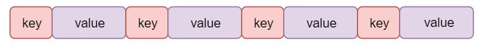
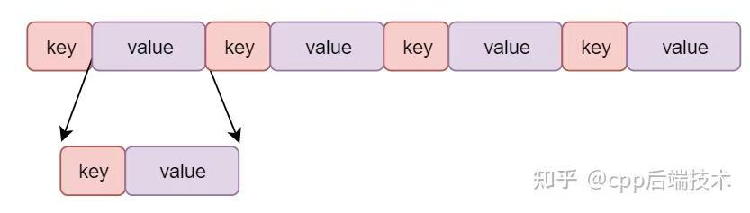

# ProtoBuf

ProtoBuf是一种，序列化反序列化的手段

当然XML，Json也是，但是比起那种原模原样的序列化，ProtoBuf采用了一些压缩的技术

## Varint

对于Int32，int64，bool，enum这些，proto使用一种叫做Varint的编码类型。

简单来说，对于proto中的一个字节，只有七个bit的数据位是有效载荷。第一个bit是用来标识，下一个bit是否可以用来作为当前的数字来解释

> 重要：Varint是小端序

例1 ： 比如现在来了一串二进制：1010 1100 0000 0010

这里显然是两个字节

先取出第一个字节：1010 1100。这个字节的第一个bit是1 表示接下来的那个字节还要加入当前这个数字的解析当中，去掉首位的1之后，剩下的是[0]010 1100。Varint是小端序，说明，当前这个0010 1100是低位

因为首位为1，所以接着解析下一个字节：0000 0010。首位是0，因此不需要接着往下看了，这个数字到这里为止了。这里剩下的是 [0]000 0010。

我们把它转化为大端序来可读： 000 0010 << 7 | 010 1100。也就是，高位的左移7位，也即是000 0010 <<7 然后加低位的7位 。合在一起就是：10010 1100，这是300.只用一个字节就表示出了300

例2 ：再比如 127 ： 1000 0001

由于只有7位的载荷，因此127会被转换为：

低七位：000 0001 加上一个1的开头表示还没结束=> [1]000 0001

最高位的1溢出了，高七位：000 0001，加上一个开头的0，表示结束了：[0]000 0001

现在传输的就是（小端序）： 1000 0001 0000 0001

现在解码： 提取 [1]000 0001，剩下七位：000 0001

提取：[0]000 0001 ,剩下七位：000 0001

高位左移7位：1000 0000，和低位取或 ： 1000 0000 | 000 0001 => 1000 0001

完美！

但是这个算法只能解决无符号数

## ZigZag ： 有符号数

因为在有符号数当中，都是用补码表示，负数的最高位一定是（最左侧的）1

按照上面的例2，最高位是1的话，就要一直补，一直补，所以对于64位负数补码来说，都要统一用10个字节：（因为64/7向上取整是10）


ZigZag 编码就是解决这个问题的，他会把有符号数字，统一的映射为无符号数字

| 原始信息    | 编码后     |
| ----------- | ---------- |
| 0           | 0          |
| -1          | 1          |
| 1           | 2          |
| -2          | 3          |
| 2           | 4          |
| -3          | 5          |
| 3           | 6          |
| 2147483647  | 4294967294 |
| -2147483648 | 4294967295 |

接受之后再转换为有符号数字就可以了

## Float

对于float这种浮点数来说。对于小端序Proto就是直接memoryCopy的

## 字段名和字段类型（Tag）

一个问题

对于int i =100来说，我们需要明确：

接下来这个变量叫做：i。i的类型是int。i的值是100

proto采用keyValue的方法。value是值，也就是上面说的Varint和Float。Key则是字段名和字段类型合在一起。同时字段名也不需要真的穿名字，只需要客户端服务器用同一份Proto导出的代码，里面对变量名统一编号，就能用字段编号表示字段名了。而类型，proto只有6种类型，因此也只需要3位就可以表示，这个key，叫做Tag

```
Tag = (字段名编号 << 3) | 字段类型
```

字段类型就是Wire Type



比如server收到了：一个kV：

key ： 0000 1000

后三位为000，解释为Varint，前面是：0000 1，也就是1对应的字段名编号

### 嵌套类型

对于嵌套类型：

```protobuf
message SubMsg{
	optional int32 id =1,
}
```

也遵循kv的逻辑，只是内部的sub字段也由kv表示：



## 字符串类型：

对于字符串，Proto采用的是长度前缀的编码：也就是Tag - Length - Value

Tag上面说过了，Length是一个Varint编码的数字，表示后面的字符串有多少个字节，Value就是真是的字节内容，用的是UTF-8

## Reference：

https://zhuanlan.zhihu.com/p/633656133?share_code=1kXmeRycLZHLN&utm_psn=1981177878906429976