# DX12-组件

## 1. CommandAllocator和CommandList

放入List的命令实际上是存储在Allocator上的

> CommandAllocator：Represents the allocations of storage for graphics processing unit (GPU) commands.

也就是说，CommandList的逻辑操作和实际存储是分开的。从逻辑上，我们希望把命令存放如CommandList里面，但是在实际的存储上，命令的引用保存在CommandAllocator里面。

这就使得，我们可以分开操作逻辑和实际存储。

比如在相邻的两帧里面，在第一帧里，我们的CommandList绑定的是CommandAllocator_A，在GPU对命令进行处理的时候，是CommandAllocator_A在维护命令在内存中的存储，因此CommandAllocator_A不能被Reset，但是，CommandList可以被Reset并与CommandAllocator_B绑定，这时就可以在第二帧里面先对CommandAllocator_B存入新的命令，然后等CommandAllocator_A上的命令处理完之后，就直接交付CommandAllocator_B。

一个CommandAllocator可以和多个CommandList绑定。

Ref:

[【D3D12学习手记】The Command Queue and Command Lists ](https://www.cnblogs.com/heben/p/11324758.html)

[DX12学习笔记(龙书)（小点3：命令队列和命令列表）_dx12命令队列在那个内存里-CSDN博客](https://blog.csdn.net/killian0213/article/details/106437313)


## 2. 几种View的创建

### 2.1. RTV(SwapChain)

> 在SwapChain创建的时候，就已经创建好了对应数量的缓冲区资源，这里的GetBuffer，只是获取已经创建好的缓冲区资源的指针进行操作。


```c++
Microsoft::WRL::Comptr<ID3D12Resource> mSwapChainBuffer[2];
CD3DX12_CPU_DESCRIPTOR_HANDLE rtvHeapHandle(mRtvHeap
                                            	->GetCPUDescriptorHandleForHeapStart());
for (UINT i = 0; i < SwapChainBufferCount; i++)
{
	mSwapChain->GetBuffer(i, IID_PPV_ARGS(&mSwapChainBuffer[i]));
	md3dDevice->CreateRenderTargetView(mSwapChainBuffer[i].Get(), nullptr, rtvHeapHandle);
	rtvHeapHandle.Offset(1, mRtvDescriptorSize);
}
```

> RTV不只是与SwapChain绑定。在 Direct3D 12 中，非交换链（SwapChain）使用的渲染目标视图（RTV）可以用于多种用途，如渲染到纹理、执行后处理效果、生成动态纹理等。

### 2.2. DSV

```c++
Microsoft::WRL::Comptr<ID3D12Resource> mDepthStencilBuffer;
//创建Buffer
D3D12_RESOURCE_DESC depthStencilDesc;
//...
D3D12_CLEAR_VALUE optClear;
//...
md3dDevice->CreateCommittedResource(
        &CD3DX12_HEAP_PROPERTIES(D3D12_HEAP_TYPE_DEFAULT),
		D3D12_HEAP_FLAG_NONE,
        &depthStencilDesc,
		D3D12_RESOURCE_STATE_COMMON,
        &optClear,
        IID_PPV_ARGS(mDepthStencilBuffer.GetAddressOf()));

//关联View和Buffer
D3D12_DEPTH_STENCIL_VIEW_DESC dsvDesc;
CD3DX12_CPU_DESCRIPTOR_HANDLE dsvHandle=mDsvHeap->GetCPUDescriptorHandleForHeapStart()
md3dDevice->CreateDepthStencilView(mDepthStencilBuffer.Get(), 
                                   &dsvDesc, 
                                   dsvHandle);
//把Resource从Initial state转换为Depth buffer
mCommandList->ResourceBarrier(1, &CD3DX12_RESOURCE_BARRIER::Transition(mDepthStencilBuffer.Get(),
		D3D12_RESOURCE_STATE_COMMON, D3D12_RESOURCE_STATE_DEPTH_WRITE));
```


### 2.3. CBV

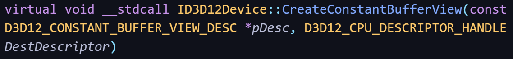

```c++
	D3D12_CONSTANT_BUFFER_VIEW_DESC cbvDesc;
	cbvDesc.BufferLocation = cbAddress;
	cbvDesc.SizeInBytes = d3dUtil::CalcConstantBufferByteSize(sizeof(ObjectConstants));

	md3dDevice->CreateConstantBufferView(
		&cbvDesc,
		mCbvHeap->GetCPUDescriptorHandleForHeapStart());
```


> 在 Direct3D 12 中，`D3D12_CONSTANT_BUFFER_VIEW_DESC` 需要填写常量缓冲区的虚地址（即缓冲区的起始位置和大小），而其他视图（如 RTV 和 DSV）只需要传递资源的指针，这是由于它们的用途和要求不同。下面详细解释这些差异：
>
> ### **常量缓冲区视图 (CBV) 的创建**
>
> **用途**: 常量缓冲区视图（CBV）用于将常量数据传递给着色器。常量缓冲区通常在 GPU 内部进行处理，因此需要特别注意如何描述数据的布局和起始位置。
>
> **为什么需要虚地址**:
>
> - **缓冲区布局**: 常量缓冲区数据在 GPU 上的存储方式是线性布局的。为了正确地将常量数据传递到着色器阶段，Direct3D 12 需要知道缓冲区中数据的起始位置和大小。这就是为什么 `D3D12_CONSTANT_BUFFER_VIEW_DESC` 需要提供常量缓冲区的虚地址（起始位置）和大小。
> - **缓冲区大小对齐**: 常量缓冲区的大小通常需要对齐（例如，16 字节对齐）。提供虚地址和大小有助于确保数据的正确对齐，从而避免潜在的 GPU 错误。
> - **资源绑定**: 常量缓冲区视图描述符（CBV）需要准确的缓冲区起始地址，以便着色器能够正确地访问这些常量数据。`D3D12_CONSTANT_BUFFER_VIEW_DESC` 中的 `BufferLocation` 成员指定了常量缓冲区的起始位置，而 `SizeInBytes` 指定了缓冲区的大小。
>
> 在 Direct3D 12 中，`D3D12_CONSTANT_BUFFER_VIEW_DESC` 需要填写常量缓冲区的虚地址（即缓冲区的起始位置和大小），而其他视图（如 RTV 和 DSV）只需要传递资源的指针，这是由于它们的用途和要求不同。下面详细解释这些差异：
>
> ### 1. **常量缓冲区视图 (CBV) 的创建**
>
> **用途**: 常量缓冲区视图（CBV）用于将常量数据传递给着色器。常量缓冲区通常在 GPU 内部进行处理，因此需要特别注意如何描述数据的布局和起始位置。
>
> **为什么需要虚地址**:
>
> - **缓冲区布局**: 常量缓冲区数据在 GPU 上的存储方式是线性布局的。为了正确地将常量数据传递到着色器阶段，Direct3D 12 需要知道缓冲区中数据的起始位置和大小。这就是为什么 `D3D12_CONSTANT_BUFFER_VIEW_DESC` 需要提供常量缓冲区的虚地址（起始位置）和大小。
> - **缓冲区大小对齐**: 常量缓冲区的大小通常需要对齐（例如，16 字节对齐）。提供虚地址和大小有助于确保数据的正确对齐，从而避免潜在的 GPU 错误。
> - **资源绑定**: 常量缓冲区视图描述符（CBV）需要准确的缓冲区起始地址，以便着色器能够正确地访问这些常量数据。`D3D12_CONSTANT_BUFFER_VIEW_DESC` 中的 `BufferLocation` 成员指定了常量缓冲区的起始位置，而 `SizeInBytes` 指定了缓冲区的大小。
>
> ```
> cpp复制代码D3D12_CONSTANT_BUFFER_VIEW_DESC cbvDesc = {};
> cbvDesc.BufferLocation = bufferResource->GetGPUVirtualAddress();
> cbvDesc.SizeInBytes = bufferSize;
> device->CreateConstantBufferView(&cbvDesc, cbvHeap->GetCPUDescriptorHandleForHeapStart());
> ```
>
> ### **渲染目标视图 (RTV) 和深度-模板视图 (DSV) 的创建**
>
> **用途**: 渲染目标视图（RTV）和深度-模板视图（DSV）用于指定渲染目标和深度-模板缓冲区。它们告诉 GPU 应该如何处理渲染到的图像数据或深度数据。
>
> **为什么只需要资源指针**:
>
> - **资源格式和用法**: RTV 和 DSV 主要关注的是资源的格式和如何使用这些资源。它们并不直接涉及数据的内存布局或对齐，而是处理图像数据的输出和深度测试。因此，创建这些视图时，只需要指定资源对象和视图描述符即可。
> - **资源绑定**: 渲染目标和深度-模板视图描述符（RTV 和 DSV）描述了如何将资源映射到渲染管线。视图描述符指定了资源的格式和用途，但不需要额外的虚地址或内存布局信息，因为这些信息已经在创建资源时确定了。

## 3.SwapChain->Present()

`SwapChain::Present` 函数是 Direct3D 12 中用于将渲染完成的图像呈现到屏幕上的关键函数。它的主要作用是将交换链中的后台缓冲区切换到前台，从而显示最终的图像。这个过程涉及将渲染管线中的渲染结果提交给显示设备。以下是 `Present` 函数的详细说明和工作原理：

### 3.1`Present` 函数的作用

1. **交换前台和后台缓冲区**:
   - **背景**: 交换链（Swap Chain）包含一个或多个后台缓冲区，这些缓冲区用于存储渲染结果。每次渲染操作完成后，渲染结果被写入后台缓冲区。
   - **`Present` 调用**: 当你调用 `SwapChain::Present` 时，交换链会将当前的后台缓冲区切换到前台显示，显示设备（如显示器或窗口）将显示该缓冲区的内容。这意味着将当前帧的图像呈现给用户，并准备好下一个缓冲区用于新的渲染。
2. **刷新显示**:
   - **屏幕更新**: `Present` 函数会触发显示器的屏幕刷新，使得用户看到最新的图像。它是同步显示和渲染过程的关键。
3. **等待垂直同步（V-Sync）**:
   - **垂直同步**: `Present` 函数可以选择等待垂直同步（V-Sync），这意味着在屏幕的垂直刷新周期结束后再进行缓冲区交换。这样可以减少图像撕裂（tearing）现象，并确保图像在屏幕上平滑显示。

### 3.2`Present` 函数的使用

**函数签名**:

```
cpp复制代码HRESULT Present(
    UINT SyncInterval,
    UINT Flags
);
```

**参数说明**:

- **`SyncInterval`**: 控制是否启用垂直同步（V-Sync）的间隔。常用的值包括：
  - `0`：不等待垂直同步，立即交换缓冲区（可能导致图像撕裂）。
  - `1`：等待垂直同步，确保图像在屏幕刷新周期的开始时交换缓冲区。
  - 大于 `1` 的值表示等待更多的垂直同步周期。
- **`Flags`**: 目前通常设置为 `0`。该参数可以用于设置特定的标志，但在大多数情况下，它不需要使用。

**代码示例**:

```
cpp复制代码// 完成渲染后，调用 Present 将当前的后台缓冲区呈现到前台
HRESULT hr = swapChain->Present(1, 0);
if (FAILED(hr)) {
    // 处理错误
}
```

### 3.3`Present` 函数的工作流程

1. **将后台缓冲区提交到前台**:
   - `Present` 将当前后台缓冲区（显示的图像）切换到前台。
   - 显示设备（显示器）现在显示的是最新渲染的内容。
2. **处理缓冲区循环**:
   - 交换链通常有多个后台缓冲区，`Present` 可能会将其中一个缓冲区切换到前台，并将其他缓冲区用于新的渲染操作。
3. **处理 V-Sync**:
   - 如果 `SyncInterval` 非零，`Present` 会等待显示器的下一次垂直刷新周期，这有助于减少图像撕裂和提高显示的平滑性。
4. **管理渲染循环**:
   - `Present` 通常是渲染循环的最后一步，标志着一帧渲染的完成，并准备开始下一帧的渲染。

### 3.4总结

`SwapChain::Present` 函数在 Direct3D 12 的渲染管线中扮演了关键角色：

- **切换缓冲区**: 将渲染的图像提交到前台显示。
- **同步显示**: 可以选择等待垂直同步，减少图像撕裂。
- **刷新屏幕**: 更新屏幕显示，呈现最新的图像给用户。

理解 `Present` 的作用和参数有助于优化渲染性能，并确保图像在屏幕上平滑显示。

## 4. ComPtr

Get和GetAddressOf有什么区别

在 DirectX 12 和 COM 编程中，`ComPtr` 类提供了两个重要的方法用于处理 COM 对象：`Get` 和 `GetAddressOf`。它们有不同的用途和行为：

### 4.1`Get`

**`Get`** 方法用于获取 `ComPtr` 内部封装的原始 COM 接口指针。

- **用途**：当你需要获取原始的 COM 接口指针以便于与其他 API 交互时使用。
- **返回值**：返回一个原始的指针（即 `T*`），指向 COM 接口。
- **行为**：不会更改 `ComPtr` 的引用计数，也不会修改 `ComPtr` 对象的状态。

**示例**：

```
cpp复制代码#include <d3d12.h>
#include <wrl.h>

using namespace Microsoft::WRL;

int main() {
    ComPtr<ID3D12Device> device;
    HRESULT hr = D3D12CreateDevice(nullptr, D3D_FEATURE_LEVEL_11_0, IID_PPV_ARGS(&device));
    if (FAILED(hr)) {
        return -1;
    }

    // 获取原始 COM 接口指针
    ID3D12Device* rawDevicePointer = device.Get();
    rawDevicePointer->GetNodeCount(); // 调用原始指针的方法

    return 0;
}
```

在这个示例中，`device.Get()` 返回一个原始的 `ID3D12Device*` 指针，你可以用它来调用接口的方法，但你需要小心不要引发悬挂指针或内存泄漏问题。

### 4.2 `GetAddressOf`

**`GetAddressOf`** 方法用于获取 `ComPtr` 的指针的地址。它在 COM 创建和初始化过程中非常有用。

- **用途**：当你需要将 `ComPtr` 的地址传递给需要 `IUnknown**` 或 `ID3D12Device**` 类型参数的函数时使用。
- **返回值**：返回一个指向 `T*` 的指针（即 `T**`），你可以用这个地址来接收 COM 对象的指针。
- **行为**：此方法不会创建或释放对象，而是为 COM 函数提供一个可以写入指针的地址。

**示例**：

```
cpp复制代码#include <d3d12.h>
#include <wrl.h>

using namespace Microsoft::WRL;

int main() {
    ComPtr<ID3D12Device> device;
    HRESULT hr = D3D12CreateDevice(nullptr, D3D_FEATURE_LEVEL_11_0, IID_PPV_ARGS(device.GetAddressOf()));
    if (FAILED(hr)) {
        return -1;
    }

    // 现在 device 是一个有效的 ComPtr<ID3D12Device>
    device->GetNodeCount(); // 使用 ComPtr 对象

    return 0;
}
```

在这个示例中，`device.GetAddressOf()` 返回一个 `ID3D12Device**` 类型的地址，这个地址被传递给 `D3D12CreateDevice` 函数来接收 COM 对象的指针。

### 4.3 总结

- **`Get`**：
  - 返回 `T*`，即 `ComPtr` 内部封装的原始 COM 指针。
  - 用于在需要原始 COM 指针时获取接口。
  - 不改变 `ComPtr` 的引用计数或状态。
- **`GetAddressOf`**：
  - 返回 `T**`，即指向 `ComPtr` 内部原始指针的地址。
  - 用于将 `ComPtr` 的地址传递给函数，以接收和初始化 COM 对象。
  - 在 COM 对象创建时用于接收指针。

选择使用 `Get` 还是 `GetAddressOf` 主要取决于你在使用 COM 对象时的需求——是需要访问现有指针还是需要初始化一个新的指针。

## 5. 根签名

### 5.1 定义

根签名是由根参数组成的

D3D12_ROOT_PARAMETE分为三种：根描述符表，根描述符，根常量，而D3D12_ROOT_PARAMETE结构体内部则有一个union定义了三种数据

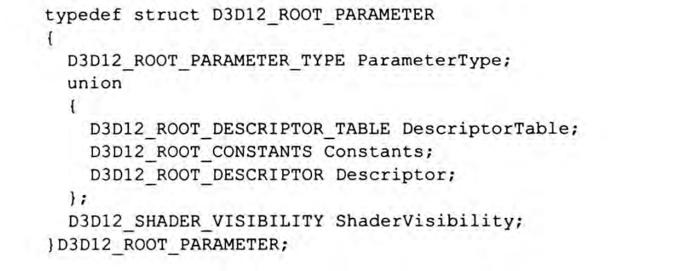

空间如下：

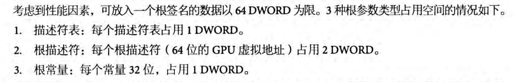

进一步的，一个根签名对应了多个根参数，而每个根参数指向的Descripotor的具体指向类型（是CBV，SB还是别的什么）都是不同的；

所以大概是这样的关系

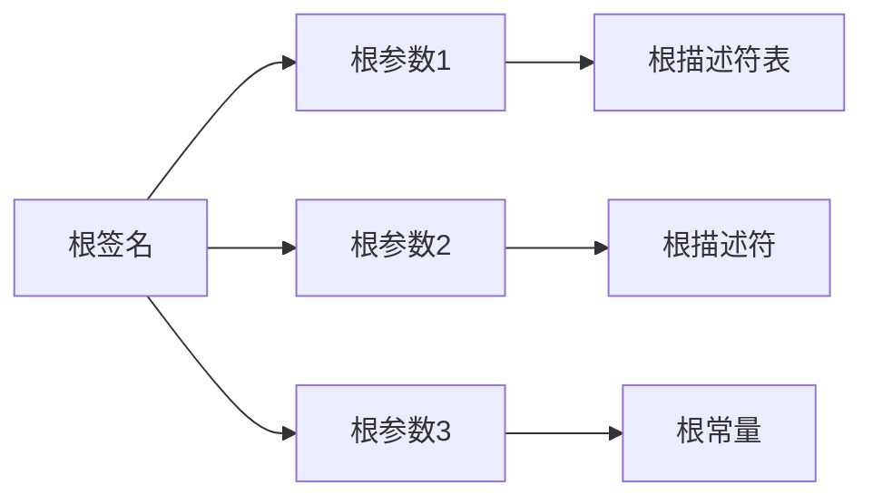

### 5.2  使用

根签名是用来表述：commondList执行操作的时候，对DescriptorHeap的解释方式的一种方法。

在使用的时候如下:

```c++
//设置描述符堆
commandList->SetDescriptorHeaps(1, &descriptorHeap);
//设置根签名,定义资源绑定方式。
commandList->SetGraphicsRootSignature(rootSignature);
//设置根描述符表,实际将描述符表绑定到根签名的指定位置。
D3D12_GPU_DESCRIPTOR_HANDLE gpuHandle = descriptorHeap->GetGPUDescriptorHandleForHeapStart();
gpuHandle.Offset(xx);
commandList->SetGraphicsRootDescriptorTable(0, gpuHandle);//0的意思是，该rootSigniture当中第0个rootParameter
```

`SetGraphicsRootSignature`指定了用哪个根签名，而`SetGraphicsRootDescriptorTable`指定了使用根签名当中的哪个根参数，并且根据这个根参数去把描述符表绑定到描述符上。

> PS : SetGraphicsRootDescriptorTable可以反复调用

### 5.3 DescriptorTable

```c++
// 定义描述符范围
D3D12_DESCRIPTOR_RANGE1 descriptorRange = {};
descriptorRange.RangeType = D3D12_DESCRIPTOR_RANGE_TYPE_SRV;
descriptorRange.NumDescriptors = 1;
descriptorRange.BaseShaderRegister = 0;
descriptorRange.RegisterSpace = 0;
descriptorRange.OffsetInDescriptorsFromTableStart = D3D12_DESCRIPTOR_RANGE_OFFSET_APPEND;

// 设置根参数
D3D12_ROOT_PARAMETER1 rootParameter = {};
rootParameter.ParameterType = D3D12_ROOT_PARAMETER_TYPE_DESCRIPTOR_TABLE;
rootParameter.DescriptorTable.NumDescriptorRanges = 1;
rootParameter.DescriptorTable.pDescriptorRanges = &descriptorRange;

// 创建根签名
D3D12_ROOT_SIGNATURE_DESC1 rootSignatureDesc = {};
rootSignatureDesc.NumParameters = 1;
rootSignatureDesc.pParameters = &rootParameter;
rootSignatureDesc.Flags = D3D12_ROOT_SIGNATURE_FLAG_ALLOW_INPUT_ASSEMBLER_INPUT_LAYOUT;

ID3DBlob* serializedRootSignature = nullptr;
ID3DBlob* errorBlob = nullptr;
D3D12SerializeRootSignature(&rootSignatureDesc, D3D_ROOT_SIGNATURE_VERSION_1, &serializedRootSignature, &errorBlob);
device->CreateRootSignature(0, serializedRootSignature->GetBufferPointer(), serializedRootSignature->GetBufferSize(), IID_PPV_ARGS(&rootSignature));

```

一般DescriptorTable的创建如上述所示，注意到，NumDescriptors参数，这个参数表示的是，DescriptorTable绑定几个连续内存上的资源描述符。

当它为1的时候，HSLS的形式大致如下：t0对应一个纹理

```
Texture2D<float4> g_TextureArray : register(t0); // 绑定到 t0
SamplerState g_Sampler : register(s0); // 绑定到 s0

// 顶点着色器
void VSMain(in float4 pos : POSITION, in float2 tex : TEXCOORD, out float4 oPos : SV_POSITION, out float4 oColor : COLOR)
{
    oPos = pos;
    oColor = g_TextureArray.Sample(g_Sampler, tex); // 使用个纹理
}
// 片元着色器
float4 PSMain(in float4 pos : SV_POSITION, in float2 tex : TEXCOORD) : SV_Target{
}
```

当它为大于一时，例如3，往往表现为一个数组

```
// 声明三个 SRV
Texture2D<float4> g_TextureArray[3] : register(t0); // 绑定到 t0
SamplerState g_Sampler : register(s0); // 绑定到 s0

// 顶点着色器
void VSMain(in float4 pos : POSITION, in float2 tex : TEXCOORD, out float4 oPos : SV_POSITION, out float4 oColor : COLOR){
    oPos = pos;
    oColor = g_TextureArray[0].Sample(g_Sampler, tex); // 使用第一个纹理
}
// 片元着色器
float4 PSMain(in float4 pos : SV_POSITION, in float2 tex : TEXCOORD) : SV_Target{
    // 使用不同的纹理
    float4 color1 = g_TextureArray[0].Sample(g_Sampler, tex);
    float4 color2 = g_TextureArray[1].Sample(g_Sampler, tex);
    float4 color3 = g_TextureArray[2].Sample(g_Sampler, tex);
    return (color1 + color2 + color3) / 3.0f; // 平均颜色
}
```

### 5.4 HSLS绑定

HSLS中的资源与rootSigniture的绑定分为两个部分：space和BaseShaderRegister

space是在初始化的时候确定的`descriptorRange.RegisterSpace = 0;`对应的就是space0

BaseShaderRegister分为两部分，首先`descriptorRange.BaseShaderRegister = 0;`确定了编号0，而`descriptorRange.RangeType = D3D12_DESCRIPTOR_RANGE_TYPE_SRV;`对应的描述符类型，决定了前面的类型符号，SRV类型BaseShaderRegister =0对应的寄存器就是s0

# DX12-光照

## 1. 光照与贴图


# DX12 Pipeline

## 0. MVP变换

Projection：

我们应该这样理解对于透视投影下的projection过程：透视矩阵分为两部分：线性过程和非线性计算过程。非线性过程就是透视除法/w，但是实际上，w当中存储的就是z值。

使用的是四位的齐次坐标系在进行透视投影之前进行的线性变换，实际上对所有的（x，y）顶点的处理都是相同的（这部分我暂时认为是一种归一化处理），而每个顶点的深度值的不同，就使得在进行透视除法的时候，会让z值更大的部分（x，y）都更小，因此体现出近大远小的透视的效果。

*整个过程有点类似于"先进行的是正交投影（深度值不影响变换），然后再进行透视除法"*

## 1. 几何着色器

### 1.1 几何着色器与sv_primitiveID(有疑问)

sv_primitiveID是一个系统值语义，可以在几何着色器，光栅化和PS当中指定，指定之后就会为该阶段**输入**的图元编号

> 以下应该是错误的：

比如在几何着色器当中，sv_primitiveID只会对输入的图元序列编号，而新增的图元则不会编号。但是如果在后续的（光栅化或者像素着色器当中使用，那么sv_primitiveID就会为新增的图元编号）

如果PipeLine有GS，那么必须优先给GS指定sv_primitiveID，之后才能可以给PS指定。

**几何着色器**: `sv_primitiveID` 表示原始图元的 ID（即输入图元的编号）。

**光栅化阶段**: `sv_primitiveID` 会对所有经过光栅化处理的图元进行编号，这包括几何着色器生成的新的图元。在这个阶段，`sv_primitiveID` 可能会被重新分配，以反映光栅化后的图元编号。

> 这里可能是正确的：

sv_primitiveID 图元ID的生成发生在IA阶段，因此逻辑上应该只会对原始的图元进行编号，新生成的应该就不会了。

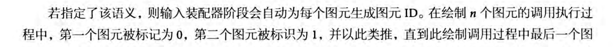

## 2. 曲面阶段

### 2.1 外壳着色器

#### 2.1.1 常量外壳着色器

**输入与输出**

输入：对每个patch进行逐一处理，输入的是每个Patch，patch用该面片的所有控制点表示，在下图的输入patch，就是用4个VertexOut表示的。

输出：网格的曲面细分因子，表示在曲面细分阶段将面片处理之后的份数

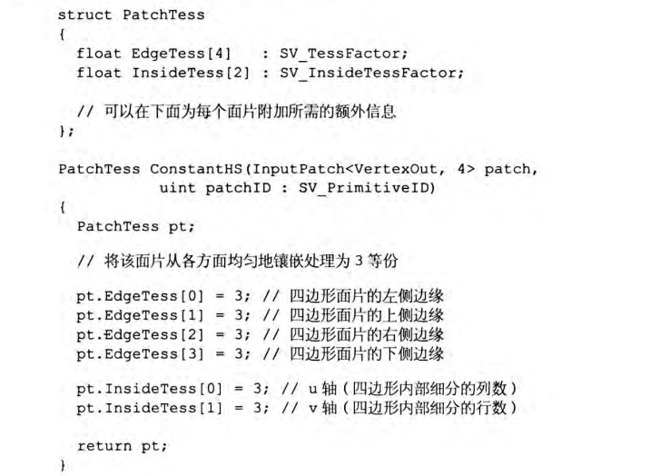

#### 2.1.2 控制点外壳着色器

输入：每个控制点都会调用一次此着色器

### 2.2 镶嵌器

计算机自动执行，把曲面按照HS划分好的细分份数进行划分

### 2.3 域着色器

在镶嵌环节当中，划分好的新的patch还是在同一个平面上，但是更复杂的效果需要移动这些新的patch和控制点，因此需要域着色器。

> 考虑一个球体，如果只是新增控制点，细分patch而不移动他们，这样的处理效果是没有办法让球体更“圆”的，必须让新增的控制点按照球体规则进行分布调整才可以达到更圆的效果

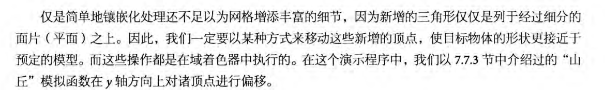

调用时机：**当镶嵌器阶段创建新顶点的时候，都会调用域着色器进行后续处理**

## 2.4. 剪切与视锥体剔除

剪切是针对三角形的，当顶点（三角形）被提交到GPU上之后，GPU会对三角形位于视锥体之外的部分进行剪切（可能会生成新的顶点）

视锥体剔除是在CPU应用阶段，在提交之前，就整组的剔除不在视锥体当中的“模型”。这样的话就不需要把大量的三角形提交到GPU了。

# 3. Picked

## 3.1射线与Bounding Box

[](https://blog.csdn.net/weixin_43022263/article/details/108550538?utm_medium=distribute.pc_relevant.none-task-blog-2~default~baidujs_baidulandingword~default-0-108550538-blog-105862332.235^v43^pc_blog_bottom_relevance_base4&spm=1001.2101.3001.4242.1&utm_relevant_index=3)

这里是和AABB盒相交。

第一种方法：

对于AABB盒，因为是与三条轴平行的，且与每条轴平行都可以找到一组平面。

那么我们就让射线分别对这三组平面进行相交判断。

> 首先要判断是不是与某个轴平行（通过看射线在改轴上的分量是不是为0）。如果平行且射线原点不在平面之间，那就一定无法相交

> 如果上述判断通过，就开始分别相交判断。求出交点之后，计算交点是不是在平面范围内（通过BB的最大最小点的分量来分析）

```C++
bool Ray::intersects(const AABB& aabb) const
{
  Vec3 ptOnPlane; //射线与包围盒某面的交点
  Vec3 min = aabb._min; //aabb包围盒最小点坐标
  Vec3 max = aabb._max; //aabb包围盒最大点坐标
  
  const Vec3& origin = _origin; //射线起始点
  const Vec3& dir = _direction; //方向矢量
  
  float t;
  
  //分别判断射线与各面的相交情况
  
  //判断射线与包围盒x轴方向的面是否有交点
  if (dir.x != 0.f) //射线x轴方向分量不为0 若射线方向矢量的x轴分量为0，射线不可能经过包围盒朝x轴方向的两个面
  {
    /*
      使用射线与平面相交的公式求交点
     */
    if (dir.x > 0)//若射线沿x轴正方向偏移
      t = (min.x - origin.x) / dir.x;
    else  //射线沿x轴负方向偏移
      t = (max.x - origin.x) / dir.x;
    
    if (t > 0.f) //t>0时则射线与平面相交
    {
      ptOnPlane = origin + t * dir; //计算交点坐标
      //判断交点是否在当前面内
      if (min.y < ptOnPlane.y && ptOnPlane.y < max.y && min.z < ptOnPlane.z && ptOnPlane.z < max.z)
      {
        return true; //射线与包围盒有交点
      }
    }
  }
  
  //若射线沿y轴方向有分量 判断是否与包围盒y轴方向有交点
  if (dir.y != 0.f)
  {
    if (dir.y > 0)
      t = (min.y - origin.y) / dir.y;
    else
      t = (max.y - origin.y) / dir.y;
    
    if (t > 0.f)
    {
      ptOnPlane = origin + t * dir;
 
      if (min.z < ptOnPlane.z && ptOnPlane.z < max.z && min.x < ptOnPlane.x && ptOnPlane.x < max.x)
      {
        return true;
      }
    }
  }
  
  //若射线沿z轴方向有分量 判断是否与包围盒y轴方向有交点
  if (dir.z != 0.f)
  {
    if (dir.z > 0)
      t = (min.z - origin.z) / dir.z;
    else
      t = (max.z - origin.z) / dir.z;
    
    if (t > 0.f)
    {
      ptOnPlane = origin + t * dir;
      
      if (min.x < ptOnPlane.x && ptOnPlane.x < max.x && min.y < ptOnPlane.y && ptOnPlane.y < max.y)
      {
        return true;
      }
    }
  }
  
  return false;
}

```

方法2： Slabs method

二维的射线与射线相交可以得知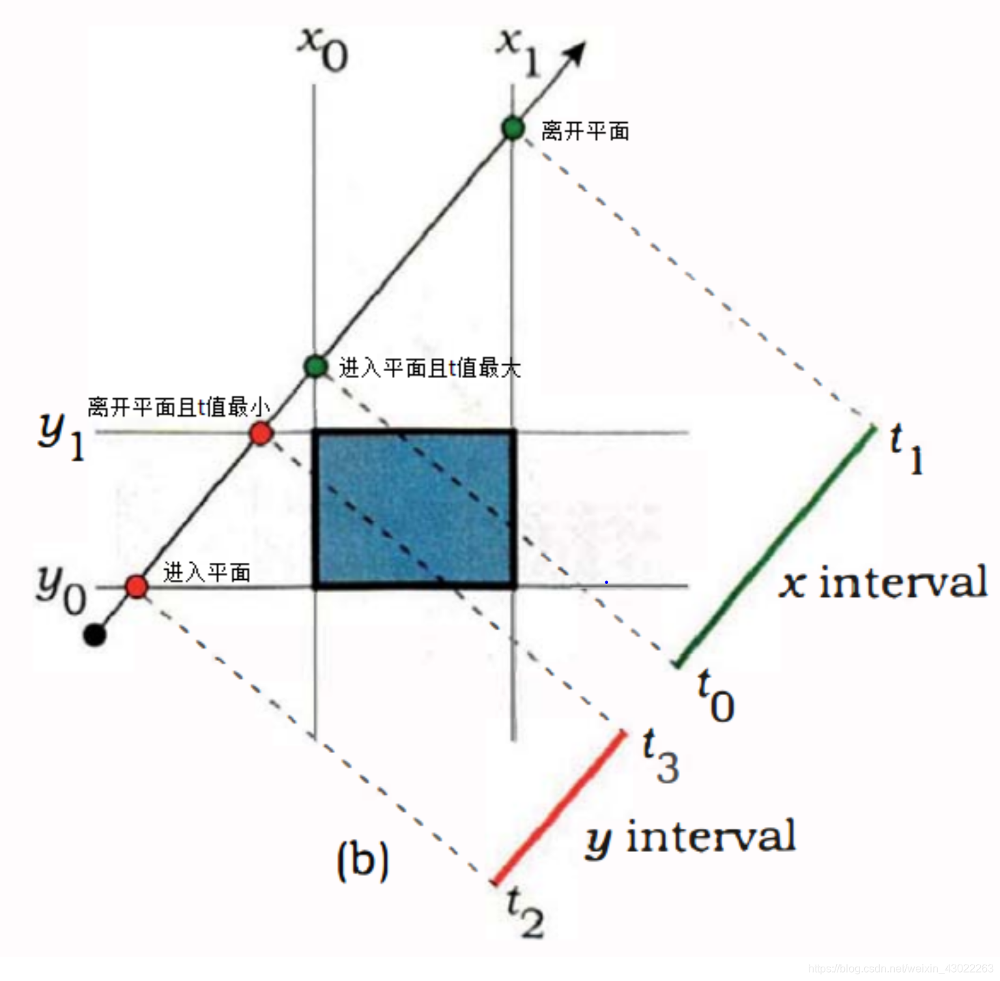

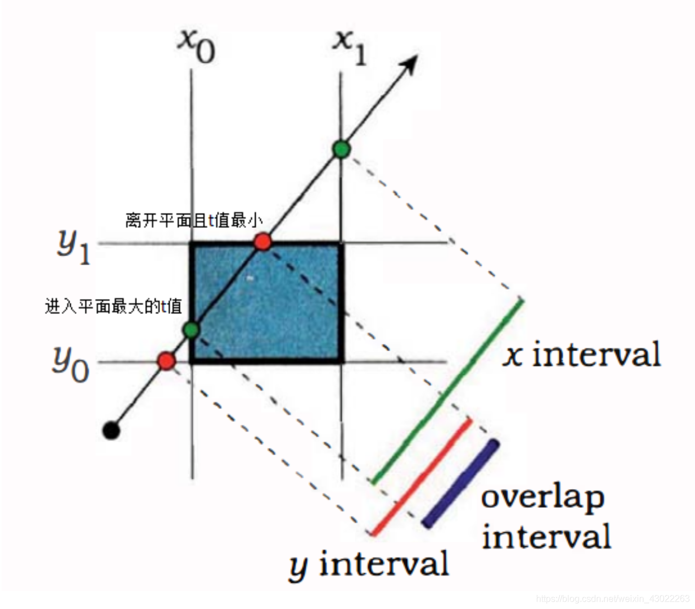


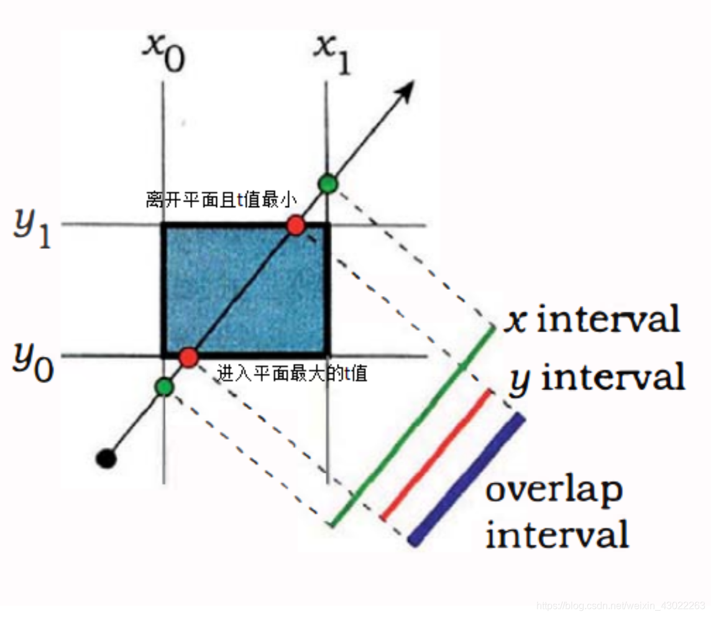

判断是否相交的关键在于：

1. 对于一对平面（平行的一对），找到进入和离开的点
2. 两组点之间有公共重合的部分（overlap interval）

观察上述三幅图可以得出，只要发生区间交叠，光线与平面就能相交，

那么区间交叠出现的条件便是：光线进入平面处的最大t值小于光线离开平面处的最小t值

也就是说，$t_{min}=max({t_{enter}-X},{t_{enter}-Y}),t_{max}=min(t_{leave-X}，t_{leave-Y})$，如果t_min<t_max，那就相交，否则就不相交

推广到三维也是一样的。

$t_{min}=max({t_{enter}-X},{t_{enter}-Y},t_{enter}-Z),t_{max}=min(t_{leave-X}，t_{leave-Y},t_{leave-Z})$


## 3.2 射线与三角形相交判断

射线表示式:$r(t)=q+tu$

三角形表示式：$T(u,v)=v_0+u(v_1-v_0)+v(v_2-v_0);其中，v_0,v_1,v_2代表三角形三个点的坐标，u，v满足>=0且u+v<=1$，这个式子代表了三角形内部以及边界上的所有点

> u，v之和取到最大的时候，就是二者都是1/2的时候，这时候正好就构成了三角形第三条边上的所有点

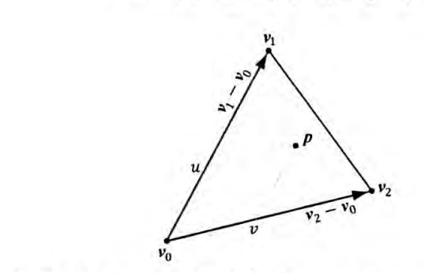

令$r(t)=T(u,v)$，那么当此式子有解的时候，就意味着存在一个时间t，我们可以找到同时在射线上以及三角形内以及边上的点，因此就是相交
