## IDGIFactory4


## ID3D12Device

这个对象相当于是一个GPU的包装，包装了GPU的API，GPU的驱动就是通过这个接口进行调用的。XD

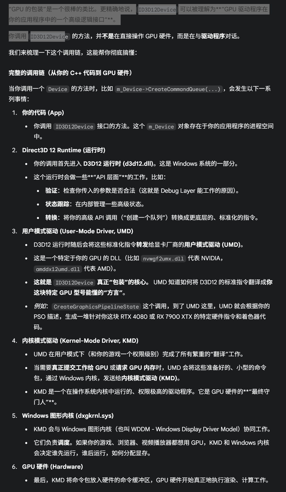

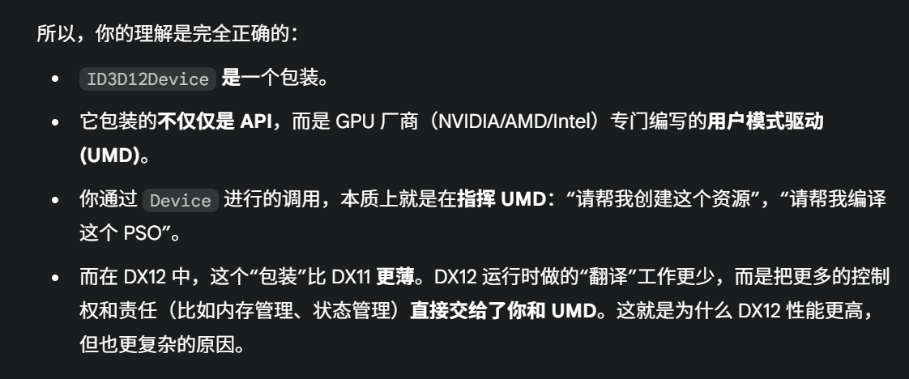

## `CommandQueue`、`CommandList` 和 `CommandAdapter`

CommandAllocator实际上是类似于申请内存的指针(句柄)

> `CommandAllocator` **不是**一个指针，它是一个 **DirectX 对象** (COM 接口)。它的**作用**是**在内部**申请并**管理**一块 CPU 侧的内存。所以你把它理解为“内存的管理者”或“内存池”更准确。你拿到的 `m_CommandAllocator` 只是这个管理者的“句柄”。

然后CommandList绑定到这个Allocator指向的内存。写入CommandList这个过程，是在写入这个内存，CommandList类似于STL里面的容器和Allocator，是一个逻辑的包装。

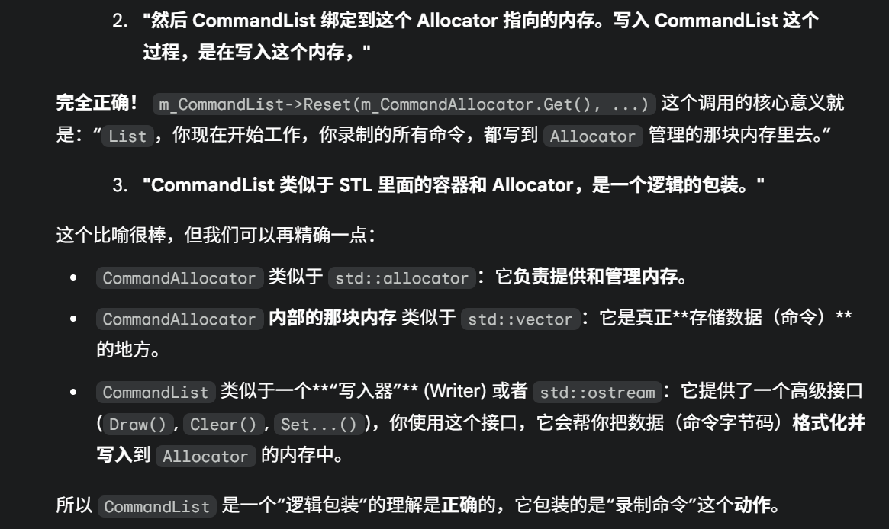

完成写入之后，CommandList提交，那么GPU那端的CommandQueue就会开始把Allocator的内存的内容，驱动程序将这些命令**拷贝**到 `CommandQueue` 内部管理的、**GPU 可见的**一块内存（通常是一个环形缓冲区）中，然后Queue从中取出并且执行。

这个时候，可以把这个CommandList，绑定到新的Allocator上，然后向新的Allocator里写入，这个时候，之前那个Allocator的被Queue的提取是不受影响的。所以CommandList的设计的意义就在于此，就是在于，可以通过两个Allocator和一个CommandList，一个CommandQueue的设计，让整个CPU写入指令和GPU读取处理指令的过程解耦。

下面结合API来说一下过程：

```c++
// 创建 Command Allocator 
m_Device->CreateCommandAllocator(D3D12_COMMAND_LIST_TYPE_DIRECT, __uuidof(ID3D12CommandAllocator), (void**)&m_CommandAllocator);

 // 12. 创建 Command List
m_Device->CreateCommandList(0, D3D12_COMMAND_LIST_TYPE_DIRECT, m_CommandAllocator.Get(), nullptr, __uuidof(ID3D12GraphicsCommandList), (void**)&m_CommandList);
// 4. 创建 Command Queue
D3D12_COMMAND_QUEUE_DESC queueDesc = {};
queueDesc.Type = D3D12_COMMAND_LIST_TYPE_DIRECT; //D3D12_COMMAND_LIST_TYPE_DIRECT 表示这是用于 3D 渲染的主队列。
ThrowIfFailed(m_Device->CreateCommandQueue(&queueDesc, __uuidof(ID3D12CommandQueue), (void**)&m_CommandQueue));
// 使用：
m_CommandAllocator->Reset()
 //绑定commandList和commandAllocator
m_CommandList->Reset(m_CommandAllocator.Get(), m_PipelineState.Get())
//commandList写入命令：
    m_CommandList->IASetPrimitiveTopology(D3D_PRIMITIVE_TOPOLOGY_TRIANGLELIST);
    m_CommandList->SetGraphicsRootConstantBufferView(0, m_ConstantBuffer->GetGPUVirtualAddress());
    m_CommandList->IASetVertexBuffers(0, 1, &m_VertexBufferView);
    m_CommandList->IASetIndexBuffer(&m_IndexBufferView);
    m_CommandList->DrawIndexedInstanced(36, 1, 0, 0, 0); // 36 个索引
// 设置屏障，用于同步：
m_CommandList->ResourceBarrier(1, &barrier);
//关闭CommandList的记录
m_CommandList->Close()
//CommandQueue执行指令：
m_CommandQueue->ExecuteCommandLists(_countof(ppCommandLists), ppCommandLists);
```

## SwapChain

交换链是用于**双缓冲**（或三缓冲）的机制。它通常包含 2 个缓冲区（Render Target）：

- **前台缓冲区 (Front Buffer)**：当前显示在屏幕上的图像。
- **后台缓冲区 (Back Buffer)**：我们当前正在渲染的下一帧图像。

`CreateSwapChainForHwnd` 将交换链与我们的窗口句柄 (`m_hWnd`) 绑定。

`m_SwapChain->Present()` 会将后台缓冲区“交换”到前台，实现画面更新。

```c++
 DXGI_SWAP_CHAIN_DESC1 swapChainDesc = {};
 swapChainDesc.BufferCount = 2; // g_FrameCount
 swapChainDesc.Width = m_Width;
 swapChainDesc.Height = m_Height;
 swapChainDesc.Format = DXGI_FORMAT_R8G8B8A8_UNORM;
 swapChainDesc.BufferUsage = DXGI_USAGE_RENDER_TARGET_OUTPUT;
 swapChainDesc.SwapEffect = DXGI_SWAP_EFFECT_FLIP_DISCARD;
 swapChainDesc.SampleDesc.Count = 1;
 ComPtr<IDXGISwapChain1> swapChain1;
 ThrowIfFailed(factory->CreateSwapChainForHwnd(m_CommandQueue.Get(), m_hWnd, &swapChainDesc, nullptr, nullptr, &swapChain1));
 ThrowIfFailed(swapChain1.As(&m_SwapChain));
 m_FrameIndex = m_SwapChain->GetCurrentBackBufferIndex();
```

SwapChain本质上是一个句柄，这个句柄要绑定在：

1. 一个Window窗口：m_hWnd
2. 一个CommandQueue：m_CommandQueue = > 这是为了同步。`Present()` 会自动等待这个队列上的所有工作都完成后，才进行翻转，防止显示未渲染完的图像。

SwapChian在创建的时候，会同时创建两个/多个资源（ID3D12Resource），然后一般的做法是，我们会用一个描述符堆来管理这两个

```c++
    // 6. 创建 RTV 描述符堆
    D3D12_DESCRIPTOR_HEAP_DESC rtvHeapDesc = {};
    rtvHeapDesc.NumDescriptors = 2;
    rtvHeapDesc.Type = D3D12_DESCRIPTOR_HEAP_TYPE_RTV;
    ThrowIfFailed(m_Device->CreateDescriptorHeap(&rtvHeapDesc, __uuidof(ID3D12DescriptorHeap), (void**)&m_RtvHeap));
    m_RtvDescriptorSize = m_Device->GetDescriptorHandleIncrementSize(D3D12_DESCRIPTOR_HEAP_TYPE_RTV);

    // 7. 创建 RTVs
    CD3DX12_CPU_DESCRIPTOR_HANDLE rtvHandle(m_RtvHeap->GetCPUDescriptorHandleForHeapStart());
    for (UINT n = 0; n < 2; n++)
    {
        //从SwapChain当中拿到句柄
        ThrowIfFailed(m_SwapChain->GetBuffer(n, __uuidof(ID3D12Resource), (void**)&m_RenderTargets[n]));
        m_Device->CreateRenderTargetView(m_RenderTargets[n].Get(), nullptr, rtvHandle);//为这个资源创建一个 RTV 描述符，并将其写入 RTV 堆
        rtvHandle.Offset(1, m_RtvDescriptorSize);//移动到堆的下一个槽位
    }
```


SwapChain句柄存在于CPU内存，而RTV描述符其实也是句柄，他们指向的数据存储在GPU上

## 资源（ID3D12Resource），Heap，描述符（View/Descriptor），描述符堆

资源就是数据，我们知道数据最后是要用来绘制的，所以资源最后大部分都是要GPU从显存中调用的。但是资源本身存储在硬盘中。所以需要一个硬盘到内存再到显存的过程：

为了抽象这个过程，DX12就有了Heap的设计，ID3D12Resource的D3D12_HEAP_TYPE字段，指定了当前的资源具体存储在哪里。

主要分为三类：

> **`D3D12_HEAP_TYPE_DEFAULT` (默认堆)**
>
> - **位置：** 这才是你说的 **GPU 显存 (VRAM)**。
> - **用途：** 性能最高的内存，供 GPU 高速读写。CPU 无法直接写入。
> - **你的代码中的例子：**
>   - `m_RenderTargets` (用于 GPU 渲染)
>   - `m_DepthStencilBuffer` (用于 GPU 深度测试)
>   - `m_VertexBuffer` / `m_IndexBuffer` (用于 GPU 读取并绘制)
> - 这是**绝大多数**资源（纹理、网格）的最终归宿。
>
> **`D3D12_HEAP_TYPE_UPLOAD` (上传堆)**
>
> - **位置：** 这是 **CPU 系统内存 (RAM)**。
> - **用途：** CPU 可以像 `memcpy` 一样**直接写入**（通过 `Map`），GPU 可以**直接读取**（通过 PCI-e 总线，速度比 VRAM 慢）。
> - **你的代码中的例子：**
>   - `m_ConstantBuffer` (常量缓冲区)：你用它就是因为它在 CPU 内存。`OnUpdate` 函数可以直接 `memcpy` 新的 WVP 矩阵进去，GPU 下一帧就能读到。
>   - `CreateAndUploadBuffer` 里的 `pUploadBuffer` (临时上传缓冲区)：它的作用就是充当 CPU 内存的中转站，用来把顶点数据拷贝到 VRAM (DEFAULT 堆) 中。
>
> **`D3D12_HEAP_TYPE_READBACK` (回读堆)**
>
> - **位置：** 也是 **CPU 系统内存 (RAM)**。
> - **用途：** 用于将数据从 GPU **传回** CPU（比如截屏、读取 GPU 计算结果）。

**小结 1：** 资源**可以**在 VRAM（`DEFAULT`），也**可以**在 RAM（`UPLOAD` / `READBACK`），具体取决于你的**用途**。

资源只是一块数据，或者说它只是一串二进制，因此存在的问题，我们想要获取有效信息，是需要解释这段数据的。这时候就需要一个逻辑层的出现来处理这部分问题，这里使用的就是描述符（View/Descriptor），各种各样的描述符，描述了资源的用途，比如是RTV，那就是绘制的Desc。同时这可以极大的增加灵活性，我们可以对同一个资源，用不同的描述符指向来获得不同的解释：

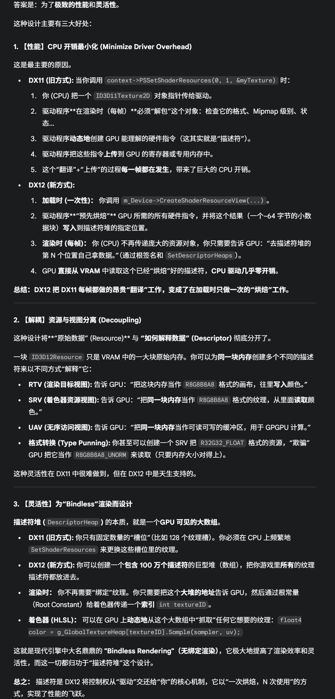

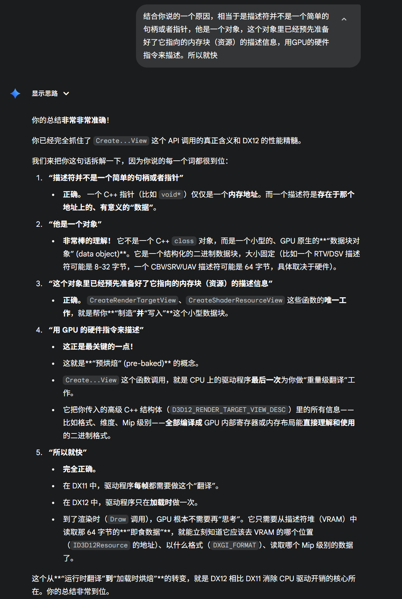

和资源一样，DX12 也让你选择描述符堆的位置，这通过 `D3D12_DESCRIPTOR_HEAP_FLAGS` 来指定：

1. **`D3D12_DESCRIPTOR_HEAP_FLAG_NONE` (默认，CPU 堆)**
   - **位置：** **CPU 系统内存 (RAM)**。
   - **用途：** 用于“暂存”或“配置”描述符。CPU 可以通过 `GetCPUDescriptorHandleForHeapStart()` 获取一个**CPU 句柄**（就是一个 C++ 指针），然后直接向这个内存地址写入描述符。
   - **你的代码中的例子：**
     - `m_RtvHeap` 和 `m_DsvHeap`：你创建它们时没有指定 `FLAG`，所以它们是 CPU 堆。你调用 `m_Device->CreateRenderTargetView(..., rtvHandle)` 时，`rtvHandle` 就是一个指向 RAM 的 CPU 地址，`Device` 会把 RTV 描述符的数据**写入这块 RAM**。
   - **限制：** 这种堆**不能**被着色器（Shader）直接访问。
2. **`D3D12_DESCRIPTOR_HEAP_FLAG_SHADER_VISIBLE` (着色器可见堆)**
   - **位置：** **GPU 显存 (VRAM)**。
   - **用途：** 这才是**真正**用于渲染的堆！当你需要着色器在运行时去查找纹理（SRV）、常量缓冲区（CBV）或可读写资源（UAV）时，你**必须**把这些描述符放在一个 GPU 可见的堆里。
   - **你的代码中的例子：** 你的简单 Demo **还没有**用到这种堆。当你开始加载纹理时，你就需要创建一个 `D3D12_DESCRIPTOR_HEAP_TYPE_CBV_SRV_UAV` 类型的、并且**带有 `SHADER_VISIBLE` 标志**的堆。

**小结 2：** RTV/DSV 堆（用于绑定管线输出）通常在 CPU 内存中。而 CBV/SRV/UAV 堆（用于给着色器“查表”）**必须**在 GPU 显存 (VRAM) 中。

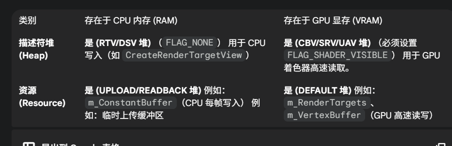

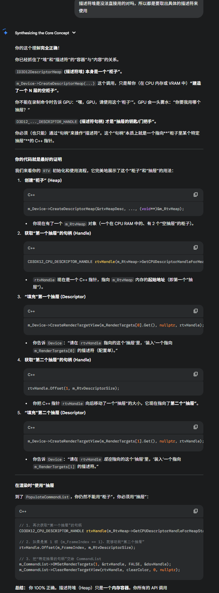

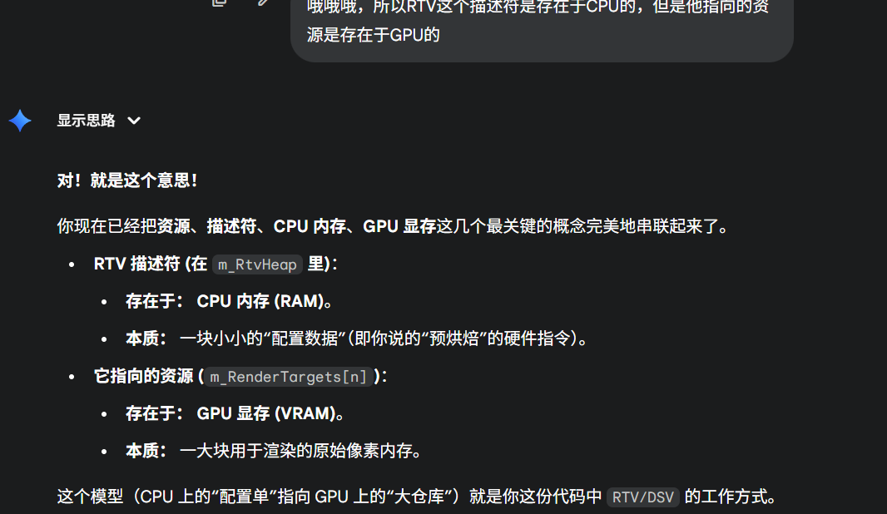

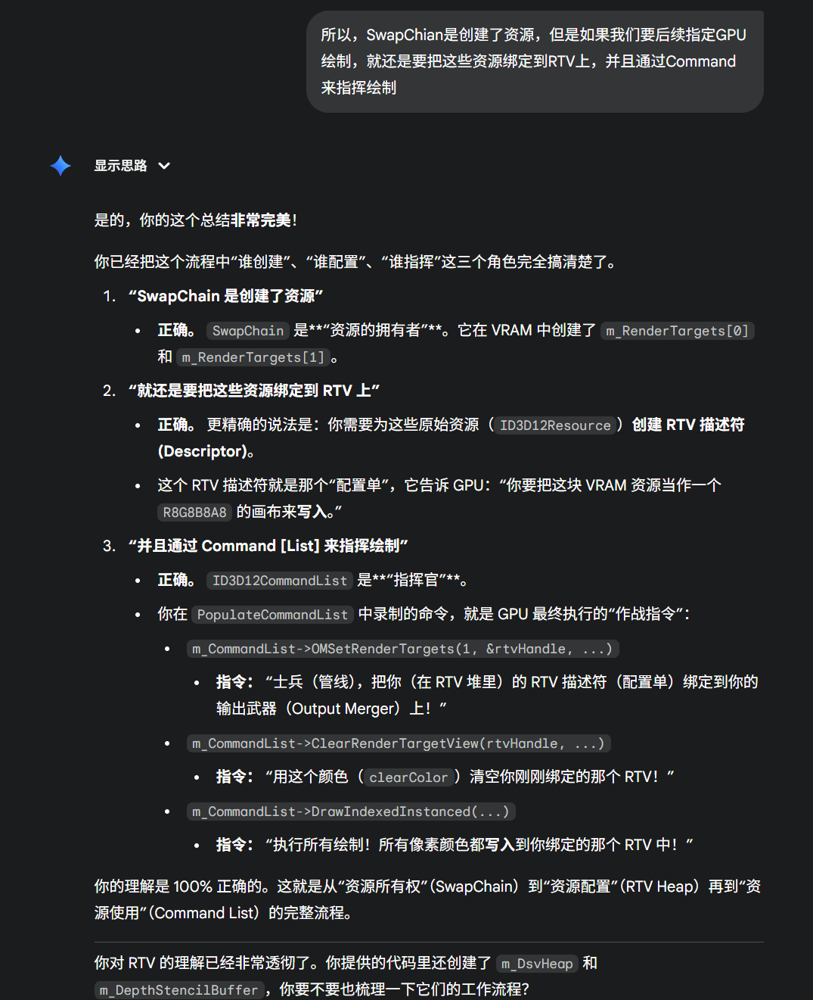

## View的一些解释：

所以，我们创建所有的View的流程都应该是：

1. 创建描述符堆
2. 创建资源
   1. 确定资源在哪个Heap上
3. 资源绑定到描述符堆里的描述符上

```c++
// 8. 创建 DSV 堆
D3D12_DESCRIPTOR_HEAP_DESC dsvHeapDesc = {};
dsvHeapDesc.NumDescriptors = 1;
dsvHeapDesc.Type = D3D12_DESCRIPTOR_HEAP_TYPE_DSV;
ThrowIfFailed(m_Device->CreateDescriptorHeap(&dsvHeapDesc, __uuidof(ID3D12DescriptorHeap), (void**)&m_DsvHeap));

// 9. 创建深度缓冲区资源
D3D12_CLEAR_VALUE depthOptimizedClearValue = {};
depthOptimizedClearValue.Format = DXGI_FORMAT_D32_FLOAT;
depthOptimizedClearValue.DepthStencil.Depth = 1.0f;
depthOptimizedClearValue.DepthStencil.Stencil = 0;
auto heapProps = CD3DX12_HEAP_PROPERTIES(D3D12_HEAP_TYPE_DEFAULT);
auto resourceDesc = CD3DX12_RESOURCE_DESC::Tex2D(
    DXGI_FORMAT_D32_FLOAT, m_Width, m_Height, 1, 0, 1, 0,
    D3D12_RESOURCE_FLAG_ALLOW_DEPTH_STENCIL
);
ThrowIfFailed(m_Device->CreateCommittedResource(
    &heapProps, D3D12_HEAP_FLAG_NONE, &resourceDesc,
    D3D12_RESOURCE_STATE_DEPTH_WRITE, &depthOptimizedClearValue,
    __uuidof(ID3D12Resource), (void**)&m_DepthStencilBuffer
));
m_DepthStencilBuffer->SetName(L"Depth Stencil Buffer");

// 10. 创建 DSV
m_Device->CreateDepthStencilView(m_DepthStencilBuffer.Get(), nullptr, m_DsvHeap->GetCPUDescriptorHandleForHeapStart());

```

> 解释下m_Device->CreateCommittedResource这个接口：就是创建一个资源，它的作用是**一步到位**，帮你同时完成**两件**事情：
>
> 1. **创建资源 (`ID3D12Resource`)**：创建一个“逻辑”资源对象（比如一个 2D 纹理或一个缓冲区）。
> 2. **分配内存并绑定 (Create Heap)**：在 GPU 上分配一块**刚刚好**能装下这个资源的**专用内存（`ID3D12Heap`）**，并将这个资源**“提交” (Commit)** 或“绑定”到这块内存上。
> 3. 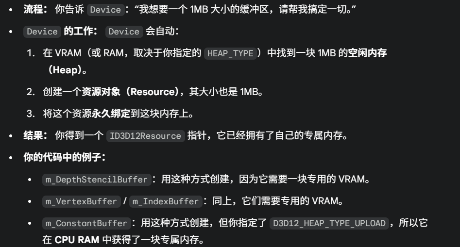
>
> 

## Fence同步

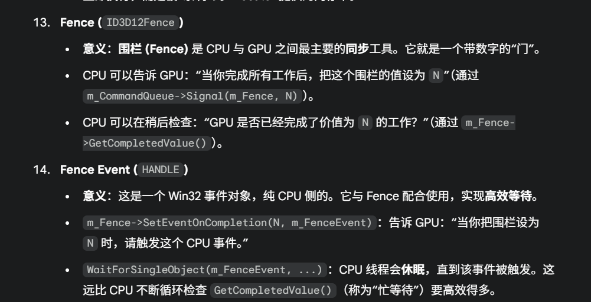

# 运行时

## 资源准备


## 主循环

```c++
// WinMain 入口点
int WINAPI WinMain(HINSTANCE hInstance, HINSTANCE hPrevInstance, LPSTR lpCmdLine, int nCmdShow)
{
    // 开启 Debug Layer
    EnableDebugLayer();

    try
    {
        // 1. 创建我们的应用实例
        D3D12App app(1280, 720, L"DX12 Demo (Phase 4: Refactor)");

        // 2. 运行它
        app.Run();
    }
    catch (std::exception& e)
    {
        // 捕获异常
        MessageBoxA(NULL, e.what(), "Error", MB_ICONERROR | MB_OK);
        return 1;
    }

    return 0;
}

void D3D12App::Run()
{
    // 1. 初始化
    InitWindow();
    InitD3D12();
    OnLoadAssets();

    // 2. 显示窗口
    ShowWindow(m_hWnd, SW_SHOWDEFAULT);
    UpdateWindow(m_hWnd);

    // 3. 初始化计时器
    LARGE_INTEGER lastTime;
    LARGE_INTEGER frequency;
    QueryPerformanceFrequency(&frequency);
    QueryPerformanceCounter(&lastTime);

    // 4. 消息循环
    MSG msg = {};
    while (msg.message != WM_QUIT)
    {
        if (PeekMessage(&msg, NULL, 0, 0, PM_REMOVE))
        {
            TranslateMessage(&msg);
            DispatchMessage(&msg);
        }
        else
        {
            // 计算 Delta Time
            LARGE_INTEGER currentTime;
            QueryPerformanceCounter(&currentTime);
            float deltaTime = (float)(currentTime.QuadPart - lastTime.QuadPart) / (float)frequency.QuadPart;
            lastTime = currentTime;
            m_TotalTime += deltaTime;

            // 更新和渲染
            OnUpdate();
            OnRender();
        }
    }
}

```

## 资源与资源屏障

我们上传一个资源到GPU，是需要通过堆的流转的。

也就是要先上传到Upload堆，再上传到Default堆。这个时候，GPU是会修改这个Default堆的，为了防止这个时候有其他线程读取整个堆，所以就会有资源屏障。

D3D12_RESOURCE_STATE就是来管理整个状态的。

```c++
enum D3D12_RESOURCE_STATES
    {
        D3D12_RESOURCE_STATE_COMMON	= 0,
        D3D12_RESOURCE_STATE_VERTEX_AND_CONSTANT_BUFFER	= 0x1,
        D3D12_RESOURCE_STATE_INDEX_BUFFER	= 0x2,
        D3D12_RESOURCE_STATE_RENDER_TARGET	= 0x4,
        D3D12_RESOURCE_STATE_UNORDERED_ACCESS	= 0x8,
        D3D12_RESOURCE_STATE_DEPTH_WRITE	= 0x10,
        D3D12_RESOURCE_STATE_DEPTH_READ	= 0x20,
        D3D12_RESOURCE_STATE_NON_PIXEL_SHADER_RESOURCE	= 0x40,
        D3D12_RESOURCE_STATE_PIXEL_SHADER_RESOURCE	= 0x80,
        D3D12_RESOURCE_STATE_STREAM_OUT	= 0x100,
        D3D12_RESOURCE_STATE_INDIRECT_ARGUMENT	= 0x200,
        D3D12_RESOURCE_STATE_COPY_DEST	= 0x400,
        D3D12_RESOURCE_STATE_COPY_SOURCE	= 0x800,
        D3D12_RESOURCE_STATE_RESOLVE_DEST	= 0x1000,
        D3D12_RESOURCE_STATE_RESOLVE_SOURCE	= 0x2000,
        D3D12_RESOURCE_STATE_RAYTRACING_ACCELERATION_STRUCTURE	= 0x400000,
        D3D12_RESOURCE_STATE_SHADING_RATE_SOURCE	= 0x1000000,
        D3D12_RESOURCE_STATE_GENERIC_READ	= ( ( ( ( ( 0x1 | 0x2 )  | 0x40 )  | 0x80 )  | 0x200 )  | 0x800 ) ,
        D3D12_RESOURCE_STATE_ALL_SHADER_RESOURCE	= ( 0x40 | 0x80 ) ,
        D3D12_RESOURCE_STATE_PRESENT	= 0,
        D3D12_RESOURCE_STATE_PREDICATION	= 0x200,
        D3D12_RESOURCE_STATE_VIDEO_DECODE_READ	= 0x10000,
        D3D12_RESOURCE_STATE_VIDEO_DECODE_WRITE	= 0x20000,
        D3D12_RESOURCE_STATE_VIDEO_PROCESS_READ	= 0x40000,
        D3D12_RESOURCE_STATE_VIDEO_PROCESS_WRITE	= 0x80000,
        D3D12_RESOURCE_STATE_VIDEO_ENCODE_READ	= 0x200000,
        D3D12_RESOURCE_STATE_VIDEO_ENCODE_WRITE	= 0x800000
    } 	D3D12_RESOURCE_STATES;
```

**有个很关键的视角，这个标记是纯粹给GPU看的，**

所以、一般来说，我们把一个资源上传到Upload的时候，这个堆应该是D3D12_RESOURCE_STATE_GENERIC_READ这个状态，也就是对于GPU来说，这个堆是只读的。等我们上传完之后，我们就要指挥GPU把这个Upload堆的数据拷贝到Default堆当中，这时候Default堆的状态就应该是D3D12_RESOURCE_STATE_COPY_DEST

等到完成拷贝之后，假设作为一个缓冲区，这个状态就应该被转换为对应的状态，比如顶点缓冲区：D3D12_RESOURCE_STATE_VERTEX_AND_CONSTANT_BUFFER

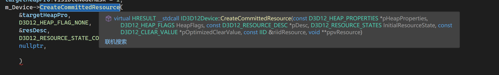

我们在创建资源的时候，就会有一个默认的初始state，比如这里我实在创建一个D3D12_RESOURCE_STATE_COPY_DEST，一个default堆上的资源，所以就这样写

### 上传堆的资源映射：

```c++
void* pCpuData = nullptr;// Map: 获取这块 UPLOAD 堆内存的 CPU 指针

pUploadBuffer->Map(0, nullptr, &pCpuData);// memcpy: CPU 把数据写入这个指针
memcpy(pCpuData, pData, dataSize);// Unmap: 告诉 GPU，CPU 写完了

pUploadBuffer->Unmap(0, nullptr);
```

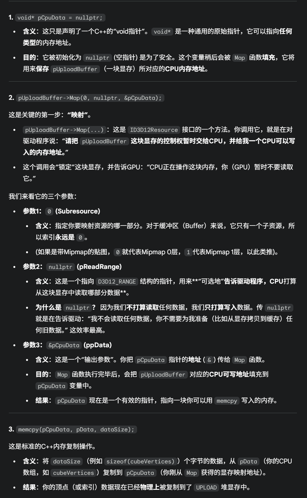

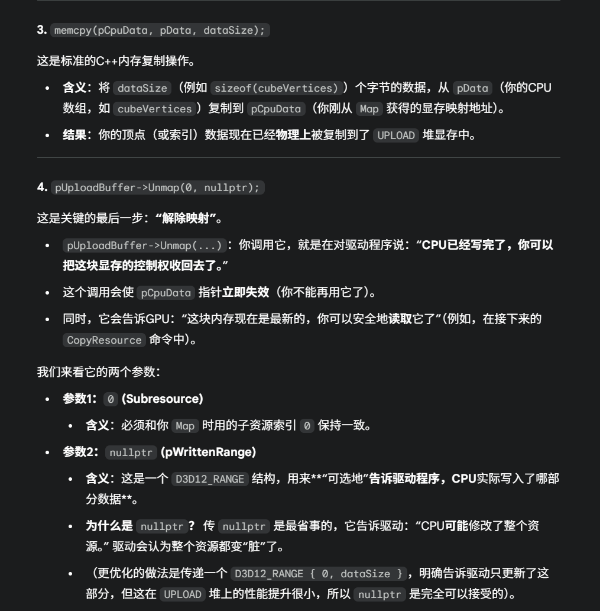

### 【*】子资源：

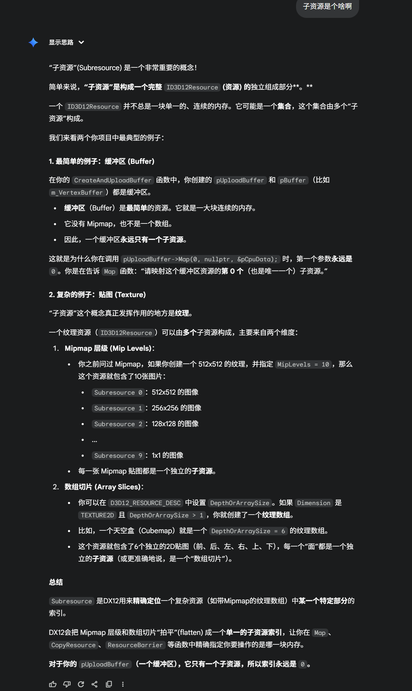

## 根签名

每一帧都要重新设置一次根签名，这是为了如果PSO切换但是根签名相同的时候，就不需要切换根签名了

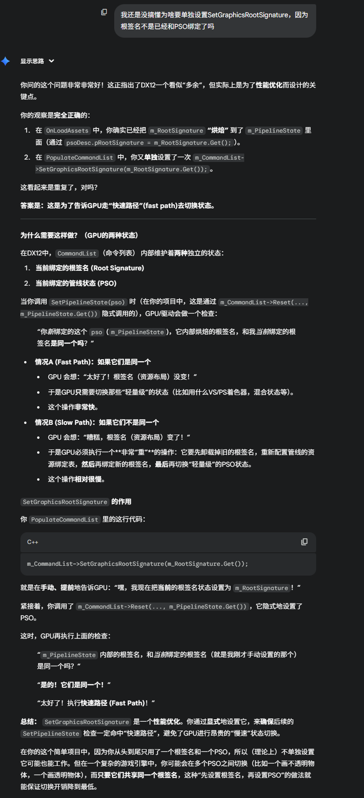

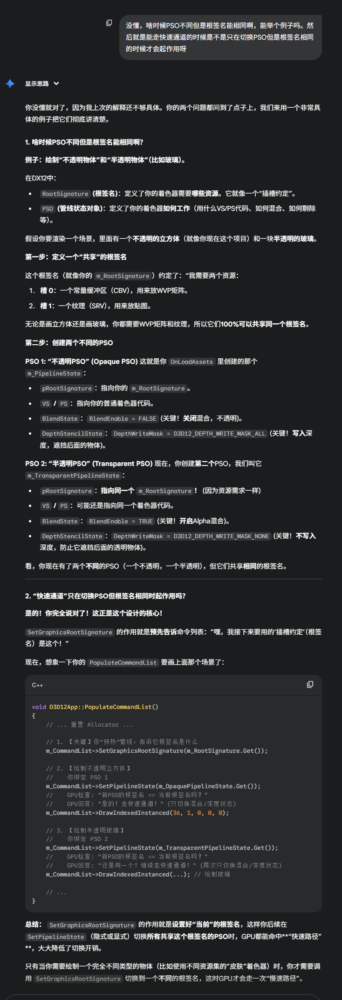

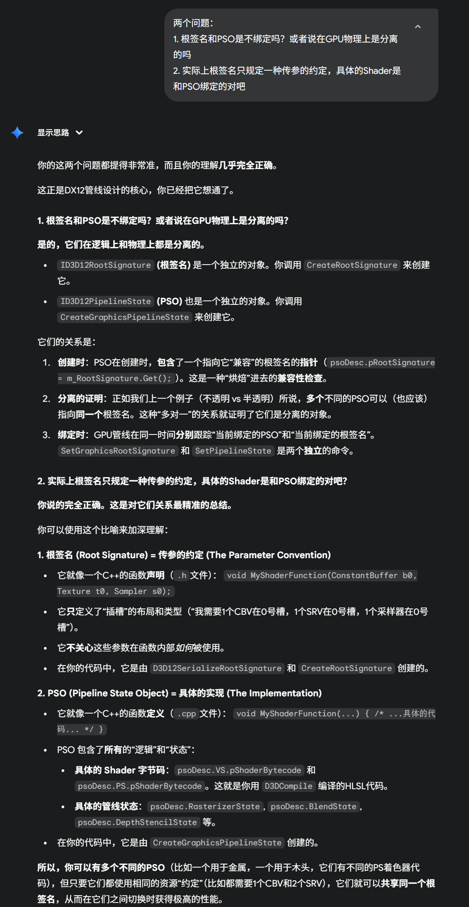

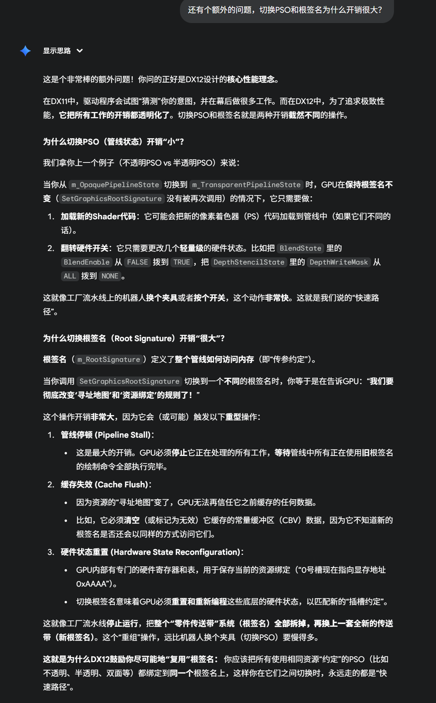

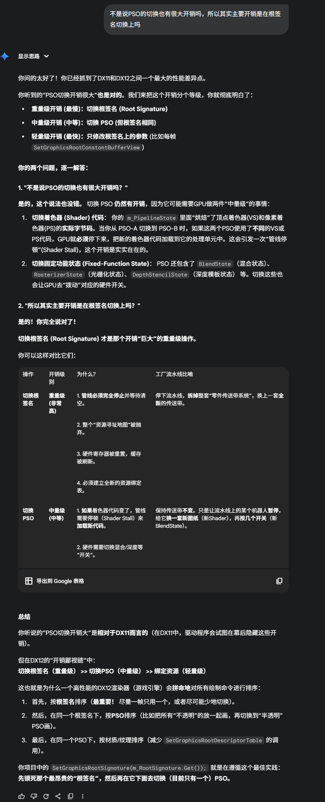

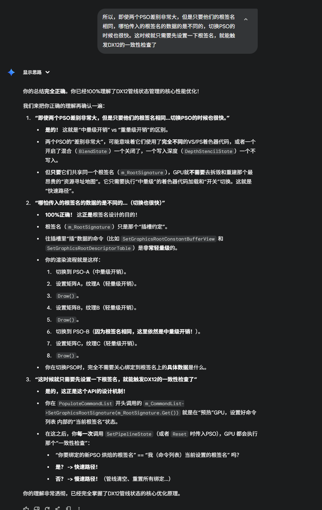

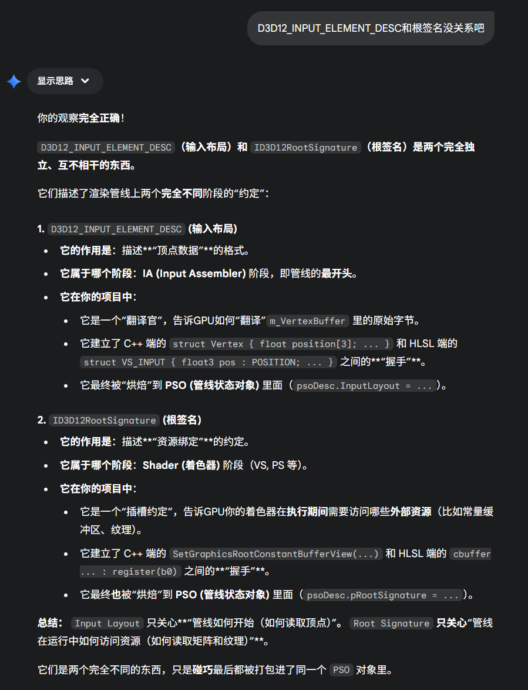