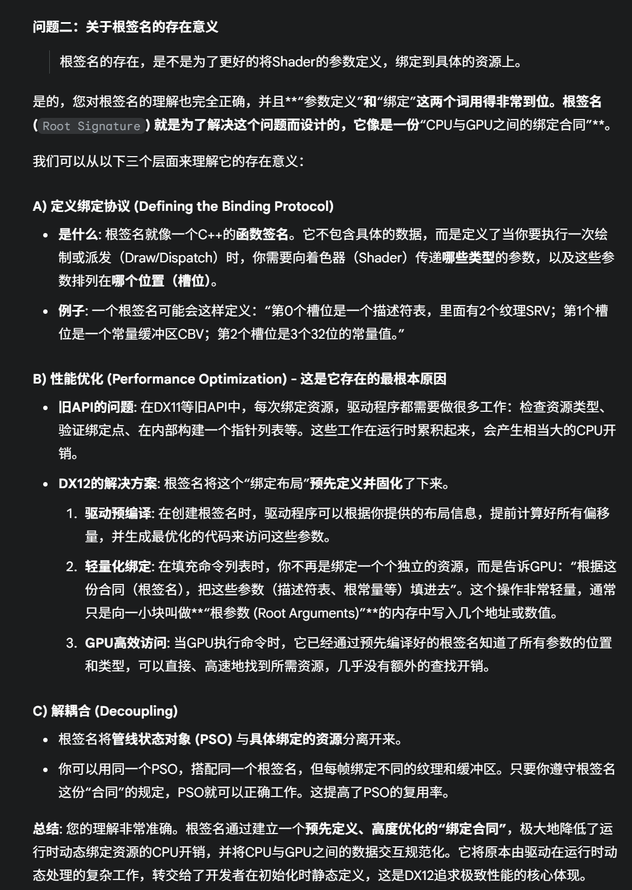
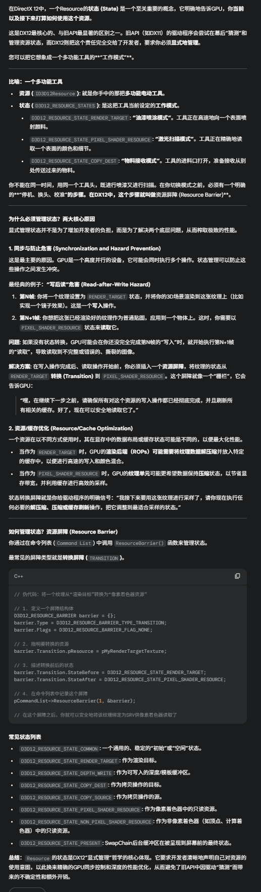
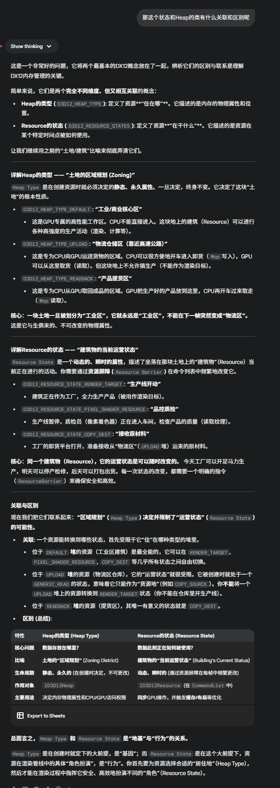
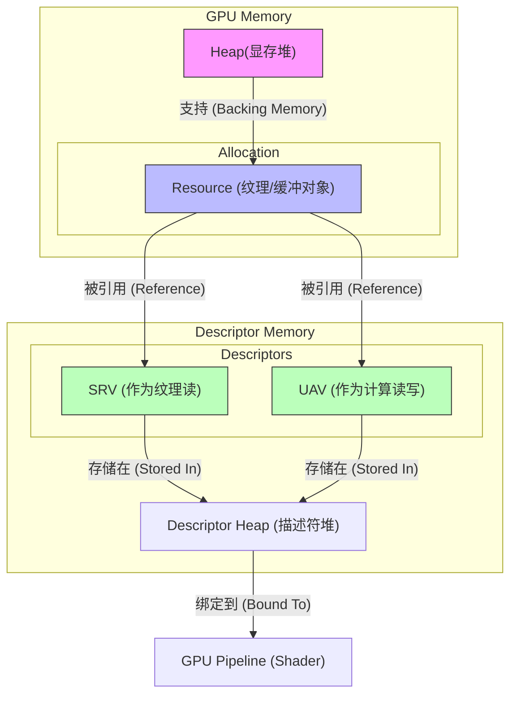

# Dx12-CPU和GPU

我们讨论两个东西：

1. 描述符（描述符堆）
2. GPU的Heap

**描述符堆本身存储在由驱动程序分配和管理的GPU内存中**。根据其是否需要被着色器直接访问，这块内存会被赋予不同的属性和访问权限。

一堆数据（例如一张贴图），在Dx12中的存储如下：

**Heap = GPU 可见内存**，不等于 **显存**

| **Heap 类型 (Type)**                      | **物理位置 (通常情况)**   | **CPU 访问权限**         | **GPU 访问权限**         | **用途**                                                     |
| ----------------------------------------- | ------------------------- | ------------------------ | ------------------------ | ------------------------------------------------------------ |
| **DEFAULT** (`D3D12_HEAP_TYPE_DEFAULT`)   | **显卡显存 (VRAM)**       | **无** (不可访问)        | **读 / 写** (极快)       | 存放纹理、Mesh、RenderTarget。这是 GPU 工作的主战场。        |
| **UPLOAD** (`D3D12_HEAP_TYPE_UPLOAD`)     | **系统内存 (System RAM)** | **只写** (Write-Combine) | **只读** (较慢，经 PCIe) | CPU 把数据写入这里，GPU 从这里把数据“搬运”到 Default Heap。  |
| **READBACK** (`D3D12_HEAP_TYPE_READBACK`) | **系统内存 (System RAM)** | **只读** (Cached)        | **只写** (较慢，经 PCIe) | GPU 把结果写回这里，CPU 读取（例如截图、计算着色器结果回读）。 |

Dx12的流程是i这样的，以一张贴图为例子：

1. CPU提交：

   1. 这张贴图最开始是存储在硬盘中，需要加载到内存当中。加载到内存后，需要提交到GPU显存才能被利用。

   2. 因此，CPU需要先创建两个Resouce，一个是最终的存储位置，这个位置应该是只有GPU只读的，所以是DefualtHeap：在GPU上创建一个`Committed Resource`，其类型为 **`D3D12_HEAP_TYPE_DEFAULT`**

   3. 第二个是中转的Heap,这里应该是UploadHeap。

   4. 然后CPU需要完成数据的提交，提交的方式是：通过memcpy等方法，把数据直接拷贝到UploadHeap当中，然后再在CommandList当中指挥GPU把数据从UploadHeap拷贝到DefualtHeap

      > 为了能把数据从cpu内存拷贝到GPU的UploadHeap，需要把GPU这里的物理地址映射到CPU的虚拟地址里

   5. 然后CPU为这个Resouce创建一个Descriptor以及一个DescriptorHeap。这个DescriptorHeap是在显存上分配的空间。CPU为了操控对应的Descriptor，把DescriptorHeap的这段物理显存地址，映射到自己的虚拟空间当中，并且获取一个句柄（D3D12_CPU_DESCRIPTOR_HANDLE），描述符是为最终资源创建的，不是为上传资源创建的。

2. GPU利用：为了获取贴图然后绑定到pipeline上，这里需要CPU告诉GPU如何获取贴图。

   1. 首先为了更好的驱动Shader中描述的“参数”和具体数据的绑定，需要首先在命令列表中设置好当前使用的**根签名**

      > 

   2. CPU需要在CommandList里面写入读取的命令，这时候要站在GPU的角度，让他从D3D12_GPU_DESCRIPTOR_HANDLE，这个GPU角度的偏移句柄找到对应的Descriptor，把这个Descriptor绑定到Pipeline上。

3. Pipeline执行的时候，比如在FragementShader，这时候GPU就通过这个Descriptor找到Resouce，根据Resource的采样和滤波显存里的贴图数据。


## 根签名：

Shader，其实就是Shader文件（或者是由Shader文件定义的）。所以，在执行渲染的时候，GPU会根据Shader文件（比如.hlsl）编译后的二进制文件来进行渲染，因此也需要Shader文件中声明的：变量“（比如常量，比如贴图；Texture2D MyTex : register(t0);` 或 `cbuffer MyCb : register(b0); ）。这里的Shader文件中的声明变量，就相当于是”函数的形参“。而根签名，相当于是，为了把函数实参（也就是具体的Resource）绑定到形参上。而出现的中间层

> 通过将“函数声明”（根签名）从“函数调用”（命令列表中的绑定）中分离出来并预先编译，DX12的驱动程序可以在PSO创建时就完成绝大部分的验证和优化工作。这使得真正的“函数调用”（每帧的资源绑定）变得极其轻量和快速，从而实现了巨大的性能提升。

# Resource

资源本身也是有状态的。

对于一个资源，可能是target，也可能是Shader的输入。Dx12需要自己控制资源状态的变换



很自然的疑问：Resource的状态和Heap的种类有什么关系呢？





## View

View存在的意义是为了把Resouce绑到Pipeline上，是资源通往管线（Pipeline）的适配器

DX12 中主要有四种 View，对应管线不同的绑定位置

| **View 类型** | **全称**                           | **绑定的管线阶段/用途**                                      |
| ------------- | ---------------------------------- | ------------------------------------------------------------ |
| **CBV**       | Constant Buffer View               | **Shader 阶段**：提供常量数据（如世界矩阵、光照参数）。      |
| **SRV**       | Shader Resource View               | **Shader 阶段**：提供只读的大块数据（如纹理、模型网格数据）。 |
| **UAV**       | Unordered Access View              | **Shader/Compute 阶段**：提供可读写的数据（如计算着色器的输出、粒子系统模拟）。 |
| **RTV / DSV** | Render Target / Depth Stencil View | **Output Merger 阶段**：作为画板，Shader 算完的颜色/深度写到这里。 |

其实从Heap到resouce再到View是一个不断具体化的过程

这种“逐步具体化”的设计，实际上就是一种**推迟决策 (Late Binding)** 的策略。DirectX 12 试图把“决定这块内存到底干嘛用”这件事，推迟到最后一刻（也就是绑定到管线的前一刻）才定下来。

### 1. Heap (堆) —— 纯粹的“存在”

- **具体程度：0%**
- **GPU 知道什么？** 只知道“这里有一块物理空间”，以及它的内存属性（是显存还是内存）。
- **潜台词：** “我有地皮。”
- **C++ 类比：** `void* ptr = malloc(size);`

### 2. Resource (资源) —— 数据的“形态”

- **具体程度：50%**
- **GPU 知道什么？** 知道数据的**布局 (Layout)**。知道它是 2D 的还是 3D 的，知道它的宽、高、Mips 层级。
- **关键点：** 这里通常允许使用 **Typeless (无类型)** 格式。例如 `DXGI_FORMAT_R32_TYPELESS`。这意味着GPU知道每个像素占32位，但不知道这32位是浮点数(float)、整数(int)还是无符号整数(uint)。
- **潜台词：** “这块地皮上盖了一栋房子，但我还没决定这房子是用来住人（SRV）还是用来开店（UAV）。”
- **C++ 类比：** 定义了一个结构体，但数据还是原始的二进制流。

### 3. View (视图) —— 使用的“语境”

- **具体程度：100%**
- **GPU 知道什么？** 知道**确切的类型**和**用法**。
- **关键点：** 必须消除歧义。如果 Resource 是 Typeless 的，View 必须指定具体格式（如 `DXGI_FORMAT_R32_FLOAT`）。它还截取了 Resource 的一部分（比如“只读第 0-2 层 Mips”）。
- **潜台词：** “给这栋房子挂上‘超市’的牌子，并且只开放一楼。”
- **C++ 类比：** `float* data = reinterpret_cast<float*>(ptr);` (强制类型转换，赋予数据具体意义)。

### ！！！为什么要这么设计？

如果像 DX9/DX11 那样，创建资源时就定死了一切，会失去两个巨大的能力，而这正是 DX12 “分步具体化”带来的红利：

#### A. 内存复用 (Aliasing) —— 在 Heap 层面灵活

既然 Resource 只是 Heap 上的一层皮，我可以在**同一个 Heap 的同一块内存区域**上，先创建一个 `1024x1024 Texture`，用完后销毁这个 Resource 对象（但不释放 Heap），在**原地**再创建一个 `10MB Buffer`。

- **结果：** 显存占用极低，因为不同时使用的资源可以共享物理内存。

#### B. 视图重解释 (Re-interpretation) —— 在 View 层面灵活

最经典的例子是 **深度缓冲 (Depth Buffer)**：

1. **写深度时：** 创建 **DSV (Depth Stencil View)**，格式为 `D32_FLOAT`。管线把它当深度图写。
2. **读阴影时：** 创建 **SRV (Shader Resource View)**，格式为 `R32_FLOAT`。管线把它当红色通道的普通纹理读。

同一个 Resource，通过不同的“眼镜”（View）去看，看到了不同的形态。

**Heap** 解决了 **"Where"** (存在哪)

**Resource** 解决了 **"What"** (长什么样)

**View** 解决了 **"How"** (怎么用)


------


## RootSignature

 **Heap (内存)** -> **Resource (数据)** -> **View (接口)** 的过程，那么 **Root Signature (根签名)** 就是用来回答最后一个问题的：

**“Shader 到底怎么找到这些 View？”**

如果把 Shader 比作一个 C++ 函数，那么 **Root Signature 就是这个函数的声明（Function Declaration/Signature）**。

------

### 1. 核心类比：函数签名

想象你写了一个 Shader，里面需要两张纹理和一个常量缓冲：

```High-level shader language
// Pixel Shader 代码
Texture2D    g_Texture1 : register(t0);
Texture2D    g_Texture2 : register(t1);
ConstantBuffer g_Data   : register(b0);
```

这就好比一个 C++ 函数：

```C++
void PixelShader(Texture2D tex1, Texture2D tex2, Data data);
```

在 DX12 中，**Root Signature** 就是用来定义这个参数列表的结构对象。它告诉 GPU：

- “我的 Shader 需要 3 个参数。”
- “第 1 个参数是一个 **Descriptor Table**（里面存着 View）。”
- “第 2 个参数是一个 **Root Constant**（直接传数值）。”

只有当 **Root Signature**（参数定义）和 **Shader**（函数体）匹配时，Pipeline State Object (PSO) 才能创建成功，GPU 才能运行。

------

### 2. Root Signature 里能装什么？（三种参数类型）

Root Signature 定义了若干个“槽位”（Slots/Root Parameters）。每个槽位可以放三种东西，它们的**开销**和**灵活性**不同：

#### A. Root Constants (根常量) —— "传值调用"——相当于是Pipeline在绑定RS的时候，就会把RS上绑定的Root Constants的变量直接硬编码进Command List 的指令流

- **这是什么？** 直接把 32-bit 的数值（int/float）塞进 Root Signature 里。
- **特点：** 速度最快，没有内存间接寻址（Indirection）。
- **代价：** 空间非常有限。
- **类比：** `void Func(int a, float b)` —— 直接传数值。
- **用途：** 只有几个 float 的常量数据，或者 Draw Call 的索引 ID。

#### B. Root Descriptors (根描述符) —— "传指针调用"

- **这是什么？** 放入一个 64-bit 的 GPU 虚拟地址（指针），直接指向显存中的 Buffer。
- **特点：** 只有 **CBV (常量)**、**SRV (原始 Buffer)** 和 **UAV (原始 Buffer)** 可以这样用。**纹理不行**。
- **代价：** 需要一次间接寻址。
- **类比：** `void Func(Data* ptr)` —— 传一个结构体指针。
- **用途：** 每一帧都变化的常量缓冲（Dynamic Constant Buffer）。

#### C. Descriptor Tables (描述符表) —— "传指针数组" (最常用)

- **这是什么？** 放入一个指向 **Descriptor Heap** 中某个范围的“句柄”。
- **逻辑：** Root Signature 存的是一个“偏移量”，告诉 GPU：“去 Descriptor Heap 的第 5 个位置开始，连续取 3 个 View”。
- **特点：** 可以绑定大量的资源（比如材质贴图数组）。
- **代价：** 开销最大（两次间接寻址：Root Sig -> Desc Heap -> Resource）。
- **类比：** `void Func(std::vector<Texture*> textures)` —— 传一个指针数组。
- **用途：** 绝大多数纹理（SRV）和采样器（Sampler）都必须用这个。

------

### 3. 为什么叫 "Root"？

你可能会问，为什么不叫 "Binding Layout" 而叫 "Root Signature"？

想象一棵树：

- **Root (根部):** 就是 Root Signature。它直接被 Command List 设置，数据就在 GPU 的寄存器里，访问最快。
- **Leaves (叶子):** 就是显存里巨大的纹理数据。

DX12 的设计哲学是：**越靠近“根部”的数据，访问速度越快，但空间越小；越靠近“叶子”的数据，访问越慢，但空间巨大。**

- **Root Constants:** 就在根上，瞬时访问。
- **Descriptor Table:** 是根上伸出去的一根枝条，指向 Descriptor Heap。
- **Resource:** 是挂在 Descriptor Heap 上的果实。

------

### 4. 这里的坑：64 DWORDs 限制

Root Signature 的总大小是有限制的：**64 DWORDs (256 字节)**。你不能无限地往里面塞参数。

- **Root Constant:** 消耗 1 DWORD (4 字节)。
- **Root Descriptor:** 消耗 2 DWORDs (8 字节)。
- **Descriptor Table:** 消耗 1 DWORD (它只是一个指向 Heap 的索引)。

**优化策略：** 因为 Descriptor Table 无论指向多少个 View，它在 Root Signature 里只占 1 DWORD，所以**通常我们会把大量的资源（所有纹理）归拢到一个或几个 Descriptor Table 里**，而不是为每个纹理单独开一个槽位。

------

### 5. 总结流程图

把之前所有的概念串起来，现在的渲染流程是这样的：

1. **准备阶段：**

   - 创建 **Heap**。
   - 在 Heap 上分配 **Resource**。
   - 在 Descriptor Heap 里创建 **View** 指向 Resource。
   - 创建 **Root Signature**，定义“我有 1 个 Table 槽位”。

2. **渲染循环（Command List）：**

   - `SetGraphicsRootSignature(rootSig)` —— **"咱们现在的函数签名是这个。"**
   - `SetDescriptorHeaps(descHeap)` —— **"所有 View 都在这个堆里。"**
   - `SetGraphicsRootDescriptorTable(0, handleToView)` —— **"第 0 号参数，去堆里找这个 View。"**
   - `Draw(...)` —— **"执行函数！"**

   ------

   

> Root Constants 是直接拷贝吗

> **是的，完全正确。**
>
> 你可以把 Root Constants 理解为 C++ 函数调用中的 **“按值传递” (Pass by Value)**。
>
> 当你在 CPU 代码中调用 `SetGraphicsRoot32BitConstants` 时，**数据会被立即拷贝到 Command List（命令列表）里**。
>
> 这意味着两个关键点：
>
> ### 1. “快照”特性 (Snapshot Behavior)
>
> 这是理解“拷贝”最重要的一点。
>
> - **场景：** 假设你在 CPU 端有一个变量 `float m_Time = 1.0f;`。
> - **动作 1：** 你调用 `SetGraphicsRoot32BitConstants(..., &m_Time, ...)`。此时，`1.0f` 这个数值被硬编码（拷贝）进了 Command List 的指令流中。
> - **动作 2：** 在下一行代码，你把 `m_Time` 改成了 `2.0f`。
> - **结果：** 当 GPU 执行这串命令时，Shader 收到的值依然是 **1.0f**。
>
> **结论：** GPU 拿到的数据和你的 CPU 原始内存地址**彻底断开连接**了。这与 Constant Buffer (CBV) 不同，CBV 是传指针（Pass by Pointer），GPU 会去读内存里的最新值。
>
> ### 2. 物理流向 (No Indirection)
>
> 之所以说它是“直接拷贝”，是因为它省去了 GPU 去内存“翻箱倒柜”的过程。
>
> - **Root Constant 路径：** `CPU` ➜ 拷贝到 `Command List` ➜ GPU 读取命令时直接加载到 `寄存器` ➜ Shader 使用。 *(全程不涉及去显存或者系统内存里找数据，这叫 **Zero Memory Indirection**)*。
> - **CBV (Descriptor) 路径：** `CPU` 记录指针 ➜ GPU 读取指针 ➜ GPU 暂停，去 `显存` 里抓取数据 ➜ Shader 使用。 *(这涉及到 **Memory Latency**，如果缓存没命中，会有几百个周期的延迟)*。
>
> ------
>
> ### 对比：C++ 类比
>
> 如果把 Shader 看作一个函数，两者的区别如下：
>
> **Root Constant (按值传递):**
>
> C++
>
> ```
> // 你的 C++ 代码
> int myValue = 10;
> // 这一步发生了拷贝
> SetRootConstant(myValue); 
> 
> // Shader 伪代码
> void PixelShader(int val) { 
>     // val 就是 10，存储在寄存器中，访问极快
> }
> ```
>
> **Root Descriptor / CBV (按指针传递):**
>
> C++
>
> ```
> // 你的 C++ 代码
> struct Data { int x; };
> Data* myData = new Data{10};
> // 这一步只拷贝了指针地址
> SetRootConstantBufferView(myData); 
> 
> // Shader 伪代码
> void PixelShader(Data* ptr) {
>     // 必须去内存地址 ptr 处读取 x
>     // 如果 ptr 指向的内容在这一帧还没上传完，就会读到垃圾数据
> }
> ```
>
> ### 什么时候用 Root Constants？
>
> 既然它是拷贝且极快，为什么不全用它？因为 **Root Signature 只有 64 DWORDs (256 字节)** 的空间。
>
> Root Constant 是**寸土寸金**的 VIP 专座。通常只用来传：
>
> 1. **Draw ID / Instance ID：** 告诉 Shader 这是第几个物体。
> 2. **Time：** 全局时间。
> 3. **极少量的材质参数：** 比如“粗糙度”系数。

# 什么是 Resource Barriers 以及为什么 DX12 强迫你自己管理同步

这是一个非常硬核但也非常关键的问题。**Resource Barrier（资源屏障）** 是 DX12 和 DX11 分道扬镳的标志性分界线。

简单来说，**Resource Barrier 是你（开发者）写给 GPU 的“交通指挥信号”**。

它主要解决两个问题：**数据竞争（Hazards）** 和 **数据格式（Layout）**。

------

### 1. 为什么我们需要 Barrier？（根本原因）

要理解 Barrier，首先要理解 GPU 的两个生理特征：

#### 特征 A：极度的并行与流水线 (Parallelism)

GPU 是个急性子。

- **Shader A** 正在往一张图上画红色（写入）。
- **Shader B** 紧接着要读取这张图来做模糊处理（读取）。

如果没有人喊停，GPU 的调度器可能会让 Shader B 在 Shader A 还没画完的时候就开始读。结果就是：**Shader B 读到了还没画好的垃圾数据**（Read-After-Write Hazard）。

#### 特征 B：复杂的缓存体系与压缩 (Caches & Compression)

这是更深层的原因。**GPU 对同一个资源，在用于不同用途时，物理上的存储格式可能是不一样的。**

- **作为 Render Target (RTV) 时：** GPU 为了写得快，可能会使用 **DCC (Delta Color Compression)** 技术。数据在显存里是被压缩过的，只有 ROP（光栅化操作单元）能看懂。
- **作为 Texture (SRV) 时：** 纹理采样单元（Texture Unit）看不懂 ROP 的压缩格式。它需要数据被解压，或者处于特定的缓存（Texture Cache）中。

**结论：** 当你把一个资源从“渲染目标”变成“纹理”时，不仅要等写操作完成，**还得让 GPU 把数据从 ROP 缓存刷回显存，并进行格式转换（Decompress）。**

------

### 2. Resource Barrier 到底做了什么？

当你调用 `ResourceBarrier` 命令时，你实际上是在对 GPU 说：

> **“嘿！停一下！刚才那个作为 Render Target 的资源，我要把它变成 Shader Resource 了。请确保之前的写入都完成了，并且把缓存里的数据刷新、格式转换好，然后再允许后面的 Shader 读取它！”**

在 DX12 代码中，这通常表现为 **State Transition (状态转换)**：

C++

```
// 告诉 GPU：这块资源的状态要变了
D3D12_RESOURCE_BARRIER barrier = {};
barrier.Type = D3D12_RESOURCE_BARRIER_TYPE_TRANSITION;
barrier.Transition.pResource = pMyTexture;
// 之前是用来写的 (Render Target)
barrier.Transition.StateBefore = D3D12_RESOURCE_STATE_RENDER_TARGET;
// 之后是用来读的 (Pixel Shader Resource)
barrier.Transition.StateAfter = D3D12_RESOURCE_STATE_PIXEL_SHADER_RESOURCE;

// 执行屏障指令
commandList->ResourceBarrier(1, &barrier);
```

### 3. 最经典的例子：SwapChain (交换链)

每一帧渲染都会发生这种转换：

1. **开始渲染前：** BackBuffer 是 `PRESENT` 状态（用来显示给显示器的）。你不能往上画画。
2. **Barrier 1:** 将其从 `PRESENT` 转换为 `RENDER_TARGET`。
   - *GPU 动作：* 准备好 ROP 缓存，允许写入。
3. **渲染中：** Draw Call 往上画画。
4. **Barrier 2:** 将其从 `RENDER_TARGET` 转换为 `PRESENT`。
   - *GPU 动作：* 等待渲染完成，刷新缓存到显存，确保显示控制器能读到完整的画面。
5. **Present:** 显示画面。

------

### 4. 为什么 DX12 强迫你自己管理？（DX11 vs DX12）

你可能会问：“DX11 没让我写这个啊，它不也跑得好好的吗？”

**DX11 其实也在做 Barrier，只不过是驱动程序（Driver）在偷偷帮你做。**

#### DX11 的做法 (保姆模式)：

驱动程序不知道你的意图。每次你绑定一个资源，驱动都要像查户口一样检查：

- “这哥们刚才把这个纹理当 RTV 用了吗？”
- “哦用了。那我现在得插入一个 Barrier，刷新一下缓存。”
- “等等，他是不是还要接着画？如果不画了我就刷，如果要画我就不刷。”

**代价：** 驱动程序需要大量的 CPU 算力去追踪每一个资源的状态。而且，驱动往往为了安全，会插入**过度保守**的 Barrier，导致 GPU 经常不必要的等待（Stall）。

#### DX12 的做法 (指挥官模式)：

微软摊牌了：**“驱动猜不透你的心，只有你知道这一帧接下来要干嘛。”**

- **性能最大化：** 你知道这 10 个 Draw Call 都会写同一个 RTV，所以你不需要在每个 Draw Call 之间加 Barrier，只需要在最后加**一个** Barrier。
- **批量处理：** 你可以把 5 个资源的 Barrier 打包成一个数组，一次 API 调用发给 GPU。GPU 可以并行处理这 5 个资源的缓存刷新，而不是串行等待。

**这就是 DX12 哲学的核心：** **把“正确性”的责任转移给开发者，换取“性能”的控制权。**

------

### 5. 总结：Barrier 的三种类型

为了完整性，简单提一下 DX12 的三种 Barrier：

1. **Transition Barrier (状态转换):** *最常用*。比如 RTV -> SRV。涉及缓存刷新和格式转换。
2. **UAV Barrier (乱序访问屏障):** *较难理解*。
   - 针对 UAV（可读写资源）。比如 Compute Shader 里，大家都对同一个 Buffer 又读又写。
   - 它不改变状态（State 始终是 UAV），但它强制加入一个“同步点”：确保 Barrier 之前的读写全部完成，Barrier 之后的读写才能开始。
3. **Aliasing Barrier (别名屏障):**
   - 当你用 Heap Aliasing（两块资源共用同一块内存）时，用来告诉 GPU：“我现在要切换租户了，把上一个租户的数据废弃掉吧。”