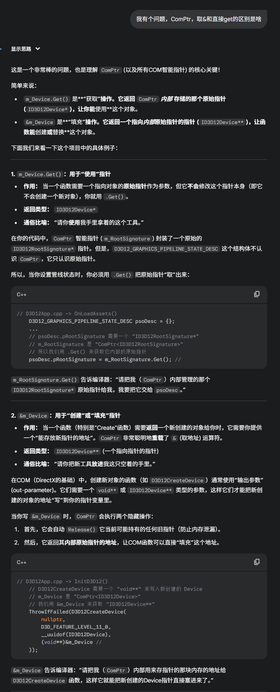
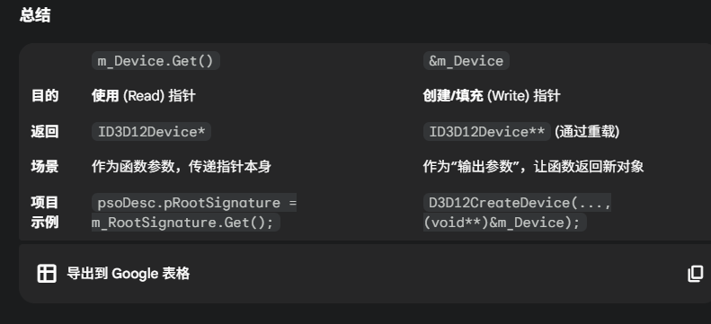
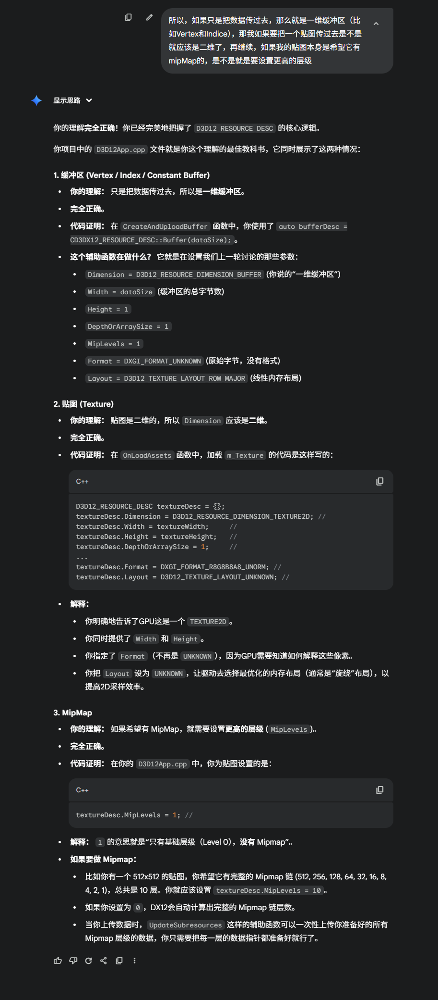
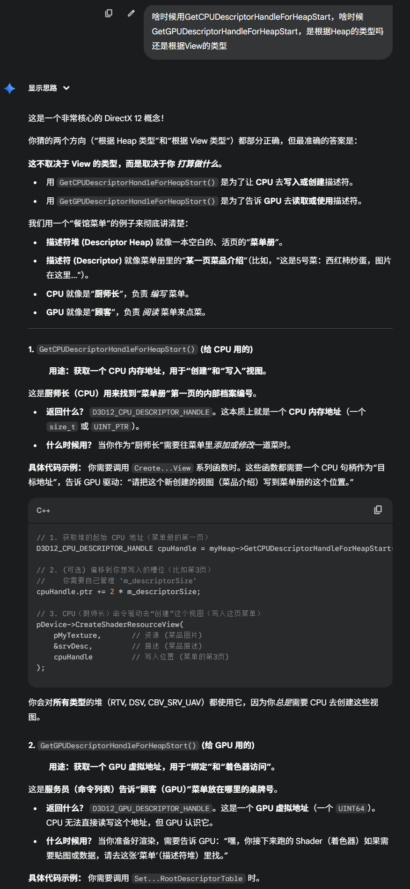
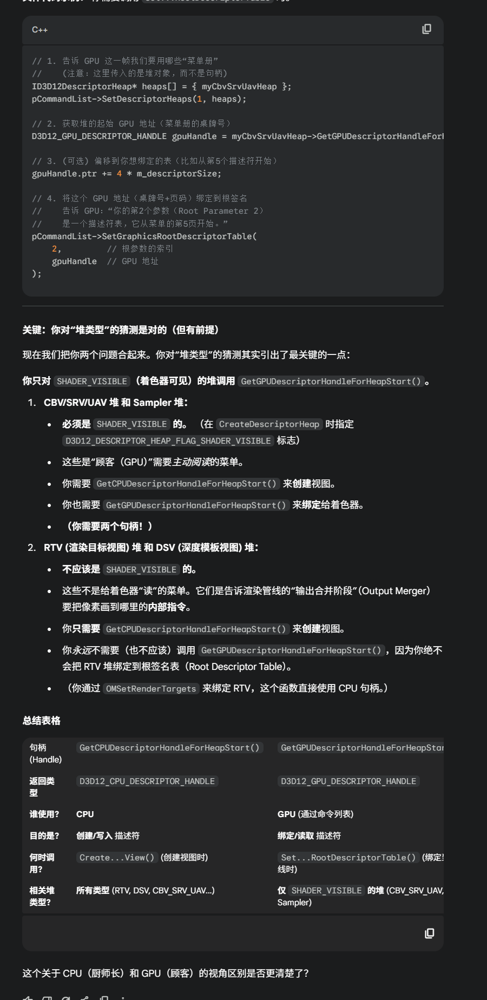
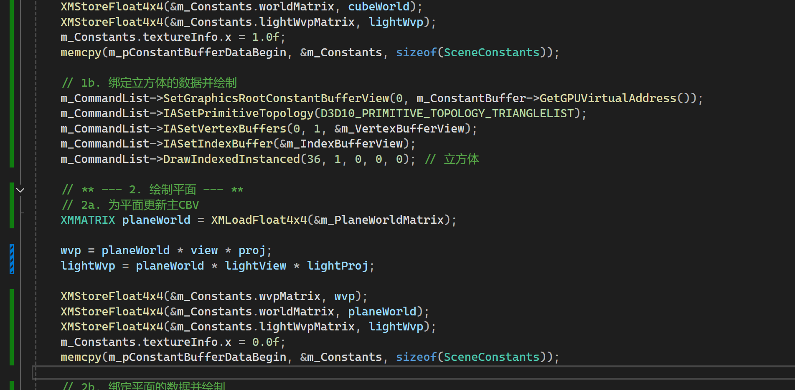
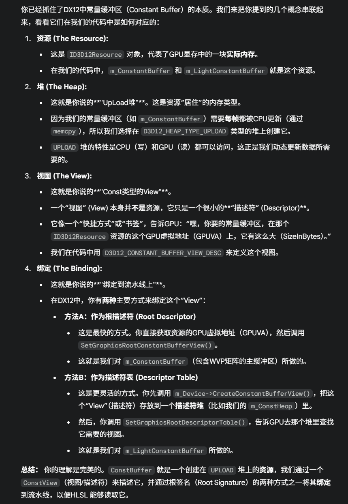

## Comptr

智能指针





## ID3DBlob

一个**通用的、只读的数据容器**。

它的名字 "Blob" 是 **B**inary **L**arge **Ob**ject (二进制大对象) 的缩写，通俗点讲，它就是**一块内存数据**。

它本身很简单，主要提供了两个核心功能：

1. `GetBufferPointer()`: 获取一个指向它内部存储的数据的**指针**。
2. `GetBufferSize()`: 获取这块数据的**大小**（字节数）。

## 对齐：

**顶点缓冲区 / 索引缓冲区**：**不需要** 256 字节对齐。只需要保证 `StrideInBytes` 和 `sizeof(Vertex)` 匹配即可。

**常量缓冲区**：**必须** 256 字节对齐。在 `CreateCommittedResource` 时，你创建的缓冲区总大小必须是 256 字节的倍数。

> const UINT constantBufferSize = (sizeof(SceneConstants) + 255) & ~255;

**纹理**：有它们自己的对齐规则（`D3D12_TEXTURE_DATA_PITCH_ALIGNMENT`），但 `UpdateSubresources` 这样的辅助函数通常会帮你处理好这些复杂的行对齐。

## Resource:

### D3D12_HEAP_PROPERTIES

用来表述资源的描述符

### **`D3D12_RESOURCE_DESC` (资源描述)**

这是**建筑蓝图**。

- 它定义了这块地的**物理属性**（`Width`, `Height` - 多大）、**形状**（`Dimension` - 是平房(Buffer)还是高楼(Texture2D)）以及**未来用途**（`Flags` - 是否允许作为商铺(RenderTarget)、是否允许作为仓库(UAV)）。

```c++
D3D12_RESOURCE_DESC bufferDesc = {}; // 必须初始化为0

/* 1. 维度 (Dimension) */
// 含义：这是1D、2D还是3D资源？
// 你的值：D3D12_RESOURCE_DIMENSION_BUFFER
// 解释：这告诉驱动，这是一块1D的线性内存（缓冲区），
//       而不是2D纹理或3D纹理。
bufferDesc.Dimension = D3D12_RESOURCE_DIMENSION_BUFFER;

/* 2. 对齐 (Alignment) */
// 含义：特殊的内存对齐要求。
// 你的值：0
// 解释：0 代表使用默认对齐。
bufferDesc.Alignment = 0;

/* 3. 宽度 (Width) */
// 含义：资源的主体大小。
// 你的值：dataSize (例如 sizeof(cubeVertices))
// 解释：对于缓冲区，这代表它有多少“字节”。
bufferDesc.Width = dataSize;

/* 4. 高度 (Height) */
// 含义：资源的Y轴大小。
// 你的值：1
// 解释：对于缓冲区(1D)资源，这个值必须是 1。
bufferDesc.Height = 1;

/* 5. 深度或数组大小 (DepthOrArraySize) */
// 含义：资源的Z轴大小，或它是一个包含多少元素的数组。
// 你的值：1
// 解释：对于缓冲区(1D)资源，这个值必须是 1。
bufferDesc.DepthOrArraySize = 1;

/* 6. Mip 级别 (MipLevels) */
// 含义：它有多少个 Mipmap 层级。
// 你的值：1
// 解释：缓冲区没有 Mipmap，这个值必须是 1。
bufferDesc.MipLevels = 1;

/* 7. 格式 (Format) */
// 含义：数据存储的格式 (例如 R8G8B8A8_UNORM)。
// 你的值：DXGI_FORMAT_UNKNOWN
// 解释：这完美地印证了你的想法！对于缓冲区(如顶点/索引/常量缓冲区)，
//       资源本身是“无类型”的原始字节。
//       如何解释这些字节，取决于描述符(SRV)或管线状态(输入布局)。
bufferDesc.Format = DXGI_FORMAT_UNKNOWN;

/* 8. 采样描述 (SampleDesc) */
// 含义：用于MSAA(多重采样抗锯齿)。
// 你的值：Count = 1, Quality = 0
// 解释：缓冲区不支持MSAA，必须设为默认值。
bufferDesc.SampleDesc.Count = 1;
bufferDesc.SampleDesc.Quality = 0;

/* 9. 布局 (Layout) */
// 含义：数据在内存中的布局方式。
// 你的值：D3D12_TEXTURE_LAYOUT_ROW_MAJOR
// 解释：这告诉驱动，数据是“行主序”的，即线性的、连续的，
//       而不是为了2D/3D采样优化的“旋绕”布局(Swizzled)。
//       所有缓冲区都必须是这个布局。
bufferDesc.Layout = D3D12_TEXTURE_LAYOUT_ROW_MAJOR;

/* 10. 标志 (Flags) */
// 含义：资源的“能力”，即它是否允许被用于特定目的。
// 你的值：D3D12_RESOURCE_FLAG_NONE
// 解释：没有特殊能力。如果这是渲染目标，你就需要
//       D3D12_RESOURCE_FLAG_ALLOW_RENDER_TARGET。
//       如果这是UAV，就需要 D3D12_RESOURCE_FLAG_ALLOW_UNORDERED_ACCESS。
bufferDesc.Flags = D3D12_RESOURCE_FLAG_NONE;
```



## RootSignatrue

根签名只是签名，它只是一种约定的定义，

Shader是和PSO绑在一起的

## D3D12_CPU_DESCRIPTOR_HANDLE





## CPU和GPU竞争问题：



上述代码的问题在于，我们试图对m_Constants修改赋值，但是问题是，m_Constants的修改是CPU进行的，但是我们的


CPU 的运行速度*极快*。在你提交命令列表（`ExecuteCommandLists`）之前，CPU 已经连续执行了**两次 `memcpy`**，把**地址A**的内存**覆盖**了。

当 GPU 最终慢悠悠地开始执行 `Draw(立方体)` 命令时，它去**地址A**读取数据，但此时地址A里的值已经是 `0.0f`（被平面的 `memcpy` 覆盖了）。

因此，立方体和平面在绘制时，读取到的 `textureInfo.x` **全都是 0.0f**。

同样的，上面的memecpy也是错误的，因为也会被覆盖

所以绘制这样两个不同材质的模型，有两种办法：

1. 申请一个足够大的缓冲区，不同的模型的数据存储在不同的偏移当中：比如一个256大小的ConstBuffer。前一半存储Box的Const数据，后一半存储Planet的Const数据
2. 使用两个PSO+两个ConstBuffer

这里原本的错误就在于，我们认为是赋值了两次，然后两次都成功让GPU使用了，但是实际上，第二次会快速的覆盖掉第一次的写入，所以第二次的Const会被用在绘制Box和绘制Planet上

## ConstBuffer

ConstBuffer对应的资源就是一个UpLoad堆，只是它的View是一个Const类型的。然后作为ConstView绑定到流水线上


