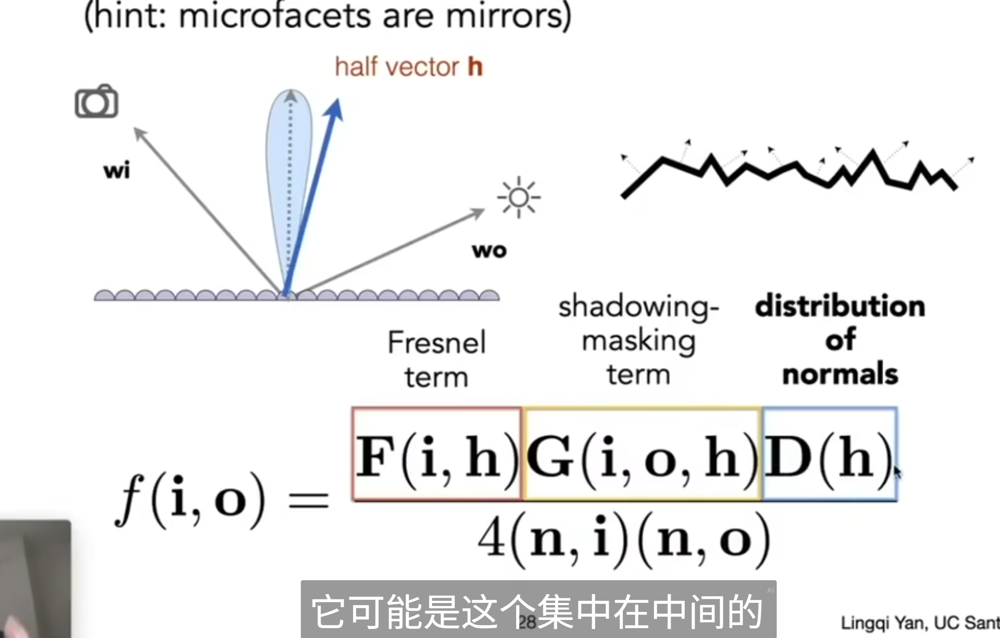

## 菲涅尔

描述的是对于一个表面，如果我们观察的角度和表面尽可能的平行（或者说和法线方向尽可能垂直）

那么我们观察到的光线就会更多（或者以眼睛为发射光的角度来说，就是更多的光线会直接穿过去而不是发生反射）

而与表面尽可能垂直，那么就会有更多的光反射

（也就是shnell定理反应的是，如果发生折射，光会偏转多少，而菲涅尔定理反应的是到底多少的光会反射，多少的光会折射）

## PBR

### 微表面

一个物体表面都是粗糙的，有很多微表面微元

每一个微表面都是镜面反射

研究的是微表面反射的光线的分布

微表面模型：考虑物体微表面对于法线反射的分布

菲涅尔项，自阴影和半程向量查询

如何理解D这一项

我们考虑PathTracing的时候，给定一个入射方向wi，我们随机选择一个采样的初设方向wo进行采样

当我们考虑到物理的微表面假设的时候，就会存在一个问题：我们假设所有的微表面都是镜面反射，那么实际上，只有法线方向和wi，wo的半程向量h一样的微表面，才能对反射到wo方向的光线有贡献。

F项考虑的是，以某个方向打入入射光，到底有多少是参与反射的？（注意这里考虑的菲涅尔计算中的法线，实际上是半程向量h，这个和上面是一样的，其实都是对微表面进行考虑）

## 材质分类：各项同性和各向异性

