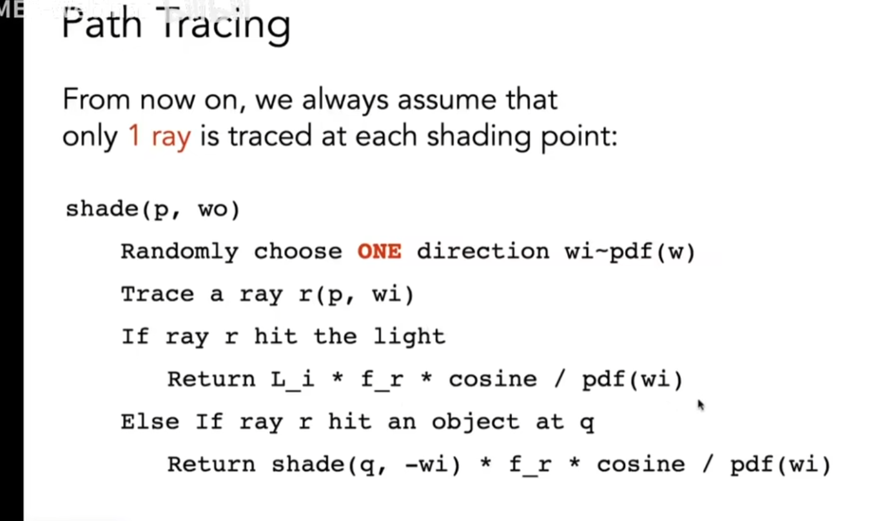
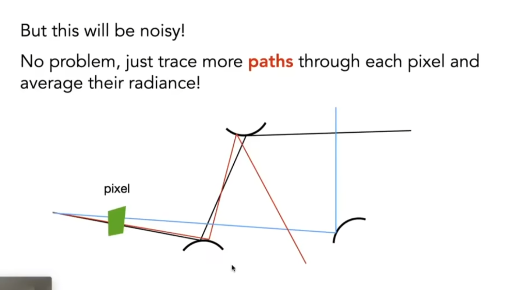

# PathTracing

1. 蒙特卡洛积分的意义是从数学上把一个积分的过程转换为了一个求和再求平均的过程
2. RR算法的意义是保证了概率上的正确性
3. 这俩都要结合大数定律来看，当采样率超过一定限度的时候，就能逼近正确的结果了。

反正不管咋说，我们可以想象，对于RayTracing，他是一个递归的过程

```伪代码
//伪代码
function shade(wo)
	//俄罗斯轮盘赌(RR)
	var flag = randonw(0,1)
	if(flag < rrTag) return
	for wi in all sample direction in sphere:
		if wo hit light
			直接返回光源的颜色
		else if wo hit a object
			BRDF(wi) shade(-wi)/PDF/RR_P
```

rayTracing返回所有

在一个点上，随机向所有可能的方向发射反射射线。但是这样的问题是递归过程会爆炸。

而PathTracing则是将算法简化，每次只反射一个方向（随机选择一个方向）



、为了减少noisy，从一个像素发射更多的path

