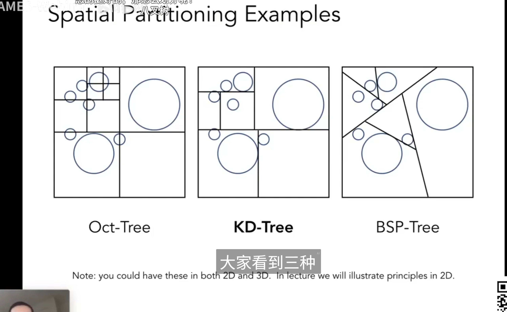
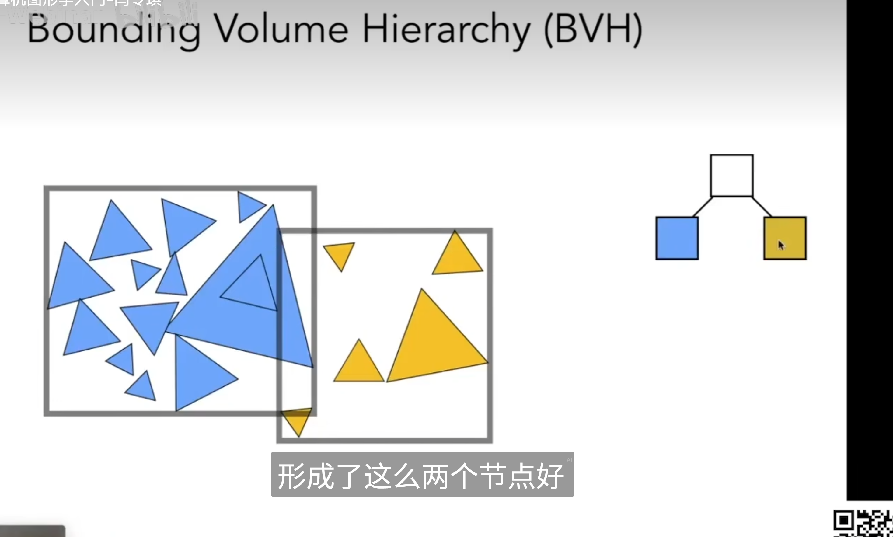
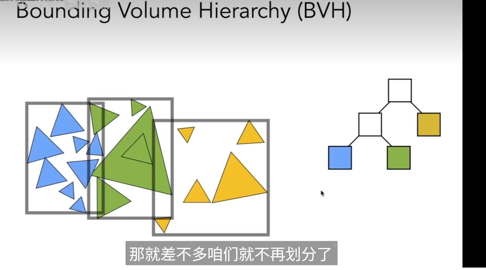

# Whitted-Style RayTracing

## 光线和AABB求交

t_enter = min(t_enter)

t_exit = max(t_exit)

何时有交点？

当且仅当:t_enter<t_exit && t_exit >=0

## 空间划分

“在球场上的茶壶”问题

KDTree 每次只沿着一个轴砍一刀（所以一直是二叉树）

KDTree的问题：一个物体可能和很多个KDTree的叶子节点管理结构有交集，另外如何判断一个三角形和一个AABB（KDtree的叶子节点）有交集很困难。为了解决这些问题出现了BVH

## BVH

BVH从物体开始

 

